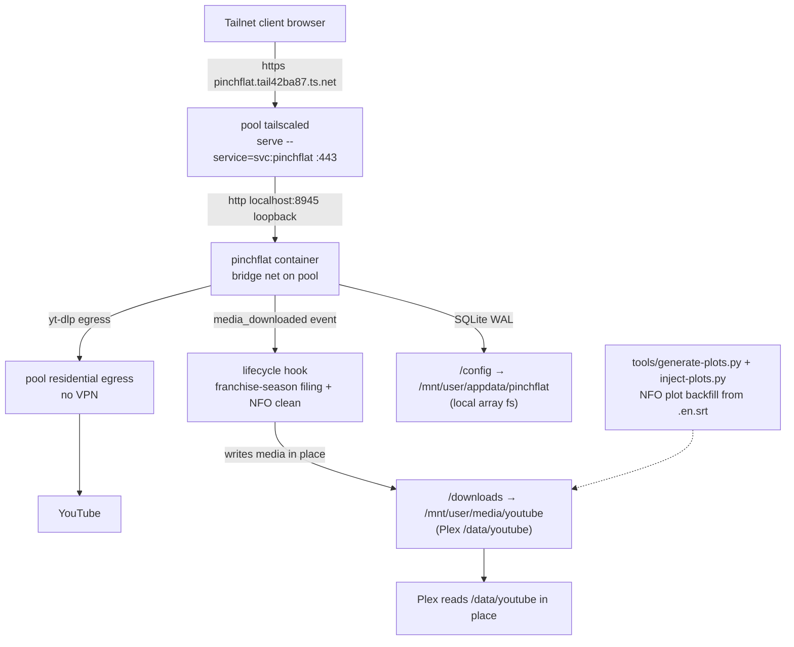

# Pinchflat Install on `pool` (Unraid) - Plan

**Target host:** `pool` (Unraid). Pinchflat runs there as a `docker compose.manager` project, **not** in the
Home-Media-Server *arr stack on `raspberry`. The canonical service definition lives as a commented block in the
Home-Media-Server repo's `docker-compose.yml`, and the files that aren't reproducible from config alone (lifecycle hook,
NFO tooling, README) are version-controlled under `pinchflat/` on the `feat/pinchflat` branch. Inspect the media tree
and container over Tailscale SSH as `root@pool`; the container itself runs as `nobody:users` (`99:100`).

---

## Goal Capsule

- **Objective:** Run Pinchflat (`kieraneglin/pinchflat`) on `pool` to monitor the **@GruffaloWorld** YouTube channel and
  write Plex-playable media in place to the pool array, filed into a per-franchise Plex TV-show layout.
- **Authority hierarchy:** The source handoff at
  `~/dotfiles/.context/handoffs/2026-06-29-001-pinchflat-install-handoff.md` frames this as a dotfiles stow package +
  systemd service — that framing is **wrong**. The real deployment is a compose.manager project on `pool`; the
  Home-Media-Server `docker-compose.yml` records it as a commented service block so the media stack documents it in one
  place.
- **Execution profile:** Container config (recorded, not run, in the HMS compose file) plus operational assets that ship
  in the HMS repo: a post-download lifecycle hook and NFO plot-enrichment tooling. Secrets come from 1Password into a
  mode-600 env file on the array; the UI is a Tailscale VIP behind basic auth.
- **Stop conditions:** Surface to Brett if YouTube bot-gates downloads despite the mitigations, or if any step would
  print a secret value into chat/commits/argv. Plex library wiring is a deliberate manual step done together — do
  **not** automate it.
- **Tail ownership:** After the backfill fills the franchise seasons and items direct-play from Plex, hand back to Brett
  for joint Plex-library confirmation.

---

## Product Contract

### Summary

Pinchflat is a self-contained yt-dlp wrapper that periodically downloads YouTube channels/playlists to disk for a media
center to read. It runs on `pool` (Unraid) as a compose.manager project over pool's residential egress — no VPN gating,
because YouTube bot-gates the exit IP and a residential IP is *less* gated than a VPN exit. The first source is
**@GruffaloWorld** (≈678 videos + 151 Shorts ≈ 829 items), full backfill, in a Plex direct-play profile
(MP4/AVC/≤1080p). A post-download lifecycle hook refiles each new video into a per-franchise season layout (`Season
00`–`Season 13`) and cleans the episode NFO title; an NFO plot-enrichment step backfills the empty `<plot>` fields from
the English closed-caption transcripts using a local ollama model. Media lands in place under `/mnt/user/media/youtube`,
which Plex already serves as `/data/youtube`.

### Problem Frame

YouTube's default `web` extraction was bot-gated on 2026-06-28 (`This video is not available` + JS challenge), and Plex
direct-play is codec-sensitive (AV1/VP9/MKV force transcoding). Pinchflat's v2025.9.26 image — the first release
bundling Deno — resolves the yt-dlp JS challenge at the image level (resolved 2026-06-29), so no cookies are needed.
`pool` already hosts the media array Plex serves and reaches YouTube over a residential IP, so the download workload
lives there rather than on the Pi's VPN-gated *arr stack. The channel publishes no episode descriptions, and its raw
titles carry a channel prefix/suffix and emojis, so the lifecycle hook and NFO tooling turn the raw downloads into a
clean Plex TV show.

### Requirements

Deployment and runtime:

- R1. Pinchflat runs on `pool` (Unraid) as a compose.manager project on the `bridge` network, healthy, never root
  (`user: "99:100"`). The Home-Media-Server `docker-compose.yml` carries the canonical definition as a commented block.
- R2. `/config` lives on local Unraid appdata (`/mnt/user/appdata/pinchflat`), never a network share — SQLite WAL
  corrupts on network shares.
- R3. The image is SHA-pinned to `v2025.9.26` (the first Deno-bundled release); updates are manual (`docker compose
  pull` to a new pinned digest), not automated.

Access and secrets:

- R4. The UI is reachable at `https://pinchflat.tail42ba87.ts.net/` via the `svc:pinchflat` Tailscale VIP served from
  `pool`, behind HTTP basic auth; the host port publish is `127.0.0.1:8945` so the tailnet VIP is the only ingress.
- R5. Basic-auth credentials come from the 1Password entry **"Pinchflat - Basic Auth"**, written into the gitignored,
  mode-600 `/mnt/user/appdata/pinchflat.env` on the array as `BASIC_AUTH_USERNAME` / `BASIC_AUTH_PASSWORD` — never
  committed, never echoed, never placed in argv. The env file sits beside `/config`, not inside it (the Unraid flash is
  vfat and cannot hold unix permissions, so the secret stays on the array).

Content and storage:

- R6. Media is written directly to `/mnt/user/media/youtube` (mounted at `/downloads`), which Plex already serves as
  `/data/youtube`; no VPN, no move/copy step across hosts.
- R7. @GruffaloWorld is configured as a Source with the Media Center profile: MP4 container, prefer AVC/H.264, cap
  ≤1080p; English subtitles (manual + auto) as sidecar `.en.srt`; thumbnails; Shorts included. The Deno-bundled image
  handles the JS challenge; `YT_DLP_WORKER_CONCURRENCY=1` blunts rate-limiting/429s; no cookies.
- R8. A full backfill of all ≈829 items runs; each downloaded item is refiled by the lifecycle hook into
  `/downloads/GruffaloWorld/Season NN/`, verified on the array in Plex-playable form (MP4/AVC ≤1080p + `.en.srt` +
  thumbnail + rewritten `.nfo`).
- R9. The post-download lifecycle hook classifies each new video into a franchise season, numbers episodes, cleans the
  NFO `<title>`, moves media + sidecars, and updates the Pinchflat SQLite DB — never deleting source files.
- R10. Episode `<plot>` fields are backfilled from the English CC transcripts via the NFO tooling.
- R11. The files that aren't reproducible from config (the lifecycle hook, the NFO tooling, the README) are
  version-controlled in the Home-Media-Server repo under `pinchflat/`.

### Scope Boundaries

**Outside this plan's identity:**

- Plex library creation, agent/scanner config, and Direct-Play confirmation — done manually with Brett.
- SponsorBlock, auto-redownload, and retention/cleanup tuning beyond the first source.
- Additional sources beyond @GruffaloWorld.

**Deferred to follow-up work:**

- Rerunning the NFO plot enrichment as the backfill grows (the tooling is resumable; new episodes need a repeat pass).

### Sources

- Pinchflat README + wiki (env vars, volumes, port, non-root guidance, lifecycle "Golden Rule" — do not use custom
  scripts to move or delete files): <https://github.com/kieraneglin/pinchflat> and its wiki.
- yt-dlp extractor `player_client` args: <https://github.com/yt-dlp/yt-dlp/wiki/Extractors>.
- Canonical as-built record: the Home-Media-Server repo's `pinchflat/README.md` and the commented `pinchflat` service
  block in its `docker-compose.yml` (branch `feat/pinchflat`).
- Tailscale VIP-service pattern in this tailnet: the tailscale skill's `tailscale-service-define-before-approve` /
  `autoApprovers-gate-fresh-advertisements` solutions, and the live `svc:radarr`/`svc:sonarr` bindings.
- Live state (verified over SSH): `pinchflat` container `Up (healthy)` on `pool`, `svc:pinchflat` in `tailscale serve
  status --json` on `pool`, media under `/mnt/user/media/youtube/GruffaloWorld/Season NN/`.

---

## Planning Contract

### Key Technical Decisions

- KTD1. **Host on `pool` (Unraid), not the `raspberry` *arr stack.** `pool` already holds the media array Plex serves
  and reaches YouTube over a residential egress IP. The download workload lives where the media lands, and the
  Home-Media-Server `docker-compose.yml` records the service as a commented block so the media stack still documents it
  in one place.
- KTD2. **No VPN gating; `network_mode: bridge`.** YouTube bot-gates the exit IP and a residential IP is *less* gated
  than a VPN exit; HTTPS to YouTube has no P2P/usenet exposure to conceal, so a VPN buys nothing for this workload. The
  UI port is `127.0.0.1:8945` (loopback-only) so the tailnet VIP (KTD7) is the sole ingress and the credential never
  touches the LAN.
- KTD3. **Image SHA-pinned to `v2025.9.26`.**
  `ghcr.io/kieraneglin/pinchflat@sha256:01b4f98aabaf3f5fe394213f7a32578c9e84e42080f52e2f8334021a4473b202` — the first
  release bundling Deno for the yt-dlp JS challenge (resolved 2026-06-29). Pinning satisfies the supply-chain rule and
  ties the deployment to the exact image that clears the 2026-06-28 bot-gate. Updates are manual via `docker compose
  pull` to a new pinned digest.
- KTD4. **Runs as `user: "99:100"` (nobody:users).** The Unraid-canonical owner of appdata + media. Pinchflat honors the
  compose `user:` (it is not a linuxserver/gosu image), so it runs directly as `99:100`; root is discouraged upstream
  and would write root-owned files into the media share.
- KTD5. **Basic-auth creds from 1Password, mode-600 on the array.** The 1Password entry "Pinchflat - Basic Auth" holds
  `BASIC_AUTH_USERNAME` / `BASIC_AUTH_PASSWORD`; they are written into `/mnt/user/appdata/pinchflat.env` (mode 600,
  owner `99`) beside `/config`, never inside the config volume, never in argv, never committed. The env sits on the
  array, not the vfat flash, so unix permissions hold.
- KTD6. **Deno-bundled image + `YT_DLP_WORKER_CONCURRENCY=1`; no cookies.** The v2025.9.26 image's bundled Deno clears
  the YouTube JS/bot-gate challenge without cookies; concurrency 1 (upstream's "set to 1 if IP limited") blunts
  rate-limiting/429s. Cookies stay off (account-ban risk, credential management).
- KTD7. **Tailscale VIP `svc:pinchflat` served from `pool`.** On `pool`: `tailscale serve --service=svc:pinchflat
  --https=443 http://localhost:8945`. Auto-approved by the existing ACL `autoApprovers.services` rule — no console step.
  Yields `https://pinchflat.tail42ba87.ts.net/`.
- KTD8. **`/config` on local appdata; media on the array.** SQLite WAL corrupts on network shares, so `/config` is
  `/mnt/user/appdata/pinchflat` (real local fs). Media is `/mnt/user/media/youtube` — a local Unraid array path, not a
  CIFS network mount, so incremental `.part` writes carry no network-share truncation risk. The host media dir is what
  Plex already serves as `/data/youtube`.
- KTD9. **Healthcheck against `/healthcheck` (auth-exempt).** A probe against the root path returns 401 once basic auth
  is enabled, which would fail the check and drive a restart loop; `/healthcheck` is exempt.
- KTD10. **Post-download lifecycle hook enforces the Plex franchise-season layout.** Title-only classification into
  `Season 00`–`Season 13`, next-episode numbering, NFO `<title>` cleaning, media + sidecar move, and a Pinchflat SQLite
  update so the app keeps tracking moved files. It never deletes source (Pinchflat's lifecycle Golden Rule) — it only
  renames/moves within the media tree.
- KTD11. **NFO plot enrichment via local ollama.** The channel publishes no descriptions, so `generate-plots.py`
  summarizes each episode's `.en.srt` with `gemma4:26b` (thinking disabled, `num_predict` capped at 512) using
  per-franchise character context, and `inject-plots.py` writes the results into the episode `.nfo` `<plot>` fields.

### High-Level Technical Design

Request and data path once deployed:

The UI ingress and the yt-dlp egress traverse `pool`; the lifecycle hook refiles each download in place on the array;
the config DB stays on local appdata.

### Assumptions

- The `svc:pinchflat` VIP served from `pool` resolves to `https://pinchflat.tail42ba87.ts.net/` and is auto-approved by
  the tailnet ACL. Verified live (401 unauthenticated).
- The v2025.9.26 Deno-bundled image extracts @GruffaloWorld cleanly without cookies.
- `/mnt/user/media/youtube` is the host path Plex serves as `/data/youtube`.

### Sequencing

Service on `pool` (compose.manager) → secret env from 1Password → Tailscale VIP → @GruffaloWorld source + profile +
backfill → lifecycle hook filing → NFO plot enrichment → version-control the non-reproducible assets in the HMS repo.
The VIP and the source config can proceed in parallel once the container is healthy.

---

## Implementation Units

### U1. Pinchflat service on `pool`

- **Goal:** Run the VPN-free `pinchflat` compose.manager project on `pool`, healthy, with the least-privilege
  media/config layout, and record the canonical definition in the HMS `docker-compose.yml`.
- **Requirements:** R1, R2, R3, R6.
- **Approach:** Service keyed to the recorded block — `image: ghcr.io/kieraneglin/pinchflat@sha256:01b4f98… #
  v2025.9.26`, `container_name: pinchflat`, `network_mode: bridge`, `user: "99:100"`, `ports: ["127.0.0.1:8945:8945"]`,
  `env_file: [/mnt/user/appdata/pinchflat.env]`, volumes `/mnt/user/appdata/pinchflat:/config` and
  `/mnt/user/media/youtube:/downloads`, environment `TZ=America/Chicago`, `HOST_OS=Unraid`, `HOST_HOSTNAME=pool`,
  `HOST_CONTAINERNAME=pinchflat`, `YT_DLP_WORKER_CONCURRENCY=1`, `LOG_LEVEL=debug` (bring-up; `info` is the minimum
  long-term), and a healthcheck `curl -f http://localhost:8945/healthcheck || exit 1`.
- **Verification:** `docker ps` on `pool` shows `pinchflat Up (healthy)`; `docker inspect` confirms `bridge` net, the
  appdata `/config` volume, and the `/mnt/user/media/youtube` mount; the HMS `docker-compose.yml` carries the commented
  canonical block.

### U2. Secret env from 1Password

- **Goal:** Provide a mode-600 `pinchflat.env` on the array with runtime tuning and basic-auth creds sourced from
  1Password without echoing values.
- **Requirements:** R5.
- **Approach:** File at `/mnt/user/appdata/pinchflat.env` contains `YT_DLP_WORKER_CONCURRENCY=1`, `LOG_LEVEL`, and
  `BASIC_AUTH_USERNAME` / `BASIC_AUTH_PASSWORD`. Populate the two auth values from the 1Password entry "Pinchflat -
  Basic Auth" straight into the file (never into chat/argv), then `chmod 600` (owner `99`).
- **Verification:** `stat -c '%a'` is `600`; a key-only dump (`grep -oE '^[A-Z_]+=' pinchflat.env`) shows the keys; no
  secret value is ever printed.

### U3. Tailscale VIP service

- **Goal:** Expose the UI at `https://pinchflat.tail42ba87.ts.net/` mirroring the *arr VIP services.
- **Requirements:** R4.
- **Approach:** On `pool`, `tailscale serve --service=svc:pinchflat --https=443 http://localhost:8945`. The ACL
  `autoApprovers.services` rule auto-approves the advertisement — no console step.
- **Verification:** `tailscale serve status --json` on `pool` lists `svc:pinchflat`; an unauthenticated request returns
  401 and an authenticated request (creds from a mode-600 file via `--netrc-file`, never argv) returns 200.

### U4. @GruffaloWorld source and media profile

- **Goal:** Create the source with the locked profile and run the full backfill into `/downloads`.
- **Requirements:** R6, R7, R8.
- **Approach:** Media Profile: Media Center preset, MP4 container, prefer AVC/H.264, cap ≤1080p; English subtitles
  (manual + auto) as sidecar; thumbnails on. Add Source `@GruffaloWorld` with Shorts included and a full (no-cutoff)
  backfill, then trigger indexing/download. The Deno-bundled image handles the JS challenge; concurrency 1; no cookies.
- **Verification:** the Source lists ~829 items; downloads land under `/downloads` as MP4 + `.en.srt` + thumbnail before
  the lifecycle hook refiles them (U5).

### U5. Post-download lifecycle hook

- **Goal:** Refile each new video into the Plex franchise-season layout and clean its NFO on the `media_downloaded`
  event.
- **Requirements:** R9.
- **Files:** `pinchflat/extras/user-scripts/lifecycle` (version-controlled in the HMS repo; deployed to
  `/mnt/user/appdata/pinchflat/extras/user-scripts/lifecycle`).
- **Approach:** On `media_downloaded`, classify by title into a franchise season — `Season 01` The Gruffalo's Child …
  `Season 13` The Scarecrows' Wedding, "Mouse meets …" → The Gruffalo (`Season 02`), unmatched → `Season 00` (Extras).
  Assign the next sequential episode number, clean the NFO `<title>` (strip the `Gruffalo World -` prefix, any `| …` /
  `@GruffaloWorld:` suffix, and emojis — filenames left as downloaded), move the media plus sidecars into
  `/downloads/GruffaloWorld/Season NN/`, rewrite the `.nfo` (season/episode/aired/runtime), and update the Pinchflat
  SQLite DB so the app keeps tracking the moved files. Never delete source (Golden Rule). Deploy with `install -m 0755
  -o 99 -g 100 lifecycle /mnt/user/appdata/pinchflat/extras/user-scripts/lifecycle`.
- **Verification:** new downloads appear under `/downloads/GruffaloWorld/Season NN/` with cleaned NFO titles; source
  files are never removed.

### U6. NFO plot enrichment

- **Goal:** Backfill empty episode `<plot>` fields from the English CC transcripts.
- **Requirements:** R10.
- **Files:** `pinchflat/tools/generate-plots.py`, `pinchflat/tools/inject-plots.py` (version-controlled in the HMS
  repo).
- **Approach:** `generate-plots.py` pulls each episode's `.en.srt`, summarizes it with a local ollama model
  (`gemma4:26b`, thinking disabled, `num_predict` 512) using per-franchise character context, and writes `{episode:
  plot}` to JSON (resumable; garbled/music-only transcripts skipped; `--sample` prints one example per season).
  `inject-plots.py` writes those plots into each episode `.nfo` `<plot>` (run in a container with media at `/media` and
  the plots JSON at `/plots.json`; dry-run by default, `--execute` to write).
- **Verification:** `--sample` prints coherent per-franchise summaries; a dry-run `inject-plots.py` reports the episodes
  it would update; after `--execute`, episode `.nfo` files carry non-empty `<plot>`.

### U7. Version-control the non-reproducible assets

- **Goal:** Keep the lifecycle hook, NFO tooling, and canonical service definition in the HMS repo.
- **Requirements:** R11.
- **Files:** `pinchflat/README.md`, `pinchflat/extras/user-scripts/lifecycle`, `pinchflat/tools/generate-plots.py`,
  `pinchflat/tools/inject-plots.py`, and the commented `pinchflat` block in `docker-compose.yml`; the decommissioned
  `/ydl` (youtubedl-material) `.gitignore` entry is dropped.
- **Verification:** `git ls-files | grep pinchflat` lists the four tracked files; `docker-compose.yml` carries the
  commented service block; the `/ydl` ignore entry is gone.

---

## Verification Contract

Inspection runs as `root@pool` (Tailscale SSH). Credentials are never placed in argv — the authenticated UI check reads
them from a mode-600 file via `curl --netrc-file`, shredded after.

| Check            | Command (on `pool` unless noted)                                                                        | Pass signal                                                                                  |
| ---------------- | ------------------------------------------------------------------------------------------------------- | -------------------------------------------------------------------------------------------- |
| Container health | `docker ps` / `docker inspect pinchflat`                                                                | `Up (healthy)`, `network_mode: bridge`, appdata `/config` + `/mnt/user/media/youtube` mounts |
| Image pinned     | `docker inspect -f '{{.Config.Image}}' pinchflat`                                                       | `…@sha256:01b4f98…` (v2025.9.26)                                                             |
| Env-file mode    | `stat -c '%a' /mnt/user/appdata/pinchflat.env`                                                          | `600`                                                                                        |
| Secret hygiene   | `grep -oE '^[A-Z_]+=' /mnt/user/appdata/pinchflat.env`                                                  | auth + tuning keys present; no value ever printed                                            |
| VIP service      | `tailscale serve status --json` on `pool`                                                               | `svc:pinchflat` present → `http://localhost:8945`                                            |
| UI gated (401)   | `curl -so /dev/null -w '%{http_code}' https://pinchflat.tail42ba87.ts.net/`                             | `401` (no creds)                                                                             |
| UI authed (200)  | `curl -so /dev/null -w '%{http_code}' --netrc-file <mode-600 tmp> https://pinchflat.tail42ba87.ts.net/` | `200`, then shred the tmp                                                                    |
| Media on array   | `find /mnt/user/media/youtube/GruffaloWorld -name '*.mp4'` + `ffprobe` sample                           | items under `Season NN/`, MP4/AVC ≤1080p + `.en.srt` + thumbnail + rewritten `.nfo`          |
| Lifecycle layout | `ls /mnt/user/media/youtube/GruffaloWorld/`                                                             | `Season 00`–`Season 13`, `tvshow.nfo`, poster/banner/fanart                                  |
| Version control  | `git ls-files \| grep pinchflat` in the HMS repo                                                        | README + lifecycle + two tools tracked; commented service block in `docker-compose.yml`      |

No unit tests apply — this is infrastructure/config plus operational scripts. The table above is the proof surface.

---

## Definition of Done

**Global:**

- R1–R11 met: `pinchflat` healthy on `pool`, UI at `https://pinchflat.tail42ba87.ts.net/` behind loopback-only basic
  auth, @GruffaloWorld configured with the locked profile, full backfill running, items refiled into the
  franchise-season layout on the array in Plex-playable form (MP4/AVC ≤1080p + `.en.srt` + thumbnail + rewritten `.nfo`
  with backfilled `<plot>`).
- The version-controlled assets — the lifecycle hook, the NFO tooling, the README, and the commented service block in
  `docker-compose.yml` — are committed on the HMS `feat/pinchflat` branch; `/mnt/user/appdata/pinchflat.env` (mode 600)
  and `/config` are not tracked.
- No secret value appears in chat, command args/argv, commits, container logs, or this plan.

**Handoff (not done autonomously):** Plex library creation and Direct-Play confirmation are completed jointly with
Brett.

---

## Risks & Dependencies

- **YouTube bot-gating.** The v2025.9.26 Deno-bundled image clears the JS challenge and `pool`'s residential egress is
  less gated than a VPN exit, so no cookies are needed. If a future image regresses or the residential IP is throttled,
  `YT_DLP_WORKER_CONCURRENCY=1` blunts 429s; escalate to Brett before adding cookies.
- **`/config` on a network share would corrupt SQLite WAL** — config is pinned to local Unraid appdata; never relocate
  it onto the array's network-share path.
- **Lifecycle-hook misclassification.** Title-only classification can drop an oddly-titled video into `Season 00`
  (Extras); the hook never deletes, so recovery is a re-file, not a re-download.
- **Unraid flash cannot hold unix permissions** — the secret env stays on the array (`/mnt/user/appdata`), never the
  vfat flash, so mode 600 holds.
- **Dependency:** the local ollama model (`gemma4:26b`) must be available for the NFO plot enrichment (U6); it is not
  needed for downloading.

---

## Open Questions

All deferred (execution-time verifications) — none block launch.

- **NFO enrichment re-runs.** The plot tooling is resumable; as the backfill adds episodes, a repeat `generate-plots.py`
  → `inject-plots.py --execute` pass is needed to fill the new `<plot>` fields. (deferred)
- **`svc:pinchflat` access scope.** `autoApprovers.services` governs who may *advertise* the VIP, not who may *reach*
  it. Confirm the tailnet ACL restricts access as intended rather than default-allowing every tailnet node — basic auth
  is the only app-layer control behind it. (deferred)
