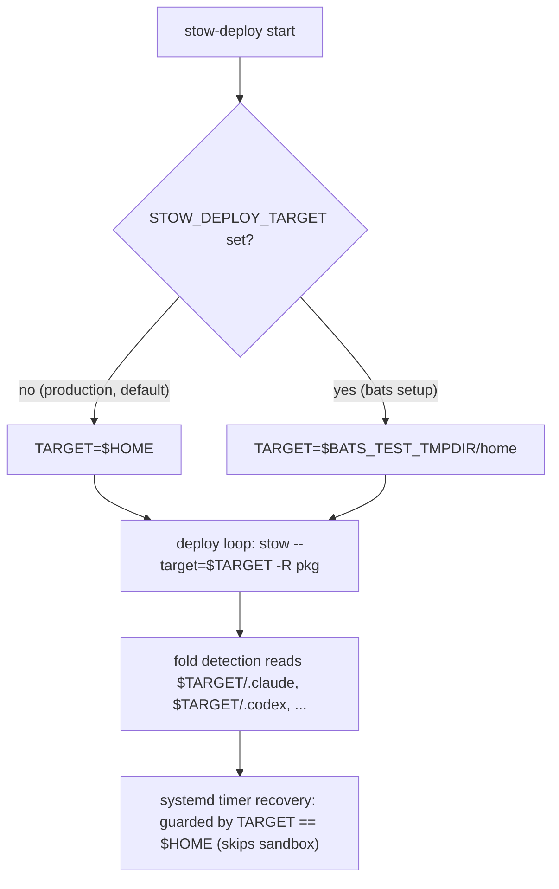
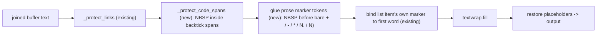

# fix: sandbox stow-deploy bats tests and md-wrap/md-align CommonMark bugs

## Summary

Two independent engineering tracks, one plan.

**Track 1 (p1)** removes a live-environment hazard: the pre-push hook runs `bats tests/*.bats`, and several cases run
the real `scripts/stow-deploy` against the real `$HOME` with no sandbox. Run from a linked worktree, a single push
re-points 120+ live `$HOME` symlinks (shell startup, git identity, secrets, every Claude Code hook) into an ephemeral
tree that removal then strands. The fix threads a fail-safe target override through `stow-deploy` and points every
deploy-executing bats case at a throwaway sandbox, so the deploy path can never touch real `$HOME` from any checkout.

**Track 2 (p2)** fixes the remaining CommonMark-mangling bugs in the markdown auto-format chain. Bug 4:
`md-align-tables.py` measures cell width with `len()` (codepoint count) while `markdownlint MD060` measures visual
display width, so emoji/CJK body cells leak spurious lint errors. Bugs 2 and 3: `md-wrap.py` soft-wraps prose such that
a continuation line can begin with a token that re-parses as a list marker (a bare ` <plus> ` glued here as prose, a
sentence-final `` `2.` ``, or an inline code span containing a dash), which the downstream fixer then promotes to list
structure. Bug 4 gets a clean display-width fix; bugs 2-3 get a bounded, honestly-scoped mitigation.

The tracks share no files and can land in either order or in parallel.

---

## Problem Frame

### Track 1 — stow-deploy bats tests mutate the live `$HOME`

`scripts/stow-deploy` hardcodes `TARGET="$HOME"` and resolves `REPO_ROOT` from its own location. Four cases in
`tests/stow-deploy-packages.bats` ("no args deploys SHARED_PACKAGES", "explicit args extend SHARED_PACKAGES", "local
package is not rejected", "duplicate packages are deduplicated") call `run "$SCRIPT"`, and two cases in
`tests/stow-deploy-args.bats` ("--headless flag is accepted", "--all flag is accepted") reach the same deploy loop. Each
performs a full live restow of SHARED_PACKAGES against the real home directory from whatever checkout it runs in.

From the canonical deployed tree this is a harmless restow. From a linked worktree (an agent scratchpad under `/tmp`,
any secondary checkout) `stow -R` re-points every stowed symlink into the worktree. Uncommitted edits to stowed files
vanish from the live environment, and removing the worktree afterward leaves the whole environment dangling. The failure
is silent at push time and the natural next step (worktree cleanup) is the destructive one, which is why this is p1.

The cases guard with `[ -L "$HOME/.profile" ]`, but that is a deployed-machine sentinel, not a sandbox: `~/.profile` is
a symlink even inside a worktree (it points at the main checkout), so the guard passes and the deploy runs. A prior
incident of the same class removed four other side-effecting tests outright rather than trust precondition skips (see
Sources). This plan keeps coverage by isolating the target instead of removing the cases.

### Track 2 — markdown auto-format chain mangles valid CommonMark

The PostToolUse auto-format hook (`stow/claude/dot-claude/auto-format.sh`, `md)` arm) chains three stages on every
markdown write: `md-wrap.py` (prose reflow), `md-align-tables.py` (GFM table alignment for MD060), then
`markdownlint-cli2 --fix`. Bug 1 (nested bullets flattened) is fixed by PR #164 and guarded by
`stow/claude/dot-claude/test_md_wrap.py`. Three defects remain:

- **Bug 4 (`md-align-tables.py`).** Alignment math uses `len()` (codepoint count). `markdownlint
  MD060/table-column-style` checks pipe alignment by visual display width, where `<hourglass>`, `<check>`, and CJK
  characters count as two visual columns. Tables whose body cells contain wide characters but whose header does not pass
  the aligner's `len()`-based idempotency check yet still trip MD060 on every wide-char body row. MD060 has no upstream
  autofixer (`DavidAnson/markdownlint#1980`), so the errors leak to the user as hook output on freshly auto-formatted
  files.
- **Bugs 2-3 (`md-wrap.py`).** When `md-wrap` soft-wraps a prose or list line, a token that re-parses as a CommonMark
  list marker can land at the start of a continuation line: a bare ` <plus> ` mid-sentence, a sentence-final `` `2.` ``
  near the width boundary, or an inline code span containing a dash. `md-wrap` breaks on whitespace and cannot see that
  the token is prose, so the wrapped output either re-parses non-idempotently on the next `md-wrap` pass or gets
  promoted to list structure by `markdownlint --fix` (silently renumbering ordered lists below it). A line wrapper
  cannot detect this without being CommonMark-aware.

Both bite every plan doc, README, and CLAUDE.md edit across every repo the hook fires in.

---

## Requirements

Traceability back to the two source todos.

- **R1** — Running `bats tests/*.bats` from a linked worktree leaves every live `$HOME` symlink untouched: `find "$HOME"
  -type l -lname "*<worktree>*"` returns nothing new. (todo 022 AC1)
- **R2** — The deploy-executing cases still assert package expansion and deduplication, against a sandbox target. (todo
  022 AC2)
- **R3** — Pre-push still runs and passes the non-mutating assertions; the `bats.yml` CI job behaves as before (the
  deploy-executing cases skip on locked/undeployed CI exactly as today). (todo 022 AC3)
- **R4** — `scripts/stow-deploy` default behavior against real `$HOME` is unchanged when no override is set: the
  override is fail-safe (absent means `$HOME`). (safety, derived)
- **R5** — After `md-align-tables.py` runs, `markdownlint-cli2` reports 0 MD060 errors on a table whose body cells hold
  emoji or CJK characters. (todo 016 bug 4 AC)
- **R6** — `md-align-tables.py` stays byte-identical (idempotent) on ASCII-only tables and on files with no tables.
  (todo 016 bug 4 no-regression)
- **R7** — `md-wrap.py` never emits a continuation line that begins with a token re-parsing as a CommonMark list marker
  for the documented cases (bare ` <plus> `, sentence-final `N.`, `N)`), so `markdownlint --fix` cannot promote or
  renumber. (todo 016 bugs 2-3)
- **R8** — `md-wrap.py` never breaks a line inside an inline code span. (todo 016 bug 3)
- **R9** — `md-wrap.py` stays idempotent across reflow passes and preserves existing behavior: nested lists, protected
  links, frontmatter, fenced code blocks, tables, blockquotes, headings, HTML blocks. (todo 016 bugs 2-3 no-regression)

---

## Key Technical Decisions

### KTD1 — Isolate the test target with a fail-safe env override, not a pre-push gate

todo 022 offers two shapes: (1) sandbox the target, (2) gate the mutating cases off pre-push. This plan takes shape 1.
Add a `STOW_DEPLOY_TARGET` env var to `stow-deploy` that defaults to `$HOME` (`TARGET="${STOW_DEPLOY_TARGET:-$HOME}"`)
and have the tests point it at a throwaway directory. Structural isolation (a temp dir the deploy can never escape) is
stronger than a conditional skip: the target is wrong-proof regardless of which checkout runs the push. A prior incident
of this exact class removed four side-effecting tests rather than trust precondition skips; a sandbox target removes the
hazard at the source while keeping the coverage the todo asks to keep. Shape 2 (smaller diff) is recorded as the
rejected alternative — it drops the expansion/dedup coverage from the push path.

### KTD2 — Sandbox both bats files, not only the four cases the todo names

todo 022's problem statement enumerates the four cases in `tests/stow-deploy-packages.bats`, but
`tests/stow-deploy-args.bats` reaches the same deploy loop through its "--all flag is accepted" and "--headless flag is
accepted" cases. R1 ("every `$HOME` symlink untouched") cannot hold if `stow-deploy-args.bats` still deploys against
real `$HOME`. Both files get the sandbox target. This is a finding beyond the todo's literal enumeration, recorded here
so scope is honest.

### KTD3 — Keep the deployed-machine precondition skip; the sandbox is the isolation, the skip only scopes exercise

The packages-file cases assert `==> Stowing secrets`, which requires git-crypt unlocked (`secrets` is the first
SHARED_PACKAGES entry, and `stow-deploy` fails fast with `EXIT_PRECONDITION` when the encrypted payload is still a
binary blob). On locked CI the deploy exits before printing the package lines. Retaining the existing `[ -L
"$HOME/.profile" ]` skip keeps CI behavior identical (R3): the cases skip on locked/undeployed CI as they do today. The
sandbox target is what makes the case safe when the skip passes from a worktree; the skip is no longer load-bearing for
safety, only for choosing when the now-safe deploy actually exercises. `stow-deploy-args.bats` needs no such skip — its
cases assert only exit codes, which tolerate the git-crypt-locked fast exit.

### KTD4 — Bounded mitigation for bugs 2-3, not a CommonMark-aware rewrite

A full fix would require a CommonMark parser that re-emits structure, and the markdown-line-wrapping solutions doc
records that `md-wrap.py` exists precisely because full formatters (mdformat, pandoc, prettier) mangle frontmatter, list
numbering, and structure. Swapping one in is off the table. The bounded fix is two targeted glue passes inside
`flush()`, mirroring the existing `_protect_links` mechanism:

- **Protect inline-code-span spaces** so `textwrap` never breaks inside a code span (fixes bug 3, satisfies R8, honors
  the "respect code-span boundaries" requirement).
- **Glue prose marker-shaped tokens to their preceding word** so a bare ` <plus> `/`-`/`*`/`N.`/`N)` in prose can never
  begin a continuation line (fixes bug 2 and the ` <plus> ` holdout, satisfies R7). This reuses the non-breaking-space
  placeholder (`\x00`) the marker glue already uses to bind a list item's own marker to its first word.

This closes every documented real-world case and is guarded by regression tests. It is not a proof of universality: a
sufficiently adversarial construction outside the documented shapes could still surface. That residual is recorded as a
known limitation rather than papered over — the alternative (a parser rewrite) is disproportionate to a p2 with working
authoring workarounds. This is a **bounded-fix** decision, not wontfix and not full-fix.

### KTD5 — Bug 4 takes the `wcwidth` dependency, not an inlined Unicode table

`md-align-tables.py` already runs under a `uv run --script` shebang with a PEP 723 metadata block, so adding
`dependencies = ["wcwidth"]` is resolved automatically on next invocation. `wcswidth()` returns the same display width
markdownlint applies for MD060 and gets emoji-presentation right out of the box, which an inlined East-Asian-Width table
would have to chase by hand. Small, self-contained, correct.

---

## High-Level Technical Design

### Track 1 — target-isolation seam

`stow-deploy` gains one resolution point and threads it through fold detection. Tests set the env var; production leaves
it unset and lands on `$HOME`.

The systemd-timer recovery block is already guarded by `[ "$TARGET" = "$HOME" ]`, so it will not fire for a sandbox
target once `TARGET` is overridable. `get_fold_target` currently hardcodes `$HOME/.claude` etc.; threading `$TARGET`
closes the last path that could touch real `$HOME` from a sandbox run.

### Track 2 — md-wrap glue pipeline (bugs 2-3)

Two new protection passes sit between the existing link protection and `textwrap.fill`, all restored after wrapping so
the on-disk file never contains the placeholder.

Idempotency holds because every protection is re-derived from the joined text on each pass and restored before write, so
a second `md-wrap` pass over the output re-derives identical glue and produces identical wrapping.

---

## Implementation Units

### U1. stow-deploy: fail-safe target override threaded through fold detection

**Goal** — Make `scripts/stow-deploy` deploy against an overridable target that defaults to `$HOME`, so tests can
redirect it to a sandbox with zero change to production behavior.

**Requirements** — R1, R4.

**Dependencies** — none.

**Files**

- Modified: `scripts/stow-deploy`

**Approach**

- Replace `TARGET="$HOME"` with `TARGET="${STOW_DEPLOY_TARGET:-$HOME}"`. Absent env var means `$HOME` (fail-safe: a
  machine with the var unset behaves exactly as today).
- Thread `$TARGET` through `get_fold_target` so it returns `$TARGET/.claude`, `$TARGET/.codex`, `$TARGET/.config/git`,
  `$TARGET/.config/opencode` instead of the hardcoded `$HOME/...`. This is the only remaining deploy-path function that
  reads `$HOME` for a write-capable target; the SSH/git/qmd post-stow validation blocks already use `$TARGET`, and the
  systemd-timer recovery is already gated by `[ "$TARGET" = "$HOME" ]` (which correctly skips a sandbox target).
- Leave `check_disk_space`'s `df -Pk "$HOME"` as-is (read-only) and leave `REPO_ROOT`-scoped operations (core.hooksPath,
  headless adopt-restore) as-is; they touch the checkout under test idempotently, not real `$HOME`.
- Keep the change minimal: no new flag, no dry-run mode. One env var, one helper threaded.

**Patterns to follow** — the existing `$TARGET` usage in `STOW_FLAGS`, the git-local-config block
(`_local_cfg="$TARGET/.config/git/local"`), and the qmd block already model target-relative paths.

**Test scenarios** — covered by U2 (the bats suite exercises this seam end to end). No standalone test file for the
script change itself.

- `STOW_DEPLOY_TARGET=<tmp> scripts/stow-deploy local` creates symlinks under `<tmp>`, not `$HOME`.
- With `STOW_DEPLOY_TARGET` unset, the resolved target is `$HOME` (grep-level assertion in U2 that the default is
  `${STOW_DEPLOY_TARGET:-$HOME}`).

**Verification** — `shellcheck scripts/stow-deploy` is clean (pre-push and `shellcheck.yml` both lint this file). A
manual `STOW_DEPLOY_TARGET=$(mktemp -d) scripts/stow-deploy local` stows into the temp dir and leaves `$HOME` untouched
(`readlink` of any managed symlink still resolves into the canonical tree).

---

### U2. Point both stow-deploy bats files at a sandbox target

**Goal** — Redirect every deploy-executing bats case to a throwaway per-test sandbox so `bats tests/*.bats` can never
mutate real `$HOME`, while preserving the package-expansion and deduplication assertions.

**Requirements** — R1, R2, R3.

**Dependencies** — U1.

**Files**

- Created: `tests/lib/stow-sandbox.bash` (shared setup helper)
- Modified: `tests/stow-deploy-packages.bats`
- Modified: `tests/stow-deploy-args.bats`

**Approach**

- Add `tests/lib/stow-sandbox.bash` exporting a function that creates `$BATS_TEST_TMPDIR/home` and sets `export
  STOW_DEPLOY_TARGET="$BATS_TEST_TMPDIR/home"`. `$BATS_TEST_TMPDIR` is per-test, so each case gets a clean sandbox that
  bats tears down. Keep it dependency-free (single function, sourced via bats `load lib/stow-sandbox`, which resolves
  relative to the test file).
- In `tests/stow-deploy-packages.bats`, add a `setup()` that `load`s the helper and calls it. Retain the existing `[ -L
  "$HOME/.profile" ] || skip` guard on the four deploy-executing cases (KTD3): the sandbox provides safety, the skip
  keeps CI/locked-git-crypt behavior identical. The four cases otherwise keep their exact output assertions (`==>
  Stowing secrets`, `==> Stowing claude`, dedup counts).
- In `tests/stow-deploy-args.bats`, add the same `setup()`. Its "--all"/"--headless" cases need no `.profile` skip —
  they assert only exit codes, which tolerate the git-crypt fast exit. The sandbox still redirects any deploy that does
  run.
- Do not touch the pure-grep cases (package-set contents, `STOW_FLAGS`, fold-target mapping, systemd-recovery grep,
  exit- code constants); they never run the deploy and are safe anywhere.

**Patterns to follow** — the bats sandbox pattern in the solutions corpus (mktemp sandbox, per-test isolation); the
existing per-test `skip` lines already in `stow-deploy-packages.bats`.

**Test scenarios** — this unit is the test change; "scenarios" here are the invariants the changed suite must hold.

- The four packages cases pass against the sandbox on a deployed machine (git-crypt unlocked), asserting the same `==>
  Stowing <pkg>` output and dedup counts as before.
- The two args cases ("--all", "--headless") pass, exercising the deploy loop against the sandbox.
- From a throwaway linked worktree, `bats tests/stow-deploy-packages.bats tests/stow-deploy-args.bats` leaves `find
  "$HOME" -type l -lname "*<worktree>*"` empty and `readlink -f ~/.claude/settings.json` still resolving into the
  canonical tree.
- On a simulated locked/undeployed environment (no `~/.profile` symlink), the four packages cases skip exactly as today
  (R3).

**Execution note** — verify the worktree-safety invariant by actually running the suite from a temporary linked worktree
(`git worktree add`), then confirm no `$HOME` symlink points into it before removing the worktree. This is the invariant
the whole track exists to guarantee; prove it by observation, not by inspection alone.

**Verification** — the suite passes from the canonical tree; the worktree run leaves `$HOME` symlinks untouched; CI
`bats.yml` stays green (the deploy cases skip on the runner as before).

---

### U3. md-align-tables.py: align by visual display width (bug 4)

**Goal** — Make `md-align-tables.py` pad columns to visual display width so `markdownlint MD060` reports zero errors on
tables containing emoji or CJK body cells, with no regression on ASCII-only content.

**Requirements** — R5, R6.

**Dependencies** — none.

**Files**

- Modified: `stow/claude/dot-claude/md-align-tables.py`
- Created: `stow/claude/dot-claude/test_md_align_tables.py`

**Approach**

- Add `wcwidth` to the PEP 723 dependency block (`dependencies = ["wcwidth"]`); `uv run --script` resolves it on next
  invocation.
- Replace the three `len()` calls that measure cell content with `wcswidth()`:
  - the header width seed (`widths = [len(header[i]) ...]`),
  - the body width pass (`if len(cell) > widths[i]: widths[i] = len(cell)`),
  - the `pad()` content measure (`n = len(text)`).
- Do not replace `len()` where it measures padding strings (`" " * extra`): ASCII spaces are one column each, and the
  separator-row minimum-width math (`sep_min`) is already in display columns.
- Guard `wcswidth` returning `-1` (unsupported control chars): fall back to `len()` so the function never narrows below
  codepoint count, only widens for known wide characters.
- Leave the state machine, fence handling, escaped-pipe parsing, and table detection untouched — the solutions doc and
  the todo both flag these as correct; the only defect is the width function.

**Patterns to follow** — the existing `pad`/`emit`/`format_table` structure; keep the single-responsibility width helper
inline rather than restructuring.

**Test scenarios** — new `test_md_align_tables.py` (mirror the `test_md_wrap.py` self-loading harness so it runs under
`python3 -B`; note `md-align-tables.py` imports `wcwidth`, so the test runner needs that dependency available, e.g. run
under `uv run --with wcwidth` or import-guard-skip when absent):

- **Emoji body cells** — a table whose body cells contain wide characters and whose header does not; after
  `md-align-tables.py` runs, `markdownlint-cli2 --config ~/.markdownlint-cli2.yaml --no-globs` reports 0 MD060 errors
  (the header cell is padded by one space per wide char so visual pipes line up). Covers R5.
- **CJK-only body** — a cell containing two CJK characters (e.g. a two-ideograph string) aligns to four display columns.
- **ASCII-only control** — a table with no wide characters is byte-identical after the run (idempotent); the new width
  function collapses to `len()` for ASCII. Covers R6.
- **No-table file** — a file with no GFM table is byte-identical after the run. Covers R6.
- **`-1` fallback** — a cell containing a control character does not raise and does not narrow the column below
  codepoint count.

**Verification** — run the new test file; run the bug-4 repro fixture from todo 016 end to end and confirm
`markdownlint-cli2` reports 0 MD060 after `md-align` runs; confirm an ASCII-only fixture diffs empty.

---

### U4. md-wrap.py: bounded marker-promotion mitigation (bugs 2-3)

**Goal** — Stop `md-wrap.py` from producing continuation lines that begin with a list-marker-shaped token, and stop it
breaking inside inline code spans, for the documented real-world cases, without regressing existing wrap behavior or
idempotency.

**Requirements** — R7, R8, R9.

**Dependencies** — none (independent of Track 1 and of U3).

**Files**

- Modified: `stow/claude/dot-claude/md-wrap.py`
- Modified: `stow/claude/dot-claude/test_md_wrap.py`

**Approach** (bounded fix per KTD4; two glue passes inside `flush()`, mirroring `_protect_links`)

- Add `_protect_code_spans(text)`: find inline code spans (backtick-delimited runs, honoring multi-backtick fences) and
  replace their internal spaces with the `\x00` placeholder so `textwrap` treats each code span as one unbreakable
  token. Restore with the existing `_restore_links` path (same placeholder). Apply after `_protect_links`.
- Add a prose marker-glue pass: after link and code-span protection, for each marker-shaped token that appears after the
  first token of the reflowed text (a bare ` <plus> `/`-`/`*` surrounded by spaces, or a `N.`/`N)` ordered-marker
  shape), replace the space before it with `\x00` so the token binds to its preceding word and can never start a
  continuation line. Do not glue the list item's own leading marker (already handled by the existing `LIST_MARKER_RE`
  bind when `indent and not results`); operate only on interior tokens. A token already inside a protected code span is
  invisible to this pass (its spaces are placeholders), which is the correct interaction.
- Keep all placeholders internal: they are introduced per `flush()` call and restored before the result is returned, so
  the on-disk file never contains `\x00` and a second pass re-derives identical glue (idempotency, R9).
- Do not alter `is_structure`, fence handling, frontmatter, table pass-through, or the list-buffer state machine.

**Technical design (directional, not specification)** — the marker-shaped-token detection is a regex over the
already-link-and-code-protected text that matches a space immediately followed by a bare marker token and a trailing
space/end, then substitutes the leading space with the placeholder. Frame it to match only the documented shapes; do not
try to enumerate every conceivable marker.

**Patterns to follow** — `_protect_links` / `_restore_links` and the `LIST_MARKER_RE.sub(..., count=1)` marker bind
already in `flush()`. Reuse the `\x00` placeholder and the restore path rather than introducing a second mechanism.

**Test scenarios** — extend `test_md_wrap.py` (keep the existing idempotency and structure-preservation cases green; the
new cases must fail against current `md-wrap` before the fix and pass after — do not weaken them):

- **Bare ` <plus> ` mid-prose near the width boundary** — a long paragraph containing a literal ` <plus> ` that, at a
  narrow width, would land at a continuation-line start. After wrap, no output line begins with ` <plus> `; a second
  pass is byte-identical. Covers R7, R9.
- **Sentence-final ordered marker** — a long bullet whose prose ends with `exits 2.` near the boundary. After wrap, no
  continuation line begins with `2.`; a downstream `markdownlint --fix` pass over the output does not renumber. Covers
  R7.
- **Inline code span with a dash** — a paragraph containing an inline code span whose content includes a dash and a
  space, positioned to straddle a wrap point. After wrap, the code span is never split across lines and no line begins
  with a marker-shaped fragment of it. Covers R8.
- **ASCII prose / nested-list controls** — the existing corpus cases still wrap identically and stay idempotent at
  widths 60/80/120. Covers R9.

**Execution note** — write the three new failing cases first, confirm they fail against current `md-wrap.py`, then
implement the two glue passes until they pass with the existing suite still green. After the unit tests pass, run a
reflow-twice sweep over the repo's tracked markdown and confirm zero diffs between passes (the known target is the `
<plus> ` changelog-bullet holdout described in todo 016).

**Verification** — `python3 -B stow/claude/dot-claude/test_md_wrap.py` passes (old and new cases); the reflow-twice
sweep over `*.md` produces no cross-pass diffs; the todo 016 bullet repro (steps 2-3) produces equivalent output.

---

## Scope Boundaries

**In scope**

- Track 1: the `stow-deploy` target seam and the two bats files that execute the deploy (`stow-deploy-packages.bats`,
  `stow-deploy-args.bats`) plus a shared sandbox helper.
- Track 2: bug 4 in `md-align-tables.py` (with a regression test) and bugs 2-3 in `md-wrap.py` (with extended tests).

**Deferred to follow-up work**

- Relocating the deployed test files (`test_md_wrap.py`, the new `test_md_align_tables.py`) out of the stow-deployed
  `stow/claude/dot-claude/` tree so they do not land in `~/.claude/`. Pre-existing pattern; out of scope here.
- A general CommonMark-aware wrapper or any full-formatter substitution for `md-wrap.py`. Explicitly rejected in KTD4.
- The remaining pending todos in `.context/compound-engineering/todos/` unrelated to these two tracks.

**Non-goals**

- Changing the auto-format hook chain order or `auto-format.sh` itself: the todo confirms the caller is correct; the
  defects are in the two scripts.
- Adding a dry-run mode or new CLI flags to `stow-deploy`: KTD1 uses a single fail-safe env var.

---

## Risks and Dependencies

- **A sandbox run still writes into the checkout's git config.** `stow-deploy`'s post-stow validation sets
  `core.hooksPath` on `REPO_ROOT` and, in `--headless` adopt paths, runs `git checkout -- stow/<pkg>/`. Against an empty
  sandbox there are no adopt conflicts, and `core.hooksPath` is already `.githooks` (idempotent). Risk is low; the plan
  leaves these `REPO_ROOT`-scoped operations unchanged (U1) rather than widening scope. If a future test runs
  `--headless` with a dirty `stow/`, the existing dirty-stow `EXIT_PRECONDITION` guard fires first.
- **`wcwidth` availability in the test runner.** `md-align-tables.py` resolves `wcwidth` via `uv run --script`, but the
  standalone `test_md_align_tables.py` importing the module needs the dependency present. U3 notes the runner must
  supply it (`uv run --with wcwidth`) or import-guard-skip; the auto-format hook path is unaffected (it invokes the
  script under its own `uv` shebang).
- **Bounded fix residual (bugs 2-3).** KTD4's mitigation is not universal. A marker shape outside the documented cases
  could still surface. Accepted for a p2 with working authoring workarounds; recorded as a known limitation, not hidden.
- **Dogfooding hazard while authoring.** This plan and any Track 2 fixture are themselves markdown the auto-format hook
  processes. Author fixtures and prose using code spans for marker-shaped tokens (as this document does) so the very bug
  under repair does not corrupt the artifact mid-edit.
- **Dependency between units:** U2 depends on U1 (the env seam must exist before tests can target it). U3 and U4 are
  independent of Track 1 and of each other.

---

## Verification Contract

The plan is verified when all of the following hold:

- `shellcheck scripts/stow-deploy` is clean; `shellcheck.yml` and the pre-push shellcheck stage pass.
- `bats tests/stow-deploy-packages.bats tests/stow-deploy-args.bats` passes from the canonical tree.
- A run of the two bats files from a temporary linked worktree leaves `find "$HOME" -type l -lname "*<worktree>*"` empty
  and `readlink -f ~/.claude/settings.json` resolving into the canonical tree (R1).
- The deploy-executing cases skip on a locked/undeployed environment exactly as before (R3); `bats.yml` CI stays green.
- `python3 -B stow/claude/dot-claude/test_md_wrap.py` passes (existing plus new cases).
- The new `test_md_align_tables.py` passes; the bug-4 repro fixture yields 0 MD060 errors after `md-align` runs; an
  ASCII-only table diffs empty (R5, R6).
- A reflow-twice sweep over tracked `*.md` produces no cross-pass diffs (R7, R9).

---

## Definition of Done

- U1-U4 implemented, each landable as an atomic commit (`fix`/`test`/`refactor` as appropriate per SRP).
- Every requirement R1-R9 is satisfied and demonstrated by the Verification Contract above.
- The two source todos are updated to reflect the shipped state (todo 022 resolved; todo 016 bugs 2-4 resolved, with the
  bounded-fix residual for bugs 2-3 noted).
- No change to `auto-format.sh`, no new `stow-deploy` flag, no full-formatter substitution.
- Live `$HOME` remains untouched by any test run from any checkout.

---

## Sources and Research

- `.context/compound-engineering/todos/022-pending-p1-sandbox-stow-deploy-bats-tests.md` — Track 1 source of truth.
- `.context/compound-engineering/todos/016-pending-p2-markdown-auto-format-mangles-commonmark.md` — Track 2 source of
  truth (bug 4 recipe, bugs 2-3 re-scoped approach).
- `docs/solutions/workflow-issues/dotfiles-stow-bats-tests-mutate-live-home-symlinks-2026-07-16.md` — the Track 1
  incident anatomy, detection commands, and the two prevention shapes.
- `docs/solutions/conventions/bats-side-effecting-tests-must-verify-deployed-checkout-and-isolate-git-fixtures-2026-06-22.md`
  — prior incident of the same class; four side-effecting tests were removed rather than trusted to precondition skips.
  Grounds KTD1's "sandbox at the source" choice.
- `docs/solutions/best-practices/bats-sandbox-vault-root-isolation-2026-04-14.md` — the mktemp per-test sandbox pattern
  U2 follows.
- `docs/solutions/tooling/markdown-line-wrapping-20260320.md` — why `md-wrap.py` exists and rejects full formatters;
  grounds KTD4.
- `docs/solutions/tooling/markdownlint-md060-autofix-gap-20260422.md` — why `md-align-tables.py` exists (no MD060
  autofixer upstream); grounds U3.
- Code read: `scripts/stow-deploy`, `tests/stow-deploy-packages.bats`, `tests/stow-deploy-args.bats`,
  `.githooks/pre-push`, `stow/claude/dot-claude/md-wrap.py`, `stow/claude/dot-claude/test_md_wrap.py`,
  `stow/claude/dot-claude/md-align-tables.py`, `stow/claude/dot-claude/auto-format.sh`, `.github/workflows/bats.yml`,
  `.github/workflows/shellcheck.yml`.
</content>

</invoke>
