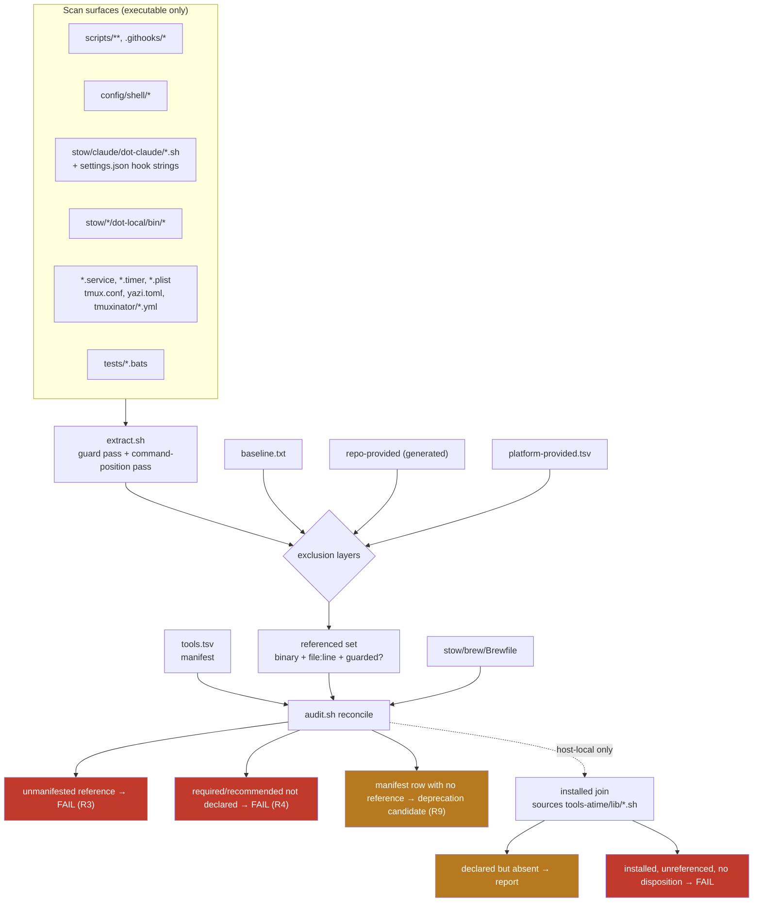

# Tooling reconciliation audit: referenced vs declared vs installed

## Summary

The repo invokes roughly a hundred external binaries across shell scripts, git hooks, Claude Code hooks, stow'd configs,
systemd units, launchd agents, and bats suites. `stow/brew/Brewfile` declares 35 formulae. Nothing checks that those two
sets agree, so a tool can be invoked by a fail-open guard, be absent from every manifest, and still report green on
every local and remote gate.

This plan introduces a committed tool manifest as the single authoritative record of every external binary the repo
depends on, a deterministic extractor that reconciles repo references against it, a tier-keyed policy that decides
whether a missing tool is silent, loud, or fatal, and a triage pass that records a removal decision per unreferenced
tool. The static half of the audit runs in CI; the installed-state half runs host-local against the existing
`scripts/tools-atime/` adapters.

---

## Problem Frame

`stow/claude/dot-claude/auto-format.sh:155` guards its formatter on `command -v shfmt` and falls through silently when
absent. `shfmt` was undeclared in `stow/brew/Brewfile`, so the hook formatted zero shell files and reported no error. CI
runs `shellcheck`, which has no opinion on formatting, so unformatted shell could land with every gate green.

That is a class, not an incident. Grounding evidence collected against the current tree:

- **`shellcheck` is present only as a transitive dependency of `actionlint`.** `brew uses --installed shellcheck`
  returns `actionlint`; neither is declared. `shellcheck` is a required status check on `dev` and `main`
  (`.github/workflows/shellcheck.yml`) and the pre-push gate (`.githooks/pre-push:55`). If `actionlint` is ever removed,
  or `brew autoremove` runs, `shellcheck` disappears, the pre-push hook prints a skip notice, and eleven bats tests that
  guard on it skip green.
- **`git-lfs` is undeclared and load-bearing.** `stow/git/dot-gitconfig:4` sets `required = true` on the LFS filter.
  Absent, every checkout touching an LFS-tracked path hard-fails. `brew uses --installed git-lfs` is empty, so nothing
  reinstalls it.
- **`bats-core` is undeclared** despite `bats` being the second required status check (`.github/workflows/bats.yml`).
- **`jaq` is undeclared** while `scripts/tools-atime/lib/brew.sh:90` hard-fails without it and the active tooling policy
  mandates it over `jq`. `jq` is declared instead, and is what `auto-format.sh:7` actually invokes, unguarded.
- **A Brewfile comment asserts a dependency that does not exist.** `stow/brew/Brewfile` states ffmpeg "is already pulled
  in transitively elsewhere". `brew uses --installed ffmpeg` is empty — it is a leaf.
  `stow/local/dot-local/bin/transcribe-diarize:52` invokes it unguarded.
- **`config/shell/languagetool.sh` never checks for `jaq`** despite its own header listing it as a dependency; every
  call is wrapped in `2>/dev/null || true`, so a missing `jaq` yields zero matches and `lt_check` returns 0 — a silent
  false pass, strictly worse than the `shfmt` case because the fail-open path fabricates a passing verdict.

The reverse direction is unmeasured too. `brew leaves` lists 25 formulae absent from the Brewfile; some are load-bearing
(`stow`, `git-lfs`, `jaq`), some are config-backed by a stow package (`lazygit`, `rclone`, `gogcli`), and some have no
reference anywhere in the repo. No record distinguishes them, so cleanup is guesswork.

---

## Goal Capsule

Make the relationship between what the repo **references**, what it **declares**, and what is **installed** an explicit,
committed, machine-checked artifact — so a missing tool is loud in proportion to what depends on it, and a removal
candidate carries recorded evidence rather than a hunch.

---

## Assumptions

Recorded because this plan was produced non-interactively; each is a judgment call an implementer may revisit.

- **A1.** The manifest is worth its maintenance cost. A committed list of ~100 tools must be updated when a tool is
  added. The alternative — a purely heuristic scanner with no baseline — cannot distinguish "new undeclared reference"
  from "known and deliberately undeclared", which is the distinction that makes a CI gate viable.
- **A2.** A tool referenced only from the `permissions.allow` list in `stow/claude/dot-claude/settings.json` is an
  *intent* signal, not an invocation. That list names ~70 binaries the agent may run; it is not evidence the repo
  invokes them. Treated as `allowlist-only` provenance, never as a Brewfile obligation.
- **A3.** Markdown is never scanned. Tools named in prose, fenced examples, runbooks, and skill documentation are out of
  scope. This is the single largest false-positive control and it costs nothing.
- **A4.** The audit's CI half asserts only the **static** relation (references ⊆ manifest, and required/recommended
  tiers ⊆ Brewfile). Installed-state cannot be asserted in CI because the runner is a clean Ubuntu image.
- **A5.** Per-project formatters resolved through `bunx` (biome, prettier) and language toolchains resolved through
  their own managers (`rustfmt` via rustup, `ruff` via uv) stay `optional`. Their absence is correctly silent — they are
  per-repo concerns, not machine-provisioning concerns.
- **A6.** Deprecation decisions are recorded but **not executed** by this plan. No formula is uninstalled here; the
  artifact is the decision record plus the Brewfile change that follows from it.

---

## Requirements

| ID | Requirement |
| -- | ----------- |
| R1 | A committed manifest enumerates every external binary the repo references, with tier, provider, and per-platform provenance. |
| R2 | A deterministic extractor enumerates referenced binaries from executable surfaces only, and reconciles them against the manifest. |
| R3 | A reference present in the repo but absent from the manifest fails the audit and names its file and line. |
| R4 | A manifest entry tiered `required` or `recommended` that no Brewfile line provides fails the audit. |
| R5 | Declaration checks resolve formula names to their provided binaries, so `sevenzip`→`7zz` and `bats-core`→`bats` are satisfied and `powerlevel10k` (zero binaries) is not falsely flagged. |
| R6 | The macOS declaration gaps the audit finds are closed in `stow/brew/Brewfile` under the existing grouped-section-with-WHY-comment convention. |
| R7 | A missing tool produces a signal proportional to its tier: fatal for `required`, loud-once for `recommended`, silent for `optional`. |
| R8 | The hook surface reports a missing `recommended` tool through a channel that does not add per-tool-call terminal noise. |
| R9 | Every installed tool with no repo reference carries a recorded disposition (`keep-undeclared`, `promote`, `move-to-optional`, `remove`) with its evidence. |
| R10 | A recorded `remove` decision is reversible: the manifest retains the entry so the audit does not re-flag it and re-adding is a one-line change. |
| R11 | The static audit runs in CI on every PR and in the pre-push hook via the existing shared-fail-flag accumulator. |
| R12 | The installed-state join reuses `scripts/tools-atime/` adapters rather than reimplementing package-manager enumeration. |
| R13 | The manifest schema carries a per-platform provider field so the Linux reconciliation (sibling feature) fills rows without schema changes. |

---

## Key Technical Decisions

### KTD1. A committed manifest is the authoritative record; the scanner is the drift detector

Extraction alone cannot distinguish a genuinely new undeclared reference from one that is known and deliberately
undeclared (`stow`, `brew`, `git` — the bootstrap set). The manifest supplies that baseline. The scanner's verdict is
`references − manifest = findings`, which is deterministic and stable across runs.

This mirrors `docs/solutions/best-practices/point-anti-drift-audit-at-built-artifacts-not-static-registry.md`, inverted
for this problem's shape: that doc walks the derived built set rather than a static registry because the registry can
outlive its content. Here the derived set (extracted references) is the *input* and the manifest is the *assertion* —
the audit compares them rather than trusting either alone, so neither a stale manifest row nor an unscanned file passes
silently.

### KTD2. `command -v` guard sites are the primary extraction signal; command-position tokens are the recall net

The repo already uses `command -v <tool>` as its presence idiom in dozens of places. Those sites are self-declaring and
near-zero false positive — the script author has already named the external dependency. Extraction runs two passes:

1. **Guard pass** — every `command -v X`, `command -v "$VAR"` with a resolvable literal default, and `type -p X`. High
   precision.
2. **Command-position pass** — first token of a simple command, plus tokens after `exec`, `sudo`, `timeout N`, `xargs`,
   and inside `$(…)`. High recall, lower precision, filtered by the exclusion layers below.

A full shell parser is rejected: `shellcheck`'s AST is not exposed as a stable public interface, and the invocation
surface includes non-shell files (`settings.json` hook strings, systemd `ExecStart=`, tmux `run-shell`, yazi TOML
previewer commands) that a shell parser cannot read anyway. A token scanner with declarative exclusions handles all
surfaces uniformly.

### KTD3. False positives are controlled by four declarative layers, not by scanner heuristics

Each layer is a committed data file under `scripts/tools-audit/data/`, so a false positive is fixed once, in the open,
with review — never by tuning a regex.

| Layer                   | Contents                                                          | Rationale                                                                                |
| ----------------------- | ----------------------------------------------------------------- | ---------------------------------------------------------------------------------------- |
| `baseline.txt`          | Shell builtins + POSIX/coreutils present on both macOS and Ubuntu | Never a provisioning concern                                                             |
| `repo-provided.txt`     | Derived at runtime from `stow/*/dot-local/bin/*`                  | The repo ships these; a reference to `uuidv7` or `sd-commit-doc` is self-satisfied       |
| `platform-provided.tsv` | Binary → platform → provider                                      | `trash` is `/usr/bin/trash` on macOS and `trash-cli` on Linux; `systemctl` is Linux-only |
| Scan scope              | Executable surfaces only; `*.md` never scanned                    | Removes prose, fenced examples, and skill docs wholesale (A3)                            |

`repo-provided.txt` is generated, not hand-maintained, so adding a helper under `stow/<pkg>/dot-local/bin/` never
requires an audit edit.

### KTD4. Five tiers, keyed on what breaks when the tool is absent

Tier drives both the Brewfile obligation and the runtime failure mode, so the two can never disagree.

| Tier          | Meaning                                                               | Declaration surface           | Missing-tool behavior                                        |
| ------------- | --------------------------------------------------------------------- | ----------------------------- | ------------------------------------------------------------ |
| `bootstrap`   | Required before `brew bundle` can run at all                          | `BOOTSTRAP.md`                | Fatal, already handled (`EXIT_DEPENDENCY`)                   |
| `required`    | A gate, hook, or filter hard-depends on it                            | `Brewfile`                    | Fatal — exit non-zero, name the tool and its install command |
| `recommended` | A hook or workflow degrades meaningfully but the repo still functions | `Brewfile`                    | Loud once per invocation, non-fatal                          |
| `optional`    | Convenience, or a per-project toolchain resolved by its own manager   | `Brewfile.optional`           | Silent skip                                                  |
| `platform`    | Provided by the OS on at least one platform                           | Per-platform `provider` field | Fatal on platforms where no provider exists                  |

`shellcheck` and `bats-core` are `required` — they back the two required status checks. `shfmt`, `actionlint`, `yq`,
`markdownlint-cli2` are `recommended`. `ruff`, `rubocop`, `biome`, `prettier` are `optional` (A5). `stow`, `brew`,
`git`, `git-crypt` are `bootstrap`. `trash`, `systemctl`, `launchctl`, `osascript`, `defaults` are `platform`.

### KTD5. The `recommended` warning rides the hook's existing structured-output channel, not stderr

A PostToolUse hook runs on every file write. A stderr warning there is terminal noise on every edit, which is a
regression in daily experience and will get silenced — reintroducing the original problem.

`stow/claude/dot-claude/auto-format.sh:25` already defines `report_errors()`, which emits JSON on stdout that Claude
Code folds into `hookSpecificOutput.additionalContext`. That channel reaches the agent's transcript without touching the
user's terminal. A missing `recommended` formatter reports through it: the agent sees "shfmt is not installed; shell
formatting skipped" and can act, while the user sees nothing.

Gate contexts behave differently. `.githooks/pre-push` is invoked deliberately, infrequently, and already prints
progress, so a missing `recommended` tool prints to stderr there. The distinction is invocation frequency, not severity.

### KTD6. The pre-push wiring joins the shared fail flag; the skip path never raises it

`docs/solutions/best-practices/accumulate-check-failures-into-a-shared-flag-not-early-exit.md` is directly on point and
its shape is followed exactly: the new audit check appends `|| fail=1`, never `|| exit 1`, so an audit finding does not
mask a shellcheck or bats failure in the same push. The tool-absent branch prints a note and leaves `fail` untouched.

`.githooks/pre-push` currently uses early `if/else` blocks rather than an accumulator. U8 introduces the `fail=0` / `||
fail=1` / single terminal `exit` shape while adding the audit, so the file matches the documented pattern.

### KTD7. Static reconciliation is a new sibling; installed-state reuses tools-atime's adapters

`scripts/tools-atime/` answers "what is installed and when was it last used" — host-local, atime-centric, and dependent
on `brew`/`bun`/`cargo`/`uv` being present. The static reconciliation must run on a CI runner with none of them.

Fusing the two would drag host package managers into a static check. Duplicating the adapter layer is explicitly
rejected. Resolution: `scripts/tools-audit/` owns extraction and static reconciliation with no package-manager
dependency; its installed-state subcommand **sources** `scripts/tools-atime/lib/<manager>.sh` and consumes the existing
`<manager>_rows()` TSV contract (`manager \t atime \t name \t has_bin \t own_kb \t reclaim_kb`) rather than
reimplementing enumeration. The adapter contract is the seam.

### KTD8. Declaration checks resolve formulae to their provided binaries

Formula name and binary name diverge routinely, verified against the current tree: `sevenzip`→`7zz`, `bats-core`→`bats`,
`poppler`→`pdftotext`/`pdfinfo`/…, `imagemagick`→`magick`/`identify`, `ast-grep`→`ast-grep`+`sg`,
`coreutils`→`g`-prefixed binaries, and `powerlevel10k`→no binaries at all.

A naive name-equality check produces false positives on every one. The manifest therefore carries an explicit
`provided_by` field (the Brewfile line that satisfies the reference), and the audit verifies that line exists rather
than inferring it. A zero-binary formula (`powerlevel10k`, the zsh plugins, fonts, `vscode` entries) is never a
reference target — those are sourced or installed, not invoked, and are excluded from the reference side entirely.

---

## High-Level Technical Design



The dashed edge is the CI boundary. Everything above it is static and runs on a clean runner; the installed join needs a
provisioned host (A4).

### Missing-tool signal by tier and context

| Tier          | PostToolUse hook                | Gate (pre-push / CI)               | Interactive script             |
| ------------- | ------------------------------- | ---------------------------------- | ------------------------------ |
| `bootstrap`   | n/a                             | Fatal `EXIT_DEPENDENCY`            | Fatal `EXIT_DEPENDENCY`        |
| `required`    | `additionalContext` + non-zero  | Fatal, joins `fail` flag           | Fatal `EXIT_DEPENDENCY`        |
| `recommended` | `additionalContext` only (KTD5) | stderr note, does not raise `fail` | stderr note                    |
| `optional`    | Silent                          | Silent                             | Silent                         |
| `platform`    | Fatal where no provider exists  | Fatal where no provider exists     | Fatal where no provider exists |

---

## Output Structure

```text
scripts/tools-audit/
├── tools-audit.sh          # orchestrator + subcommands: extract | reconcile | installed | report
├── lib/
│   ├── extract.sh          # guard pass + command-position pass over scan surfaces
│   ├── reconcile.sh        # references x manifest x Brewfile -> verdicts
│   ├── installed.sh        # sources ../tools-atime/lib/*.sh for the installed join
│   └── manifest.sh         # manifest parse/validate helpers
└── data/
    ├── tools.tsv           # THE manifest (R1)
    ├── baseline.txt        # builtins + ubiquitous coreutils
    ├── platform-provided.tsv
    └── scan-surfaces.txt   # glob list defining what gets scanned
```

`stow/local/dot-local/bin/tool-guard` is added separately as the shared runtime guard helper (U5), because it must be on
`PATH` for hooks and scripts, not under `scripts/`.

### Manifest schema (`scripts/tools-audit/data/tools.tsv`)

Tab-separated, one row per tool, sorted by name. Columns:

| Column           | Meaning                                                                               |
| ---------------- | ------------------------------------------------------------------------------------- |
| `name`           | Binary name as invoked                                                                |
| `tier`           | `bootstrap` \| `required` \| `recommended` \| `optional` \| `platform`                |
| `platforms`      | `macos`, `linux`, or `both`                                                           |
| `provider.macos` | Brewfile line that provides it, `os` for OS-provided, `repo` for repo-shipped, or `-` |
| `provider.linux` | Same, filled by the sibling Linux feature (R13)                                       |
| `why`            | One clause: what breaks without it                                                    |
| `disposition`    | `active` \| `keep-undeclared` \| `move-to-optional` \| `removed` (R9, R10)            |

TSV over YAML/JSON deliberately: the audit is shell, the repo's existing adapter contract is TSV, and
`sort`/`comm`/`awk` diff it directly without a parser dependency. A `removed` row is retained forever — that is the
reversal path (R10).

---

## Implementation Units

### U1. Manifest schema, seed data, and validator

**Goal:** Establish `scripts/tools-audit/data/tools.tsv` as the authoritative record, seeded from the reference sweep
already grounded in this plan, plus the exclusion data files.

**Requirements:** R1, R5, R13

**Dependencies:** none

**Files:**

- `scripts/tools-audit/data/tools.tsv` (create)
- `scripts/tools-audit/data/baseline.txt` (create)
- `scripts/tools-audit/data/platform-provided.tsv` (create)
- `scripts/tools-audit/data/scan-surfaces.txt` (create)
- `scripts/tools-audit/lib/manifest.sh` (create)
- `tests/tools-audit-manifest.bats` (create)

**Approach:**

1. Seed `tools.tsv` from the reference sweep. Rows must include, at minimum, the tools this plan's Problem Frame names:
   `shellcheck`, `bats-core`, `actionlint`, `git-lfs`, `jaq`, `shfmt`, `stow`, `git-crypt`, `ffmpeg`, `lazygit`,
   `rclone`, `gogcli`, `git-cliff`, `trash`, `cc2md`, `gitleaks`, `gbrain`, `caam`, `micro`, `tailscale`, `rtk`,
   `terminal-notifier`, `glow`, `pdftotext`, `magick`, `7zz`, `yazi`, `tmux`, `tmuxinator`, `qmd`, `uv`, `bun`, `node`,
   `gh`, `op`, `yq`, `markdownlint-cli2`, `ast-grep`, `rg`, `fd`, `jq`.
2. `provider.macos` names the Brewfile line, not the binary (KTD8) — e.g. `bats` → `bats-core`, `7zz` → `sevenzip`,
   `pdftotext` → `poppler`.
3. `platform-provided.tsv` records the split cases: `trash` (macOS `os`, Linux `trash-cli`), `systemctl`/`journalctl`/
   `apparmor_parser`/`ss`/`gio` (Linux only), `launchctl`/`osascript`/`defaults`/`diskutil`/`pgrep`/`open` (macOS only).
4. `baseline.txt` holds builtins plus coreutils common to both platforms. `sha256sum` is **not** baseline — it is absent
   from stock macOS and supplied by the declared `coreutils` formula; it gets a manifest row.
5. `manifest.sh` exposes parse and validate helpers: column count, tier vocabulary, platform vocabulary, sortedness, no
   duplicate names.

**Patterns to follow:** the TSV row contract and `[[ -n "${GUARD:-}" ]] && return 0` idempotent-source guard in
`scripts/tools-atime/lib/common.sh:1-8`.

**Test scenarios** (`tests/tools-audit-manifest.bats`):

1. A well-formed manifest validates clean and exits 0.
2. A row with the wrong column count fails validation and names the offending line number.
3. A row with an unknown tier value (`critical`) fails and lists the accepted vocabulary.
4. A row with an unknown platform value fails.
5. Duplicate `name` rows fail validation.
6. An out-of-sort-order row fails, so diffs stay reviewable.
7. A row tiered `platform` with `-` in both provider columns fails — a platform tool must name a provider somewhere.
8. A row with `disposition: removed` parses successfully and is excluded from active-set queries.
9. `baseline.txt` and the manifest have no overlapping names — a tool is baseline or manifested, never both.

**Verification:** `bats tests/tools-audit-manifest.bats` passes; `shellcheck` and `shfmt -i 2 -ci -bn -d` are clean on
the new shell file.

---

### U2. Reference extractor

**Goal:** Enumerate every externally-invoked binary from executable surfaces, with file, line, and whether the call site
is guarded.

**Requirements:** R2

**Dependencies:** U1

**Files:**

- `scripts/tools-audit/lib/extract.sh` (create)
- `scripts/tools-audit/tools-audit.sh` (create — orchestrator with the `extract` subcommand)
- `tests/tools-audit-extract.bats` (create)

**Approach:**

1. Read scan globs from `data/scan-surfaces.txt` so surface changes are data, not code. Seed globs cover `scripts/**`,
   `.githooks/*`, `config/shell/*`, `stow/claude/dot-claude/*.sh`, `stow/*/dot-local/bin/*`, `stow/**/*.service`,
   `stow/**/*.timer`, `stow/**/*.plist`, `stow/tmux/**/tmux.conf`, `stow/yazi/**/*.toml`, `stow/tmuxinator/**/*.yml`,
   `stow/**/dot-gitconfig`, `stow/zsh/**`, `stow/bash/**`, `stow/shell/dot-profile`, `tests/*.bats`.
2. Extract hook command strings from `stow/claude/dot-claude/settings.json` with `jaq`, reading
   `.hooks[][].hooks[].command` and `.statusLine.command`. Parse the `permissions.allow` list separately and tag it
   `allowlist-only` (A2).
3. Guard pass then command-position pass (KTD2). Emit TSV: `binary \t file \t line \t guarded(0|1) \t provenance`.
4. Apply the four exclusion layers (KTD3). Generate the repo-provided set at runtime by listing
   `stow/*/dot-local/bin/*`.
5. Emit deterministically — sorted, stable — so two runs on an unchanged tree byte-match.

**Execution note:** the false-positive rate is the thing that decides whether this tool is usable. Build the exclusion
fixtures and their tests before broadening the command-position pass, and check the extractor's output against the whole
repo early to confirm it does not drown the signal.

**Test scenarios** (`tests/tools-audit-extract.bats`):

1. `command -v shfmt` in a fixture yields `shfmt` with `guarded=1`.
2. A bare `shfmt -w file` invocation yields `shfmt` with `guarded=0`.
3. A builtin (`printf`, `cd`, `local`) is never emitted.
4. A baseline coreutil (`sed`, `awk`, `head`) is never emitted.
5. A repo-provided binary (`uuidv7`) is not emitted as an external reference.
6. `sudo powermetrics …`, `exec rclone …`, and `timeout 120 claude …` each yield the wrapped binary, not the wrapper.
7. A tool named only inside a fenced block in a `.md` file is not emitted, because markdown is never scanned (A3).
8. A tool named only in `permissions.allow` is emitted with provenance `allowlist-only`, not as an invocation.
9. A `settings.json` hook string (`rtk hook claude`) yields `rtk` with its `settings.json` line number.
10. A systemd `ExecStart=/abs/path/caddy run` yields `caddy` from the absolute path's basename.
11. A `yazi.toml` previewer command piping through `glow` yields `glow`.
12. Two runs over the same fixture tree produce byte-identical output.
13. A `command -v "$TMUX_BIN"` with a resolvable literal default yields `tmux`; an unresolvable variable is emitted as
    an `unresolved` row rather than silently dropped.

**Verification:** running `extract` over the real tree emits `shellcheck`, `bats`, `git-lfs`, `jaq`, and `ffmpeg` among
its rows, each with a correct file:line.

---

### U3. Reconciler and verdicts

**Goal:** Turn extracted references plus the manifest plus the Brewfile into pass/fail verdicts.

**Requirements:** R3, R4, R5

**Dependencies:** U1, U2

**Files:**

- `scripts/tools-audit/lib/reconcile.sh` (create)
- `scripts/tools-audit/tools-audit.sh` (modify — add `reconcile` and `report` subcommands)
- `tests/tools-audit-reconcile.bats` (create)

**Approach:**

1. Parse `stow/brew/Brewfile` into declared entries, capturing the `if OS.mac?` / `if OS.linux?` guard per line so a
   Linux-guarded line does not satisfy a macOS requirement.
2. Verdict A (R3): referenced ∧ ¬manifested → fail, printing binary, file:line, and a copyable manifest row stub.
3. Verdict B (R4): manifested ∧ tier ∈ {required, recommended} ∧ `provider.<platform>` names no existing Brewfile line →
   fail.
4. Verdict C (R9 input): manifested ∧ ¬referenced → deprecation candidate, emitted as a report row, not a failure.
5. Exit codes: 0 clean, 1 findings, 2 usage, 3 missing own dependency. Support `--json` for machine consumption and
   `--platform macos|linux` so the sibling feature can run the same reconciler.
6. Verdict B resolves `provider` against the Brewfile line, never against the binary name (KTD8).

**Test scenarios** (`tests/tools-audit-reconcile.bats`):

1. A reference present in the manifest and declared in the Brewfile produces no finding, exit 0.
2. A reference absent from the manifest fails with exit 1 and prints its file:line.
3. A `required` tool whose `provider.macos` names no Brewfile line fails.
4. A `recommended` tool with no Brewfile line fails.
5. An `optional` tool with no Brewfile line does not fail.
6. A `bootstrap` tool with no Brewfile line does not fail (BOOTSTRAP.md is its surface).
7. `7zz` with `provider.macos = sevenzip` passes against a Brewfile containing `brew "sevenzip"` — the name-vs-binary
   case (R5).
8. `bats` with `provider.macos = bats-core` passes against `brew "bats-core"`.
9. `powerlevel10k` is absent from the reference side entirely and produces no finding in either direction.
10. A `caddy` row with `provider.linux` set and `provider.macos = -` produces no macOS finding under `--platform macos`.
11. A manifest row with no matching reference is reported as a deprecation candidate, exit stays 0 for that verdict
    alone.
12. A row with `disposition: removed` produces neither a declaration finding nor a deprecation candidate.
13. `--json` output parses under `jaq` and carries one object per finding with `binary`, `verdict`, `file`, `line`.
14. Exit code is 2 for an unknown subcommand and 3 when `jaq` is absent.

**Verification:** run against the current tree; the findings list includes `shellcheck`, `bats-core`, `git-lfs`, and
`jaq` as undeclared-but-required before U4 lands, and is empty for those four after.

---

### U4. Close the macOS declaration gaps in the Brewfile

**Goal:** Declare every `required` and `recommended` tool the reconciler flags, so U3 exits clean on macOS.

**Requirements:** R6

**Dependencies:** U3

**Files:**

- `stow/brew/Brewfile` (modify)
- `stow/brew/Brewfile.optional` (modify)
- `BOOTSTRAP.md` (modify)

**Approach:**

1. Add `required` tier: `shellcheck`, `bats-core`, `git-lfs`, `jaq`, `git-cliff`. `shellcheck` gets a WHY comment naming
   that it backs a required status check and must not be left to arrive transitively through `actionlint`. `git-lfs`
   gets one naming `required = true` in `stow/git/dot-gitconfig`.
2. Add `recommended` tier: `actionlint`, and any further rows the reconciler reports.
3. Correct the ffmpeg claim. The existing yazi-block comment asserts ffmpeg arrives transitively; `brew uses --installed
   ffmpeg` is empty. Add `brew "ffmpeg"` and replace the assertion with the present-tense reason: yazi video previews
   and `stow/local/dot-local/bin/transcribe-diarize` both invoke it directly.
4. Add stow-package-backed tools whose config the repo deploys: `lazygit`, `rclone`, `gogcli`.
5. Move genuinely optional entries to `Brewfile.optional` per U7's dispositions.
6. Confirm `BOOTSTRAP.md` names the full `bootstrap` set. It currently instructs `brew install stow git-crypt`; verify
   `git` and Homebrew itself are covered by the surrounding prose.
7. Follow the existing convention exactly — grouped sections, WHY comment above any non-obvious entry, `if OS.mac?` /
   `if OS.linux?` guards. This convention is the shared surface the Linux sibling feature consumes.

**Execution note:** this is a declaration change with no behavioral logic. Verify by running the reconciler before and
after and diffing the findings list rather than by adding unit tests for Brewfile contents.

**Test scenarios:** covered by U3's reconciler tests plus the U8 CI gate. No new bats file. `Test expectation: none —
pure declaration change; the reconciler is the assertion.`

**Verification:** `scripts/tools-audit/tools-audit.sh reconcile --platform macos` exits 0. `brew bundle check
--file=stow/brew/Brewfile` reports satisfied on the macOS workstation.

---

### U5. Tier-keyed missing-tool policy

**Goal:** Replace ad-hoc `command -v X || silent-skip` with a shared helper whose behavior is driven by manifest tier
and invocation context.

**Requirements:** R7, R8

**Dependencies:** U1

**Files:**

- `stow/local/dot-local/bin/tool-guard` (create)
- `stow/claude/dot-claude/auto-format.sh` (modify)
- `config/shell/languagetool.sh` (modify)
- `tests/tool-guard.bats` (create)

**Approach:**

1. `tool-guard` takes a binary name and a context (`hook` | `gate` | `script`), reads the tier from the manifest, and
   returns an exit code plus a message on the channel the context dictates (KTD5 table).
2. Rewire `auto-format.sh` so each formatter arm consults `tool-guard` in `hook` context. A missing `recommended`
   formatter routes its message through the existing `report_errors()` helper at
   `stow/claude/dot-claude/auto-format.sh:25` rather than stderr.
3. Fix the two unguarded high-impact call sites the sweep found: `markdownlint-cli2` at
   `stow/claude/dot-claude/auto-format.sh:129` (the only formatter in the chain with no guard) and `jq` at
   `stow/claude/dot-claude/auto-format.sh:7`, which is the hook's very first statement — absent `jq`, the hook dies
   before reading its input.
4. Fix `config/shell/languagetool.sh`: add a real `jaq` presence check so a missing `jaq` returns the documented
   non-zero "LT unreachable" status instead of returning 0 with zero matches. This is the silent-false-pass case and is
   the highest-severity fail-open instance found.
5. `tool-guard` must degrade safely: if the manifest is unreadable it treats the tool as `recommended` and warns, never
   blocking a hook on its own bookkeeping.

**Execution note:** the hook path runs on every file write. Add a test asserting the quiet path stays quiet before
changing `auto-format.sh`, so a regression that starts printing per-edit noise fails the suite rather than the user's
patience.

**Test scenarios** (`tests/tool-guard.bats`):

1. `required` tool absent, `gate` context → exit 3, message on stderr naming the install command.
2. `required` tool absent, `hook` context → non-zero exit and a JSON `additionalContext` payload on stdout.
3. `recommended` tool absent, `hook` context → exit 0, JSON `additionalContext` payload, **nothing on stderr**.
4. `recommended` tool absent, `gate` context → exit 0, note on stderr.
5. `optional` tool absent, any context → exit 0, no output on either stream.
6. `platform` tool absent on a platform that names a provider → fatal.
7. `platform` tool absent on a platform where it is `-` → silent, correct no-op.
8. Tool present → exit 0, no output, regardless of tier.
9. Unreadable manifest → treated as `recommended`, warns, exit 0.
10. `auto-format.sh` on a `.sh` file with `shfmt` absent emits `additionalContext` mentioning shfmt and leaves the file
    unmodified.
11. `auto-format.sh` on a `.sh` file with `shfmt` present formats the file and prints no warning.
12. `lt_check` with `jaq` absent returns non-zero rather than 0-with-zero-matches.
13. `auto-format.sh` with `jq` absent exits non-zero with a diagnostic instead of dying on an unbound variable.

**Verification:** `bats tests/tool-guard.bats` passes; editing a `.sh` file through the hook with all tools present
produces no new terminal output.

---

### U6. Installed-state join

**Goal:** Answer the third dimension — what is actually on this host — by reusing the tools-atime adapters.

**Requirements:** R12

**Dependencies:** U3

**Files:**

- `scripts/tools-audit/lib/installed.sh` (create)
- `scripts/tools-audit/tools-audit.sh` (modify — add the `installed` subcommand)
- `tests/tools-audit-installed.bats` (create)

**Approach:**

1. Source `scripts/tools-atime/lib/common.sh` and each `lib/<manager>.sh`, consuming `<manager>_rows()` output on its
   existing six-column TSV contract. Add no adapter and duplicate no enumeration (KTD7).
2. Join installed rows against the manifest to produce: declared-but-absent, installed-and-referenced, and
   installed-but-unreferenced.
3. Resolve a formula to its provided binaries via `brew list --formula <name>` so the join survives the name-vs-binary
   divergence (KTD8).
4. Distinguish leaf from transitive-only installs. A referenced tool that is installed **only** as another package's
   dependency is its own reported state — this is exactly the `shellcheck`-via-`actionlint` case, and neither `brew
   leaves` nor a plain presence check surfaces it.
5. Guard on each manager's absence and skip that manager cleanly; the subcommand must run on a host with only some
   managers present.

**Test scenarios** (`tests/tools-audit-installed.bats`):

1. A manifest tool present on `PATH` and leaf-installed reports `installed`.
2. A manifest tool installed only as another formula's dependency reports `transitive-only` and names the parent.
3. A manifest tool absent reports `missing`.
4. An installed formula with no manifest reference and no disposition reports as an untriaged deprecation candidate.
5. An installed formula whose manifest row is `disposition: keep-undeclared` produces no finding.
6. A formula whose binaries differ from its name (`sevenzip`) joins correctly via `brew list`.
7. A zero-binary formula (`powerlevel10k`) is skipped rather than reported missing.
8. With `brew` absent, the brew adapter is skipped and other managers still report.
9. Output rows conform to the tools-atime six-column TSV contract where they carry atime data.
10. `--json` output parses under `jaq`.

**Verification:** run on the macOS workstation; `shellcheck` reports `transitive-only` before U4 and `installed` after.

---

### U7. Deprecation triage and recorded dispositions

**Goal:** Give every installed-but-unreferenced tool a recorded decision with evidence, and a reversal path.

**Requirements:** R9, R10

**Dependencies:** U6

**Files:**

- `scripts/tools-audit/data/tools.tsv` (modify — add dispositions)
- `stow/brew/Brewfile` (modify — apply `promote` decisions)
- `stow/brew/Brewfile.optional` (modify — apply `move-to-optional` decisions)

**Approach:**

1. Run `tools-audit installed` and take its untriaged list as the work queue. From the current tree that queue starts
   from the 25 undeclared leaves, minus those U4 already promoted.
2. Apply the evidence bar. A tool is safely removable only when **all** hold:
   - zero references in the extractor's output, across every scan surface;
   - no stow package deploys configuration for it;
   - `brew uses --installed <formula>` is empty, so nothing else needs it;
   - it is named in no CI workflow and no `BOOTSTRAP.md` step.

   `atime` is **corroborating only, never sufficient** — a rarely-used tool is not a dead tool, and `tools-atime`'s own
   sorting makes that easy to misread. A recent atime vetoes removal; an old atime never justifies it on its own.
3. Record one disposition per entry. Expected shape from current evidence: `lazygit`, `rclone`, `gogcli` → `promote`
   (stow packages deploy their config); the Xcode/iOS toolchain (`fastlane`, `swiftformat`, `swiftlint`, `xcbeautify`,
   `xcode-build-server`) and personal utilities (`htop`, `dust`, `nvtop`, `mole`, `yt-dlp`, `pandoc`, `lazygit`-adjacent
   extras) → `keep-undeclared` or `move-to-optional` per the bar, since they serve work outside this repo; `micro` →
   referenced by `stow/yazi/**` and `stow/lazygit/**` but not installed, so it is a declaration gap rather than a
   removal candidate.
4. Reversal path (R10): a `remove` decision keeps its manifest row with `disposition: removed`. The audit skips removed
   rows in both directions, so re-adding is flipping one field back to `active`.
5. No formula is uninstalled by this plan (A6). The artifact is the decision record and the Brewfile changes that
   follow.

**Test scenarios:** covered by U3 scenario 12 (`removed` rows produce no findings) and U6 scenario 5 (`keep-undeclared`
produces no finding). `Test expectation: none — this unit records decisions in data; the reconciler tests assert how
each disposition behaves.`

**Verification:** `tools-audit installed` reports zero untriaged entries on the macOS workstation.

---

### U8. Gate wiring and documentation

**Goal:** Run the static audit on every PR and every push, and bring the repo docs to present truth.

**Requirements:** R11

**Dependencies:** U3, U4, U5

**Files:**

- `.github/workflows/shellcheck.yml` (modify — add the audit as a step)
- `.githooks/pre-push` (modify)
- `.github/workflows/bats.yml` (modify)
- `.github/rulesets/protect-dev.json` (modify — only if the audit is promoted to its own required context)
- `.github/rulesets/protect-main.json` (modify — same)
- `README.md` (modify)
- `tests/git-hooks.bats` (modify)

**Approach:**

1. Add the static reconciler as a **step inside `.github/workflows/shellcheck.yml`**, not as a new workflow. Required
   contexts are declared in-repo at `.github/rulesets/protect-dev.json` and `protect-main.json`, and both currently list
   exactly `shellcheck` and `bats`. A new workflow would report a new context that no ruleset requires, so it would sit
   advisory until a separate ruleset edit lands. Riding the existing required `shellcheck` context makes the audit
   blocking on day one with no ruleset change.
2. Because the audit is blocking immediately, it must be quiet on a clean tree from its first run. U4 and U7 land the
   declarations and dispositions before this unit, and the unit's own verification is a clean run against the current
   tree. If findings remain when this unit is reached, fix the findings rather than downgrading the gate.
3. Install the audit's own dependency (`jaq`) in that workflow, mirroring the `jq`-symlinked-as-`jaq` step already in
   `.github/workflows/bats.yml`.
4. Rewire `.githooks/pre-push` to the accumulator shape (KTD6): introduce `fail=0`, convert the existing shellcheck and
   bats blocks to `|| fail=1`, add the audit as another `|| fail=1`, and exit once at the end. The md-only short-circuit
   stays an early exit — it is a genuine precondition, which the referenced solutions doc explicitly permits.
5. Add `bats-core` and the audit's own dependencies to the CI install step so the new bats file runs.
6. Update `README.md`: add `scripts/tools-audit/` to the repo-layout tree, and note the manifest as the tool source of
   truth near the Stow-package table.

**Cross-feature coordination:** the Linux reconciliation plan wires its own gate into the same `shellcheck.yml` workflow
for the same ruleset reason. Both features add a step to one file. Land them sequentially, and prefer a single shared
audit step invoking `tools-audit reconcile --platform <os>` over two independent steps.

**Test scenarios** (`tests/git-hooks.bats`, extending the existing file):

1. `.githooks/pre-push` passes `shellcheck` (extends existing coverage to the rewritten file).
2. With shellcheck absent and bats present, the hook still runs bats — a skip does not short-circuit later checks.
3. A failing audit and a failing shellcheck in one push both print; the hook exits non-zero once.
4. A failing audit alone exits non-zero.
5. All checks passing exits 0.
6. An md-only push short-circuits before the audit runs.
7. The audit's tool-absent branch prints a note and does not raise `fail`.

**Verification:** a PR touching a shell script runs both workflows green; a PR adding an unmanifested tool reference
fails the `shellcheck` context with a finding naming the file and line.

---

## Verification Contract

| Gate                 | Command                                                         | Expectation            |
| -------------------- | --------------------------------------------------------------- | ---------------------- |
| Shell lint           | `shellcheck` over the new files, per the workflow's file sets   | Clean                  |
| Shell format         | `shfmt -i 2 -ci -bn -d` on all new and modified shell           | No diff                |
| Unit tests           | `bats tests/*.bats`                                             | All pass               |
| Static audit (macOS) | `scripts/tools-audit/tools-audit.sh reconcile --platform macos` | Exit 0                 |
| Installed join       | `scripts/tools-audit/tools-audit.sh installed`                  | Zero untriaged entries |
| Determinism          | `extract` run twice on an unchanged tree                        | Byte-identical output  |
| Brew declarations    | `brew bundle check --file=stow/brew/Brewfile`                   | Satisfied              |

---

## Definition of Done

- Every external binary the repo invokes has a manifest row with a tier, a provider, and a why-clause.
- `reconcile --platform macos` exits 0 on the current tree.
- `shellcheck`, `bats-core`, `git-lfs`, and `jaq` are declared in `stow/brew/Brewfile`; none depends on arriving
  transitively.
- A missing tool's signal matches its tier in all three contexts, and the PostToolUse hook adds no per-edit terminal
  output.
- `config/shell/languagetool.sh` returns non-zero when `jaq` is absent instead of a false pass.
- Every installed-but-unreferenced tool carries a recorded disposition.
- The audit runs in CI on every PR and in `.githooks/pre-push` via the shared fail flag.
- `README.md`'s repo-layout tree includes `scripts/tools-audit/`.

---

## Scope Boundaries

**In scope:** the platform-agnostic audit tooling, the manifest schema and its macOS rows, macOS Brewfile
reconciliation, the tier-keyed fail-open policy, and the deprecation decision record.

### Deferred to Follow-Up Work

- **Linux reconciliation** — the sibling feature owns `provider.linux`, apt/linuxbrew inventory, `if OS.linux?` rows,
  Linux-only stow packages, and systemd units. This plan ships the schema column and the `--platform` flag it needs.
- **A remote/second-host adapter** for the installed join. The seam is `scripts/tools-audit/lib/installed.sh`'s adapter
  sourcing; a remote adapter satisfies the same `<manager>_rows()` TSV contract. The sibling feature fills it.
- **Executing removals.** This plan records dispositions; uninstalling is a separate, reversible operation (A6).
- **The `*_act` guard asymmetry** in `scripts/tools-atime/lib/*.sh`, where the reclaim functions are the only ones
  lacking a `command -v` check on their manager. Real but low-risk — `_act` is reachable only after `_rows` succeeded.
- **Second Claude profile drift.** `stow/caam/dot-local/share/caam/vault/claude/streams/settings.json` mirrors a subset
  of the main hook set and has drifted from it. A reconciliation of the two profiles is its own change.
- **Hardcoded absolute binary paths** in three sync scripts and one systemd unit, which bypass `PATH` resolution
  entirely and so are invisible to a `command -v`-based guard.
- **The `permissions.allow` / `deny` contradiction** in `stow/claude/dot-claude/settings.json`, where one rule appears
  in both lists.

**Out of scope:** package-manager choice, version pinning of tools, and the release/docs pass that a sibling feature
owns.

---

## Risks & Dependencies

| Risk                                                                                          | Mitigation                                                                                                                                                                                                                                                                                                                                                                                                       |
| --------------------------------------------------------------------------------------------- | ---------------------------------------------------------------------------------------------------------------------------------------------------------------------------------------------------------------------------------------------------------------------------------------------------------------------------------------------------------------------------------------------------------------- |
| The command-position pass produces enough false positives to make the audit ignored           | Guard pass carries the precision; exclusions are declarative data files reviewed once (KTD3); U2's execution note sequences fixture tests before broadening the pass                                                                                                                                                                                                                                             |
| The audit blocks unrelated PRs the day it lands, because it rides an already-required context | U4 and U7 close every finding before U8 wires the gate, and U8's verification is a clean run against the current tree. If findings somehow remain, the fallback is a separate advisory workflow plus a `.github/rulesets/` edit — slower to become blocking, but it never wedges the repo                                                                                                                        |
| The manifest rots as tools are added                                                          | The audit fails on any unmanifested reference (R3), so adding a tool without a manifest row cannot merge                                                                                                                                                                                                                                                                                                         |
| Tier assignment is subjective                                                                 | Tier is defined by observable consequence — what breaks when the tool is absent — not by importance (KTD4)                                                                                                                                                                                                                                                                                                       |
| The hook change adds terminal noise and gets disabled                                         | The `recommended` path uses the existing structured channel and never stderr (KTD5); U5 scenario 3 asserts stderr stays empty                                                                                                                                                                                                                                                                                    |
| Rewriting `.githooks/pre-push` to an accumulator regresses the existing gates                 | U8 scenarios 1-6 cover the rewritten file, including the md-only short-circuit                                                                                                                                                                                                                                                                                                                                   |
| Brewfile edits collide with the sibling Linux feature                                         | Both features touch `stow/brew/Brewfile`; this plan owns section conventions and macOS rows, the sibling owns `if OS.linux?` rows. Sequence the two merges rather than running them concurrently                                                                                                                                                                                                                 |
| Two divergent manifest designs ship, and the reconciliation never composes                    | The Linux plan declares its own `config/linux/*.txt` manifests, its own extractor, and an inline `# provides: <binary>` convention where this plan uses a single `tools.tsv` with a `provided_by` column (KTD8). Both solve the same name-versus-binary problem in different shapes. Resolve the schema before either extractor lands — one manifest with a platform column, or an explicit adapter between them |

**Dependencies:** `jaq` (the audit's own runtime dependency — bootstrap it in CI the way `bats.yml` already does),
`bats-core` for the test suites, and the existing `scripts/tools-atime/lib/` adapter contract.

---

## Open Questions

1. **Should the audit report its own required context instead of riding `shellcheck`?** U8 rides the existing
   `shellcheck` context because `.github/rulesets/protect-dev.json` and `protect-main.json` require exactly `shellcheck`
   and `bats`, so a new workflow is advisory until those files change. Riding an existing context is faster to make
   blocking but conflates two failure meanings in one check name. A dedicated `tools-audit` context plus a ruleset edit
   is cleaner long-term; the ruleset files are in-repo, so the promotion is a normal PR rather than a settings change.
   Recommendation: ride `shellcheck` to land, and split the context out once the audit has proven quiet.
2. **Does the `jq` → `jaq` migration belong here?** The Brewfile declares `jq`, the tooling policy mandates `jaq`, and
   the hooks invoke `jq` unguarded. This plan manifests both and fixes the unguarded call sites, but does not migrate
   the call sites from one to the other. Assumption: migration is a separate change with its own blast radius.
3. **Where should the manifest live long-term** — `scripts/tools-audit/data/` (with its consumer) or a repo-root
   location (more discoverable)? Assumption: alongside its consumer, because it is machine-read far more often than
   human-read, and `README.md` gains a pointer either way.
4. **Should `tool-guard` read the manifest at runtime, or should tiers be baked in at deploy time?** Runtime read is
   simpler and chosen here; if hook latency becomes measurable, a generated lookup baked by `scripts/stow-deploy` is the
   fallback.

---

## Sources & Research

- `docs/solutions/best-practices/accumulate-check-failures-into-a-shared-flag-not-early-exit.md` — the exact accumulator
  shape for adding a check to a multi-check hook, including the rule that a fail-open skip never raises the flag.
  Directly shapes KTD6 and U8.
- `docs/solutions/best-practices/fail-open-security-default-must-warn-loudly-at-build-time.md` — a permissive default
  must make its own fallback path loud rather than merely safe. Generalizes from security defaults to the missing-tool
  case and shapes KTD5.
- `docs/solutions/best-practices/point-anti-drift-audit-at-built-artifacts-not-static-registry.md` — an anti-drift audit
  keyed to a static registry breaks when registry and reality diverge. Shapes KTD1's decision to compare both sides
  rather than trust either.
- `docs/solutions/best-practices/promote-warn-guard-to-hard-fail-must-discriminate-every-execution-context.md` —
  promoting a warn-only guard to a hard failure requires discriminating every execution context of the guarded path.
  Shapes the three-context table in KTD4 and U5's per-context test scenarios.
- `docs/solutions/conventions/local-hooks-compensating-gate-when-ci-is-minimized.md` — when local hooks carry the gate,
  showing every failure in one run matters more.
- Repo evidence gathered for this plan: `brew leaves` vs `stow/brew/Brewfile` (25 undeclared leaves), `brew uses
  --installed shellcheck` → `actionlint`, `brew uses --installed ffmpeg` → empty, `brew list --formula sevenzip` →
  `7zz`, and a full invocation sweep across `scripts/**`, `.githooks/*`, `config/shell/*`, `stow/**`, and
  `tests/*.bats`.
