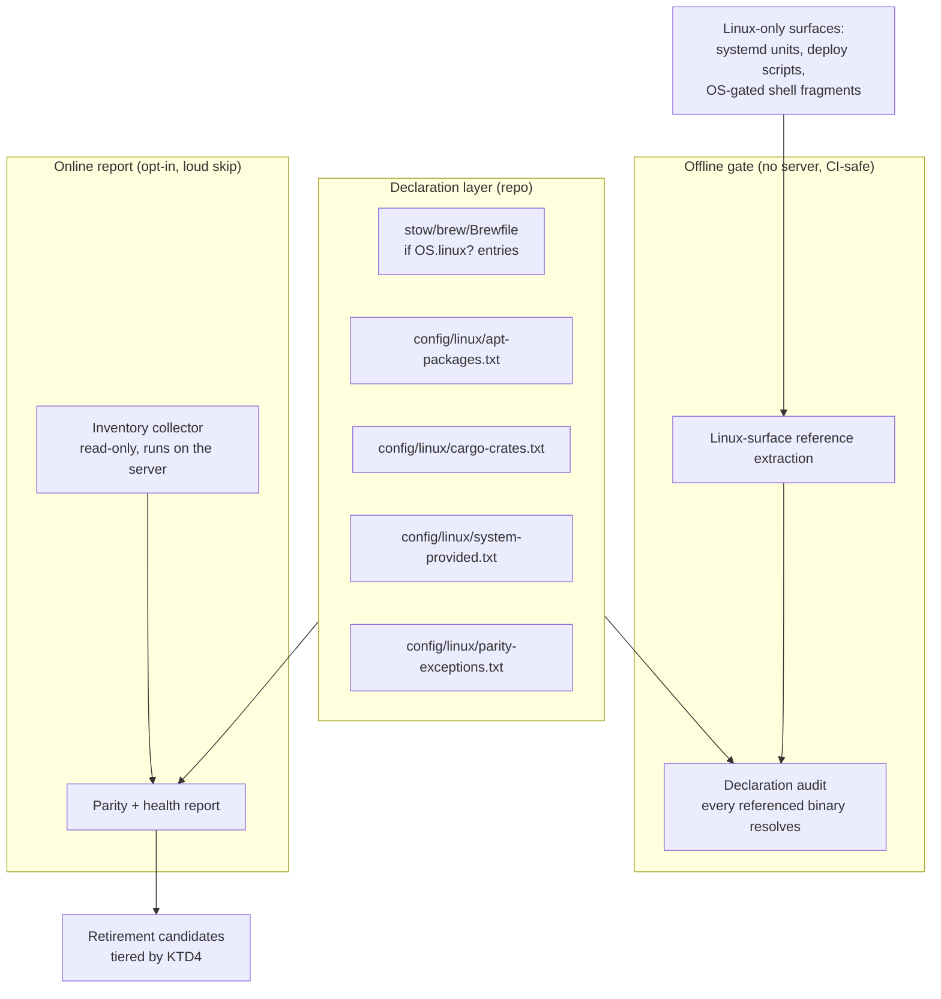
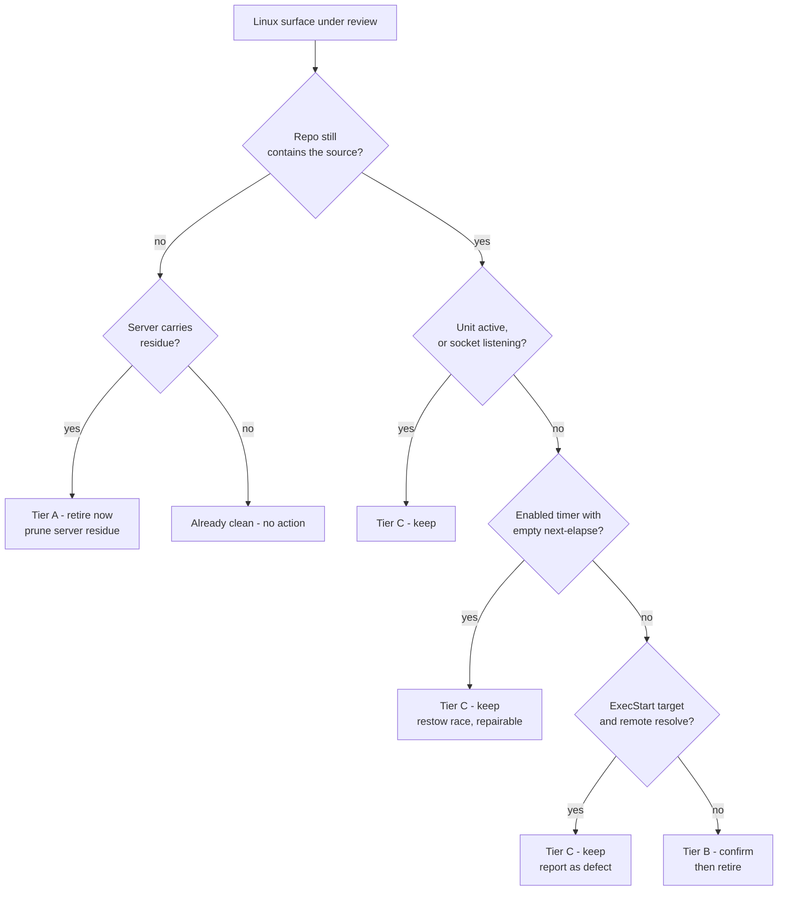
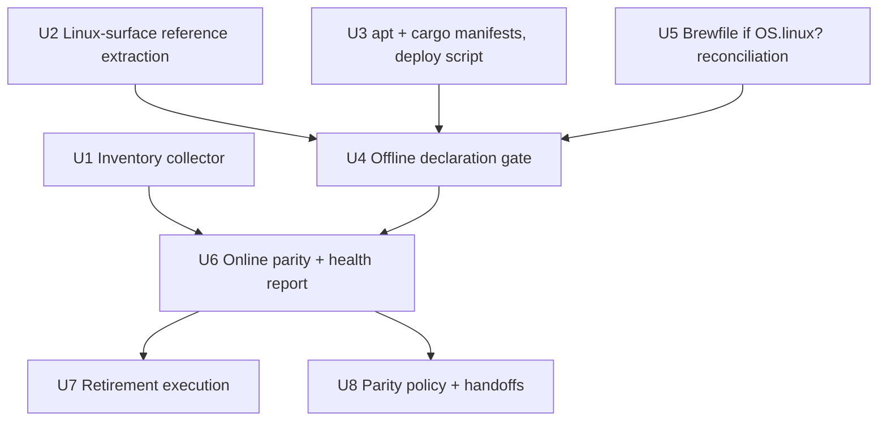

# Linux Server Declaration Reconciliation - Plan

## Goal Capsule

- **Objective:** Make the dotfiles repo an accurate declaration of what the headless Linux server needs, in both
  directions — every binary a Linux-only surface invokes is declared and installable, and every Linux surface the repo
  still provisions is either live or removed with evidence.
- **Authority hierarchy:** Ground-truth inventory collected from the server outranks the repo's claims.
  `stow/brew/Brewfile` `if OS.linux?` entries, `config/linux/` manifests, and `README.md`'s package table are claims to
  be verified, not sources of truth.
- **Execution profile:** Two landable tracks. The declaration track is additive and safe. The retirement track is
  destructive and gated on per-entry evidence plus a documented reversal path.
- **Stop conditions:** Stop and surface rather than guess when (a) a package cannot be attributed to a deliberate
  install versus a transitive dependency, (b) a retirement candidate's evidence does not clear the Tier ladder in KTD4,
  or (c) closing a declaration gap would require installing software on the server as part of the change rather than
  declaring it.
- **Tail ownership:** This plan owns the Linux half of the two-machine comparison. macOS-side gaps it surfaces are
  handed to the repo-wide/macOS reconciliation effort, not fixed here. Documentation rewrites are handed to the
  release-and-docs effort.

---

## Product Contract

### Summary

Add a Linux declaration layer to dotfiles and a two-layer audit that keeps it honest. The declaration layer gives apt
packages and cargo crates a home the repo does not currently provide, alongside the existing Brewfile `if OS.linux?`
entries. The audit layer runs offline in CI to prove every binary a Linux surface invokes is declared somewhere, and
runs online on demand to compare the server's real inventory against those declarations. The same run reports failed
units, dangling symlinks, and unbound tailnet service VIPs, so silent breakage becomes visible.

### Problem Frame

A formatter invoked by a Claude Code hook was never declared in the Brewfile. The hook guards on `command -v` and fails
open, so on a machine without the binary the hook did nothing and reported nothing. The repo had no way to notice.

The same class of gap exists across the Linux server, and it is wider there because the server draws from four package
managers while the repo declares only one. Linuxbrew has the Brewfile. Apt, cargo, and the user-scoped bun and uv
installs have no declaration surface at all. `scripts/nas-deploy.sh` names `cifs-utils` as a prerequisite in a comment;
nothing installs it and nothing checks it.

Verification against the running server shows the gap is real and already costing:

- `cifs-utils` is not installed. The CIFS kernel module is loaded and `/mnt/nas` is currently mounted, so the share
  works — but `mount.cifs` is absent, so `mnt-nas.automount` cannot re-establish the mount after a reboot.
- Both tailnet service VIPs are advertised (`AdvertiseServices` lists `svc:ollama` and `svc:codex-proxy`) while
  `tailscale serve status` reports no serve config. All four loopback upstreams are listening and healthy. This is
  precisely the drop-a-binding-but-keep-the-pref failure that `scripts/tailscale-serve-setup.sh` exists to repair, and
  it has occurred with nothing detecting it.
- Three user units are in a failed state and two of those have been failing on a one-minute and fifteen-minute cadence
  respectively.
- Removing `stow/openclaw/` from the repo left residue on the server: a broken symlink into the deleted package, an
  orphaned unit file with a `.bak` sibling and a drop-in directory, and three timers that resolve to nothing.

The reverse direction is thinner than expected. Very little the repo provisions for the server is genuinely dead. What
looks dead on first inspection is mostly live-but-broken, and the distinction is the crux of the retirement work.

### Requirements

**Ground truth**

- R1. Collect the server's real inventory with read-only commands, covering Linuxbrew, apt, cargo, uv tools, bun
  globals, systemd user and system units, timers, failed units, and dangling symlinks under the user config and data
  trees.
- R2. Separate deliberately-installed packages from transitive dependencies using each manager's own first-class query,
  and state where that separation is not cleanly available.
- R3. Emit the inventory as a normalized, diffable snapshot that both the audit and a human reviewer can consume.

**Declaration gaps**

- R4. Give apt packages a declaration home in the repo with a WHY comment per entry.
- R5. Give cargo crates a declaration home in the repo.
- R6. Give base-OS binaries an explicit allowlist so the audit distinguishes "provided by the operating system" from
  "undeclared".
- R7. Provide an idempotent deploy path that installs anything declared-but-absent, and reports rather than installs by
  default.
- R8. Reconcile the Brewfile's `if OS.linux?` entries against what Linux-only surfaces actually invoke.

**Retirement**

- R9. Classify every Linux surface the repo provisions into live, live-but-broken, or retirable, using a stated evidence
  ladder rather than liveness inference from a single signal.
- R10. Record per-entry evidence and a reversal path for each retirement.
- R11. Remove server-side residue left by repo-side removals, defaulting to a dry run.
- R12. Do not retire a surface whose failure is a repairable defect. Report those as defects instead.

**Parity and repeatability**

- R13. Encode the macOS-versus-Linux differences that are correct so a future audit does not re-flag them.
- R14. Prove the declaration layer offline, with no server contact, so it can gate CI.
- R15. Skip the online layer loudly and exit non-failing when the server is unreachable.
- R16. Surface failed units, dangling symlinks, and unbound tailnet service bindings in the online report.
- R17. Hand macOS-side gaps and documentation deltas to their owning efforts rather than fixing them here.

### Scope Boundaries

**In scope**

- The Linux server's declaration surface and the Linux half of the two-machine comparison.
- `if OS.linux?` entries in `stow/brew/Brewfile`.
- Linux-only stow packages, systemd units, deploy scripts, and OS-gated shell fragments.

**Deferred to follow-up work**

- Repairing the individual failing units. This plan makes them visible and classifies them as defects; each repair is
  its own change.
- Re-running the tailnet serve setup. The plan surfaces the unbound state; restoring the binding is an operational
  action, not a repo change.
- A scheduled health timer that re-asserts serve bindings. Worth considering once the report proves the failure mode
  recurs.

**Outside this plan**

- The repo-wide binary extraction scanner, unguarded and `if OS.mac?` Brewfile entries, and the Brewfile's section and
  comment conventions. Owned by the repo-wide/macOS reconciliation effort.
- Rewriting `README.md`'s package table and `BOOTSTRAP.md`'s Linux setup steps. Owned by the release-and-docs effort;
  this plan records the deltas.
- The NVIDIA, CUDA, and kernel driver stack. Host hardware provisioning, not dotfiles.
- Desktop applications installed on the server outside any dotfiles flow.

---

## Planning Contract

### Key Technical Decisions

- KTD1. **Split the audit into an offline declaration gate and an online server report.** The offline layer extracts
  every binary referenced by Linux-only surfaces and asserts each resolves to a declaration. It needs no server, so it
  can gate CI and it is the layer that would have caught the triggering incident. The online layer compares declarations
  against a real snapshot and needs the server. Merging them would make the whole audit unrunnable off the tailnet;
  keeping them separate lets the cheap, high-value half run everywhere.

- KTD2. **Declare apt and cargo in `config/linux/` manifests; leave uv tools and bun globals audit-only.** Linuxbrew
  keeps the Brewfile. Apt and cargo get plain-text manifests with WHY comments, matching the Brewfile's idiom. Uv tools
  and bun globals churn with agent tooling and carry no boot-critical dependency, so they are reported as drift but not
  declared — declaring them would create a manifest that is wrong within a week. `scripts/tools-atime/` already covers
  the unused-tool direction for uv, cargo, and bun. The manifests are paired with a deploy script rather than written up
  as a bootstrap step because the shared knowledge store records the lesson directly: nobody runs README instructions on
  a headless server, so a documented step is not a provisioning mechanism. A prior audit reached the same conclusion
  about a linter used by tooling but absent from the Brewfile — the recorded rule is to declare the dependency, not to
  document it.

- KTD3. **Apt's forward direction gates; its reverse direction only reports.** Each manager exposes a deliberate-install
  query: `brew leaves --installed-on-request`, `cargo install --list`, `uv tool list`, `bun pm ls -g`. Apt's `apt-mark
  showmanual` is muddier on this host — the install-time seed manifest at `/var/log/installer/initial-status.gz` is
  absent, and `playwright install --with-deps` marks browser system libraries as manually installed. Subtracting the
  recursive dependency closure of the Ubuntu server metapackages narrows the list but does not clear it. So
  declared-must-be-installed is asserted; installed-must-be-declared is reported against a categorized ignore list.

- KTD4. **Retirement evidence ladder, three tiers.** Tier A is retirable now: the repo no longer contains the source and
  the server carries residue. Tier B needs confirmation: the unit exists in the repo and is enabled, but its `ExecStart`
  target is absent or it has never succeeded within the reporting window. Tier C is keep: active, or failing while its
  invocation target and remote both resolve. Every retirement records its tier, its evidence, and its reversal path.
  Tier C is where the failing sync units land — they are defects, not corpses.

  Three known failure modes force a unit into Tier C that a naive read would file as dead, all recorded in the shared
  knowledge store. A restow race can leave a timer `enabled` with an empty next-elapse for days; that is a live defect
  with a known repair, not abandonment. A unit that runs and does nothing useful is usually failing to source the
  profile chain under strict mode, not obsolete. And a user unit that appears to depend on a system-level mount is
  hitting the rule that the user manager silently ignores such dependencies. None of these are retirement evidence.

- KTD10. **The declared-state baseline is `scripts/stow-deploy`'s package lists, not the `stow/` directory listing.** A
  package present on disk but absent from `SHARED_PACKAGES` is an intentional exclusion, and `stow/ollama/` targets
  `/etc` by deliberate decision rather than participating in the `stow-deploy` flow at all. Auditing against the
  directory listing would report both as drift. The parity exceptions encode them so the report stays quiet about
  settled decisions.

- KTD5. **An unreachable server is a loud skip, never a failure.** The online layer prints a `SKIP:` line naming the
  reason and exits zero. Silence is the failure mode this whole effort exists to fix, so the skip is printed, not
  swallowed. A laptop off the tailnet must not turn a check red.

- KTD6. **Fill the repo-wide extractor's seam rather than building a parallel extractor.** The repo-wide effort owns the
  binary-reference scanner and will specify an interface for a second host. This plan consumes that interface and
  contributes the Linux-surface file set plus the Linux declaration resolvers. If the seam is not available when this
  work starts, implement a minimal Linux-only extractor behind the same interface shape so the swap is mechanical.

- KTD7. **Access time is not a liveness signal for a daemon.** The reverse-proxy binary reports an access time 48 days
  old while its unit is active and serving — a long-running process does not re-exec its binary. The retirement ladder
  uses unit state, invocation-target existence, and repo references. Access time stays where it already works, in
  `scripts/tools-atime/`, for interactive tools.

- KTD8. **One plan, two PR boundaries.** Both directions read from one snapshot, so splitting the plan would duplicate
  the collector and fork the evidence ladder. The declaration track (U1-U5) lands as one PR; the retirement track
  (U6-U8) lands as a second, after the first is merged and the report has run at least once.

- KTD9. **Force a C locale and filter package-manager stderr in the collector.** Brew invocations on the server emit
  locale warnings and a Ruby deprecation warning on stderr on every call. A collector that mixes those into its output
  produces an unparseable snapshot and a noisy diff. Set `LC_ALL=C` and read only stdout.

### High-Level Technical Design

Two layers, one snapshot, one declaration set.

The offline gate answers "does the repo declare what it invokes?" The online report answers "does the server match what
the repo declares, and is anything the repo deployed there broken or orphaned?"

Retirement classification is a decision procedure, not a judgment call per entry.

### Assumptions

- A1. The orchestrating effort's repo-wide extractor will expose a per-file-set interface this plan can call. If it does
  not exist when implementation starts, U2 builds a minimal Linux-only equivalent behind the same shape (KTD6).
- A2. Passwordless SSH to the server from the workstation is the transport for the online layer. The collector itself is
  a plain script that also runs directly on the server, so the transport is replaceable.
- A3. `apt-mark showmanual` reflects deliberate intent well enough for a report, given the categorized ignore list. It
  is not trusted enough to gate.
- A4. The user-scoped bun and uv install sets are agent tooling and acceptably undeclared. Revisit if either becomes a
  dependency of a systemd unit.
- A5. Retirement of server-side residue is reversible by re-deploying the owning stow package and re-enabling the unit,
  so a dry-run-then-apply flow is sufficient safety without snapshots.
- A6. The shared knowledge store's guidance on stow deploys leaving user timers failed applies here: any prune that
  touches `~/.config/systemd/user/` must be followed by a daemon reload and a timer-state check.
- A7. All verification runs from the canonical deployed checkout, never a git worktree. Running `scripts/stow-deploy` or
  the bats suite from a second checkout re-points live home symlinks at that checkout, and removing it afterward leaves
  the shell chain, git identity, secrets, and every hook dangling at once. A consequence for U7: some dangling symlinks
  the report finds may originate from a worktree run rather than a retirement, so attribution precedes pruning.
- A8. Both a Linuxbrew and an apt build of the symlink farm manager are installed on the server, at different versions.
  The Linuxbrew one satisfies the repo's stated minimum; the apt one does not. Which resolves first depends on PATH
  order. The report surfaces the duplicate; picking a resolution is out of scope here.

### Sequencing

U1 establishes the snapshot. U2 establishes the reference set. U3 and U5 create the declaration surfaces those two feed.
U4 turns the pair into an enforceable gate. U6 is the first thing that needs both a snapshot and complete declarations.
U7 consumes U6's classification. U8 closes the loop on parity policy and hands off deltas.

---

## Implementation Units

### U1. Inventory collector

- **Goal:** Produce a normalized, diffable snapshot of what the Linux server actually has and actually runs, using
  read-only commands only.
- **Requirements:** R1, R2, R3
- **Dependencies:** none
- **Files:**
  - `scripts/linux-inventory.sh` (create)
  - `tests/linux-inventory.bats` (create)
- **Approach:**
  1. Run on Linux directly; refuse with a `NOTE:` and exit zero on any other platform, matching the guard in
     `scripts/opendataloader-pdf-enable.sh`.
  2. Export `LC_ALL=C` and read only stdout from every package-manager call (KTD9).
  3. Collect per manager using the deliberate-install query: `brew leaves --installed-on-request`, `apt-mark
     showmanual`, `cargo install --list`, `uv tool list`, `bun pm ls -g`.
  4. Collect systemd state: user and system unit files with enablement state, all timers including dead ones, failed
     units for both scopes.
  5. Collect dangling symlinks under the user config and data trees, resolving each to its target so a reviewer can
     attribute it.
  6. Emit a stable, sorted, section-delimited plain-text snapshot to stdout; add `--json` for machine consumption,
     following the `--json` precedent in `scripts/tools-atime/tools-atime.sh`.
  7. Add `--remote` to run the same script over SSH against the configured host alias, so one implementation serves both
     call sites.
- **Patterns to follow:** the flag-parsing loop, quoted-heredoc `usage()`, `--json`, and `--quiet` shape of
  `scripts/tools-atime/tools-atime.sh`; the platform guard and message-prefix vocabulary used across `scripts/*.sh`
  (`FATAL:`/`ERROR:`/`WARNING:` to stderr and always followed by an exit for `FATAL:`; `NOTE:`/`OK:`/`SKIP:`/`==>` to
  stdout, with the platform-guard `NOTE:` going to stderr before `exit 0`). Tests follow the suite conventions: no
  shared helper file, `REPO_ROOT="$BATS_TEST_DIRNAME/.."` at file top level, raw bash assertions with `run` plus
  `$status`/`$output`, and a `[ -L "$HOME/.profile" ] || skip` precondition on anything that needs a deployed tree.
- **Execution note:** Snapshot stability matters more than completeness on the first pass. Two consecutive runs with no
  system change must produce byte-identical output, or the diff is worthless.
- **Test scenarios:**
  1. On a non-Linux platform, the script prints a `NOTE:` naming the platform and exits zero without invoking any
     package manager.
  2. With every package manager stubbed on `PATH` to emit a fixed list, the snapshot contains exactly those entries
     under the matching section header.
  3. With a package manager absent from `PATH`, its section renders with an explicit absent marker rather than being
     silently omitted.
  4. Two consecutive runs against identical stubs produce byte-identical output.
  5. A stub emitting unsorted input produces sorted output.
  6. A stub writing locale warnings to stderr does not contaminate stdout.
  7. `--json` emits parseable JSON whose section keys match the plain-text section headers.
  8. A fixture tree containing one dangling symlink and one valid symlink reports only the dangling one, with its
     unresolved target.
  9. A stubbed `systemctl` reporting one failed unit surfaces that unit in the failed section.
  10. `--remote` with an unreachable host prints a `SKIP:` line and exits zero.
- **Verification:** `bats tests/linux-inventory.bats` passes; `shellcheck scripts/linux-inventory.sh` is clean; a live
  `--remote` run against the server produces a snapshot whose brew, apt, and cargo counts match manual spot checks.

### U2. Linux-surface reference extraction

- **Goal:** Enumerate every binary that a Linux-only surface invokes, so the declaration gate has something to check
  against.
- **Requirements:** R2, R14
- **Dependencies:** U1 (for the snapshot's section vocabulary only; extraction itself is independent)
- **Files:**
  - `scripts/linux-refs.sh` (create)
  - `tests/linux-refs.bats` (create)
- **Approach:**
  1. Consume the repo-wide extractor's interface when present; otherwise implement the same shape scoped to Linux
     surfaces (KTD6). Keep the surface list in one place so the swap touches one function.
  2. Define the Linux surface set: `stow/*/dot-config/systemd/user/*.service`, `stow/ollama/systemd/system/`,
     `config/systemd/system/`, the Linux-targeted scripts in `scripts/` (`nas-deploy.sh`, `apparmor-deploy.sh`,
     `playwright-deps-deploy.sh`, `playwright-browsers-deploy.sh`, `opendataloader-pdf-enable.sh`,
     `tailscale-serve-setup.sh`, `qmd-*.sh`), `scripts/sync/`, and the OS-gated fragments in `config/shell/` that return
     early on non-Linux.
  3. Extract from systemd units: the leading binary of `ExecStart`, `ExecStartPre`, `ExecStop`, and `ExecCondition`.
     Resolve `%h` and absolute home-prefixed paths to a repo-relative or manifest-relative token rather than a literal
     path.
  4. Extract from shell surfaces: `command -v <name>` guards and directly-invoked commands, mirroring how the repo-wide
     scanner treats them.
  5. Emit one binary name per line with the referencing file, so the gate's failure message names the caller.
- **Patterns to follow:** `rg` for extraction, matching the repo's stated tool preference; the reference-with-source
  output shape makes the gate's error actionable rather than a bare name.
- **Test scenarios:**
  1. A fixture unit with `ExecStart` pointing at an absolute Homebrew path yields the bare binary name plus the fixture
     path.
  2. A fixture unit using `%h`-relative `ExecStart` yields the binary name without a home-directory literal in the
     output.
  3. A fixture unit with `ExecStartPre` and `ExecStart` yields both binaries.
  4. A fixture unit whose `ExecStart` invokes a shell wrapper with `-c` yields the wrapper and the inner binary.
  5. A fixture shell fragment guarded by `command -v foo` yields `foo`.
  6. A fixture shell fragment gated to non-Linux is excluded from the surface set.
  7. A binary referenced from two surfaces appears once per referencing file, not deduplicated away.
  8. Running against the real repo yields a non-empty set that includes the reverse-proxy, container runtime,
     virtual-framebuffer, and AppArmor parser binaries.
- **Verification:** `bats tests/linux-refs.bats` passes; `shellcheck` clean; a real run's output reviewed against the
  Linux-only unit and script inventory with no obvious omission.

### U3. Apt and cargo declaration manifests plus deploy script

- **Goal:** Give apt packages and cargo crates a declaration home, and an idempotent way to install anything
  declared-but-absent.
- **Requirements:** R4, R5, R6, R7
- **Dependencies:** U1 (the snapshot seeds the initial manifest contents)
- **Files:**
  - `config/linux/apt-packages.txt` (create)
  - `config/linux/cargo-crates.txt` (create)
  - `config/linux/system-provided.txt` (create)
  - `scripts/linux-packages-deploy.sh` (create)
  - `tests/linux-packages-deploy.bats` (create)
- **Approach:**
  1. Manifest format: one package per line, blank lines and `#` comments allowed, a WHY comment above any entry whose
     purpose is not obvious from its name. This mirrors the Brewfile's idiom without importing Ruby.
  2. Seed `config/linux/apt-packages.txt` from what Linux surfaces actually require. `cifs-utils` is the first entry and
     the one with a live consequence — `scripts/nas-deploy.sh` names it as a prerequisite, the NAS mount unit depends on
     its mount helper, and it is absent. Include the AppArmor userspace parser package, the virtual framebuffer, the
     container runtime and compose plugin, the tailnet client, and the shell and stow packages the bootstrap flow
     assumes.
  3. Seed `config/linux/cargo-crates.txt` from the deliberate cargo installs. Mark any crate installed from a local path
     checkout with a comment naming that it is a path install, since a fresh machine cannot reproduce it from the
     manifest alone.
  4. `config/linux/system-provided.txt` lists binaries the base OS supplies that no manifest should claim: the service
     manager, socket statistics, process signalling, and the standard file utilities. Without it the gate reports false
     positives on every unit.
  5. `scripts/linux-packages-deploy.sh` defaults to reporting what is missing and exits zero. `--apply` performs the
     install. Refuse to run as root and escalate per-command, matching the guard in `scripts/playwright-deps-deploy.sh`.
- **Patterns to follow:** the report-by-default, `--apply`-to-execute shape already used by
  `scripts/tools-atime/tools-atime.sh`'s reclaim mode; the root-refusal and sudo-per-command guard in
  `scripts/playwright-deps-deploy.sh`.
- **Execution note:** Seed the manifests from the collected snapshot, not from memory. An entry nobody can attribute to
  a Linux surface does not belong in the manifest.
- **Test scenarios:**
  1. A manifest with comments and blank lines parses to only the package names.
  2. A manifest entry with trailing whitespace parses to the trimmed name.
  3. With a stubbed query reporting all declared packages present, the script reports nothing missing and exits zero.
  4. With a stubbed query reporting one declared package absent, the script names that package and exits zero in report
     mode.
  5. `--apply` with one package absent invokes the installer exactly once with that package name.
  6. `--apply` with nothing absent invokes no installer.
  7. Running as root exits non-zero with a `FATAL:` message before touching any manifest.
  8. On a non-Linux platform the script prints a `NOTE:` and exits zero.
  9. A missing manifest file produces an `ERROR:` naming the path, not a silent empty set.
  10. A malformed line consisting only of a comment marker is ignored rather than treated as a package named `#`.
- **Verification:** `bats tests/linux-packages-deploy.bats` passes; `shellcheck` clean; a report-mode run against the
  server names `cifs-utils` as missing.

### U4. Offline declaration gate

- **Goal:** Assert that every binary a Linux surface invokes resolves to a declaration, with no server contact, so CI
  can enforce it.
- **Requirements:** R14
- **Dependencies:** U2, U3, U5
- **Files:**
  - `scripts/linux-declaration-audit.sh` (create)
  - `tests/linux-declaration-audit.bats` (create)
  - `.github/workflows/shellcheck.yml` (modify — add the gate as a step, and extend the script file set)
  - `.githooks/pre-push` (modify — it mirrors the workflow's five invocations and carries the same coverage gap)
- **Approach:**
  1. Take U2's reference set. For each binary, attempt resolution in order: Brewfile `if OS.linux?` entry, unguarded
     Brewfile entry, `config/linux/apt-packages.txt`, `config/linux/cargo-crates.txt`,
     `config/linux/system-provided.txt`.
  2. A binary that resolves nowhere is a gate failure. The message names the binary, every referencing file, and the
     manifests searched.
  3. Handle the name-versus-package mismatch explicitly: a Brewfile formula name is not always the binary name. Support
     an inline `# provides: <binary>` comment on a manifest or Brewfile line, and resolve through it.
  4. Exit non-zero on any unresolved reference. This is the layer that turns the triggering incident into a red build.
  5. Wire the gate as a **step inside `.github/workflows/shellcheck.yml`**, not as a new workflow. Required status
     checks are declared in `.github/rulesets`; a new workflow would need a ruleset change and would sit un-required
     until that lands. A step in an already-required workflow is enforced the moment it merges.
  6. In the same edit, extend that workflow's script coverage. Its `Check scripts` step names `scripts/stow-deploy` as a
     fixed path rather than globbing `scripts/`, so every script this plan adds would go unchecked by default — the same
     silent-skip shape as the triggering incident. Add the new scripts explicitly, or convert the step to a
     shebang-matched find over `scripts/`, following the pattern its own hook and bin-helper steps already use.
  7. Apply the identical coverage change to `.githooks/pre-push`, which duplicates the same five invocations. Changing
     only one leaves local and CI coverage divergent.
  8. Add `--explain` to print the full resolution table, so a developer can see why something resolved rather than only
     that it did.
- **Patterns to follow:** the shebang-matched find loops in `.github/workflows/shellcheck.yml`'s hook and bin-helper
  steps; the exit-code vocabulary and named exit-code table in `scripts/stow-deploy`; inline `# shellcheck
  disable=SCxxxx # <justification>` for any suppression, since the repo has no `.shellcheckrc`.
- **Execution note:** This unit is the permanent fix for the triggering class of bug. Prove it with a test that
  constructs a surface referencing an undeclared binary and asserts the gate fails.
- **Test scenarios:**
  1. A fixture surface referencing a binary declared in a Linux-guarded Brewfile entry passes.
  2. A fixture surface referencing a binary declared in an unguarded Brewfile entry passes.
  3. A fixture surface referencing a binary declared in the apt manifest passes.
  4. A fixture surface referencing a binary declared in the cargo manifest passes.
  5. A fixture surface referencing a binary in the system-provided allowlist passes.
  6. A fixture surface referencing an undeclared binary fails with a non-zero exit, and the message names both the
     binary and the referencing file.
  7. A formula whose binary name differs from its package name resolves through an inline `# provides:` comment.
  8. Two surfaces referencing the same undeclared binary produce one failure entry listing both referencing files.
  9. `--explain` prints a resolution row for every referenced binary including the resolving manifest.
  10. Running against the real repo with the seeded manifests exits zero.
  11. Removing the formatter entry from the Brewfile fixture causes the gate to fail, reproducing the triggering
      incident.
  12. Every script under `scripts/` matching this plan's naming is either named in the shellcheck workflow's script step
      or matched by its glob. Asserted as a test over the workflow file, so adding a script without adding CI coverage
      fails rather than passing silently.
- **Verification:** `bats tests/linux-declaration-audit.bats` passes; `shellcheck` clean; the gate runs green in CI on a
  branch and red when a declaration is deliberately removed; the workflow's script step covers every new script.

### U5. Brewfile Linux-guard reconciliation

- **Goal:** Make the Brewfile's `if OS.linux?` entries match what Linux-only surfaces actually invoke, and stop
  declaring for Linux what Linux does not use.
- **Requirements:** R8, R13
- **Dependencies:** U1, U2
- **Files:**
  - `stow/brew/Brewfile` (modify — `if OS.linux?` entries only)
- **Approach:**
  1. For each unguarded Brewfile entry, check presence on the server from the snapshot. Entries absent there fall into
     two classes: a genuine Linux gap, or a correct platform difference. Classify each and act accordingly — add an `if
     OS.mac?` guard for the platform differences, leave unguarded and let U3 or the Linuxbrew install cover the genuine
     gaps.
  2. The known correct differences to guard rather than install: the prompt theme and zsh plugin formulae, which the
     Linux side provisions as git clones; and the GNU core utilities, which are native on Linux. Do not add these to a
     Linux manifest.
  3. For each Linux-only surface binary that Linuxbrew provides, add an `if OS.linux?` entry with a WHY comment naming
     the surface that needs it, matching the existing reverse-proxy entry's style.
  4. Do not touch unguarded or `if OS.mac?` entries beyond adding a guard where step 1 classifies a difference as
     correct — the repo-wide effort owns those and the file's section and comment conventions. Coordinate before moving
     any entry between sections.
- **Patterns to follow:** the existing `if OS.linux?` reverse-proxy entry, whose comment explains why the binary exists
  rather than what it is. The repo's settled convention is an explicit Ruby conditional per entry, not reliance on
  Homebrew silently skipping a formula that does not exist for the platform — an unguarded entry that happens to behave
  correctly because of that silent skip is drift under this convention, so guard it rather than leaving it.
- **Execution note:** Every entry added or guarded here must be traceable to a specific surface from U2's output. An
  entry that cannot be traced is a candidate for the repo-wide effort, not for a Linux guard.
- **Test scenarios:**
  1. The offline gate (U4) exits zero against the reconciled Brewfile.
  2. Every `if OS.linux?` entry corresponds to at least one Linux surface in U2's reference set.
  3. No entry moved between the unguarded and `if OS.mac?` sections without a corresponding note for the repo-wide
     effort.
  4. `brew bundle --file=stow/brew/Brewfile` parses without error on both platforms. Test expectation: parse-only; do
     not install as part of the test.
- **Verification:** the U4 gate passes; a Brewfile parse succeeds on both platforms; a reviewer can trace each new `if
  OS.linux?` entry to a named surface.

### U6. Online parity and health report

- **Goal:** Compare the server's snapshot against the repo's declarations, and surface failed units, dangling symlinks,
  and unbound tailnet service bindings in the same run.
- **Requirements:** R9, R15, R16
- **Dependencies:** U1, U4
- **Files:**
  - `scripts/linux-parity-report.sh` (create)
  - `config/linux/parity-exceptions.txt` (create)
  - `tests/linux-parity-report.bats` (create)
- **Approach:**
  1. Take U1's snapshot and the declaration set. Report three buckets: declared-but-absent, present-but-undeclared, and
     matched.
  2. Filter present-but-undeclared through `config/linux/parity-exceptions.txt`, whose categories cover the base-system
     dependency closure, browser system libraries installed by the Playwright deps flow, the GPU driver and toolkit
     stack, and desktop applications. Each category carries a WHY comment. Uncategorized entries stay in the report so
     the exception list stays honest rather than becoming a blanket mute.
  3. Health section, run in the same pass: failed user and system units; dangling symlinks with their unresolved
     targets; and a comparison of advertised tailnet services against actual serve bindings, since an advertised service
     with no binding is a live outage that nothing else reports.
  4. Attach a KTD4 tier to each retirement candidate, with the evidence that placed it there.
  5. Unreachable server prints `SKIP:` with the reason and exits zero (KTD5). Never wire this script into a required CI
     check.
- **Patterns to follow:** the report-only default and category-based output of `scripts/tools-atime/tools-atime.sh`; the
  fail-fast upstream check in `scripts/tailscale-serve-setup.sh` for how to assert a binding's health without mutating
  it.
- **Execution note:** Verify the health section against the current server state before trusting it — the
  advertised-but-unbound VIP condition and the failing user units are present now and make good live fixtures.
- **Test scenarios:**
  1. A snapshot containing a declared package that is absent places it in declared-but-absent.
  2. A snapshot containing an undeclared package not matching any exception places it in present-but-undeclared.
  3. A snapshot containing an undeclared package matching a parity exception is filtered out and counted in the
     suppressed total.
  4. A snapshot with all declarations satisfied and no undeclared extras reports a clean result and exits zero.
  5. A snapshot containing a failed unit surfaces it in the health section with its unit name.
  6. A snapshot containing a dangling symlink surfaces it with its unresolved target.
  7. A snapshot where advertised services exceed bound services reports each unbound service by name.
  8. A snapshot where advertised and bound services match reports no binding problem.
  9. A unit that is enabled with an absent `ExecStart` target is classified Tier B.
  10. A unit that is failed but whose `ExecStart` target exists is classified Tier C with a defect note, not a
      retirement candidate.
  11. A residue entry whose owning package is absent from the repo is classified Tier A.
  12. An unreachable host prints `SKIP:` and exits zero.
  13. A parity exception with no matching entry in the snapshot is reported as a stale exception.
  14. An enabled timer with an empty next-elapse is classified Tier C as a repairable restow race, never Tier B.
  15. A user unit declaring an ordering dependency on a system-level mount is reported as a defect, since the user
      manager ignores it.
  16. A package present in `stow/` but absent from the deploy script's package lists is not reported as undeployed.
  17. The `/etc`-targeting package is not reported as undeployed by the deploy-script flow.
- **Verification:** `bats tests/linux-parity-report.bats` passes; `shellcheck` clean; a live run reproduces the known
  current findings — the missing CIFS utilities, the unbound service VIPs, the failing user units, and the residue
  symlinks.

### U7. Retirement execution

- **Goal:** Remove the entries the report classifies as Tier A, on both the repo side and the server side, with a dry
  run by default and a recorded reversal path.
- **Requirements:** R10, R11, R12
- **Dependencies:** U6
- **Files:**
  - `scripts/linux-prune-residue.sh` (create)
  - `tests/linux-prune-residue.bats` (create)
  - `stow/brew/Brewfile` (modify — remove any `if OS.linux?` entry the report proves unused)
  - `config/linux/apt-packages.txt` (modify — if the report proves a seeded entry unused)
- **Approach:**
  1. Repo side: remove only what U6 places in Tier A with evidence. The repo-side Tier A set is expected to be small —
     the residue from the already-removed gateway package lives on the server, not in the repo.
  2. Server side: `scripts/linux-prune-residue.sh` removes dangling symlinks whose target is a deleted stow package,
     orphaned unit files with no repo source, their `.bak` siblings and drop-in directories, and stale enablement links
     under the wants directories.
  3. Dry run is the default and prints every action it would take. `--apply` executes. Use `trash` rather than deletion
     so a mistaken prune is recoverable, matching the repo's stated tool preference.
  4. After any apply that touches the user unit directory, reload the systemd user manager and re-check timer state. A
     stow deploy is known to leave user timers enabled but unscheduled; a prune can do the same (A6).
  5. Record the reversal path per entry in the script's output: re-deploy the owning stow package, reload, re-enable. Do
     not put the reversal path only in a commit message.
- **Patterns to follow:** the dry-run-then-apply flow in `scripts/tools-atime/tools-atime.sh`; the
  daemon-reload-then-verify sequence in `scripts/opendataloader-pdf-enable.sh`.
- **Execution note:** Run the dry run against the live server and review its output entry by entry before implementing
  `--apply`. A prune that removes a live symlink is worse than the residue it cleans.
- **Test scenarios:**
  1. Dry run against a fixture tree with one dangling and one valid symlink lists only the dangling one and removes
     nothing.
  2. `--apply` against the same fixture removes only the dangling symlink.
  3. `--apply` routes removals through the trash utility rather than deleting outright.
  4. A unit file with no repo source and a `.bak` sibling has both listed, and the reversal path printed names the
     owning package.
  5. A unit file whose repo source exists is not listed.
  6. A drop-in directory whose only content is a dangling symlink is listed for removal.
  7. A drop-in directory containing a live local override is not listed.
  8. An apply that touches the user unit directory triggers a daemon reload.
  9. After an apply, any timer that was scheduled before remains scheduled.
  10. Running with no Tier A entries reports nothing to do and exits zero.
  11. On a non-Linux platform the script prints a `NOTE:` and exits zero.
  12. A dangling symlink whose target path names a checkout other than the canonical one is reported with that
      attribution and is not pruned as retirement residue (A7).
- **Verification:** `bats tests/linux-prune-residue.bats` passes; `shellcheck` clean; a live dry run lists exactly the
  known residue and nothing live; after apply, U6's health section reports no dangling symlinks and no timer in a
  not-found state.

### U8. Parity policy encoding and handoffs

- **Goal:** Encode the macOS-versus-Linux differences that are correct, and record the deltas other efforts own.
- **Requirements:** R13, R17
- **Dependencies:** U6
- **Files:**
  - `config/linux/parity-exceptions.txt` (modify — add the correct-difference categories)
  - `README.md` (modify — the Cross-Platform Notes section only)
- **Approach:**
  1. Encode as exception categories, each with a WHY comment: casks and editor extensions are macOS-only because the
     cask ecosystem and that editor's sync are; the launch-agent plists and the systemd user units are functional twins,
     one per platform, not a gap; the prompt theme and zsh plugins are brew formulae on macOS and git clones on Linux;
     GNU core utilities are a brew formula on macOS and native on Linux; the trash utility is a formula on macOS and a
     shell alias over the desktop-portal tool on Linux; the GPU, virtual-framebuffer, AppArmor, and CIFS stack is
     Linux-only because the hardware and kernel are; the platform-specific developer toolchain formulae are macOS-only.
  2. Encode two deploy-shape exceptions alongside them (KTD10): a package present in `stow/` but absent from the deploy
     script's package lists is an intentional exclusion, and the `/etc`-targeting package deploys outside that flow by
     decision because its sudo requirement breaks the headless-deploy assumption. Encode also the asymmetry that macOS
     needs a file-extension ignore for systemd units while Linux needs no matching ignore for launch-agent plists,
     because those live entirely inside a package that is already platform-gated.
  3. Extend `README.md`'s existing Cross-Platform Notes section to point at the exception file as the machine-readable
     source, without duplicating the list — the file is the single truth and the prose points to it.
  4. Record, for the release-and-docs effort: the package table's Linux-only column needs verification against the
     actual deploy guards, the systemd user units attributed to one package actually live in another, one package's
     systemd units are undocumented in the table, and the bootstrap document's Linux section names a host directly.
  5. Record, for the repo-wide/macOS effort: binaries present on the Linux server and referenced by the repo's own
     tooling guidance that are absent on the workstation, plus the unguarded Brewfile entries with no invocation
     anywhere in the repo.
- **Patterns to follow:** the WHY-comment-per-entry idiom used throughout `stow/brew/Brewfile`.
- **Execution note:** Every exception category must be justified by a mechanism, not by "it has always been this way".
  An exception with no mechanism is drift being laundered into policy.
- **Test scenarios:**
  1. Every parity-exception category carries a WHY comment. Enforced by the U6 stale-exception check plus a test
     asserting no uncommented category header.
  2. A parity exception matching nothing in the current snapshot is reported as stale by U6.
  3. `README.md`'s Cross-Platform Notes section references the exception file path and does not restate its entries.
  4. The U6 report against the live server produces no present-but-undeclared entries that fall into an encoded
     correct-difference category.
- **Verification:** the U6 report's suppressed count is fully attributable to encoded categories; no correct difference
  appears as drift; the handoff notes name specific files and are actionable without re-running this analysis.

---

## Verification Contract

| Gate                  | Command                                                    | Applies to    | Signal                                                   |
| --------------------- | ---------------------------------------------------------- | ------------- | -------------------------------------------------------- |
| Shell lint            | `shellcheck scripts/linux-*.sh`                            | U1-U4, U6, U7 | Clean, no suppressions added                             |
| Shell format          | `shfmt -i 2 -ci -bn -d scripts/linux-*.sh`                 | U1-U4, U6, U7 | No diff                                                  |
| Unit tests            | `bats tests/linux-*.bats`                                  | U1-U4, U6, U7 | All pass                                                 |
| Full suite            | `bats tests/*.bats`                                        | all           | No regression in existing suites                         |
| Offline gate          | `scripts/linux-declaration-audit.sh`                       | U4, U5        | Exit zero against the real repo                          |
| Incident reproduction | Remove the formatter entry from the Brewfile, run the gate | U4            | Non-zero exit naming the binary and its referencing file |
| Manifest deploy       | `scripts/linux-packages-deploy.sh`                         | U3            | Report mode names the missing CIFS utilities             |
| Live parity           | `scripts/linux-parity-report.sh`                           | U6            | Reproduces the four known findings                       |
| Offline safety        | Run the parity report with the server unreachable          | U6            | `SKIP:` line, exit zero                                  |
| Prune safety          | `scripts/linux-prune-residue.sh` with no flags             | U7            | Dry run, no filesystem mutation                          |
| CI gate               | `.github/workflows/shellcheck.yml`                         | U4            | Green on branch, red when a declaration is removed       |
| CI coverage           | Inspect the workflow's script step against `scripts/`      | U4            | Every script this plan adds is named or glob-matched     |

`.github/workflows/bats.yml` runs `bats tests/*.bats`, so new test files are picked up with no workflow edit.
`.github/workflows/shellcheck.yml` names its script targets individually, so new scripts need an explicit edit — the
CI-coverage gate above exists because a script that CI never checks is the same silent skip this plan is closing.

Tests must not touch the live environment. Follow the existing suites' sandboxing: fixture trees under a temp directory,
stubbed binaries on `PATH`, and no writes outside the fixture root. The bats workflow provides a `jaq` shim over `jq`,
so tests may use `jaq` for JSON assertions.

---

## Definition of Done

**Global**

- The offline declaration gate runs in CI and fails when a Linux-surface binary is undeclared.
- Every binary invoked by a Linux-only systemd unit, deploy script, or OS-gated shell fragment resolves to a declaration
  or the system-provided allowlist.
- `cifs-utils` is declared, and the report names it as missing on the server until it is installed there.
- The parity report classifies every retirement candidate by tier with evidence and a reversal path.
- No surface whose invocation target and remote both resolve appears on the retirement list.
- Running the parity report with the server unreachable exits zero with a printed skip.
- No hostname, tailnet name, IP address, or user-home path appears in any file this plan creates or modifies.
- All new shell passes `shellcheck` clean and `shfmt -i 2 -ci -bn` with no diff.
- Every script this plan adds is covered by the shellcheck workflow's script step, not left to a fixed path list that
  silently skips it.
- Abandoned or experimental code from approaches that did not pan out is removed, not left in the diff.

**Per unit**

| Unit | Done signal                                                                                                           |
| ---- | --------------------------------------------------------------------------------------------------------------------- |
| U1   | Two consecutive snapshots are byte-identical; a live remote run matches manual spot checks                            |
| U2   | Extraction against the real repo yields the known Linux-surface binaries with their referencing files                 |
| U3   | Report mode names the missing CIFS utilities; `--apply` installs only what is absent                                  |
| U4   | Gate is green in CI and red when a declaration is removed; the workflow's script step covers every new script         |
| U5   | Every `if OS.linux?` entry traces to a named surface; Brewfile parses on both platforms                               |
| U6   | Live run reproduces the missing CIFS utilities, the unbound service VIPs, the failing units, and the residue symlinks |
| U7   | Dry run lists exactly the known residue; after apply, the health section is clean and no timer lost its schedule      |
| U8   | Suppressed count is fully attributable to encoded categories; handoff notes name specific files                       |

---

## Open Questions

- Q1. **Deferred.** Does the repo-wide extractor's interface land before this work starts? If not, U2 builds a minimal
  Linux-only equivalent behind the same shape and the swap becomes a follow-up. Does not block; changes U2's size.
- Q2. **Deferred.** Should the parity report run on a schedule from the workstation rather than on demand? The
  advertised-but-unbound VIP condition persisted undetected, which argues for scheduling. Out of scope here; the report
  is the prerequisite either way.
- Q3. **Deferred.** Should uv tools and bun globals graduate from audit-only to declared? Revisit if either becomes a
  dependency of a systemd unit. Current state: neither is.
- Q4. **Deferred.** The apt reverse direction cannot be fully automated on this host because the install-time seed
  manifest is absent. The categorized ignore list is the chosen mitigation. A cleaner alternative — recording a seed
  manifest at the next reinstall — is not actionable now.
- Q5. **Deferred.** One system-level mount unit's description names a decommissioned service while the mount itself is
  live and carrying unrelated content. Renaming it is a correctness improvement, not a retirement, and belongs with
  whoever next touches that unit.
- Q6. **Deferred.** The shared knowledge store has no prior art on distinguishing deliberately-installed packages from
  transitive dependencies, and none on an evidence bar for retiring a service or a stow package. KTD3 and KTD4 are new
  methodology. Capture both as durable learnings once they have survived a real run.
- Q7. **Deferred.** Both a Linuxbrew and an apt build of the symlink farm manager are installed on the server, and only
  the Linuxbrew one meets the repo's stated minimum version (A8). Whether to remove the apt one or pin PATH order is a
  separate decision; the report surfaces it.

---

## Risks and Dependencies

- **A repairable unit is misclassified as dead and retired.** The highest-consequence error in this plan. A restow race
  leaves a healthy timer enabled with no next elapse, and a unit failing to source the profile chain runs and does
  nothing — both read as abandonment. Mitigated by the Tier C branches in KTD4, by U6 scenarios 10, 14, and 15, and by
  the rule that Tier B requires confirmation rather than auto-retiring.
- **A prune removes something live.** Mitigated by dry-run default, routing removals through the trash utility,
  attributing each dangling symlink before pruning it (A7), and reviewing the live dry run entry by entry before
  implementing apply.
- **The gate produces false positives and gets disabled.** Mitigated by the system-provided allowlist, the `# provides:`
  resolution for name mismatches, and `--explain` so a developer can diagnose rather than suppress.
- **Manifest drift.** A manifest nobody updates is worse than none. Mitigated by the offline gate failing when a surface
  references something undeclared, which forces the manifest to move with the code.
- **Brewfile contention.** The repo-wide effort writes the same file. Mitigated by strict ownership: this plan touches
  `if OS.linux?` entries and adds `if OS.mac?` guards only where a correct platform difference is proven. Coordinate
  before moving an entry between sections.
- **Package-manager output instability.** Brew emits locale and deprecation warnings on stderr on the server. Mitigated
  by forcing a C locale and reading stdout only (KTD9). A future manager version changing its output shape breaks the
  collector; the snapshot-stability test catches it.
- **Upstream dependency:** the repo-wide extractor interface (Q1).

---

## Sources and Research

- `stow/brew/Brewfile` — the single `if OS.linux?` entry and the unguarded entries that must resolve on both platforms;
  the WHY-comment idiom to follow.
- `scripts/nas-deploy.sh` — names the CIFS utilities as a prerequisite in a comment with nothing installing or checking
  them.
- `scripts/tailscale-serve-setup.sh` — documents the drop-a-binding-keep-the-pref failure mode, which is the condition
  the server is currently in.
- `scripts/apparmor-deploy.sh`, `scripts/playwright-deps-deploy.sh`, `scripts/playwright-browsers-deploy.sh`,
  `scripts/opendataloader-pdf-enable.sh` — the Linux deploy surface and the binaries each implies.
- `scripts/tools-atime/tools-atime.sh` and `scripts/tools-atime/lib/` — the adapter row contract, `--json`, and the
  report-then-apply reclaim flow this plan's scripts mirror.
- `scripts/stow-deploy` — the platform guards and the Linux-only package list, which the package table should be
  verified against.
- `.github/workflows/shellcheck.yml` — its `Check scripts` step names one fixed path from `scripts/`, while its hook and
  bin-helper steps use a shebang-matched find; the latter is the pattern to extend. Its header explains why the workflow
  carries no paths filter, which is why a new step in it is enforced immediately.
- `.github/workflows/bats.yml` — runs `bats tests/*.bats` and provides a `jaq` shim over `jq`.
- `.github/rulesets/` — where required status checks are declared, and the reason U4 adds a step rather than a workflow.
- `config/shell/platform-linux.sh`, `config/shell/run-flags.sh` — OS-gated fragments and the desktop-portal trash alias.
- `README.md` Cross-Platform Notes and the Stow Packages table — the existing prose home for parity policy and the
  claims to verify.
- Shared knowledge store, in rough order of how much each constrains this plan:
  - The note on stow restow leaving user timers failed and unscheduled — source of the post-prune reload requirement
    (A6) and of the Tier C empty-next-elapse branch.
  - The cross-platform stow package gating note — the three-tier decision table for whether an OS difference is correct,
    and the basename-not-directory `--ignore` constraint.
  - The stow-dotfiles architecture and failure-modes note — the invariant table and the deploy ordering chain that
    exists because violating it locks out a headless server.
  - The cross-platform shell idiom and config hardening note — source of the explicit-Brewfile-guard convention in U5.
  - The portable binary detection note — source of the lesson that a documented step is not a provisioning mechanism,
    which decided KTD2.
  - The todo backlog resolution note — prior precedent for exactly this defect class, with the rule to declare a tool
    dependency rather than assume it.
  - The ollama loopback binding note — why the `/etc`-targeting package stays outside the deploy-script flow.
  - The tailscale service define-before-approve and autoapprovers notes — why a host script can assert only the binding,
    never the tailnet-policy approval.
  - The note on stow bats tests mutating live home symlinks from a worktree — source of A7.
  - The bash strict-mode profile-sourcing convention note — source of the Tier C runs-but-does-nothing branch.
  - The NAS SMB automount note — source of the rule that a user unit cannot depend on a system-level mount.
  - The bats precondition-skips convention note — the deployed-tree probe set the new suites reuse.
