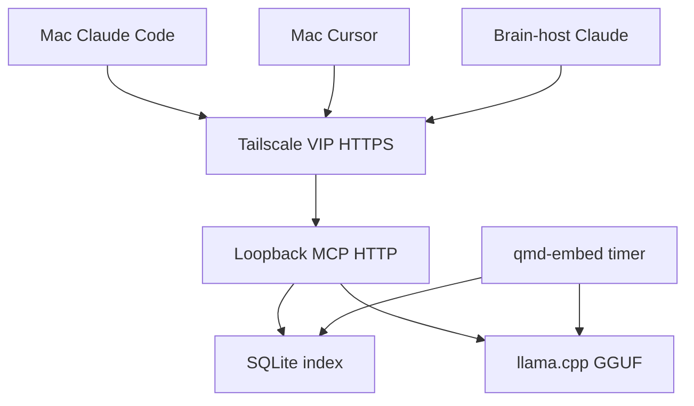
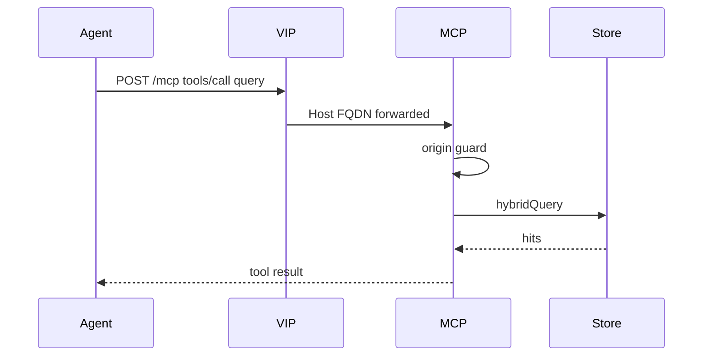
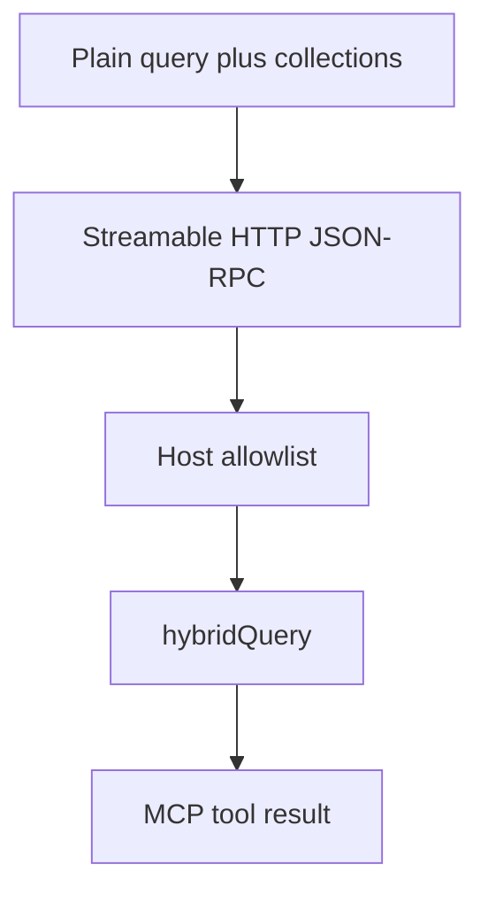

# QMD MCP HTTP VIP - Plan

## Goal Capsule

- **Objective:** Agents on the Mac and on the qmd brain host search and retrieve from the central qmd corpus over the
  tailnet, with no local qmd index or GGUF on the Mac.
- **Means:** One always-on `qmd mcp --http` process on the brain host, published as Tailscale VIP
  `https://qmd.tail42ba87.ts.net`, with Claude Code and Cursor talking MCP HTTP to `https://qmd.tail42ba87.ts.net/mcp`.
- **Authority:** Product Contract requirements win on behavior. Key Technical Decisions win on mechanism within those
  requirements. Implementation units add only local deltas.
- **Execution profile:** Smoke-first for the systemd unit and Tailscale Serve bind (`GET /health`). Bats for static
  config. Instruction-rewrite and researcher `tools:` checks. Live MCP `query` from Mac Claude, Mac Cursor, and
  brain-host Claude after Serve bind.
- **Stop conditions:** Do not add `POST /query` to `qmd serve`. Do not introduce a throwaway test URL. Do not change
  `qmd-embed.service` / `qmd-embed.timer`. Do not install the official qmd stdio MCP plugin as the client path. Do not
  set `QMD_ALLOWED_ORIGINS=*`. Do not enable Tailscale Funnel for `svc:qmd`. Do not start a GPU-lease service.
- **Tail:** Linux `qmd` CLI remains for embed/update/cleanup on the brain host. Agents must not use it for search.

---

## Product Contract

### Summary

Replace the loopback `qmd serve` daemon (`127.0.0.1:7832`) with a single MCP HTTP listener on the brain host and publish
it as Tailscale service `svc:qmd`. Claude Code on Mac and on the brain host, and Cursor on the Mac, call that VIP. The
Mac is a qmd thin client: no local qmd, no local index, no local GGUF.

### Problem Frame

`qmd serve` is an embed/rerank model server. Agents today shell `qmd query`, which either loads GGUF in-process or talks
the serve protocol via `QMD_REMOTE_URL`. That protocol is not MCP. A Mac without qmd cannot search the brain host's
corpus. Extending serve with `POST /query` would still leave URL-only IDEs without a Streamable HTTP MCP surface, and
`QMD_REMOTE_URL` still implies a local sqlite index on the caller (RemoteQMD). The official `qmd mcp` stdio plugin
requires a local binary. The working shape is one MCP HTTP process behind a tailnet VIP, with client configs and agent
instructions aimed at that URL from day one.

### Requirements

**Query surface**

- R1. One MCP HTTP listener on the qmd brain host is the query engine for hybrid search and document get.
- R2. That listener is published as Tailscale VIP `https://qmd.tail42ba87.ts.net` (MagicDNS for `svc:qmd`) as the
  production URL from the first client config, not a throwaway test host or port. Client MCP entries use
  `https://qmd.tail42ba87.ts.net/mcp`.
- R3. Agents on the brain host and on the Mac use that same VIP URL. Loopback-only MCP is not the documented client URL.
- R4. The Tailscale service object may be Defined before the daemon answers so the FQDN exists for config. Tailscale
  Serve must still refuse to bind a dead upstream.
- R11. Authn is tailnet access to `svc:qmd` over Serve (not Funnel). There is no application bearer. Any peer the grant
  allows can search every `includeByDefault` collection (vault, stars, solutions, skills, and the nas-* entries on the
  brain host). `query` with an explicit `collections` list, `get` / `multi_get`, `status`, and MCP initialize still
  reach every indexed collection, including `claude-code-sessions`. `status` returns absolute filesystem paths.

**Clients and instructions**

- R5. Agents search only via MCP HTTP to the VIP. The Mac has no local qmd. The brain host may keep `qmd` on PATH for
  maintainer embed, but agents there still must not shell `qmd query`.
- R6. User-level Claude and Cursor MCP config points at that VIP. Per-repo `.mcp.json` is not the primary install path.
- R7. Agent instruction surfaces — CLAUDE.md, AGENTS.md, the qmd skill, the learnings researcher, and hook-injected
  reminders — teach MCP tools (`query`, `get`, `multi_get`, `status`) instead of `qmd query` / `qmd collection list`.
- R8. The official qmd stdio MCP plugin (`qmd mcp` without `--http`) is not the install path.

**Embed and VRAM**

- R9. Periodic embed on the brain host stays as it is today (`qmd-embed.service` / `qmd-embed.timer`). Do not stop or
  restart MCP around embed.
- R10. The live GGUF process keeps low-vram behavior (`QMD_LOW_VRAM=1` / equivalent) so it can coexist with Ollama.

### Key Decisions

- MCP HTTP is the agent query surface. `(session-settled: user-directed — chosen over extending qmd serve POST /query
  first: URL-only clients need Streamable HTTP MCP, not the serve embed/rerank protocol.)` Governs R1, R8.
- The Mac has no local qmd. `(session-settled: user-directed — chosen over QMD_REMOTE_URL / RemoteQMD: that path keeps a
  local sqlite index on the caller.)` Governs R5.
- Brain-host agents use the same VIP. `(session-settled: user-directed — chosen over loopback-only MCP on the brain
  host: one URL in every client config.)` Governs R3.
- Production VIP URL from day one. `(session-settled: user-directed — chosen over a throwaway test host/port then
  switch: configs and tests would have to be rewritten.)` Governs R2, R4.
- Periodic embed is unchanged. `(session-settled: user-directed — chosen over stopping/restarting MCP around embed: the
  corpus is small enough that overlap is acceptable.)` Governs R9.
- Skills and agents are rewritten, not only CLAUDE.md. `(session-settled: user-directed — chosen over docs-only: agents
  would still Bash qmd query.)` Governs R7.
- User-level Claude and Cursor MCP only. `(session-settled: user-directed — chosen over per-repo .mcp.json: default
  configs on every checkout.)` Governs R6.

### Actors

- A1. Mac Claude Code / Cursor — qmd thin client. Uses user MCP config. No local `qmd` binary required.
- A2. Brain-host Claude Code — same VIP URL as A1.
- A3. Tailscale Serve — HTTPS `svc:qmd` → `http://127.0.0.1:8181`. Forwards the tailnet `Host` unchanged.
- A4. `qmd mcp --http` — Streamable HTTP at `/mcp`, health at `/health`, and the same process also serves REST `POST
  /query` and `POST /search`. Origin guard runs on every path.
- A5. `qmd-embed` oneshot — unchanged. May overlap A4 on GPU and sqlite.

### Key Flows

- F1. **Search.** Trigger: agent needs solutions or vault context. Actors: A1 or A2, A3, A4. Steps: MCP tool `query`
  with plain `query` plus `collections`; VIP `POST /mcp`; origin guard; `hybridQuery`; optional `get` / `multi_get` for
  bodies. Outcome: hits from the brain index. Covers R1, R3, R5, R7.
- F2. **URL before daemon.** Trigger: Define `svc:qmd` while A4 is down. Actors: operator, A1. Steps: MagicDNS name
  exists; client config stores `https://qmd.tail42ba87.ts.net/mcp`; tool calls fail loudly until A4 is up and Serve is
  bound. Outcome: no second URL to swap later. Covers R2, R4.
- F3. **Embed overlap.** Trigger: `qmd-embed.timer` fires while A4 is resident. Actors: A4, A5. Steps: embed runs as
  today (including Ollama unload ExecStartPre); MCP is not stopped. Outcome: possible SQLITE_BUSY or second LlamaCpp;
  accepted residual. Covers R9.

### Acceptance Examples

- AE1. Given a Mac with no `qmd` on PATH, when Claude Code searches the solutions collection, then it calls MCP tool
  `query` against the VIP and does not shell `qmd query`. Covers R5, R7.
- AE2. Given Serve bound and `QMD_ALLOWED_HOSTS` set, when a client `POST`s `/mcp` with `Host: qmd.tail42ba87.ts.net`
  and no Origin, then the origin guard returns 200-class MCP JSON. A foreign Host returns 403. Covers R1, R2, R11.
- AE3. Given A4 down and the VIP Defined, when an agent calls the MCP server, then the failure is visible (connection
  error), not a silent local grep or in-process GGUF load. Covers R4, R5.
- AE4. Given brain-host Claude with `qmd` on PATH, when it searches solutions, then it still uses VIP MCP `query`, not
  the CLI. Covers R3, R5.
- AE5. Given Mac Cursor with user `mcp.json`, when it searches solutions, then it uses the VIP MCP `query` tool. Covers
  R5, R6.

### Scope Boundaries

**In scope**

- Brain-host systemd unit for MCP HTTP, disable `qmd-serve`.
- Tailscale `svc:qmd` plus `scripts/tailscale-serve-setup.sh`.
- Remove `QMD_REMOTE_URL`.
- User-level Claude + Cursor MCP install and permission allowlist.
- Rewrite CLAUDE.md, repo `AGENTS.md`, guides, researcher agent, qmd skill, session hooks.
- Disable Darwin qmd LaunchAgents that assume a local engine.
- Bats and README/BOOTSTRAP updates.

**Deferred to Follow-Up Work**

- GPU lease / serialize embed vs MCP (a later dotfiles idea; not this change).
- Codex `config.toml` MCP stanza (Codex already follows `stow/claude/dot-claude/CLAUDE.md` via symlink). Instruction vs
  tool mismatch on Codex is an accepted residual until that follow-up.
- Cloud Cursor agents (they do not inherit user `~/.cursor/mcp.json`). Rewritten AGENTS.md will teach MCP tools those
  agents cannot call until a follow-up installs MCP for that client.
- Per-repo `.mcp.json` for checkouts that need an extra override.
- Caddy or Serve path-filter so VIP exposes only `/mcp` and `/health` (REST `POST /query` stays on the same listener).

**Outside this product's identity**

- vLLM cutover.
- OpenClaw.
- gbrain changes.
- Upstream qmd PR to put hybrid `POST /query` on `qmd serve`.

---

## Planning Contract

### Key Technical Decisions

- KTD1. **Foreground systemd, not `qmd mcp --http --daemon`.** Run `Type=simple` `qmd mcp --http --port 8181 --host
  127.0.0.1` under user systemd with `Restart=on-failure` and `Conflicts=qmd-serve.service`. The `--daemon` flag forks,
  writes a PID file, and exits 0, which systemd treats as a finished oneshot. Port 8181 is qmd's MCP default and stays
  distinct from dead `:7832`. Instantiates R1. Cite from U2.
- KTD2. **Host allowlist on the unit, no Caddy, no wildcard origins.** Set `QMD_ALLOWED_HOSTS=qmd.tail42ba87.ts.net`.
  Bind loopback. Do not set `QMD_ALLOWED_ORIGINS` until a real Claude Code or Cursor `POST /mcp` is captured: missing
  Origin is the non-browser path; a webview Origin would 403 if it is not allowlisted, and widening Origins recreates a
  browser CSRF surface. Never set `QMD_ALLOWED_ORIGINS=*`. Do not add Caddy. Ollama rejects the tailnet Host, so that
  VIP uses Caddy to rewrite Host to localhost. qmd allowlists the tailnet Host, so Serve forwards it unchanged (the
  `svc:codex-proxy` pattern). Origin-guard is DNS-rebinding protection, not authn (R11). The same listener also serves
  REST `POST /query` and `POST /search` at the same authz as `/mcp`. Instantiates R1, R2, R11. Cite from U2.
- KTD3. **Define MagicDNS first; Serve bind waits on `GET /health`.** `(session-settled: user-directed — chosen over a
  throwaway test URL then switch: client configs need the production FQDN immediately.)` Operator Defines `svc:qmd` in
  the admin console so `qmd.tail42ba87.ts.net` exists. `scripts/tailscale-serve-setup.sh` still refuses `tailscale
  serve` until `http://127.0.0.1:8181/health` succeeds. Client files may mention the URL before that bind. Operator also
  grants the service (deny-by-default) and does not enable Funnel. Instantiates R2, R4, R11. Cite from U1, U4.
- KTD4. **Claude: `claude mcp add`, not a stow of `~/.claude.json`. Cursor: enable-script merge of `mcp.json`.**
  `(session-settled: user-approved — chosen over stowing Cursor mcp.json: first stow against a real file can adopt other
  servers and tokens into git.)` Claude Code stores `mcpServers` in `~/.claude.json` and rewrites that file; a stow
  symlink breaks under an atomic writer. A `url` without `"type": "http"` is treated as stdio and skipped. Install with
  `claude mcp add --transport http --scope user`. Permissions live in `stow/claude/dot-claude/settings.json` as
  enumerated `mcp__qmd__query`, `mcp__qmd__get`, `mcp__qmd__multi_get`, `mcp__qmd__status` (`mcp__*` in allow is
  skipped). Cursor user MCP is `~/.cursor/mcp.json` with `"url"` only (no `type`); `scripts/qmd-mcp-clients-enable.sh`
  creates or merges the `qmd` entry on Darwin (same class of writer as Claude). Cursor has no `mcp__*` allowlist twin.
  Run the Claude add on Mac and on the brain host. If a user-scope qmd stdio server already exists, replace it with HTTP
  VIP. Instantiates R6, R8. Cite from U4.
- KTD5. **Health probes are `GET /health`, never `GET /mcp`.** qmd MCP HTTP returns 405 on `GET /mcp`. Older Streamable
  HTTP GET can hang. Serve setup, enable-script smoke, and docs use `/health`. Instantiates R4. Cite from U1, U2.
- KTD6. **Leave embed units untouched; put `QMD_LOW_VRAM=1` on the MCP unit.** `(session-settled: user-directed — chosen
  over stopping MCP around embed: overlap is accepted.)` Do not edit `qmd-embed.service` or `qmd-embed.timer`. Systemd
  does not source `config/shell/qmd.sh`, so the MCP unit must export `QMD_LOW_VRAM=1` and `NODE_LLAMA_CPP_GPU=cuda`
  itself (same CUDA pin as today's serve unit). Residual: second LlamaCpp and SQLITE_BUSY during embed. Instantiates R9,
  R10. Cite from U2, U3.
- KTD7. **Disable Darwin qmd LaunchAgents that assume a local engine.** `(session-settled: user-directed — chosen over a
  Mac-local qmd dispatcher: the Mac is a thin client.)` Boot out `com.user.qmd-serve`, `com.user.qmd-embed`,
  `com.user.qmd-update`, and `com.user.qmd-cleanup`. Do not bootstrap them from `scripts/qmd-launchd-enable.sh`.
  Indexing stays on the brain host. Instantiates R5. Cite from U3.
- KTD8. **Delete `QMD_REMOTE_URL`.** That variable is the serve protocol (`/embed`, `/rerank`), not MCP. After
  `qmd-serve` is gone, a leftover `http://127.0.0.1:7832` makes the CLI in-process load GGUF next to Ollama (OOM).
  Agents must not use it. Linux `QMD_LOW_VRAM=1` in `config/shell/qmd.sh` may remain for maintainer CLI embed.
  Instantiates R1, R5, R10. Cite from U3.

### High-Level Technical Design

Directional sketches. Units name exact flags and files.

Default agent teaching: MCP tool `query` with plain `query` and `collections` (array). `searches[]` is advanced. Then
`get` with `file` (path, docid, or `qmd://`) and `multi_get` with `pattern` (glob, docid, or comma-separated list).
`status` for health. VIP down: fail loudly with a visible connection error. No `ce-learnings-researcher` as a qmd
substitute. No silent grep. No local `qmd`.

### Assumptions

- Tailnet DNS suffix `tail42ba87.ts.net` is stable. MagicDNS for `svc:qmd` is `qmd.tail42ba87.ts.net`.
- User-systemd linger is enabled on the brain host so `WantedBy=default.target` survives reboot without a GUI login.
- The qmd fork already serves Streamable HTTP at `POST /mcp` and `GET /health`.
- `stow-deploy` does not restart always-on `.service` units. Enable scripts perform `daemon-reload` and `enable --now`.
- Codex inherits CLAUDE.md via `stow/codex/dot-codex/AGENTS.md` → `stow/claude/dot-claude/CLAUDE.md`. Codex has no MCP
  stanza in this plan.
- A Tailscale Services grant for `svc:qmd` will be created the same way as `svc:ollama` / `svc:codex-proxy` (operator,
  admin console). Exact `src` tags stay an operator choice; the residual is R11.

### Risks

- Origin-guard is not authn (R11). Unlike `svc:codex-proxy` there is no bearer. Any granted tailnet peer can search
  every `includeByDefault` collection, including vault and nas-* entries. Named `get` / `status` still reach
  `claude-code-sessions`. `status` returns absolute filesystem paths. Loopback `:8181` is reachable on the brain host
  without Tailscale.
- REST `POST /query` and `POST /search` are on the VIP with the same authz as `/mcp` (KTD2). Path-filter is deferred.
- Origin guard 403 if a real IDE sends a non-loopback Origin before that Origin is allowlisted (KTD2). Capture a live
  request before adding `QMD_ALLOWED_ORIGINS`.
- SQLITE_BUSY or VRAM pressure when embed overlaps MCP (KTD6). Accepted; do not reopen R9.
- Claude rewrites `~/.claude.json` (KTD4). Cursor `mcp.json` is merged by the enable script, not stowed.
- Brain-host `Bash(qmd:*)` remains for maintainer CLI. Instruction + researcher `tools:` are the agent enforcement.
  Residual: a brain-host agent can still shell `qmd query` if it ignores instructions (local GGUF after KTD8).
- Cloud Cursor agents never see user MCP (deferred). Codex instruction/tool mismatch until `config.toml` MCP (deferred).
- Wrong health URL (`GET /mcp`) hangs enable/serve scripts (KTD5).

### Sequencing

U1 Define can start immediately (admin console). U4 client configs may land as soon as the FQDN is known. U2 must be
healthy before the Serve bind in U1's script is run. U3 should land with U2 so `QMD_REMOTE_URL` does not outlive
`:7832`. U5 follows U4 because both edit `stow/claude/dot-claude/settings.json`. U6 last.

---

## Implementation Units

### U1. Define `svc:qmd` and extend Tailscale Serve setup

- **Goal:** Production MagicDNS name exists. Serve script binds `svc:qmd` → `http://127.0.0.1:8181` only after `GET
  /health`.
- **Files:** `scripts/tailscale-serve-setup.sh`; comments/links for
  `https://login.tailscale.com/admin/services/svc:qmd`.
- **Patterns:** Existing `svc:codex-proxy` block (direct loopback, health probe, refuse dead upstream). Not the
  Ollama/Caddy path.
- **Approach:** Operator Defines `svc:qmd` in the admin console first (KTD3). Append the qmd block after the existing
  ollama and codex-proxy binds so a down MCP cannot skip those rebinds. Add `QMD_TARGET=http://127.0.0.1:8181` and probe
  `${QMD_TARGET}/health` (KTD5). `tailscale serve --service=svc:qmd --https=443 --yes "${QMD_TARGET}"`. Document that
  client configs may use `https://qmd.tail42ba87.ts.net/mcp` before this bind succeeds (R4). Document the admin grant
  URL and that Funnel stays off (R11). Do not introduce a second hostname.
- **Test scenarios:** Happy: `/health` up → serve command runs. Error: `/health` down → script exits nonzero and does
  not call `tailscale serve` for qmd. Edge: script on a non-brain hostname still exits 0 after the existing skip.
  Integration: `tailscale serve status` shows `svc:qmd` after a successful run.
- **Verification:** Run the script on the brain host after U2; `curl -sf https://qmd.tail42ba87.ts.net/health` from a
  tailnet peer.
- **Execution note:** Smoke-first. Do not bind Serve until U2 `/health` works.
- **Covers:** R2, R4, R11. KTD3, KTD5.

### U2. MCP systemd unit and enable script; retire `qmd-serve`

- **Goal:** One always-on MCP HTTP process on loopback `:8181` with CUDA, low-vram, and Host allowlist
  (`QMD_ALLOWED_HOSTS`). `qmd-serve` cannot run at the same time.
- **Files:** `stow/local/dot-config/systemd/user/qmd-mcp.service` (new);
  `stow/local/dot-config/systemd/user/qmd-serve.service` (delete); `scripts/qmd-mcp-enable.sh` (new, modeled on
  `scripts/qmd-serve-enable.sh`); `scripts/qmd-serve-enable.sh` (stub that errors and points at the new script);
  `scripts/qmd-llama-rebuild.sh` (restart `qmd-mcp.service` instead of `qmd-serve.service`).
- **Patterns:** Current `qmd-serve.service`: `Type=simple`, `Restart=on-failure`, `NODE_LLAMA_CPP_GPU=cuda`, absolute
  ExecStart to `$HOME/.bun/bin/qmd` (keep the same binary-resolution invariant as today's serve unit),
  `NoNewPrivileges=true`, `PrivateTmp=true`. Enable script: Linux gate, clear orphan port, `daemon-reload`, `enable
  --now`, smoke `/health`.
- **Approach:** ExecStart: the same absolute bun qmd binary as today's serve unit, then `mcp --http --port 8181 --host
  127.0.0.1` (KTD1). Copy that unit's `Environment=PATH` line. Also set `QMD_LOW_VRAM=1`, `NODE_LLAMA_CPP_GPU=cuda`,
  `QMD_ALLOWED_HOSTS=qmd.tail42ba87.ts.net` (KTD2, KTD6). Copy `NoNewPrivileges=true` and `PrivateTmp=true`. Do not set
  `QMD_ALLOWED_ORIGINS` until a captured IDE Origin requires it. `Conflicts=qmd-serve.service`. Enable script `disable
  --now qmd-serve.service`, then enable MCP, smoke `http://127.0.0.1:8181/health` (KTD5). Fail-closed: request with a
  foreign Host is 403; VIP Host and no Origin is 200-class. Port-clear: stop `qmd-mcp.service` and pkill `qmd mcp` only.
  Do not pkill `qmd serve` or `bun .*qmd` (that would kill an overlapping embed). Do not use `--daemon`. Do not edit
  embed units.
- **Test scenarios:** Happy: enable script → `/health` JSON with `status: ok`. Error: missing binary → script prints
  last journal lines and exits nonzero. Edge: `:8181` occupied by a non-unit process → script fails after the port-clear
  wait. Fail-closed: foreign `Host` on `/mcp` and `/query` is 403. Integration: `systemctl --user is-active
  qmd-mcp.service` is `active` and `qmd-serve` is not.
- **Verification:** `bash scripts/qmd-mcp-enable.sh` on the brain host. `curl -sf --max-time 30
  http://127.0.0.1:8181/health`.
- **Execution note:** Smoke-first before U1's Serve bind.
- **Covers:** R1, R10, R11. KTD1, KTD2, KTD5, KTD6.

### U3. Drop `QMD_REMOTE_URL`; Mac LaunchAgents off

- **Goal:** No shell or LaunchAgent still aims at `:7832` or a local qmd engine. Linux CLI embed can still see
  `QMD_LOW_VRAM=1`.
- **Files:** `config/shell/qmd.sh`; `stow/qmd/dot-local/bin/qmd`; Darwin qmd index render (today `index.yml.darwin` via
  stow-deploy); `tests/shell-config.bats`; `scripts/qmd-launchd-enable.sh`; Darwin plists under
  `stow/launchagent/Library/LaunchAgents/com.user.qmd-*.plist` (bootout, do not bootstrap; comments may note
  thin-client).
- **Patterns:** `config/shell/*.sh` sourced from `.profile`. Launchd enable script already Darwin-gated. Cross-platform
  stow file-level `--ignore` for OS-specific content.
- **Approach:** Remove `export QMD_REMOTE_URL=...` (KTD8). Keep the Linux `QMD_LOW_VRAM=1` block for maintainer CLI.
  Change `qmd-launchd-enable.sh` to boot out serve/embed/update/cleanup and not require a local qmd binary (KTD7).
  Darwin branch of `stow/qmd/dot-local/bin/qmd` must not exec the local fork: print that search is MCP HTTP at the VIP
  `/mcp` URL and exit nonzero. Skip deploying a Darwin qmd index file on thin-client hosts. Keep the Linux wrapper and
  Linux index for maintainer embed. Do not add a Mac dispatcher to the VIP.
- **Test scenarios:** Happy: sourced `.profile` has empty/unset `QMD_REMOTE_URL`. Regression: `stow/shell/dot-profile`
  still has no `QMD_REMOTE_URL`. Error: enable script on Darwin with agents already loaded boots them out without
  failing on a missing qmd binary. Edge: Linux run of launchd script still no-ops. Darwin wrapper: invoking `qmd query`
  prints the MCP URL and does not spawn a local engine.
- **Verification:** bats in U6. Manual: `launchctl print gui/$(id -u)/com.user.qmd-serve` fails on the Mac after enable.
  Darwin `qmd query` exits nonzero without loading GGUF.
- **Covers:** R5, R10. KTD7, KTD8.

### U4. User-level Claude and Cursor MCP config

- **Goal:** Default Claude Code and Cursor MCP point at `https://qmd.tail42ba87.ts.net/mcp`. Claude permissions allow
  the four qmd tools.
- **Files:** `stow/claude/dot-claude/settings.json` (allowlist); `scripts/qmd-mcp-clients-enable.sh` (new); do not add
  `~/.claude.json` or `~/.cursor/mcp.json` to stow.
- **Patterns:** Enumerated `mcp__gbrain__*` entries already in `settings.json`. Desktop package `cursor` already in
  `DESKTOP_PACKAGES`.
- **Approach:** Cursor: the enable script creates or merges `mcpServers.qmd.url` only, no `type` (KTD4). Do not stow
  `mcp.json`. Claude: idempotent `claude mcp add --transport http --scope user` with the VIP `/mcp` URL on Mac **and**
  the brain host (not Darwin-gated). If a user-scope qmd stdio server already exists, replace it with HTTP VIP. Skip
  duplicate add if HTTP VIP is already present. Add `mcp__qmd__query`, `mcp__qmd__get`, `mcp__qmd__multi_get`,
  `mcp__qmd__status` to Claude allow without removing `Skill(qmd)` or `Bash(qmd:*)`. Do not add `mcp__*`. Do not enable
  the official qmd stdio plugin (R8). Merge Cursor rather than clobbering other servers. Client config may land before
  U2 (KTD3).
- **Test scenarios:** Happy: `claude mcp list` on Mac and brain host shows `qmd` with HTTP type and VIP `/mcp`; Cursor
  file contains the VIP `/mcp` and no `type`. Error: a leftover stdio qmd server is gone after the enable script. Edge:
  re-running the enable script does not duplicate the server. Integration: Mac Cursor Settings shows the qmd server;
  local Task/subagents inherit it.
- **Verification:** `claude mcp list` on Mac and brain host. Enable script wrote Cursor `mcp.json` on Darwin with VIP
  `/mcp` and no `type`. Permission strings present in `settings.json`.
- **Covers:** R3, R6, R8. KTD3, KTD4.

### U5. Teach MCP tools instead of the qmd CLI

- **Goal:** Always-on instructions, the qmd skill, the learnings researcher, and session hooks search via MCP.
- **Files:** `AGENTS.md`; `stow/claude/dot-claude/CLAUDE.md` (also Codex `AGENTS.md` via symlink — edit once);
  `stow/claude/dot-claude/guides/cli-tools.md`; `stow/claude/dot-claude/guides/workflows-and-skills.md`;
  `stow/claude/dot-claude/agents/qmd-learnings-researcher.md`; `stow/claude/dot-claude/session-context.sh`;
  `stow/claude/dot-claude/solutions-prefetch.sh`; `stow/claude/dot-claude/skills/qmd/SKILL.md` (new stow; replaces
  Bash-first user skill); `stow/claude/dot-claude/settings.json` (`Skill(qmd)` stays; keep `Bash(qmd:*)` for Linux
  maintainer CLI only).
- **Patterns:** Existing "Query solutions first" paragraphs. Researcher output shape stays the same; only the retrieve
  step changes.
- **Approach:** Default: MCP `query` with plain `query` and `collections: ["solutions"]` (or vault/stars as today). Then
  `get` with `file` and `multi_get` with `pattern`. Researcher `tools:` is exclusive: the four `mcp__qmd__*` tools plus
  `Read` for frontmatter (today `Bash, Read` blocks MCP). Rewrite `solutions-prefetch.sh` reminders so they name MCP
  `query` + `collections`, not `qmd query`. `session-context.sh` must not call `qmd collection list`; print a static
  collection list (`solutions`, `vault`, `stars`) and do not probe VIP `/health` from SessionStart. Skill frontmatter:
  MCP tool allows, not `allowed-tools: Bash(qmd *)`. VIP down: fail loudly with a visible connection error; do not offer
  `ce-learnings-researcher` as a qmd substitute. Keep `Bash(qmd:*)` for maintainer CLI (residual in Risks). If
  `~/.claude/skills/qmd` is a real directory, trash or move aside `SKILL.md` and any CLI `search-guide.md` before the
  first stow. Do not `--adopt`. Do not tree-fold.
- **Test scenarios:** Happy: CLAUDE.md / AGENTS.md / skill / prefetch reminder have no `qmd query` as the search
  instruction. Edge: researcher description still says hybrid search against `solutions`. Error: researcher `tools:`
  does not list Bash as a search path. Integration: researcher `tools:` names `mcp__qmd__query` and `mcp__qmd__get`.
  SessionStart still completes when the VIP is down.
- **Verification:** `rg` over the listed files for `qmd query` / `qmd collection` as agent instructions (CLI may remain
  in maintainer comments). Agent-native: researcher tools field includes MCP.
- **Covers:** R7. Product Key Decision on skills rewrite.

### U6. Tests, README, leftover references

- **Goal:** CI and human docs describe MCP VIP, not `qmd-serve` on `:7832`.
- **Files:** `tests/qmd-serve.bats` (retarget or replace with `tests/qmd-mcp.bats`); `tests/shell-config.bats`;
  `README.md`; `BOOTSTRAP.md` if it grows a brain-host linger/MCP enable note; `CONCEPTS.md` (qmd thin client — already
  added at plan-write; do not duplicate).
- **Patterns:** Existing static bats (grep unit files, no live daemon in CI). Manual smoke checklist in the bats header.
- **Approach:** Assert MCP unit ExecStart, port 8181, allowlist env, absence of `QMD_REMOTE_URL` export, Claude
  permission strings, Tailscale script health path, Darwin wrapper refuses local engine. Rewrite the manual checklist:
  cold start `qmd-mcp-enable.sh`, `/health`, Serve bind, VIP `/health` from a peer, MCP `query` from Claude/Cursor,
  embed timer still fires, Mac has no qmd-serve LaunchAgent. Mention linger as an operational check on the brain host.
- **Test scenarios:** Happy: `bats tests/qmd-mcp.bats tests/shell-config.bats` pass on a deployed host. Regression: no
  test still requires `QMD_REMOTE_URL=http://127.0.0.1:7832`. Edge: CI skip if not a deployed host, matching today's
  stow tests.
- **Verification:** `bats tests/qmd-mcp.bats tests/shell-config.bats` (or the kept filename if retargeted in place).
- **Covers:** R2, R6, R9 (embed files still present and unchanged).

---

## Verification Contract

| Gate               | Check                                                                                            | When                        | Signal                                                 |
| ------------------ | ------------------------------------------------------------------------------------------------ | --------------------------- | ------------------------------------------------------ |
| Static unit + env  | bats for MCP unit, shell env, Claude permission strings, Serve health path                       | Every PR                    | Pass                                                   |
| Local MCP health   | `GET http://127.0.0.1:8181/health`                                                               | Brain host after U2         | JSON `status: ok`                                      |
| Origin fail-closed | `POST /mcp` (and `/query`) with a foreign Host                                                   | Brain host after U2         | 403                                                    |
| Serve bind         | `scripts/tailscale-serve-setup.sh`                                                               | Brain host after U2         | Nonzero if `/health` down; `svc:qmd` present if up     |
| VIP health         | `GET https://qmd.tail42ba87.ts.net/health`                                                       | Tailnet peer                | 200                                                    |
| Funnel off         | Serve config for `svc:qmd` is Serve, not Funnel                                                  | After U1 bind               | Funnel disabled                                        |
| Claude MCP         | `claude mcp list`                                                                                | Mac and brain host after U4 | HTTP type, VIP `/mcp`, no stdio qmd                    |
| Cursor MCP         | enable-script `~/.cursor/mcp.json`                                                               | Mac after U4                | VIP `/mcp`, no `type`                                  |
| Agent instructions | no `qmd query` as the search default in U5 files including prefetch reminders                    | After U5                    | No hits in instruction voice                           |
| Researcher tools   | `qmd-learnings-researcher.md` `tools:`                                                           | After U5                    | four `mcp__qmd__*` plus Read; Bash not the search path |
| Embed unchanged    | `qmd-embed.service` and `qmd-embed.timer` match the pre-change text                              | After all units             | Unchanged                                              |
| Agent-native       | MCP `query` with `collections: ["solutions"]` from Mac Claude, Mac Cursor, and brain-host Claude | After Serve bind            | Hits, not 403, not stdio plugin                        |

---

## Definition of Done

| Scope  | Done when                                                                                                                                         |
| ------ | ------------------------------------------------------------------------------------------------------------------------------------------------- |
| Global | AE1–AE5 hold. F1 works from Mac Claude, Mac Cursor, and brain-host Claude. F2's URL is the only URL in client config. R9 embed files unchanged.   |
| U1     | `svc:qmd` Defined and granted. Serve (not Funnel) probes `/health` and binds the production VIP only.                                             |
| U2     | `qmd-mcp.service` active. `qmd-serve` disabled. `/health` on `:8181`. Foreign Host 403s.                                                          |
| U3     | `QMD_REMOTE_URL` gone. Darwin qmd agents not loaded.                                                                                              |
| U4     | Claude user MCP HTTP on Mac and brain host. Cursor `mcp.json` merged by enable script on Mac. Enumerated Claude permissions. No stdio qmd plugin. |
| U5     | Skills, researcher tools field, hooks, CLAUDE.md, and AGENTS.md teach MCP tools.                                                                  |
| U6     | Bats and README match the new topology. Manual smoke checklist executed on the brain host and Mac.                                                |
