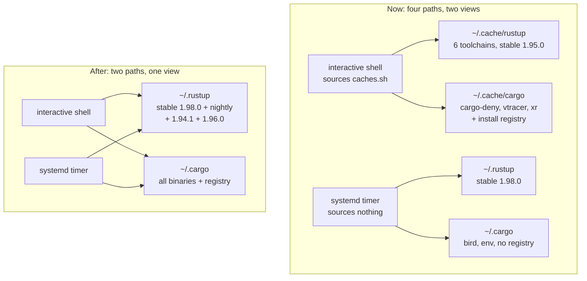
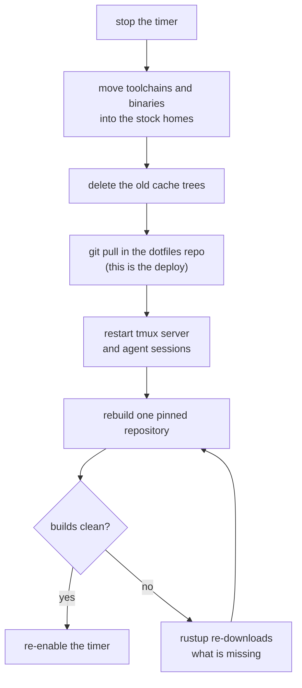

# Rust Home Consolidation - Plan

## Goal Capsule

- **Objective:** Every context that invokes Rust on a given host — interactive shell, systemd timer, agent Bash tool,
  git hook — resolves the same toolchains and the same installed binaries.
- **Means:** Delete the `CARGO_HOME` / `RUSTUP_HOME` overrides so both homes sit at their stock defaults (KTD1).
- **Authority hierarchy:** Requirements govern behavior. KTDs govern mechanism within those requirements. Units override
  neither.
- **Execution profile:** Config change plus a one-time data migration on one host. Ships as a feature branch off `dev`
  with a PR; the host migrations run after merge.
- **Stop conditions:** Stop and report if a toolchain move leaves `rustup toolchain list` short of the expected set, if
  `~/.profile` fails `bash -n` at any point, or if any host loses shell access.
- **Tail ownership:** The operator owns the two host migrations. They are not part of the PR and do not gate its merge.

---

## Product Contract

### Summary

Remove the two shell exports that relocate Rust's install roots into the cache directory, consolidate the headless
host's split toolchain and binary trees onto the stock paths, and reclaim the orphaned Rust tree left on the macOS
workstation. Add a permission guard and shell-config assertions so the split cannot silently return.

### Problem Frame

`config/shell/caches.sh` exports `CARGO_HOME` and `RUSTUP_HOME` into `$XDG_CACHE_HOME` at runtime. `rustup-init` had
already installed to the defaults, so the override never applied at install time. The result is one install-time path
plus two runtime paths, and any context that does not source the shell chain sees a third view.

The divergence is not theoretical. On the headless host all four paths exist, holding 12.7 GB. `~/.rustup` carries one
toolchain at rustc 1.98.0; `~/.cache/rustup` carries six at rustc 1.95.0.
`stow/rust/dot-config/systemd/user/rustup-update.service` sets only `Environment=PATH=`, and systemd user units never
source `~/.profile`, so the nightly timer has been updating a tree no interactive shell reads. The shell's `stable` is
four months behind the one the timer maintains. Installed binaries are split the same way: `bird` sits in
`~/.cargo/bin`, while `cargo-deny`, `vtracer`, and `xr` sit in `~/.cache/cargo/bin` — a directory no repo mechanism ever
adds to `PATH`.

The workstation shows the same shape. `~/.rustup` holds 1.1 GB at rustc 1.85.0 with no `~/.cargo` left to drive it.

### Key Decisions

- KD1. **Rust lives at the stock `~/.cargo` and `~/.rustup` on every host.** Reverting to the default is cheaper than
  propagating the override into every unit, hook, and bare launcher. Governs R1, R2, R3.
- KD2. **Rust stays uninstalled on the macOS workstation.** No `Cargo.toml` exists anywhere under the development tree
  and every Rust CLI there is a Homebrew bottle. Governs R4, R5.

### Requirements

**Shell configuration**

- R1. `config/shell/caches.sh` exports neither `CARGO_HOME` nor `RUSTUP_HOME`.
- R2. `config/shell/caches.sh` creates neither `$XDG_CACHE_HOME/cargo` nor `$XDG_CACHE_HOME/rustup`.
- R3. A new login shell on a deployed dotfiles host reports both variables unset, and on a host where `~/.cargo/env`
  exists it resolves `~/.cargo/bin` on `PATH`. The workstation carries no Rust after U6, so the PATH clause is scoped to
  hosts that have a toolchain rather than to every deployed host.

**Workstation reclaim**

- R4. The orphaned `~/.rustup` tree is removed from the workstation.
- R5. The two cache-side Rust directories are removed from the workstation and do not reappear in a new shell.

**Headless host migration**

- R6. Every toolchain the six pinned repositories require resolves from `~/.rustup` after the migration.
- R7. The `stable` toolchain surviving on the headless host is the newer of the two.
- R8. `cargo install --list` reports the crates that were registered before the migration, and `cargo deny` resolves as
  a cargo subcommand.
- R9. `rustup-update.timer` is active and scheduled after the migration, and its next run updates the tree interactive
  shells read.

**Safety**

- R10. `rustup self` is denied for agent shell calls and cannot run without an explicit settings change. Deny blocks
  outright; it does not prompt.

### Success Criteria

- No context on either host resolves a Rust path under `$XDG_CACHE_HOME`.
- The headless host's four Rust trees reduce to two. The moves themselves free nothing — they are same-device renames.
  The reclaim arrives when both cache trees are deleted, carrying the duplicate `stable` tree and the two unreferenced
  toolchains with them, and the figure to check is the byte accounting the migration script prints.
- A reviewer can tell from `config/shell/caches.sh` alone why Rust is absent from a file whose stated purpose is cache
  relocation.

### Scope Boundaries

- Reinstalling Rust on the workstation is out of scope (KD2).
- The two unreferenced headless toolchains (`1.94` bare, `1.88.0`, 2.7 GB) are not carried over. Nothing pins them, and
  under KTD4 a re-download is the accepted recovery if that turns out wrong, so they are deleted with the cache tree
  rather than migrated and pruned later.

#### Deferred to Follow-Up Work

- The five sibling install roots `caches.sh` also relocates — `PIPX_HOME`, `PNPM_HOME`, `BUN_INSTALL`, `GOPATH`,
  `PUPPETEER_CACHE_DIR`. They carry the same defect. `BUN_INSTALL`'s version is already worked around with a dual-`PATH`
  entry in `stow/shell/dot-profile` rather than fixed, which is evidence the pattern recurs.
- Adding `rust` to `SHARED_PACKAGES` in `scripts/stow-deploy` so its timer joins the post-deploy recovery loop. This
  plan restores the timer explicitly instead (KTD8).
- The `config/shell/xurl.sh` ordering gap: it guards on `command -v xr` but runs inside the `config/shell/*.sh` glob,
  which completes before `~/.cargo/env` extends `PATH`.
- Capturing the runtime-versus-install-time divergence pattern in `docs/solutions/`. Both learnings searches returned no
  existing entry.

### Open Questions

Both are deferred, not blocking. Neither holds up the PR or either host migration.

- OQ1. Does the migration script stay in the repository after it runs, or come out with its two lint registrations in a
  follow-up? It executes once against a split that cannot recur, and neither lint surface globs `scripts/*.sh`.
- OQ2. Does `bird` get re-registered in the install registry, or stay a bare binary? It is unregistered today, so
  leaving it is not a regression — but `cargo install --list` and `scripts/tools-atime/lib/cargo.sh` will keep
  under-reporting it either way.

### Sources

- `stow/shell/dot-profile` resolves the repo root, then sources `config/shell/*.sh` alphabetically. `caches.sh` is not a
  stow package file, so a `git pull` in the dotfiles repo is itself the deploy — the change takes effect in new shells
  with no stow step.
- rustup discovers toolchains by scanning `$RUSTUP_HOME/toolchains` (`src/config.rs`, `list_toolchains`). There is no
  registry and `settings.toml` is not consulted for discovery; the directory name is the toolchain's identity.
- rustc builds rpaths as `@loader_path` on Darwin and `$ORIGIN` elsewhere
  (`compiler/rustc_codegen_ssa/src/back/rpath.rs`), so a toolchain directory embeds no absolute self-reference.
- [rustup #2967](https://github.com/rust-lang/rustup/issues/2967) — the rc-file corruption.
  [PR #4960](https://github.com/rust-lang/rustup/pull/4960) anchors the matcher to line boundaries and is unreleased as
  of rustup 1.29.0.
- [rustup #1072](https://github.com/rust-lang/rustup/issues/1072) — `self uninstall` removes the whole `CARGO_HOME`,
  including third-party binaries.
- `docs/solutions/deployment-issues/cross-platform-stow-dotfiles-deployment.md` records SSH lockout as a realized
  failure mode when editing the login chain on a headless host.
- `docs/solutions/integration-issues/qmd-server-env-var-non-interactive-shell-bypass-2026-04-15.md` is the same
  divergence class: an env var visible interactively and invisible to a systemd user service.

---

## Planning Contract

### Key Technical Decisions

- KTD1. **Drop the overrides rather than plumb them.** Deleting the two exports makes
  `stow/rust/dot-config/systemd/user/rustup-update.service` and the `~/.cargo/env` block in `stow/shell/dot-profile`
  correct as written, and removes the dual-path scan in `stow/claude/dot-claude/session-context.sh`. *(session-settled:
  user-directed — chosen over XDG data directories and over keeping the cache paths with install-time plus systemd
  environment plumbing: the stock path is the one every bare launcher already resolves.)* Instantiates KD1, governs R1,
  R2, R3.
- KTD2. **Reclaim the workstation's Rust tree rather than leave it.** With `~/.cargo` gone there is no `rustup` or
  `cargo` binary left to manage `~/.rustup`, so it is unreachable rather than dormant. *(session-settled: user-directed
  — chosen over reinstalling Rust under the new layout: nothing on that host needs a toolchain.)* Instantiates KD2,
  governs R4, R5.
- KTD3. **Relocate the headless toolchains; do not reinstall them.** Discovery is a directory scan and rpaths are
  output-relative, so a moved toolchain is found and runs. Both rustup homes report device `64512`, making each move
  atomic. Reinstalling would re-download roughly 7-9 GB at the default profile. Governs R6.

  Discovery is not selection. A toolchain directory carries no pin state; `default_toolchain` and the per-directory
  `[overrides]` table live in each home's `settings.toml` and migrate separately. Both tables were measured empty on the
  headless host and every pin in the six repositories is a checked-in `rust-toolchain.toml`, so nothing needs merging —
  but the migration asserts that rather than assuming it, and verifies the resolved toolchain name per repository rather
  than only that nothing downloads.
- KTD4. **Hard cutover in one session; no bridge symlinks, no soak.** Move the data, pull the config, restart the stale
  consumers, then prove it with a rebuild in a pinned repository. If a toolchain is missing or a stale process re-forks
  something, rustup re-downloads it and the rebuild catches it. *(session-settled: user-directed — chosen over bridging
  the old paths with symlinks and disabling auto-install for a soak window: this is a local environment cleanup on one
  host, and re-download is an acceptable cost for a much shorter procedure.)* Governs R6.
- KTD5. **Move toolchains one at a time behind an existence guard.** `mv` into an existing directory nests rather than
  fails, and `stable` exists in both homes. A nested toolchain is invisible to `rustup toolchain list` while a directory
  count still looks correct. The surviving `stable` is the 1.98.0 tree already in `~/.rustup`. Governs R6, R7.
- KTD6. **Move the install registry wholesale; do not merge it.** `~/.cargo` holds no `.crates.toml` or `.crates2.json`,
  so the pair moves across with no merge. A malformed merge breaks every subsequent `cargo install`, not just the
  listing. `bird` is unregistered today and stays so unless reinstalled. Governs R8.
- KTD7. **Ship the migration as a script with a dry-run default, not a runbook.** `Bash(mv:*)` sits in the permission
  `ask` list, so an operator- or agent-driven runbook prompts on every move. A script is one review surface, is
  idempotent, and can resume after an interruption. Governs R6, R8.
- KTD8. **Restore the timer as its own asserted step.** `rust` is absent from `SHARED_PACKAGES` in
  `scripts/stow-deploy`, so the post-deploy timer recovery loop never reaches `rustup-update.timer` — the operator's
  usual mental model does not hold here. `Persistent=true` also means starting the timer fires an immediate update if
  the window elapsed while it was stopped, so restoration comes after the data is final. Governs R9.
- KTD9. **Deny `rustup self` in settings rather than rely on discipline.** `Bash(rustup:*)` is in the permission allow
  list with no matching deny, so the one command that would delete the whole `CARGO_HOME` runs unprompted. The repo's
  established pattern for a hard prohibition is a deny entry. Governs R10.
- KTD10. **Leave `rustup-update.service` unedited.** Under stock homes its existing `PATH` and `ExecStart` are correct,
  and its `Description` already matches what it runs. Adding `Environment=RUSTUP_HOME=` would re-encode the layout being
  removed. The stale description is `README.md`'s row for the package, corrected in U3.

### High-Level Technical Design

Current and target topology on the headless host:

The cutover, in one session (KTD4):

### Assumptions

- The operator runs the headless migration in a single session with a second authenticated session already open, and
  performs no other git operation in the dotfiles repo on that host during the window.
- No pinned repository is mid-build when the migration starts.

### Sequencing

U1 through U4 land together on one feature branch off `dev` and merge as one PR. U5 runs on the headless host after
merge. U6 runs on the workstation after merge and is independent of U5.

Editing `config/shell/caches.sh` takes effect on the local machine immediately, because `~/.profile` sources the working
tree rather than a stowed copy. Switching branches therefore toggles the change. U6 is ordered after the branch merges
so the workstation is not left on a branch to keep its cleanup valid.

---

## Implementation Units

### U1. Remove the Rust home overrides and assert their absence

- **Goal:** `config/shell/caches.sh` stops relocating Rust's install roots, and the shell test suite fails if they
  return.
- **Requirements:** R1, R2, R3. Implements KTD1.
- **Dependencies:** none.
- **Files:** `config/shell/caches.sh`, `tests/shell-config.bats`.
- **Approach:**
  1. Delete the `CARGO_HOME` and `RUSTUP_HOME` exports and the two matching directory-creation lines. Both edits land
     together — removing only the exports leaves the creation lines expanding an unset variable.
  2. Leave a short comment at the removal site explaining why Rust is absent from this file, so the next reader does not
     restore consistency by adding it back. The file's own header claims all caches live under `XDG_CACHE_HOME`; adjust
     it to distinguish caches from install roots.
  3. Confirm the file's last executable line still returns zero. A trailing short-circuit that evaluates false makes the
     whole file return non-zero, which kills strict-mode callers that source the chain.
- **Patterns to follow:** the qmd assertions in `tests/shell-config.bats` pair two static greps with two functional
  checks that source `$HOME/.profile` in a fresh shell, precondition-skipped on `[ -L "$HOME/.profile" ]`.
- **Test scenarios:**
  - `config/shell/caches.sh` contains no `CARGO_HOME` assignment.
  - `config/shell/caches.sh` contains no `RUSTUP_HOME` assignment.
  - Sourcing `$HOME/.profile` in a fresh shell that first unsets both variables leaves `CARGO_HOME` unset. The unset
    prefix is load-bearing: the suite is often run from a shell that still carries the old exported value, and without
    it the test reports on the inherited value rather than the file.
  - The same fresh-shell source leaves `RUSTUP_HOME` unset.
  - On a host where `~/.cargo/env` exists, the same fresh-shell source puts `~/.cargo/bin` on `PATH`, since that block
    becomes the only thing that does. Guard this case on `[ -f "$HOME/.cargo/env" ]` alongside the existing `[ -L
    "$HOME/.profile" ]` precondition — the workstation has no Rust after U6, and without the second guard this assertion
    fails on the machine the suite runs on.
  - `bash -n` on `stow/shell/dot-profile` and on `config/shell/caches.sh` passes, and shellcheck passes on
    `config/shell/*.sh`. The profile check alone does not follow `source`, so it cannot see a syntax error in the edited
    file.
- **Verification:** `bats tests/shell-config.bats` passes, and a newly opened login shell reports both variables unset.

### U2. Deny `rustup self` for agent sessions

- **Goal:** The command that deletes an entire `CARGO_HOME` is blocked for agent shell calls, not merely prompted.
- **Requirements:** R10. Implements KTD9.
- **Dependencies:** none.
- **Files:** `stow/claude/dot-claude/settings.json`.
- **Approach:** Add the literal entry `Bash(rustup self:*)` to the permission deny array, in the existing alphabetical
  position between the `rm` and `sudo` entries. `Bash(rustup:*)` stays in the allow array; the narrower deny wins for
  the destructive subcommand. The trailing `:*` glob is load-bearing — every one of the ten existing deny entries
  carries it, and three of them already use the multi-word prefix shape this needs.
- **Test scenarios:** `Test expectation: none -- permission configuration with no behavioral surface in the test suite.`
  The settings file is validated as JSON by the existing tooling.
- **Verification:** A session running against the deployed settings refuses `rustup self uninstall` while still allowing
  `rustup toolchain list`. A presence check alone is insufficient: an entry missing the trailing glob parses as valid
  JSON, satisfies "the list contains it", and matches no command.

### U3. Correct the three inaccuracies on the changed surface

- **Goal:** The files this change touches stop asserting things that are no longer true, or were never true.
- **Requirements:** advances R3 indirectly by removing a dead code path.
- **Dependencies:** U1.
- **Files:** `stow/claude/dot-claude/session-context.sh`, `scripts/tools-atime/lib/cargo.sh`, `README.md`.
- **Approach:**
  1. `session-context.sh` sources `~/dotfiles/stow/shell/caches.sh`, which does not exist — the file lives under
     `config/shell/`. The guard makes it a silent no-op, so the hook has been running without that environment. Remove
     the dead source line, and collapse the dual `$CARGO_HOME/bin` plus `~/.cargo/bin` scan to the stock path alone.
  2. `scripts/tools-atime/lib/cargo.sh` carries a header comment asserting this machine has no user crates. That is
     machine-state narration, it is false on the headless host, and the comment policy forbids it. Remove it. The
     `${CARGO_HOME:-$HOME/.cargo}` fallbacks in that file resolve correctly either way and need no change.
  3. `README.md` describes the `rust` package as performing a nightly rustup self-update. The unit passes
     `--no-self-update` and updates the stable toolchain instead.
- **Test scenarios:**
  - Sourcing `session-context.sh` produces no error and still reports Rust binaries when a stock `~/.cargo/bin` exists.
  - shellcheck passes on the two shell files.
- **Verification:** `bats tests/*.bats` passes and the session-start hook emits its tool inventory without error.

### U4. Add the headless migration script

- **Goal:** A reviewable, resumable, dry-run-by-default script performs the headless consolidation.
- **Requirements:** R6, R7, R8. Implements KTD3, KTD4, KTD5, KTD6, KTD7.
- **Dependencies:** none for authoring; U1 for the environment it assumes at run time.
- **Files:** `scripts/rust-home-consolidate.sh`, `tests/rust-home-consolidate.bats`, `.github/workflows/shellcheck.yml`,
  `.githooks/pre-push`.
- **Approach:**
  1. Default to dry-run; require an explicit flag to mutate. Follow the precondition-check and numbered-exit-code style
     in `scripts/stow-deploy`.
  2. Preconditions, each with its own exit code: abort unless both rustup homes and both cargo homes share a device id;
     abort if the timer is running; abort if the destination cargo home already holds an install registry, since a
     wholesale registry move would overwrite it and de-register its crates; abort if the source home's per-directory
     override table is non-empty or its default toolchain differs from the destination's (KTD3). Snapshot `rustup
     toolchain list`, `cargo install --list`, both `settings.toml` files, the mode of `credentials.toml`, and the sizes
     of all four trees before mutating.
  3. Refuse to run while a build is in progress in any pinned repository. The cutover is one session (KTD4), so a
     concurrent build is the only realistic way a stale process writes into a tree mid-move.
  4. Move only the toolchains the six pinned repositories reference — `nightly`, `1.94.1`, `1.96.0` — one at a time,
     skipping any whose destination already exists, and report each skip. `stable` is expected to skip; the destination
     already holds the newer one (KTD5, KTD7). The two unreferenced toolchains are deliberately left behind for step 6.
  5. Move each `bin/` entry individually behind the same existence guard step 4 uses — both directories hold rustup
     shims, and an unguarded move would overwrite the `rustup` binary the timer invokes by absolute path. Only the
     unique user crates should move. Move the install registry pair, `config.toml`, and `credentials.toml` if present as
     same-device renames, which preserve mode atomically and never leave a second copy of the crates.io token. Do not
     copy `env` — the stock one already carries the correct path, and copying the cache-side one over it would install a
     stale absolute path.
  6. Enumerate what remains under both cache paths and print the full path list with a byte count, in dry-run too.
     Expect the skipped duplicate `stable` toolchain, the two unreferenced toolchains, and cargo's `registry/` and
     `git/` caches. Delete both cache trees outright with the repo's mandated deletion tool and report the reclaimed
     bytes. No symlinks are left behind — anything that still resolves through the old paths afterwards is a stale
     consumer, and surfacing it is the point (KTD4). This is the one irreversible step and the one exception to the
     no-undo-path claim below; the recovery is a re-download.
  7. Post-assert on `rustup toolchain list` naming the expected set, not on a directory count.
  8. Register the new script path in the shellcheck workflow and the pre-push hook, neither of which globs
     `scripts/*.sh` today.

  Every mutating step before 6 is idempotent and order-independent, so a re-run after an interruption resumes rather
  than restarts. Because each move is a same-device rename, a given toolchain is either fully at the source or fully at
  the destination — there is no half-moved state to repair, and the existence guard makes the second pass skip what the
  first completed. Recovery from a partial run is therefore a re-run, not a rollback. Step 6 is where that stops being
  true, which is why it is gated on an explicit enumeration rather than folded into the move.
- **Execution note:** This is operational tooling; prefer a dry-run against the real headless state as the primary proof
  over unit coverage of its internals.
- **Test scenarios:**
  - Dry-run against a fixture with a colliding `stable` directory reports the skip and mutates nothing.
  - Dry-run against fixture homes on different device ids exits non-zero with a distinct code.
  - A move interrupted partway leaves already-moved toolchains in place, and a re-run completes the remainder without
    error.
  - The script refuses to run while `rustup-update.timer` is active.
  - shellcheck passes on the new script.
- **Verification:** A dry-run against the headless host prints the expected move set and exits zero.

### U5. Migrate the headless host

- **Goal:** The headless host resolves one set of toolchains and one set of binaries from the stock homes.
- **Requirements:** R6, R7, R8, R9.
- **Dependencies:** U1, U4, and a merged PR.
- **Files:** none in the repo; this unit runs against the host.
- **Approach:**
  1. Open a second authenticated session and keep it open for the duration. Editing the login chain on this host has
     locked the operator out before.
  2. Stop `rustup-update.timer`.
  3. Run the migration script for real.
  4. `git pull` in the dotfiles repo. That pull is the deploy — no stow step is involved, and it takes effect for new
     shells only.
  5. Restart the tmux server and any long-running agent sessions. A process started before the pull keeps the old
     environment for its lifetime and hands it to every pane or tool call it spawns, which silently rebuilds the split.
  6. Re-enable the timer and assert it is scheduled.
- **Test scenarios:**
  - A new login shell reports both variables unset.
  - `rustup toolchain list` names exactly `stable`, `nightly`, `1.94.1`, and `1.96.0`, and reports `stable` at rustc
    1.98.0. The two unreferenced toolchains are gone, deleted with the cache tree rather than carried over.
  - `rustup show` in each of the six pinned repositories resolves the toolchain name that repository pins, not merely
    without downloading — a fallback to the destination default also downloads nothing.
  - `cargo install --list` exits zero and lists the crates captured in the pre-migration snapshot.
  - `cargo deny --version` resolves as a cargo subcommand.
  - `credentials.toml` exists at the stock cargo home if and only if it existed before, its mode is `600`, and no copy
    remains under the cache path.
  - Before the change reaches the host and again after, `git status --porcelain` for `stow/shell/dot-profile` is empty,
    so an rc-file write is caught as itself rather than as an unexplained pull conflict.
  - `systemctl --user list-timers rustup-update` shows a non-empty next run.
  - A manual timer run touches `~/.rustup` rather than a cache path.
  - No running process carries `RUSTUP_HOME` in its environment.
- **Verification:** One pinned repository builds from scratch, and the four Rust trees have reduced to two.

### U6. Reclaim the workstation Rust tree

- **Goal:** The workstation carries no Rust directories.
- **Requirements:** R4, R5. Implements KTD2.
- **Dependencies:** U1, and a merged PR so the working tree is not holding the change on a branch.
- **Files:** none in the repo; this unit runs against the host.
- **Approach:**
  1. Confirm the config change is live locally — both variables unset in a new shell — before deleting anything. Until
     then the cache directories are recreated on every shell start.
  2. Remove `~/.rustup`, `~/.cache/rustup`, and `~/.cache/cargo`.
  3. This host is at 99 percent capacity. The repo denies `rm` and mandates `trash`, but `trash` moves to a directory on
     the same volume, so the space does not return until the trash is emptied. Empty it and assert the free-space delta
     rather than assuming the deletion freed anything.
- **Test scenarios:**
  - A new shell after deletion does not recreate either cache directory.
  - Free space increases by roughly the size of the removed tree.
- **Verification:** None of the three paths exists, and a new shell leaves them absent.

---

## Verification Contract

| Gate                            | Command                                                         | Applies to     |
| ------------------------------- | --------------------------------------------------------------- | -------------- |
| Shell config assertions         | `bats tests/shell-config.bats`                                  | U1, U3         |
| Full suite, as pre-push runs it | `bats tests/*.bats`                                             | U1, U2, U3, U4 |
| Shell lint                      | `shellcheck` over `config/shell/*.sh` and the new script        | U1, U3, U4     |
| Profile syntax                  | `bash -n stow/shell/dot-profile`                                | U1             |
| Migration dry-run               | `scripts/rust-home-consolidate.sh` with no mutate flag          | U4, U5         |
| Toolchain resolution            | `rustup toolchain list` and `rustup show` per pinned repo       | U5             |
| Timer scheduling                | `systemctl --user list-timers rustup-update` reports a next run | U5             |

The PR title uses `fix(shell):`. Removing two exported environment variables is user-observable, and `cliff.toml` drops
`chore` from the changelog.

---

## Definition of Done

- R1 through R10 hold.
- `bats tests/*.bats` and both required CI checks pass on the PR.
- The headless host resolves one toolchain set from `~/.rustup` and its timer is scheduled.
- The workstation carries no Rust directories and the freed space is confirmed against the volume, not the directory.
- No abandoned migration scaffolding remains. Nothing bridges the old paths, so there is no temporary state to retire
  and no soak to time out. The migration script's own retirement is OQ1.

---

## System-Wide Impact

The change is one file and two directories, but the surfaces that read those paths are spread across both hosts.

- **Bare launchers.** Every context that does not source the shell chain — systemd user units, cron, git hooks, the
  agent Bash tool, GUI-launched processes — resolves Rust from the stock defaults today and always has. That is the
  divergence. After this change they and the interactive shell agree, and no new seam is added to keep them in sync.
- **Agent tool parity.** `stow/claude/dot-claude/session-context.sh` reports the Rust toolchain inventory into every
  session. It currently scans two paths and sources a file that does not exist (U3), so its Rust view comes from
  inherited process environment. After U1 and U3 the agent's view and the shell's view are the same one path.
- **Long-lived process environments.** A process started before the cutover keeps the old environment for its whole life
  and passes it to everything it spawns. On the headless host that means the tmux server and any running agent session,
  not just individual panes. This is the single most likely way the split silently returns, which is why U5 carries both
  a restart step and a negative assertion.
- **Build artifacts.** Cargo fingerprints embed absolute registry paths, so changing `CARGO_HOME` invalidates every
  `target/` directory in the six pinned repositories. Expected and accepted; one rebuild doubles as U5's functional
  proof.
- **Shared cache directory semantics.** `config/shell/caches.sh` keeps relocating five other install roots after this
  change. Carving Rust out without adjusting the file's framing would leave it asserting something untrue of its own
  contents, which is why U1 includes the header correction rather than only the deletions.

---

## Risks & Dependencies

| Risk                                                                                                                                                                | Mitigation                                                                                                                                                                                                                                                                                                                 |
| ------------------------------------------------------------------------------------------------------------------------------------------------------------------- | -------------------------------------------------------------------------------------------------------------------------------------------------------------------------------------------------------------------------------------------------------------------------------------------------------------------------- |
| SSH lockout on the headless host while the login chain changes. Realized before, per `docs/solutions/deployment-issues/cross-platform-stow-dotfiles-deployment.md`. | Second authenticated session held open for the window; `bash -n` gate before the change reaches the host.                                                                                                                                                                                                                  |
| A long-running process (tmux server, agent session, git hook) keeps the old environment and rebuilds the split after migration.                                     | Explicit restart step and a post-migration assertion that no process carries `RUSTUP_HOME` (U5).                                                                                                                                                                                                                           |
| A build during the cutover writes into a tree mid-move.                                                                                                             | The script refuses to run while a pinned repository is building, and the whole cutover is one session (KTD4). If something slips through, the pinned-repo rebuild at the end catches it and rustup re-downloads what is missing.                                                                                           |
| `mv` nests a colliding toolchain instead of failing, leaving it invisible to rustup.                                                                                | Per-toolchain existence guard, and post-assertion on the toolchain name set rather than a count (KTD5).                                                                                                                                                                                                                    |
| `rustup self uninstall` deletes the whole `CARGO_HOME`, including third-party binaries. The upstream rc-file fix is unreleased.                                     | Permission deny entry (U2) covers agent shell calls only. U5 and U6 are operator-run and outside that boundary, where the still-unfixed matcher would write through the profile symlink into version control — so U5 asserts a clean working tree for that file before and after. The migration never invokes the command. |
| A `git pull`, `git checkout`, or branch switch in the dotfiles repo performs the cutover with no confirmation.                                                      | The migration runs in one session; no other git operation in that repo during the window (Assumptions).                                                                                                                                                                                                                    |
| Changing `CARGO_HOME` invalidates every `target/` directory, since cargo fingerprints embed absolute registry paths.                                                | Expected. One pinned repository's rebuild is the planned functional verification (U5).                                                                                                                                                                                                                                     |
| Workstation is at 99 percent capacity, and `trash` does not free space on the same volume.                                                                          | Empty the trash and assert the free-space delta (U6).                                                                                                                                                                                                                                                                      |
