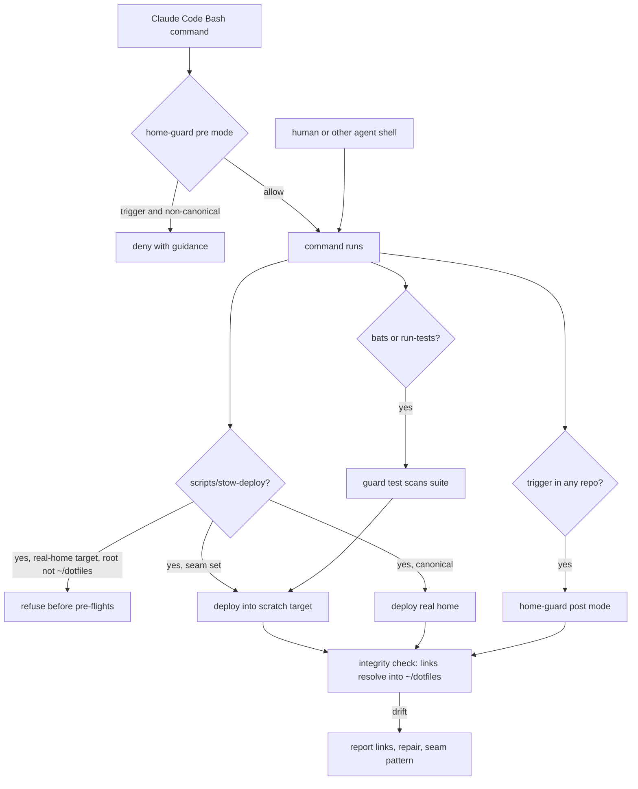
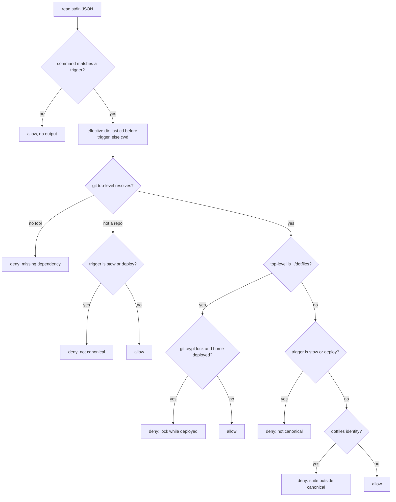

# Stow Deploy Home Isolation - Plan

## Goal Capsule

- **Objective:** Nothing can write into the real home directory of a deployed dotfiles host except `scripts/stow-deploy`
  running from the canonical checkout at `~/dotfiles`, and any repository whose test run does re-point the live symlinks
  is told so, with the repair and the pattern to adopt, before the damage spreads.
- **Means:** Four guards (KTD1, KTD2, KTD7, KTD8): a refusal inside the deploy script, a deploy-target seam for the test
  suite backed by a source-scanning guard test, a global Claude Code hook that denies deploys and the dotfiles suite
  from non-canonical checkouts, and a post-run integrity check that reports drift in any repository. Rule text in
  `AGENTS.md` and the global `CLAUDE.md`, and the solutions corpus updated to match.
- **Product authority:** The Product Contract below, in particular its Key Decisions. Where an implementation unit and a
  requirement disagree, the requirement wins on behaviour and the cited KTD wins on mechanism.
- **Execution profile:** One feature branch cut from `dev`, one pull request, squash-merged. Units land in the order
  given under Sequencing. The solutions-corpus unit runs after the merge through `sd-commit-doc`.
- **Stop conditions:** Stop and report if a red run would write into the real home, if the allow-list probe in U1 shows
  the hook cannot deny any of the target commands and no narrowing of the allow list restores it, or if the seam cannot
  be threaded through the fold-target resolution without a second `$HOME` write path.
- **Tail ownership:** The implementer owns the pull request, its CI, and the red-observation record in the PR body. The
  solutions-corpus rewrite is a separate commit in the shared clone through `sd-commit-doc`, owned by the same session
  after the merge.

---

## Product Contract

### Summary

Make the real home unreachable from anywhere but `~/dotfiles`. The deploy script refuses a real-home deploy from any
other checkout before it checks anything else, the bats suite deploys only into a scratch target through a seam the
script supports, a guard test keeps every future test on that seam, and a global hook stops a Claude Code session from
running a deploy or the dotfiles suite from a non-canonical checkout. After any test or deploy command in any
repository, the same hook checks that every stow-managed link still resolves into `~/dotfiles` and, on drift, reports
the links, the repair, and the seam pattern to adopt. The rule and its mechanisms are written into the repo and global
agent instructions.

### Problem Frame

On 2026-09-04 a Claude Code session cloned this repo into its scratchpad to mirror CI and ran the full bats suite there.
The deploy-executing cases ran `scripts/stow-deploy`, which targets the real home unconditionally, so stow re-pointed
111 live symlinks into the clone. The session then ran `git crypt lock` on the clone, and the shell's secrets file and
the SSH config became ciphertext. Every new shell printed a parse error and the session misattributed its own push
failure to an unset agent socket.

This was at least the third incident of the same shape. A June 2026 linked-worktree push re-pointed 93 symlinks, and a
July 2026 plan specified a deploy-target override and a sandbox for the deploy-executing tests. That plan never landed:
the script still assigns its target from the home directory in one place and offers no override,
`tests/stow-deploy-args.bats` runs the script with `--headless` and `--all` against the real home with no guard at all,
and `tests/stow-deploy-packages.bats` gates only on whether the host is deployed, not on which checkout is running.
Three solutions-corpus entries document the hazard. Documentation has not prevented recurrence.

The cost shape is asymmetric. Every pre-push from `~/dotfiles` re-deploys the real home as a side effect, which is
harmless only because that checkout is canonical. Any other checkout that runs the suite hijacks the live deployment,
and a later lock or cleanup of that checkout breaks the shell, git, and SSH on the machine. The same shape can appear in
any repository whose tests reach a home-anchored path, and today nothing on the machine notices until a shell fails to
start.

### Key Decisions

- **The guarantee is outcome-based, not the literal removal of every `$HOME` reference.** Read-only verification suites
  and runtime scripts exist to observe or operate on the real home. Governs R12. (session-settled: user-directed —
  chosen over ripping out all 168 `$HOME` references across the script, tests, and runtime scripts: the value is that no
  test run and no non-canonical deploy can write into the real home, and the read-only references deliver no risk.)
- **Enforcement lives in three prevention layers: in-script refusal, test seam plus guard test, and a global hook.** The
  script covers humans and every agent, the hook covers Claude Code sessions before a command runs, and the seam makes
  the suite safe even from the canonical checkout. Governs R1, R7, R13. (session-settled: user-directed — chosen over a
  global rule with repo-only enforcement and over a hook-only design: a rule alone has failed three times, and a hook
  cannot see a test suite spawning the deploy script.)
- **The hook blocks real-home deploys from any non-canonical checkout of any repo, and blocks test runners only inside
  non-canonical checkouts of dotfiles.** Governs R13, R16, R17. (session-settled: user-directed — chosen over blocking
  test runners everywhere and over blocking deploys only: an inventory of every repo under `~/dev` showed the dotfiles
  suite is the only one on the machine that has ever written to the real home, and seven active worktrees in other repos
  run their own suites legitimately.)
- **Canonical means the fixed resolved path `~/dotfiles`.** One rule shared by the script and the hook, no escape hatch,
  and repair from the canonical checkout always works. Governs R1, R3, R14. (session-settled: user-directed — chosen
  over ownership-based detection and over a union of both: ownership needs a reclaim override that can be misused and
  leaves the first deploy on a fresh host unguarded, and README and BOOTSTRAP document `~/dotfiles` as the only clone
  destination.)
- **The hook also refuses a git-crypt lock inside `~/dotfiles` while the home is deployed.** This was the amplifier that
  turned a stray deploy into ciphertext in the shell. Governs R15. (session-settled: user-approved — proposed as an
  add-on with its carrying cost surfaced; the user confirmed.)
- **A post-run integrity check reports drift in any repository, with guidance toward the seam pattern.** Prevention
  covers this repo; detection covers every repo whose tests might reach a home-anchored path. Governs R24, R25, R26,
  R27. (session-settled: user-directed — chosen over rule text alone and over an opt-in marker that would extend
  test-runner blocking to declaring repos: the user wants every repo pushed toward the seam pattern at the moment damage
  is detected, with links to the prose that explains the move.)
- **Guidance redirects the write through a seam; it never says to stop touching the home.** The wording differs by which
  hook mode caught the command, and each mode links the worked example closest to its shape. Governs R26.
  (session-settled: user-approved — the split by mode was proposed after the user asked which pattern to push; the user
  confirmed.)
- **The refusal runs before the git-crypt pre-flight.** A locked non-canonical clone then fails on the refusal, and the
  refusal can be observed red against unfixed code without any run reaching stow. Governs R2, R23.
- **Tests keep exercising real stow against a scratch target rather than switching to dry-run assertions.** The script
  has no dry-run mode, and the value of the deploy-executing cases is proof that stow, conflict cleanup, and fold
  resolution work against a real target. Governs R4, R7.
- **The deployed-host precondition stays keyed to the real home's sentinel.** CI on an undeployed runner keeps skipping
  the deploy-executing cases, and a deployed host keeps running them, now into the scratch target. Governs R8.

### Actors

- A1. Brett, operating the machine in a shell or through an agent session.
- A2. A Claude Code session, whose Bash commands pass through the global hook in both modes.
- A3. Any other caller of the deploy script or the suite: Codex, opencode, a git hook, a human in a shell. The hook does
  not see these; the script refusal does.
- A4. The CI runner, an undeployed host where the deploy-executing cases skip.
- A5. A session in any other repository on the machine whose test run re-points a stow-managed link.

### Requirements

**Deploy script refusal**

- R1. `scripts/stow-deploy` refuses to deploy into the real home unless its own repository root resolves to
  `~/dotfiles`, exiting non-zero with a message that names the canonical checkout and the non-home target alternative.
- R2. The refusal runs before every other pre-flight, including the git-crypt lock check.
- R3. No flag or environment variable permits a real-home deploy from a non-canonical checkout.
- R4. The script supports one dedicated deploy-target seam, documented in the script's usage, and when the seam names a
  non-home directory every write the deploy performs lands under that directory, including stow links, fold-target
  moves, rendered configs, and git local config, while the disk-space check and the systemd recovery scope to that
  directory.
- R5. The seam is a purpose-built variable the script owns, never a reset of `HOME`, `USER`, `TMPDIR`, `XDG_*`, or
  `PATH`.
- R6. The script stays a single file with no sourced helpers.

**Test suite isolation**

- R7. No test under `tests/` writes into the real home; the deploy-executing cases in `tests/stow-deploy-packages.bats`
  and `tests/stow-deploy-args.bats` run the real script against a scratch target through the seam in R4.
- R8. The deploy-executing cases keep the deployed-host precondition skip on the real home's `.profile` sentinel.
- R9. A guard test under `tests/` scans the test sources for any invocation of the deploy script or of stow that does
  not go through the seam, and for any reset of a core environment variable, and fails naming the file and line.
- R10. Exceptions to R9 live in a reviewed allowlist inside the guard test, each with the file, the test, and a one-line
  reason.
- R11. The guard test never runs the deploy script or the suite to check itself.
- R12. The read-only verification suites and the runtime scripts under `scripts/` keep their references to the real home
  unchanged.

**Global hook**

- R13. A PreToolUse Bash hook, shipped in the `claude` stow package so it reaches every deployed host, denies a command
  that invokes `stow` toward the real home or invokes a deploy script when the working checkout is non-canonical, in any
  repository.
- R14. Non-canonical means the resolved git top-level of the command's working directory is not `~/dotfiles`; a linked
  worktree, a `/tmp` clone, and an agent scratchpad are all non-canonical.
- R15. The hook denies `git crypt lock` when the working checkout is `~/dotfiles` and the real home is deployed.
- R16. The hook denies `bats` and `scripts/run-tests` when the working checkout is a non-canonical checkout of the
  dotfiles repository, and it recognises that repository by its origin whether the origin is the GitHub remote or a
  local path that resolves to `~/dotfiles`.
- R17. The hook never denies a test runner in any other repository.
- R18. Every denial prints a message naming the canonical checkout and the safe alternative, in the same shape as the
  existing heredoc guard.
- R19. The hook has a bats suite covering allow and deny cases, including a local-path-origin clone, a linked worktree,
  a scratchpad clone, the canonical checkout, and a test runner in another repository's worktree, and the suite feeds
  the hook command-plus-cwd input without deploying or running the dotfiles suite.

**Durable rule**

- R20. `AGENTS.md` states that the real home is written only by `scripts/stow-deploy` running from `~/dotfiles`, that
  the suite never writes the real home, how the guards enforce it, and where the seam is documented.
- R21. The global instructions in `stow/claude/dot-claude/CLAUDE.md` state, for every repository, that a suite able to
  write under the home runs only from its canonical checkout, that tests isolate through a purpose-built seam and never
  by resetting core environment variables, that scratch clones and worktrees are never a venue for such a suite, and
  that the hook enforces and reports it.
- R22. The three solutions-corpus entries that document this hazard describe the shipped mechanism as present state,
  committed through `sd-commit-doc`, and Track 1 of
  `docs/plans/2026-07-17-001-fix-bats-sandbox-and-md-commonmark-plan.md` is marked deprecated in favour of this plan.

**Verification**

- R23. Each guard is observed failing against the unfixed code before it is trusted, and no red run writes into the real
  home.
- R24. After any run of the dotfiles suite from `~/dotfiles`, every stow-managed link under the real home resolves into
  that checkout's stow tree, checked by the same integrity check the hook uses in R25, and the suite run fails when one
  does not.

**Cross-repo detection**

- R25. After a Bash command that matches a fixed trigger list of test runners and stow commands, in any repository, the
  hook checks that every stow-managed link under the real home resolves into `~/dotfiles`, and reports every link that
  resolves elsewhere or dangles.
- R26. A report names the command, lists the offending links, gives the repair step, and pushes the seam pattern with
  deep links: a pre-command denial links the AGENTS.md rule and the CONCEPTS.md entry and offers the canonical checkout
  or the target seam; a post-run drift report links the three corpus conventions on core environment variables, hermetic
  spawn seams, and home-anchored constructors, plus the xurl-rs and dotfiles worked examples, and says to inject a
  purpose-built path in tests rather than reset `HOME`.
- R27. The post-run check is stateless and runs only for commands that match the trigger list, which covers the runners
  in use on this machine (`bats`, `scripts/run-tests`, `cargo test`, `cargo nextest`, `bun test`, `npm test`, `pnpm
  test`, `yarn test`, `vitest`, `jest`, `pytest`, `go test`, `make test`) plus `stow` and `stow-deploy` invocations.

### Key Flows

- F1. Deploy attempt from a non-canonical checkout
  - **Trigger:** A1 or A3 runs `scripts/stow-deploy` from a scratch clone, a `/tmp` clone, or a linked worktree.
  - **Steps:** The script resolves its repository root, finds it is not `~/dotfiles`, and exits before the git-crypt
    check or any stow call.
  - **Outcome:** Nothing under the real home changes; the message names `~/dotfiles` and the seam.
  - **Covered by:** R1, R2, R3.
- F2. Full suite from the canonical checkout
  - **Trigger:** The pre-push hook runs `scripts/run-tests --all` in `~/dotfiles`.
  - **Steps:** The deploy-executing cases set the seam to a scratch target, the script deploys into it and runs real
    stow, the guard test scans the suite, and the runner checks link integrity after bats returns.
  - **Outcome:** Every stow-managed link under the real home still resolves into `~/dotfiles`.
  - **Covered by:** R4, R7, R8, R9, R24.
- F3. Claude Code session runs the suite in a scratch clone
  - **Trigger:** A2 clones dotfiles into its scratchpad and runs `bats` or `scripts/run-tests`.
  - **Steps:** The hook resolves the working checkout, identifies it as a non-canonical dotfiles checkout, and denies
    the command.
  - **Outcome:** The suite never starts; the message says to run it from `~/dotfiles`.
  - **Covered by:** R13, R14, R16, R18, R26.
- F4. Bootstrap on a fresh host
  - **Trigger:** A1 clones the repo to `~/dotfiles` on an undeployed machine and runs the deploy.
  - **Steps:** The repository root resolves to `~/dotfiles`, the refusal passes, the remaining pre-flights run.
  - **Outcome:** The deploy proceeds exactly as today.
  - **Covered by:** R1, R14.
- F5. Lock attempt in the canonical checkout
  - **Trigger:** A2 runs `git crypt lock` inside `~/dotfiles` while the home is deployed.
  - **Outcome:** The hook denies the command and names why.
  - **Covered by:** R15, R18.
- F6. Another repository's suite re-points a link
  - **Trigger:** A5 runs a test runner from the trigger list in a repository whose tests reach a home-anchored path, and
    a stow-managed link now resolves outside `~/dotfiles`.
  - **Steps:** The command runs; the hook's post-run mode scans the stow-managed links and finds the drift.
  - **Outcome:** The session receives the drift report with the repair step and the seam pattern, and the user sees the
    same message.
  - **Covered by:** R25, R26, R27.

### Acceptance Examples

- AE1. **Covers R1, R2.** Given a copy of the deploy script in a temp tree with an empty `stow/` directory, when it runs
  with no seam set, then it exits with the home-guard code and the canonical-checkout message, and no link under the
  real home changes.
- AE2. **Covers R4, R7.** Given the suite runs from `~/dotfiles` with the seam set to a scratch directory, when the
  deploy-executing cases finish, then the scratch directory holds stow links into `~/dotfiles/stow` and the real home's
  links are unchanged.
- AE3. **Covers R9, R10.** Given a scratch directory holding a test that invokes the deploy script without the seam,
  when the guard scanner runs against that directory, then it fails naming that file and line; and given the same
  invocation with an allowlist entry carrying a reason, then it passes.
- AE4. **Covers R13, R14.** Given a Claude Code session whose working directory is a linked worktree of any repo, when
  it runs `stow` toward the real home, then the hook denies it; given the same command from `~/dotfiles`, then the hook
  allows it.
- AE5. **Covers R16, R17.** Given a scratchpad clone of dotfiles whose origin is the local path `~/dotfiles`, when the
  session runs `bats`, then the hook denies it; given a worktree of a different repo, when the session runs its own test
  runner, then the hook allows it.
- AE6. **Covers R8.** Given the CI runner with no `.profile` symlink in its home, when the suite runs, then the
  deploy-executing cases skip as they do today.
- AE7. **Covers R23.** Given the unfixed deploy script, when the refusal test in AE1 runs against it, then the test
  fails on the package-validation usage error instead of the refusal message, proving the red state without any deploy.
- AE8. **Covers R25, R26.** Given a fixture home whose stow-managed links include one that resolves into a scratch path,
  when the post-run check runs against that fixture after a command matching the trigger list, then the report lists
  that link, names the command, gives the repair step, and carries the three convention links and both worked examples.
- AE9. **Covers R27.** Given a command that matches none of the trigger list, when the post-run mode runs, then it exits
  without scanning and emits nothing.

### Success Criteria

- Running the dotfiles suite from a fresh scratch clone on a deployed host is denied by the hook, and with the hook out
  of the way the suite completes with every stow-managed link still resolving into `~/dotfiles`.
- Every guard test has a recorded red run against the unfixed code, per R23, quoted in the pull request body.
- A reader of `AGENTS.md` or the global `CLAUDE.md` can name the rule, the guards, and the seam without opening the
  script.
- A session in another repository that re-points a stow-managed link receives, in the same turn, the repair step and the
  links to the seam pattern.

### Scope Boundaries

- The read-only verification suites and the runtime scripts keep their real-home references; they observe or operate on
  the live deployment by design.
- Hooks for Codex, opencode, or other agent tools are not built; the script refusal is the layer that covers them for
  deploys, and the git-crypt lock denial has no equivalent outside Claude Code sessions, which `AGENTS.md` states.
- No standalone watcher or daemon fingerprints the home outside command boundaries.
- Ownership-based detection of the canonical checkout is rejected, not deferred.
- Test runners outside the R27 trigger list are not checked.

#### Deferred to Follow-Up Work

- The agent-skills suites sandbox by resetting `HOME`, which the new global rule forbids; that repo's cleanup is a
  separate follow-up.
- Extending `scripts/lint-shell` to cover `scripts/tools-atime/` is a separate one-liner.

### Dependencies / Assumptions

- Every host clones the repo to `~/dotfiles`, as `README.md` and `BOOTSTRAP.md` document; no fleet automation in the
  repo clones elsewhere.
- The solutions corpus lives at `~/dev/solutions-docs` on every host where the hook runs, so the deep links in R26
  resolve locally.
- The hook applies only to Claude Code sessions; every other caller relies on the script refusal.
- The `claude` stow package deploys the hook and its settings wiring to every host, so the hook is present wherever the
  dotfiles are.
- Linked worktrees of this repo cannot be checked out by the harness because of the git-crypt smudge filter, so agent
  worktree isolation is not a supported venue for the suite regardless of this work.
- The PreToolUse and PostToolUse Bash payloads carry `cwd`, `hook_event_name`, and `tool_input.command`; the official
  Claude plugins read these fields and the hook suite pins them.

### Outstanding Questions

**Resolve Before Planning**

- None.

**Deferred to Implementation**

- Whether the `permissions.allow` pattern entries defeat a PreToolUse deny; U1 settles it empirically and U7 applies the
  result.
- The exact bounded-depth and exclusion set for the stow-managed link scan, tuned against the live home's layout during
  U5.

### Sources / Research

- `docs/plans/2026-07-17-001-fix-bats-sandbox-and-md-commonmark-plan.md`: Track 1 specifies the seam, names it
  `STOW_DEPLOY_TARGET`, and threads the target through the fold-target helper; nothing in it landed, and it left the
  disk-space check on the real home, which R4 overrides.
- `docs/solutions/workflow-issues/dotfiles-stow-bats-tests-mutate-live-home-symlinks-2026-07-16.md`: the mechanism, the
  detection command, and the prevention that names a test-only override of the script's single target variable.
- `docs/solutions/conventions/bats-side-effecting-tests-must-verify-deployed-checkout-and-isolate-git-fixtures-2026-06-22.md`:
  the June incident; the pre-push hook once exported `GIT_DIR`, `GIT_WORK_TREE`, and `GIT_INDEX_FILE`, which
  `scripts/run-tests` now scrubs.
- `docs/solutions/conventions/never-override-core-env-vars-in-tests-stub-collaborators.md`: the rule that the seam is a
  purpose-built variable, never a reset of `HOME`.
- `docs/solutions/conventions/hermetic-cli-spawn-seam-with-unwritable-default-store-and-escape-hatch-guard.md` and
  `docs/solutions/conventions/home-anchored-constructors-never-write-on-load-and-tests-inject-the-path-2026-09-03.md`:
  the xurl-rs shape, including the guard test with a reasoned allowlist, the companion test that allowlist entries still
  exist, and observing a guard red on a planted violation.
- `docs/solutions/best-practices/claude-code-permissions-allow-precedes-hook-deny-2026-04-20.md`: a tool-level allow
  entry silences a PreToolUse deny (anthropics/claude-code#18312); whether pattern entries do is undocumented.
- `docs/solutions/best-practices/claude-code-hook-exit-codes-and-stdout-semantics-2026-04-20.md` and
  `docs/solutions/developer-experience/hook-stdin-enxio-use-cat-not-redirect-2026-04-20.md`: a model-visible deny is
  exit 0 plus stdout JSON; read stdin with `$(cat)`.
- `docs/solutions/best-practices/prove-a-freshly-authored-guards-tests-are-non-vacuous-by-temporarily-degrading-the-guard.md`
  and `docs/solutions/conventions/adversarially-fuzz-the-fail-closed-guard-you-write.md`: degrade the guard to read the
  red set; fuzz the matcher with malformed shapes.
- `stow/claude/dot-claude/heredoc-pr-guard.sh` and `tests/heredoc-pr-guard.bats`: the PreToolUse Bash hook shape this
  repo already ships; it reads `.tool_input.command` only and fails open when `jaq` is absent.
- `stow/claude/dot-claude/ci-watch-prompt.sh`: the PostToolUse Bash hook shape, with the `jaq`-then-`jq` fallback and
  `hookSpecificOutput.additionalContext` output.
- `CONCEPTS.md`, Deployed dotfiles host and Canonical checkout: the `.profile` sentinel is a host-class check; the
  canonical checkout is a checkout-identity check.
- `scripts/stow-deploy` header: the single-file, no-sourced-helpers constraint for fleet deploys.

---

## Planning Contract

**Product Contract preservation:** changed: R24 — the before-and-after fingerprint became the stateless integrity check
the hook shares; added R25, R26, R27 and two Key Decisions for cross-repo detection and the guidance split, both
user-directed in this session; added A5, F6, AE8, AE9. All other IDs and meaning unchanged.

### Key Technical Decisions

- KTD1. **The seam is `STOW_DEPLOY_TARGET`, read once at the single `TARGET` assignment, defaulting to `$HOME`.** The
  July plan chose the name and the corpus convention requires a purpose-built variable. Governs R4, R5.
  (session-settled: user-directed — inherited from the enforcement decision, chosen over resetting `HOME` in tests: a
  core-variable reset has machine-wide reach and hides the seam.)
- KTD2. **The refusal sits immediately after argument parsing, before package validation, and compares physical paths on
  both sides.** Earliest placement means the red fixture needs only the script and an empty `stow/` directory, and `pwd
  -P` on both the repository root and `~/dotfiles` makes a symlinked checkout path neither pass nor fail by accident.
  The condition is: the target resolves to the real home and the repository root does not resolve to `~/dotfiles`.
  Governs R1, R2, R3. (session-settled: user-directed — inherited from the fixed-canonical-path decision, chosen over
  ownership detection.)
- KTD3. **The refusal's red fixture is a copy of the deploy script in a temp tree.** Never a worktree of the real repo
  (git-crypt blocks it and it mutates the canonical git dir) and never a copy of package trees (they hold decrypted
  secrets). Unfixed code proceeds to package validation and exits with the usage code, a different message, so red is
  observable without reaching stow. Governs R23, AE7.
- KTD4. **Deploy-executing tests share `tests/lib/stow-sandbox.bash`, loaded with `load`, giving each test a fresh
  scratch target under `BATS_TEST_TMPDIR`.** The helper creates the target directory, because stow requires it to exist,
  and exports the seam; the sentinel skip stays on the real home. `scripts/lint-shell` gains `tests/lib/*.bash` so the
  helper is linted. Governs R7, R8.
- KTD5. **The guard scanner is a function that takes a directory, with a denylist of textual idioms and a narrow reset
  pattern.** Denylist: a `run` of the deploy script or of `stow` in a file that does not load the sandbox helper, a bare
  `stow` invocation, an `export HOME`, and a `HOME=` assignment whose right-hand side is anything but `"$HOME"`, so the
  three tests that pass `HOME` through under `env -i` are not resets. The allowlist is a table of file, test, and
  reason, with a companion test that every entry still names an existing test. Red proof: plant a violation in a scratch
  directory and point the scanner at it. Governs R9, R10, R11.
- KTD6. **One script, `stow/claude/dot-claude/home-guard.sh`, serves three entry points: PreToolUse denial, PostToolUse
  drift report, and a `--check` command line for the test runner and for tests.** Branching on `hook_event_name` keeps
  the canonical-path, repo-identity, and link-scan functions in one file, and `scripts/run-tests` calls the
  repo-relative copy so CI works undeployed. Governs R13, R24, R25.
- KTD7. **The pre-command mode uses a textual fast path, then resolves the effective directory as the last `cd` target
  preceding the trigger token, otherwise the payload `cwd`, and fails closed.** No subprocess runs unless the command
  text matches a trigger. Git is invoked with `GIT_DIR`, `GIT_WORK_TREE`, and `GIT_INDEX_FILE` unset. Dotfiles identity
  is the origin matching `brettdavies/dotfiles`, a local-path origin resolving to `~/dotfiles`, or the presence of
  `scripts/stow-deploy` at the top level. When `git`, `jaq`, and `jq` are all unavailable for a trigger-matching
  command, the hook denies and names the missing dependency. Governs R13, R14, R16, R17. (session-settled: user-directed
  — inherited from the hook-scope decision, chosen over blocking test runners everywhere.)
- KTD8. **The post-run mode and the runner gate share one integrity rule: a stow-managed link is any symlink under the
  real home, within a bounded depth and outside cache and trash directories, whose target path contains a `/stow/`
  segment; each must resolve to a path under `~/dotfiles/stow`.** Stateless, so no baseline file is needed and
  pre-existing drift is caught too. Output is `hookSpecificOutput.additionalContext` plus `systemMessage`, mirroring the
  CI watch hook. Governs R24, R25, R27. (session-settled: user-directed — chosen over a before-and-after diff and over
  an opt-in marker: the user asked for detection in every repo with guidance emitted at the moment of detection.)
- KTD9. **The allow-list interaction is proved before the hook is called shipped.** U1 probes with the existing heredoc
  guard from a throwaway repository; if a pattern allow entry bypasses the deny, U7 narrows `Bash(bats:*)`,
  `Bash(stow:*)`, and `Bash(git-crypt:*)` and keeps `Bash(git:*)`, recording that `git crypt lock` then relies on the
  post-run report. Governs R13, R15, R16.
- KTD10. **Rule text lands as a subsection under Deployment Context in `AGENTS.md` and as one bullet in the Workflow and
  skills section of the global `CLAUDE.md`, with no new guide file.** Both cite `CONCEPTS.md` for the canonical-checkout
  definition rather than restating it. Governs R20, R21.

### High-Level Technical Design

The four guards sit on three entry paths. The diagram shows where each path is stopped or observed; the prose in the
Requirements is authoritative.

The pre-command mode decides in this order. Each step is cheap until a trigger matches.

### Assumptions

- The Claude Code hook payload fields named in the Dependencies section are stable; the hook suite pins them so a rename
  fails loudly.
- The link scan over the real home at a bounded depth completes in well under the hook timeout on this machine; U5
  measures it and records the depth.

### Sequencing

Phase 1, repo-local isolation: U2, then U3, then U4. Phase 2, global guard: U1 at any time before U7; U5, then U6, then
U7. Phase 3, rule and record: U8 after U2 and U7; U9 after the merge. U5 can start in parallel with Phase 1.

---

## Implementation Units

### U1. Probe whether allow entries defeat a hook deny

- **Goal:** Establish, before the new hook is written, whether a `permissions.allow` pattern entry lets a command bypass
  a PreToolUse deny.
- **Requirements:** R13, R15, R16; KTD9.
- **Dependencies:** None.
- **Files:** No repo files. Record the observation in the pull request body and in U9's corpus entry.
- **Approach:**
  1. In a throwaway git repository under the session scratchpad with nothing staged, run the exact shape
     `tests/heredoc-pr-guard.bats` denies for `git commit -m` with a heredoc body.
  2. Observe whether the deny JSON appears and the command is blocked, or the command reaches git.
  3. Record the outcome as one line: allow entries do or do not bypass a deny for `Bash(git:*)`.
- **Execution note:** This is a harness probe, not a test; the throwaway repository makes either outcome harmless.
- **Test scenarios:** Test expectation: none -- a one-off observation of harness behaviour, consumed by U7.
- **Verification:** The outcome line exists and names which branch of KTD9 applies.

### U2. Deploy-target seam and canonical-checkout refusal in the deploy script

- **Goal:** `scripts/stow-deploy` refuses a real-home deploy from any checkout but `~/dotfiles` and honours the seam
  everywhere it writes or measures.
- **Requirements:** R1, R2, R3, R4, R5, R6; KTD1, KTD2, KTD3; AE1, AE7; F1, F4.
- **Dependencies:** None.
- **Files:** `scripts/stow-deploy`; `tests/stow-deploy-args.bats`; `tests/stow-deploy-packages.bats`.
- **Approach:**
  1. Read `STOW_DEPLOY_TARGET` at the single target assignment, defaulting to the real home; document the seam and the
     refusal in the header usage block, including that the git-crypt pre-flight reads the repo's own secrets sentinel,
     not the target.
  2. Add the home-guard exit code after the existing constants.
  3. Immediately after argument parsing, resolve the repository root and `~/dotfiles` with `pwd -P` and refuse per KTD2
     with a message naming the canonical checkout and the seam.
  4. Replace the four `$HOME` paths in the fold-target helper and the disk-space check's root with the target; leave the
     systemd guard, the git local config block, the qmd render, and the conflict cleanup as they are, since they already
     use the target.
  5. Update the fold-target grep case in `tests/stow-deploy-packages.bats` to expect the four target-based paths.
- **Patterns to follow:** The existing `pwd -P` comparisons in the fold-detection helpers; the existing exit-code
  constants and their uniqueness test in `tests/stow-deploy-args.bats`.
- **Test scenarios:**
  - Covers AE1. A copy of the script in a temp tree with an empty `stow/` directory, run with no seam, exits with the
    home-guard code and a message naming `~/dotfiles`.
  - Covers AE7, observed red: the same test against the unfixed script fails on the usage exit code.
  - The same fixture with the seam pointing at a temp directory does not refuse and reaches package validation.
  - The home-guard exit code is distinct and non-zero, covered by the existing exit-code uniqueness test.
  - The header usage block mentions the seam variable and the refusal, asserted by grep.
  - The fold-target helper and the disk-space check contain no `$HOME`, asserted by grep on the script source.
- **Verification:** `scripts/lint-shell scripts/stow-deploy tests/stow-deploy-args.bats` is clean; the new cases pass;
  the red observation is quoted.

### U3. Sandbox helper and seam adoption in the deploy-executing tests

- **Goal:** Both deploy-executing files deploy into a fresh scratch target per test and never into the real home.
- **Requirements:** R7, R8; KTD4; AE2, AE6; F2.
- **Dependencies:** U2.
- **Files:** `tests/lib/stow-sandbox.bash` (new); `tests/stow-deploy-packages.bats`; `tests/stow-deploy-args.bats`;
  `scripts/lint-shell`.
- **Approach:**
  1. The helper's `setup` creates a scratch home under `BATS_TEST_TMPDIR`, exports the seam, and leaves the `.profile`
     sentinel skip on the real home.
  2. Load the helper in both files; the four packages cases and the two args cases keep their existing assertions.
  3. Add `tests/lib/*.bash` to the lint-shell target list.
- **Patterns to follow:** `BATS_TEST_DIRNAME` for the repo root, as in every existing bats file; the skip message style
  in `tests/stow-deploy-packages.bats`.
- **Test scenarios:**
  - Covers AE2. After the no-args case, the scratch home holds a `.profile` link resolving into `~/dotfiles/stow`, and
    the real home's `.profile` target is unchanged before and after the case.
  - Observed red: with the unfixed script, the scratch home holds no links and the assertion fails.
  - Covers AE6. With no real-home sentinel, every deploy-executing case skips.
  - The `--all` and `--headless` cases in the args file deploy into the scratch home, and on Linux `--all` deploys only
    the shared packages.
  - Each case gets its own scratch home; two consecutive cases do not share link state.
- **Verification:** `scripts/run-tests tests/stow-deploy-packages.bats tests/stow-deploy-args.bats` passes from
  `~/dotfiles`; `scripts/lint-shell --all` reports the helper as covered.

### U4. Source-scanning guard test with a reasoned allowlist

- **Goal:** No future test can invoke the deploy script or stow outside the seam, or reset a core environment variable,
  without a reviewed allowlist entry.
- **Requirements:** R9, R10, R11; KTD5; AE3.
- **Dependencies:** U3.
- **Files:** `tests/home-isolation-guard.bats` (new).
- **Approach:**
  1. A scanner function takes a directory and emits one line per hit: file, line, idiom.
  2. The denylist follows KTD5; the allowlist is a table of file, test, and reason.
  3. One test scans `tests/` and fails on any hit not allowlisted; one test asserts every allowlist entry names an
     existing test; one test plants a violation in a scratch directory and asserts the scanner reports it.
- **Patterns to follow:** The `(file, test, reason)` allowlist and the companion existence test from the xurl-rs guard
  described in the corpus; grep-based source assertions already used in `tests/stow-deploy-packages.bats`.
- **Test scenarios:**
  - Covers AE3. A scratch file with a `run` of the deploy script and no helper load is reported with its file and line.
  - Covers AE3. The same scratch file with an allowlist entry passes.
  - A scratch file with `export HOME=/tmp/x` is reported; a file with `env -i HOME="$HOME"` is not.
  - The live `tests/` directory reports nothing after U3.
  - Observed red: the live scan against the pre-U3 test files reports both deploy-executing files.
  - An allowlist entry naming a test that no longer exists fails the companion test.
- **Verification:** `scripts/run-tests tests/home-isolation-guard.bats` passes; the two red observations are quoted.

### U5. Home guard script: integrity check and the runner gate

- **Goal:** One function decides whether every stow-managed link resolves into `~/dotfiles`, callable from the command
  line, and `scripts/run-tests` fails the suite when it does not.
- **Requirements:** R24, R25, R26, R27; KTD6, KTD8; AE8, AE9.
- **Dependencies:** None.
- **Files:** `stow/claude/dot-claude/home-guard.sh` (new); `scripts/run-tests`; `tests/home-guard.bats` (new);
  `tests/run-tests.bats`.
- **Approach:**
  1. Create the script with the `jaq`-then-`jq` selection from the CI watch hook, a `--check` mode taking an optional
     home root and canonical root for fixtures, and the link scan per KTD8.
  2. The drift report body follows R26's post-run wording, with the corpus and worked-example links as constants near
     the top of the script.
  3. `scripts/run-tests` calls the repo-relative script after bats returns and fails with the report on drift; on an
     undeployed runner the scan finds nothing and passes.
  4. Measure the scan on the live home and record the depth and exclusions chosen.
- **Patterns to follow:** `stow/claude/dot-claude/ci-watch-prompt.sh` for tool selection and output shape; the runner's
  existing exit-code constants.
- **Test scenarios:**
  - Covers AE8. A fixture home with two links into a fixture canonical stow tree and one into a scratch path reports
    exactly the scratch one, with the repair step and all five links present in the text.
  - A fixture with a dangling link whose target path contains `/stow/` reports it.
  - A fixture whose links all resolve into the canonical tree emits nothing and exits zero.
  - A link under an excluded cache directory pointing into a scratch path is ignored.
  - Observed red: before the runner change, a fixture-driven runner invocation with drift exits zero.
  - The runner, given a home root with drift through the same fixture mechanism, exits non-zero and prints the report.
- **Verification:** `scripts/run-tests tests/home-guard.bats tests/run-tests.bats` passes;
  `stow/claude/dot-claude/home-guard.sh --check` on the live home exits zero; the measured scan time is recorded in the
  PR body.

### U6. Home guard script: pre-command denial mode

- **Goal:** A Claude Code session cannot deploy toward the real home from a non-canonical checkout, run the dotfiles
  suite outside `~/dotfiles`, or lock git-crypt inside `~/dotfiles` while deployed.
- **Requirements:** R13, R14, R15, R16, R17, R18, R19, R26; KTD6, KTD7; AE4, AE5; F3, F5.
- **Dependencies:** U5.
- **Files:** `stow/claude/dot-claude/home-guard.sh`; `tests/home-guard.bats`.
- **Approach:**
  1. In PreToolUse mode, read stdin with `$(cat)`, extract the command and `cwd`, and return early unless a trigger
     matches.
  2. Resolve the effective directory and the git top-level per KTD7, with the three `GIT_*` variables unset, and compare
     physical paths.
  3. Apply the decision order in the second design diagram; emit the deny JSON in the heredoc guard's shape, with R26's
     pre-command wording and links.
  4. Fail closed for trigger-matching commands when the dependencies are missing.
- **Patterns to follow:** `stow/claude/dot-claude/heredoc-pr-guard.sh` for the deny JSON and the fast path; the
  `classify` helper in `tests/heredoc-pr-guard.bats`, extended to pass `cwd` and `hook_event_name`.
- **Test scenarios:**
  - Covers AE4. `stow --target="$HOME" foo` with `cwd` in a throwaway worktree is denied; the same from a fixture
    canonical path is allowed.
  - Covers AE5. `bats tests` with `cwd` in a throwaway clone whose origin is the local canonical path is denied; the
    same in a throwaway repo with an unrelated origin is allowed.
  - `scripts/run-tests --all`, `./scripts/run-tests`, and an absolute path to it are all denied in a non-canonical
    dotfiles checkout.
  - `cd /tmp/x && bats tests` with a canonical `cwd` is denied; `cd <canonical> && scripts/stow-deploy` with a scratch
    `cwd` is allowed.
  - `git crypt lock` and `git-crypt lock` in the fixture canonical path with a deployed sentinel are denied; the same on
    an undeployed fixture are allowed.
  - `cargo test` in a throwaway worktree of another repo is allowed.
  - A non-trigger command from any directory produces no output and spawns no subprocess.
  - With `jaq` and `jq` hidden from the path, a trigger command is denied with the missing-dependency message; a
    non-trigger command is allowed.
  - Observed red: every deny case against a stub script that exits zero with no output reports allow.
- **Verification:** `scripts/run-tests tests/home-guard.bats` passes; `scripts/lint-shell --all` is clean; the red
  observation is quoted.

### U7. Home guard script: post-run drift mode and settings wiring

- **Goal:** The hook runs in both modes on every deployed host, and the allow list cannot silently defeat it.
- **Requirements:** R13, R25, R26, R27; KTD6, KTD8, KTD9; F6.
- **Dependencies:** U1, U5, U6.
- **Files:** `stow/claude/dot-claude/home-guard.sh`; `stow/claude/dot-claude/settings.json`; `tests/home-guard.bats`;
  `tests/claude-settings.bats` (new, if no settings test exists).
- **Approach:**
  1. In PostToolUse mode, return early unless the command matches the R27 trigger list, then run the integrity check and
     emit `additionalContext` plus `systemMessage` with the R26 post-run wording.
  2. Wire the script under both the PreToolUse and PostToolUse Bash matchers beside the existing entries, with the tilde
     path style and a timeout that covers the measured scan.
  3. Apply KTD9's branch from U1's outcome; if narrowing is needed, remove the three allow entries and add a test that
     they stay absent.
  4. After deploying the `claude` package from `~/dotfiles`, run a harmless trigger-shaped command from a throwaway
     clone of dotfiles in a live session and confirm the deny reaches the model.
- **Patterns to follow:** The settings hook entries at the existing PreToolUse and PostToolUse Bash matchers; the CI
  watch hook's output construction.
- **Test scenarios:**
  - Covers AE9. A PostToolUse payload whose command is `ls` produces no output.
  - A PostToolUse payload for `cargo test` with a fixture home containing drift emits the report with the command name,
    the offending link, and the convention links.
  - A PostToolUse payload for `bats tests` with a clean fixture home emits nothing.
  - `settings.json` lists the script under both matchers, asserted by `jaq`.
  - If KTD9 narrowed the allow list, the three entries are absent from `settings.json`.
  - Observed red: the settings assertion against the pre-change file fails.
- **Verification:** `scripts/run-tests tests/home-guard.bats` passes; the live-session probe is recorded in the PR body
  with the message text that reached the model.

### U8. Rule text and retirement of the July plan's first track

- **Goal:** Every agent reading the repo or the global instructions can name the rule, the guards, and the seam.
- **Requirements:** R20, R21, R22; KTD10.
- **Dependencies:** U2, U7.
- **Files:** `AGENTS.md`; `stow/claude/dot-claude/CLAUDE.md`; `CONCEPTS.md`;
  `docs/plans/2026-07-17-001-fix-bats-sandbox-and-md-commonmark-plan.md`.
- **Approach:**
  1. Add a subsection under Deployment Context in `AGENTS.md` stating the rule, the four guards by name, the seam
     variable, and the residual gap for git-crypt lock outside Claude Code sessions; link `CONCEPTS.md` for the
     canonical-checkout definition.
  2. Add one bullet in the Workflow and skills section of the global `CLAUDE.md` with the cross-repo rule and the hook's
     two modes, pointing at the three corpus conventions.
  3. Confirm the `CONCEPTS.md` entry for the canonical checkout matches the shipped behaviour; keep it free of the
     variable name.
  4. Mark Track 1 of the July plan deprecated in present tense, pointing at this plan; leave Track 2 untouched.
- **Patterns to follow:** The bullet style of the existing "Subagent worktree base" rule in the global `CLAUDE.md`; the
  short-bullet style of the Deployment Context section.
- **Test scenarios:** Test expectation: none -- prose only; `markdownlint-cli2` on the four files is the gate.
- **Verification:** `markdownlint-cli2` reports no issues; a reader of the new subsection can name the seam variable and
  the hook script without opening either.

### U9. Solutions corpus update through sd-commit-doc

- **Goal:** The corpus describes the shipped mechanism as present state and gains an entry for the hook and the
  allow-list finding.
- **Requirements:** R22.
- **Dependencies:** U8 and the merged pull request.
- **Files:** `docs/solutions/workflow-issues/dotfiles-stow-bats-tests-mutate-live-home-symlinks-2026-07-16.md`;
  `docs/solutions/conventions/bats-side-effecting-tests-must-verify-deployed-checkout-and-isolate-git-fixtures-2026-06-22.md`;
  `docs/solutions/conventions/never-override-core-env-vars-in-tests-stub-collaborators.md`; one new entry under
  `docs/solutions/best-practices/` for the home guard hook.
- **Approach:**
  1. Rewrite the Prevention and Guidance sections of the three entries to present state, removing the "until one of
     those lands" narration.
  2. Write the new entry: the two hook modes, the trigger list, the integrity rule, the guidance split, and U1's
     allow-list finding.
  3. Commit each through `sd-commit-doc` with an `/unslop`-scrubbed message file.
- **Patterns to follow:** The frontmatter and section shape of the existing conventions entries.
- **Test scenarios:** Test expectation: none -- documentation in a separate repository; `/unslop` and
  `markdownlint-cli2` gate the text.
- **Verification:** The shared clone is fast-forwarded to origin after each commit and `qmd query` for the hook name
  returns the new entry.

---

## Verification Contract

| Check | Command | Applies to | Done signal |
| --- | --- | --- | --- |
| Shell lint | `scripts/lint-shell --all` | U2, U3, U4, U5, U6, U7 | Zero findings, including the new helper directory |
| Deploy script tests | `scripts/run-tests tests/stow-deploy-args.bats tests/stow-deploy-packages.bats` from `~/dotfiles` | U2, U3 | Pass, with scratch-target links and unchanged real-home links |
| Guard test | `scripts/run-tests tests/home-isolation-guard.bats` | U4 | Pass on the live suite; planted violation reported |
| Hook suite | `scripts/run-tests tests/home-guard.bats tests/run-tests.bats` | U5, U6, U7 | Every allow and deny scenario passes |
| Full gate | `scripts/run-tests --all` from `~/dotfiles` | All | Pass, and the runner's integrity check reports no drift |
| Live integrity | `stow/claude/dot-claude/home-guard.sh --check` | U5 | Exit zero on the deployed home |
| Live hook probe | A harmless trigger-shaped command from a throwaway dotfiles clone in a Claude Code session, after deploying the `claude` package | U7 | The deny message reaches the model and the command does not run |
| Red observations | Each unit's observed-red scenario, run against the unfixed code | U2, U3, U4, U5, U6, U7 | Failure output quoted in the PR body; no red run touched the real home |
| Prose | `markdownlint-cli2` on every changed markdown file; `/unslop` on the PR body and commit messages | U8, U9 | Zero issues |

---

## Definition of Done

- All nine units landed in the order under Sequencing; U9 after the merge.
- Every red observation in the Verification Contract is quoted in the pull request body, and none wrote into the real
  home.
- `scripts/run-tests --all` from `~/dotfiles` passes with the integrity check reporting no drift, and CI is green on the
  pull request.
- The hook is deployed and the live probe shows the deny reaching the model; KTD9's branch is recorded.
- `AGENTS.md`, the global `CLAUDE.md`, and `CONCEPTS.md` agree with the shipped names and behaviour; Track 1 of the July
  plan is marked deprecated.
- The three corpus entries read as present state and the new entry exists, each committed through `sd-commit-doc`.
- No probe repository, scratch clone, or fixture from U1 or the live probe remains under the scratchpad or the home;
  abandoned experiment code is removed from the diff.
