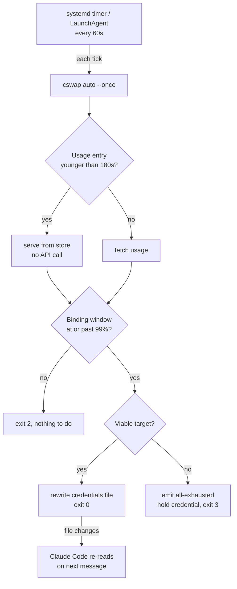

# cswap Account Rotation - Plan

## Goal Capsule

- **Objective:** Claude Code keeps working when the signed-in account runs out of quota, without someone noticing and
  logging in as another account.
- **Means:** A scheduled `cswap auto --once` tick runs every minute on each host, as a systemd timer on Linux and a LaunchAgent on macOS (KTD1), against settings pinned by `scripts/cswap-autoswitch-deploy.sh` (KTD2).
- **Authority:** Requirements govern behavior. KTDs govern mechanism. Where a KTD and the upstream tool's behavior
  disagree, the tool's behavior wins and the KTD is wrong.
- **Execution profile:** Packaging and host configuration. Runtime smoke verification over unit coverage; the repo-side
  assertions are shape checks, not behavior proofs.
- **Stop conditions:** Stop and ask if a change would rotate credentials on a host the user did not name, or if a switch
  lands while the outgoing account still has ample quota.
- **Tail ownership:** A live rotation is proven only when an account reaches the trip point in ordinary use. Nothing
  forces that state, so it is observed rather than scheduled.

---

## Product Contract

### Summary

`cswap auto --once` runs on a one-minute schedule on both hosts so account rotation happens unattended, with the trip
point set to switch while the outgoing account can still serve.

### Problem Frame

Each host runs one Claude account at a time. When that account's quota is spent, work stops until a person notices and
runs `/login`, and an agent that hits the wall mid-turn stalls and needs a manual restart. `cswap` can rotate accounts
on its own, but only when something invokes it on a schedule and its trip point is set to fire before exhaustion rather
than at it.

The account-wide 5-hour and 7-day windows are the signal that governs. A per-model weekly window can also be counted,
but it gates the account outright rather than contributing to a blend, so counting a window that does not track the work
parks rotation on a limit that never binds. These accounts report one scoped window, for a model the work does not run
on, which is why the account-wide windows are the correct input here.

### Key Decisions

- Trip point set at 99% (session-settled: user-directed — chosen over both the 90% default and a 99.7 setting: the
  switch must land while the account can still serve, because an agent that hits the wall mid-turn stalls and needs a
  manual restart). Governs R2.
- Rotation runs on both hosts (session-settled: user-directed — chosen over Linux-only: the Mac runs unattended sessions
  too, so the interactive-operator assumption that would have excluded it does not hold). Governs R1, R7.
- The account roster is the user's to manage; the schedule does not block on how many accounts exist (session-settled:
  user-directed — chosen over gating rollout on a second account). Governs R6.

### Requirements

**Rotation behavior**

- R1. The rotation check runs every minute on each host, unattended, and resumes after reboot.
- R2. A switch triggers while the active account can still serve, at 99% utilization of its binding window, rather than
  on exhaustion.
- R3. The trigger reads the account-wide 5-hour and 7-day windows. Per-model weekly windows stay out of the gating set.
- R4. When no account can be switched to, the current credential is held and not rotated.
- R5. Rotation never moves onto a metered API-key account.

**Deployment**

- R6. Deployment completes and the schedule runs whatever the registered account count.
- R7. The systemd units never deploy to macOS, and the LaunchAgent never deploys to Linux.
- R8. The units and their configuration are reproducible from the repo on a fresh host, including a `--all` rebuild.

### Success Criteria

- A switch is observed end to end: rotation happens with no human action, the outgoing account still has quota left at
  that moment, and a running Claude Code session picks up the new credential on its next message without a restart.
- A rotation check that genuinely fails is visible as a failed unit, while the ordinary no-action and hold outcomes are
  not.
- A `--all` deploy installs the scheduler that matches the platform and skips the one that does not.

### Scope Boundaries

- Which accounts exist, their aliases, and their credentials.
- The CodexBar adapter and its account display.
- Notification routing for the exhausted and quarantined states.

#### Deferred to Follow-Up Work

- Alerting on the exhausted and quarantined states. Both are emitted and logged; routing them to a notification is
  separate work.
- Tracking `cswap`'s own version in the repo. It is a `uv tool` install, and this repo has no pattern for pinning those.

---

## Planning Contract

### Key Technical Decisions

- KTD1. **A scheduled oneshot tick, not a long-running daemon.** (session-settled: user-directed — chosen over a service
  daemon: the tool governs its own fetch cadence, so a daemon buys no responsiveness the schedule lacks.) The engine
  floors usage refetches at 60 seconds even in its tightest mode, so a one-minute schedule matches the fastest cadence
  the trigger can ever act on. Two properties then favour the scheduled tick. A failing tick inside a daemon's loop is
  caught and slept past, so a wedged watcher stays `active (running)` and green, while a failed tick surfaces in the
  failed-unit list. And `--once` holds live refresh tokens for a fraction of a second per minute rather than
  continuously. Linux follows `stow/rclone/dot-config/systemd/user/box-bisync.{service,timer}`; macOS uses
  `StartInterval`, which is launchd's equivalent. Governs R1.

- KTD2. **Settings applied through the persisted config, not scheduler flags.** `cswap config set` writes settings that
  apply to every invocation, including a hand-run `cswap auto --once` during debugging. Flags in the unit or plist would
  apply only to scheduled ticks and make a hand-run diverge silently. `scripts/cswap-autoswitch-deploy.sh` owns them.
  Governs R2, R3, R5.

- KTD3. **`autoswitch.model` is held unset, so the trigger reads the account-wide windows only.** A counted per-model
  window gates the account outright and has no fallback: `oauth.relevant_windows` returns the scoped windows alongside
  the 5-hour and 7-day ones, the worst window sets headroom, and once a counted window reads 100% on every account the
  engine reports all-exhausted and waits on the latest reset among the at-limit windows. It never re-decides on the
  account-wide windows alone. Measured on both hosts: with the setting applied, an account reporting `5h 15% · 7d 60% ·
  Fable 100%` returned `headroomPct 0.0` and the pair read as all-exhausted; unset, the same account returned `40.0` and
  rotation resumed. The one scoped window these accounts report is for a model the work does not run on. A comma-separated list does not narrow this: each named window is appended to the gating set, so naming that model
  explicitly gates identically. Governs R3.

- KTD4. **The anti-flap margin is lowered to 2 points.** The margin gates the proactive path only, and a 99 trip point
  is what makes that path reachable: the engine reports whole-number percentages, so a reading of 99 still leaves
  headroom and selects the proactive trigger rather than the at-limit escape. At the shipped margin of 10 the target
  would have to sit at or below 89% to be accepted, and a peer anywhere between 89 and 99 would be refused until the
  active account reached exhaustion, which is the outcome the trip point exists to avoid. At 2 the accepted band widens
  to 97 and below. Flapping stays bounded: once both accounts are at or above the trip point the percentage margin no
  longer applies, and the engine's all-exhausted escape takes over with its own one-way guards. Governs R2.

- KTD5. **Two packages, each guarded to its platform.** `stow/cswap` carries the systemd units and sits in
  `SHARED_PACKAGES` with a Linux-only guard case in `scripts/stow-deploy`, following `codex-proxy`. `stow/launchagent`
  carries the plist and sits in `DESKTOP_PACKAGES`, which is macOS-only by construction. Registration in a deploy list is what satisfies R8, since a package named in neither is absent from a `--all` rebuild, and the guard is what satisfies R7. Governs R7, R8.

- KTD6. **The units address the binary through the systemd `%h` specifier.** This follows the repo's dominant
  convention: eight committed user units already use `%h`. A minority hardcode an absolute home path, which works on one
  host and pins a username into a repo that deploys to many. The plist reaches the same end through `$HOME` inside its
  shell invocation. Governs R8.

- KTD7. **The scheduler declares the tick's non-failure exit codes as success.** `auto --once` reports its outcome in
  the exit code: 0 switched, 2 nothing to do, 3 every account spent so the credential is held. Only 0 is success to
  systemd, so without `SuccessExitStatus=2 3` every routine tick lands in the failed-unit list and buries the failures worth seeing, forfeiting the observability KTD1 selects the scheduled tick for. Governs R4 and the
  failed-unit success criterion.

- KTD8. **Each scheduler sets `PATH` explicitly.** Neither a systemd user unit nor a LaunchAgent inherits an interactive
  shell's `PATH`, and `cswap` resolves the `claude` binary through it when rewriting credentials. The Linux unit sets it
  via `Environment=`; the plist sets it inside the `sh -c` invocation. Governs R1.

- KTD9. **cswap's settings file is applied by command, not stowed.** The tool rewrites that file when any setting
  changes, so a stow symlink would be replaced by a regular file on first write and the repo copy would stop tracking
  reality. This is the same failure documented for the CodexBar config, which the repo handles with an apply script
  rather than a symlink. Governs R8.

### Assumptions

- `cswap` stays at a version whose `config set` keys and `auto` flags match the ones the deploy script targets. A major
  upgrade could rename either, and the script would then apply nothing while reporting success.
- Lingering stays enabled for the user on the Linux host. Without it the timer does not run until an interactive login,
  which would leave the deployment looking complete and inert after a reboot.

### High-Level Technical Design

The binding window is the higher of the account-wide 5-hour and 7-day utilizations. A tick evaluates every minute but
fetches only when the tool's own freshness floor says the entry is stale, so the schedule adds no sustained API load.
The credential handoff is file-based, which is why no restart is needed.

---

## Implementation Units

### U1. cswap stow package with the timer and oneshot unit

- **Goal:** A committed timer and oneshot unit pair that runs the rotation check every minute on Linux.
- **Requirements:** R1, R4, R7, R8
- **Files:**
  - `stow/cswap/dot-config/systemd/user/cswap-auto.service`
  - `stow/cswap/dot-config/systemd/user/cswap-auto.timer`
  - `scripts/stow-deploy`
- **Approach:**
  1. `Type=oneshot` on the service with no `Restart=` directive; `OnCalendar=minutely`, `Persistent=true`, and
     `WantedBy=timers.target` on the timer.
  2. `SuccessExitStatus=2 3` per KTD7, and `Environment=PATH=` per KTD8.
  3. `%h`-addressed `ExecStart` per KTD6, plus the `NoNewPrivileges` / `PrivateTmp` hardening pair the repo's other user
     units carry.
  4. `After=network-online.target` with the matching `Wants=`, since a tick with no network can only fail.
  5. `cswap` registered in `SHARED_PACKAGES` and in the non-Linux guard case in `scripts/stow-deploy`, per KTD5.
- **Patterns to follow:** `stow/rclone/dot-config/systemd/user/box-bisync.timer` for the minutely-and-persistent shape;
  `stow/opendataloader-pdf/dot-config/systemd/user/opendataloader-pdf.service` for the `%h` `ExecStart` and hardening
  pair.
- **Verification:** `systemd-analyze verify` accepts both units on the Linux host.

### U2. LaunchAgent for macOS

- **Goal:** The same one-minute rotation check on the Mac.
- **Requirements:** R1, R7
- **Dependencies:** U1 (shares the settings contract)
- **Files:**
  - `stow/launchagent/Library/LaunchAgents/com.user.cswap-auto.plist`
- **Approach:**
  1. `StartInterval` of 60 with `RunAtLoad`, launchd's equivalent of the minutely timer.
  2. `PATH` set inside the `sh -c` invocation per KTD8, and stdout/stderr appended to per-agent logs under the user's
     `Library/Logs`.
  3. No trip point or model flag, per KTD2.
  4. The package rides `DESKTOP_PACKAGES`, which never deploys on Linux.
- **Verification:** `launchctl list` shows the label with the nothing-to-do exit status between ticks.

### U3. Settings deploy script

- **Goal:** The trip point, the anti-flap margin, and the API-key exclusion are applied reproducibly on any host that
  runs the schedule, and the per-model trigger stays unset.
- **Requirements:** R2, R3, R5, R8
- **Files:**
  - `scripts/cswap-autoswitch-deploy.sh`
  - `scripts/lint-shell`
- **Approach:**
  1. Pin three keys: trip point 99, anti-flap margin 2, and API-key exclusion false. Hold `autoswitch.model` at its default per KTD3.
  2. Distinguish pinned from inherited. `cswap config` marks an unpinned key `(default)`, so a key sitting at a value
     that merely equals the shipped default is still unpinned and an upstream change would move it silently; the script
     re-pins in that case and says so.
  3. Clear `autoswitch.model` when an earlier run left it pinned, rather than only skipping it.
  4. Leave the cooldown and poll interval alone, so a harmless upstream default change is inherited rather than frozen.
  5. Resolve the binary through `CSWAP_BIN`, defaulting to `cswap` on `PATH`. `cswap config set` writes to a root the
     tool resolves internally and takes no path flag, so this override is the only seam that keeps the suite off a real
     installation.
  6. Exit non-zero naming the missing binary rather than partially applying.
  7. Registered in both `_is_target` and `_all_targets` in `scripts/lint-shell`; a `scripts/*.sh` path absent from that
     enumeration is skipped silently even when passed by name.
- **Patterns to follow:** `scripts/sshd-locale-deploy.sh` for the guard-apply-report structure.
- **Verification:** A second run reports that nothing changed.

### U4. Repo guards for the package shape

- **Goal:** The deployment properties the rotation depends on cannot regress silently.
- **Requirements:** R2, R3, R4, R5, R7, R8
- **Files:**
  - `tests/cswap-autoswitch.bats`
- **Approach:** Assert against the committed units, the deploy script, and `scripts/stow-deploy` rather than host state,
  so the suite passes on both platforms. Drive the settings scenarios through a stub on `CSWAP_BIN`.
- **Test scenarios:**
  - The timer runs minutely and catches up after downtime.
  - The service is oneshot and declares no `Restart=` directive.
  - The service accepts the nothing-to-do and hold exit codes as success.
  - The service carries no trip point or model flag.
  - No committed cswap file carries a username.
  - `cswap` is in `SHARED_PACKAGES`, and is guarded Linux-only so a macOS deploy skips it.
  - The deploy script is executable and enumerated as a lint target.
  - The trip point and anti-flap margin are set so the proactive path is reachable.
  - The per-model trigger is never pinned, and one left pinned by an earlier run is cleared.
  - The API-key exclusion is pinned rather than inherited.
  - A second run changes nothing and says so.
  - A missing binary fails loudly instead of applying nothing quietly.
- **Verification:** The file passes under `scripts/run-tests --all` on macOS, with the developer's own cswap settings
  untouched.

### U5. Deploy and observe

- **Goal:** The schedule is live on both hosts and its decisions are visible.
- **Requirements:** R1, R4, R6
- **Dependencies:** U1, U2, U3
- **Files:** none; this unit is host state.
- **Approach:**
  1. Deploy the matching package per host, reload the user daemon or load the agent, and enable the schedule.
  2. Confirm lingering on the Linux host, since without it the timer is inert until an interactive login.
  3. Confirm ticks recur at the schedule's cadence and that each reports its decision with the reading behind it.
  4. Distinguish a quarantine from an exhaustion hold. A dead refresh token removes an account from rotation until the
     user logs in with it again, and that state presents like a legitimate hold: no further credential rewrites.
- **Execution note:** Journal and log lines for switch and quarantine events render the account's email address inline.
  Redact it to an account ordinal before any excerpt is recorded outside the host, in a PR body, a commit message, or a
  docs entry.
- **Verification:** The schedule reports active on both hosts, survives a reboot on Linux, and each tick logs its
  outcome and the utilization behind it.

---

## Verification Contract

| Gate           | Command                                                                                                    | Applies to     |
| -------------- | ---------------------------------------------------------------------------------------------------------- | -------------- |
| Repo suite     | `scripts/run-tests --all`                                                                                  | U1, U2, U3, U4 |
| Shell lint     | `scripts/lint-shell --all`                                                                                 | U3, U4         |
| Unit syntax    | `systemd-analyze verify` on both units                                                                     | U1, U5         |
| Schedule state | timer active on Linux after reboot; agent listed on macOS                                                  | U5             |
| Settings state | the three pinned keys read as pinned, and `autoswitch.model` reads `(default)`, on every host              | U3, U5         |
| Tick health    | ticks recur at cadence, each logging its outcome and the reading behind it                                 | U5             |
| Rotation proof | one credential rewrite per switch, outgoing account still holding quota, session continues without restart | U5             |

The repo suite and shell lint run on macOS with no cswap unit deployed and the developer's cswap settings unchanged. The
remaining gates are host gates.

---

## Definition of Done

Met:

- The units, plist, deploy script, and guards are committed, and the repo suite and shell lint pass.
- `cswap` is registered in `SHARED_PACKAGES` behind a Linux-only guard, the plist rides `DESKTOP_PACKAGES`, and no
  committed file carries a username.
- The schedule is live on both hosts, lingering is enabled on the Linux host, and ticks recur at cadence reporting the
  no-action outcome with the utilization behind it.
- The three pinned settings read as pinned on both hosts, and `autoswitch.model` reads `(default)` on both.

Outstanding:

- The rotation proof. No account has reached the trip point since deployment, so no switch has been exercised: the ticks observed so far all report the below-threshold no-action outcome. Nothing forces this state without spending an
  account, so it is observed when it arrives rather than scheduled. Until then the switch path, the credential handoff,
  and the uninterrupted-session claim rest on the engine's behavior rather than on a measurement from these hosts.
