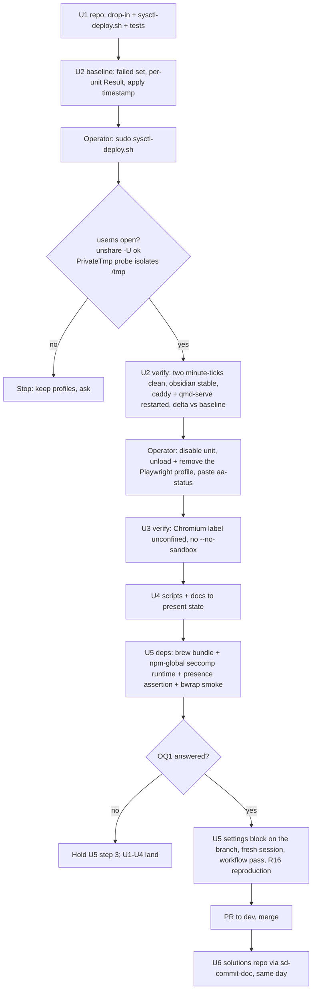

# Unprivileged User Namespaces on the Linux Host - Plan

## Goal Capsule

- **Objective:** Every sandbox on the Linux host that asks for a user namespace gets one: the systemd user units run
  with the private `/tmp` they declare, headless Obsidian and Playwright Chromium run with their own sandboxes instead
  of crash-looping or needing an allow-list, and Claude Code's Bash sandbox is available. The sandboxing directives the
  repo's systemd user units declare are the ones the kernel enforces.
- **Means:** Ubuntu's documented sysctl opt-out shipped from this repo and copy-deployed to `/etc/sysctl.d/` (KTD1,
  KTD2), with the per-binary AppArmor machinery retired (KTD4).
- **Authority:** Requirements govern behavior. KTDs govern mechanism. The host's observed state wins over any doc or
  memory claim; where a solutions doc disagrees with a live measurement, the doc is what gets rewritten.
- **Execution profile:** Host configuration plus packaging. Proof is runtime measurement on the live host; bats coverage
  is shape checks on the shipped file and the deploy-script seams. Every `/etc` step is an operator (sudo) action:
  Claude's settings deny `sudo`, so the implementing agent prepares and verifies, and the user applies.
- **Stop conditions:** Stop and ask if the sysctl does not take effect without a reboot, if any unit that was healthy
  before the apply is failed after it, if `browse` cannot launch Chromium after the profile is unloaded, if the enabled
  Claude Code sandbox blocks the routine Bash workflow in a way one allow-list pass cannot fix, or before authoring the
  settings block while the Open Question on secrets is unanswered.
- **Tail ownership:** The dotfiles change merges to `dev` by PR. The operator applies the host steps in the order U2 →
  U3 → U5. The solutions-repo entries (U6) are committed with `sd-commit-doc` the same day the host converts. Ubuntu
  Pro/Livepatch, `docker`/`lxd` group membership, the Box OAuth re-authorization, and the nightly-autocommit repair are
  separate tasks and stay out.

---

## Product Contract

### Summary

Ship `config/sysctl.d/20-apparmor.conf` (`kernel.apparmor_restrict_unprivileged_userns = 0`) with a copy-based
`scripts/sysctl-deploy.sh`, apply it on the Linux host, and prove the previously inert `PrivateTmp=true` sandboxing,
Obsidian, and Playwright Chromium now work. Retire the Playwright AppArmor profile, its boot-reload unit, and
`scripts/apparmor-deploy.sh` together with every reference to them. Declare the sandbox dependencies in the repo and
turn on Claude Code's sandbox in the stowed settings with the boundaries that make it a real one. Bring the
`docs/solutions/` record to present state.

### Problem Frame

Ubuntu 24.04 ships `kernel.apparmor_restrict_unprivileged_userns = 1` (from `/usr/lib/sysctl.d/10-apparmor.conf`), which
denies user-namespace creation to any process without an AppArmor `userns` grant. The restriction is enforced by the
AppArmor LSM itself, so it holds even with no policy loaded: on this host every process runs `unconfined` and user
namespaces are still denied. That has four measured consequences:

- Every systemd user unit with `PrivateTmp=true` (ten in the repo) runs unsandboxed. systemd 255 needs a user namespace
  before it can build the mount namespace, logs `Failed to set up user namespacing for unprivileged user, ignoring` at
  info level once per `Exec*` line, and continues in the host mount namespace. A `PrivateTmp=true` unit sees the full
  host `/tmp` and shares the login shell's mount-namespace inode. `NoNewPrivileges=true` is the only directive that
  takes effect. The journal carries roughly 35,000 of those lines this boot.
- `obsidian.service` has been in `activating (auto-restart)` since the current boot began (115,000+ restarts), dying
  every ~10 s on Chromium's `sandbox/linux/services/credentials.cc … Permission denied`. Its allow-list profile
  `/etc/apparmor.d/obsidian` (Ubuntu's stock `apparmor`-package stub, a dpkg conffile) never loads because
  `apparmor.service` did not run this boot (`ConditionTimestamp` empty; it ran on the previous boot), and nothing else
  reloads `/etc/apparmor.d/`.
- Playwright Chromium works only because the repo ships a dedicated boot unit that reloads
  `config/apparmor.d/playwright`. That profile attaches to a glob under `/home/*/.cache/playwright/`, a user-writable
  path, and children exec'd from an unconfined-mode profile inherit its label and `userns` grant. Any local account can
  place a script at a matching path and get user namespaces, so the restriction already protects nothing here. This
  account is also in the `docker` group (live daemon, root-equivalent socket) and the `lxd` group (no daemon present),
  so the privilege-escalation risk the restriction mitigates for this uid is moot.
- Claude Code's Bash sandbox (`bubblewrap`) cannot run, and `bubblewrap` has deliberately not been installed for that
  reason.

Ubuntu's own sysctl file names `/etc/sysctl.d/20-apparmor.conf` as the sanctioned override. Every other major
distribution ships user namespaces enabled. `systemd-sysctl.service` is static and active on this host, so a drop-in
persists across reboots with no custom unit, unlike the AppArmor path.

### Key Decisions

- **Open unprivileged user namespaces host-wide with the sysctl.** (session-settled: user-approved — chosen over leaving
  the restriction in place, an unconfined-mode AppArmor profile for `systemd-executor`, and per-unit `LogLevelMax=`
  suppression: the restriction already protects nothing for this account while blocking every sandbox that matters, an
  executor profile widens exposure to every unprofiled service without being narrower in practice, and log suppression
  hides the only visible symptom of decorative hardening.) Governs R1, R2, R3, R8, R9, R10, R11, R12.
- **Claude Code's sandbox is in scope, not a follow-up.** (session-settled: user-approved — chosen over deferring it: it
  is the main practical payoff of opening user namespaces, and the memory note that blocks installing `bubblewrap`
  becomes wrong the moment the sysctl lands.) Governs R13, R14, R15, R16.

### Requirements

**Host policy**

- R1. The repo ships `config/sysctl.d/20-apparmor.conf` containing exactly one setting,
  `kernel.apparmor_restrict_unprivileged_userns = 0`, with a comment stating why the host opts out of Ubuntu's default.
  `kernel.apparmor_restrict_unprivileged_unconfined` is not set and stays at the host default.
- R2. `scripts/sysctl-deploy.sh` copies (never symlinks) every file in `config/sysctl.d/` into `/etc/sysctl.d/`, applies
  the result, asserts the live value of the key is `0`, is idempotent, is root-gated, no-ops on non-Linux, and exposes a
  test seam that bypasses root, platform, and apply.
- R3. The setting survives a reboot with no repo-provided boot unit.

**Retirement**

- R4. `config/apparmor.d/playwright`, `config/systemd/system/apparmor-playwright.service`, and
  `scripts/apparmor-deploy.sh` are removed from the repo.
- R5. On the host, `apparmor-playwright.service` is disabled and its unit file removed, and the `playwright-*` profiles
  are unloaded and `/etc/apparmor.d/playwright` removed, after R2 (sysctl first). Ubuntu's stock `userns` stub profiles,
  `obsidian` among them, stay in place.
- R6. No repo file outside `docs/plans/`, `docs/solutions/`, and the generated `CHANGELOG.md` references
  `apparmor-deploy`, `apparmor-playwright`, `config/apparmor.d`, or `apparmor_parser`: `README.md` (tree and
  system-level configs section), `PROJECT.md`, `CONCEPTS.md`, `BOOTSTRAP.md`,
  `docs/runbooks/playwright-browser-launch.md`, `scripts/playwright-deps-deploy.sh`,
  `scripts/playwright-browsers-deploy.sh`.
- R7. `scripts/playwright-deps-deploy.sh` no longer escalates to `sudo`. It checks the userns knob as a precondition and
  fails fast pointing at `scripts/sysctl-deploy.sh` when the value is `1`; a missing knob (non-Ubuntu kernel) counts as
  unrestricted.
- R8. `BOOTSTRAP.md § Linux Server Setup` gains the sysctl step and the sandbox-dependency install, both ordered before
  the first `claude` launch and before Playwright provisioning.

**Host verification**

- R9. After the sysctl is applied, a `PrivateTmp=true` user unit runs in its own mount namespace with an empty `/tmp`
  and a single-line `uid_map`, and no unit activated after the apply timestamp logs the namespacing line or exits
  `226/NAMESPACE`.
- R10. `obsidian.service` leaves auto-restart and stays `active (running)`: two reads at least 60 s apart show an
  identical `NRestarts` and `SubState=running`, and one `obsidian` CLI round-trip succeeds.
- R11. Health is measured as a delta against a baseline taken before the apply: no unit that was healthy before is
  failed after, every timer keeps a scheduled next run, and the long-running units (`caddy`, `qmd-serve`) are restarted
  and re-checked. `box-bisync` is failed before and after on an unrelated `invalid_grant` (expired Box OAuth token) and
  is tracked outside this plan. `nightly-autocommit` and `rustup-update` are not restarted to verify (that runs them);
  their first timer-triggered runs after the apply are part of U2's done criteria.
- R12. Playwright Chromium launches with its sandbox on and no AppArmor profile loaded: the launched Chromium's command
  line lacks `--no-sandbox` and its label reads exactly `unconfined`. `tmux-prune-orphans` (needs the real `/tmp`) and
  `obsidian` (X socket in `/tmp/.X11-unix`) keep their current `/tmp` visibility.

**Claude Code sandbox**

- R13. `stow/brew/Brewfile` declares `bubblewrap` and `socat` for Linux only, with a comment stating what they serve;
  the seccomp filter the sandboxing docs list for Linux Unix-socket blocking is installed where Claude Code looks for it
  (KTD6); all three are installed and their presence asserted on the host before the settings change exists on the
  checked-out branch.
- R14. The stowed `settings.json` enables the sandbox, fails loudly when it is unavailable, denies non-listed hosts
  instead of deferring to the classifier, prompts on every unsandboxed retry even in auto permission mode, and carries
  write and credential boundaries that make it a code-execution boundary, not only a network one (KTD7).
- R15. The routine Bash workflow keeps working under the sandbox: `gh`, `git` fetch/push over SSH and HTTPS, `brew`,
  `bun`/`uv` installs, `qmd query`, Ollama and Caddy on loopback, `sd-commit-doc` writing through the `docs/solutions`
  symlink, and signed commits on both platforms. Memory writes under `~/.claude/` go through the Write/Edit tools, which
  run outside the sandbox, and need no Bash write grant. `1Password` `op` calls follow the Open Question below. The
  allow-lists that make this true ship in the same change.
- R16. A `claude -p` session shaped like the nightly unit's (`NoNewPrivileges=true` + `PrivateTmp=true`, the unit's
  `PATH`, started from a repo directory) runs under the sandbox: it completes, its Bash call runs in a mount namespace
  different from the launching shell's, and a write outside that repo is denied. The nightly job itself is not the proof
  vehicle: its Claude path has failed at baseline since 2026-07-30 (see Scope Boundaries).

**Knowledge record**

- R17. `docs/solutions/runtime-errors/playwright-chromium-sandbox-ubuntu-2404-2026-04-17.md` describes the sysctl route
  as the present mechanism, keeps its triage fork and WebKit-deps content, and drops the profile, boot-unit, and "prefer
  the scoped profile" content.
- R18. `docs/solutions/developer-experience/local-ci-env-parity-playwright-docker-2026-04-14.md`,
  `docs/solutions/tooling/defuddle-skill-and-web-metadata-extraction-20260324.md` (Track B step 3 and its decision row),
  and `docs/solutions/runtime-errors/playwright-browser-install-stall-manual-cache-install.md` no longer instruct
  readers to deploy an AppArmor profile.
- R19. A new `docs/solutions/configuration-fixes/` entry records the inert-`PrivateTmp` finding: symptom, the systemd
  255 behavior, the label-inheritance probe, the copy-not-symlink rule for `/etc`, the residual-risk statement (kernel
  namespace surface for every unprivileged uid; the accepted GitHub egress path while the SSH key and `gh` token stay
  readable in the sandbox; exported secrets per the Open Question's outcome), and the verification recipe including the
  first-reboot and first-Mac-session checks.
- R20. All solutions-repo edits are committed with `sd-commit-doc`, never directly in the shared clone, and on the same
  day the host converts.

### Success Criteria

- `unshare -U true` succeeds for the user with no AppArmor profile involved.
- A `systemd-run --user -p PrivateTmp=true` probe started after the apply reports a mount-namespace inode different from
  the login shell's, an empty `/tmp`, and a single `uid_map` line.
- Zero `Failed to set up user namespacing` lines from unit activations after the apply timestamp, measured only once at
  least two ticks of `box-bisync` and `cswap-auto` have run after it.
- `obsidian.service` meets R10.
- In a fresh `claude` session on the Linux host, `/sandbox` shows the sandbox active with no Dependencies tab, a Bash
  call reports a mount-namespace inode different from the launching shell's, a `systemd-run --user` probe and a `tmux
  run-shell` probe from sandboxed Bash both fail, a write into `~/dotfiles/scripts` from Bash is denied, and reading
  each denied credential file by its `~/` path and its repo-side path fails.
- `rg` for the retired names across the repo (excluding `docs/plans/`, `docs/solutions/`, `CHANGELOG.md`) returns
  nothing; CI (`bats`, `shellcheck`, `actionlint`) is green.

### Scope Boundaries

- The Ollama override keeps its `sudo stow -t /etc` deployment. This plan resolves the copy-vs-stow split for new `/etc`
  files (KTD1) and does not migrate existing ones.
- `/etc/sysctl.d/50-cursor.conf` (Cursor's commented-out lines) is left untouched; it sorts after `20-` and agrees on
  the `userns` key if ever uncommented.
- Ubuntu's stock `userns` stub profiles under `/etc/apparmor.d/` (`obsidian`, `chrome`, `firefox`, and roughly eighty
  more, all `apparmor`-package conffiles) stay in place. Once the sysctl is `0` they gate nothing, and deleting
  package-owned files deviates the host from its package baseline for no gain.
- `memory-distill.service`, a decommissioned openclaw unit that still carries `PrivateTmp=true`, is not restarted,
  verified, or removed here.
- No unit's `PrivateTmp` value changes. The directives are correct declarative intent on any host where user namespaces
  are allowed.
- `apparmor.service` not running this boot is not investigated. Its consequence is named so the residual-risk entry is
  honest: Ubuntu's stock confinement profiles (`cupsd`, `snap-confine`, and the rest of `/etc/apparmor.d/`) are inert on
  this host today; this plan neither causes nor changes that.
- `box-bisync.service` failing since the 2026-08-31 boot on `invalid_grant` is a dead Box OAuth refresh token, unrelated
  to namespaces. Re-authorization runs on the Mac (`rclone authorize`) and is a separate task; R11's delta baseline
  keeps the two from masking each other.
- `nightly-autocommit.service` carries three pre-existing bugs unrelated to namespaces: its `claude -p` path has hit
  "Execution error" at the 120 s timeout on every attempt since 2026-07-30 and fallen back to `git add -A` (last
  Claude-path success 2026-07-25); `obsidian-vault` is skipped every night as "not a git repo" because its `.git` is a
  gitdir file and the script tests for a directory; and `-d "$repo_path"` is `--debug`, not a directory, so `claude -p`
  runs from `$HOME`. Repairing the job is a follow-up; R16 proves the sandbox for that unit shape directly.

#### Deferred to Follow-Up Work

- Ubuntu Pro attach for Livepatch (account-bound, manual). Until then, a published user-namespace-reachable kernel
  privilege escalation for the running kernel is a reboot-now trigger, not a wait-for-the-timer one.
- `RestrictNamespaces=` on system units that run as their own uid and face the network; the Ollama override
  (tailnet-reachable through the Caddy VIP) is the obvious first.
- `user.max_user_namespaces=0` as an emergency kill switch that needs no AppArmor, documented in the runbook paired with
  the sandbox rollback: the switch also disables Claude Code's sandbox, and with `failIfUnavailable: true` every Bash
  call fails until `sandbox.enabled` is flipped off.
- Dropping the account from the `docker`/`lxd` groups once rootless Docker is viable (user namespaces make it possible).
- Box OAuth re-authorization for `box-bisync`.
- Repair of `scripts/nightly-autocommit.sh` as one item: the 120 s "Execution error" root cause, the gitdir-file repo
  test, and running `claude -p` from the repo path (drop the `-d` flag; set the working directory) so the sandbox's
  writable region is the repo, not `$HOME`. Until it lands, the nightly session never reaches a working Claude path, so
  its `$HOME`-wide sandbox scope is a latent, not live, exposure.
- The secrets fragment (Open Question below, option b) if not chosen now: a git-crypt-encrypted settings fragment
  carrying `credentials.envVars`, loaded through `--settings` by the `claude()` shell wrapper and the two units that
  launch `claude -p`.
- `gh` token masking in the sandbox (`credentials.files` `mask`) needs the experimental TLS-terminating proxy; revisit
  when it leaves experimental.
- Reconcile the "deploys via stow" wording for machine-level config in the user-level instructions with `CONCEPTS.md`'s
  system-level-unit definition, which this plan follows.
- First reboot after the change, and the first Mac session after pulling the settings (which also checks with `claude
  doctor` that the Mac client accepts `strictAllowlist` and the `credentials` block; older clients drop those keys
  silently): both are verification points recorded in the U6 entry's recipe, not gates on this plan.
- Tuning of the sandbox allow-lists beyond the first representative-workflow pass in U5.

### Open Questions

- **OQ1 (blocks U5 step 3 only; U1–U4 proceed): how do exported secrets reach, or stay out of, sandboxed Bash?** The
  repo is public and `stow/claude/dot-claude/settings.json` is not git-crypt encrypted, so a `credentials.envVars` deny
  list there would publish the names of every variable the secrets file exports. Sandboxed commands otherwise inherit
  those variables, and the 1Password skill's `op` calls depend on the service-account token being one of them. Options:
  (a) ship without `credentials.envVars`; the secrets file itself stays denied by path, exported values remain readable
  inside the sandbox, `op` keeps working sandboxed, and the exposure is recorded in R19 as accepted with
  `strictAllowlist` bounding egress; (b) keep the names out of the tracked file by loading a git-crypt-encrypted
  settings fragment with `credentials.envVars` through `--settings` in the `claude()` wrapper and the two units that
  launch `claude -p`, at which point `op` calls ride the ask-gated unsandboxed retry; (c) list the names in the public
  file (rejected: contradicts the standing rule on git-crypt contents). Recommendation: (a) for this change with (b) as
  the deferred follow-up, because (b) adds a launch-context mechanism the plan has not verified and blocks nothing else.
  An `excludedCommands` entry for `op` is ruled out in every option (a matched command runs the whole compound line
  unsandboxed).

---

## Planning Contract

### Key Technical Decisions

- KTD1. **Copy-deploy via a new single-concern `scripts/sysctl-deploy.sh`, mirroring `scripts/nas-deploy.sh` and
  `scripts/sshd-locale-deploy.sh`.** (session-settled: user-approved — chosen over `sudo stow -t /etc` as used by the
  `ollama` package: root applying a file that lives in a user-writable tree is the wrong shape for a kernel setting,
  `systemd-sysctl` reads drop-ins at sysinit before `$HOME` is guaranteed mounted, and the NAS eng review already
  rejected `stow --target=/` on the same grounds.) Copy is the house rule for `/etc` from here on; `CONCEPTS.md` §
  System-level unit already states it.
- KTD2. **Apply with a restart of `systemd-sysctl.service`, then assert the live value.** Restarting the unit re-applies
  every drop-in in lexical order, which is the same precedence exercised at boot, so a passing apply also proves boot
  persistence without a reboot. Neither the unit restart nor `sysctl --system` fails on an unapplied key, so the
  script's live-value assertion on `/proc/sys/kernel/apparmor_restrict_unprivileged_userns` is the real gate; a
  later-sorting override or a kernel without the knob is loud. No repo boot unit: `systemd-sysctl.service` is static and
  active on this host, which is the property `apparmor.service` lacked. No user-manager reload is needed: systemd's
  executor retries namespace setup on every exec.
- KTD3. **The drop-in is `config/sysctl.d/20-apparmor.conf` and sets one key.** The name is the one
  `/usr/lib/sysctl.d/10-apparmor.conf` recommends in its own comment, so a reader of the Ubuntu file finds the override
  where it says to look. `kernel.apparmor_restrict_unprivileged_unconfined` is deliberately absent: the host default is
  already `0`, and once user namespaces are open, that knob gates nothing.
- KTD4. **Retire the repo's AppArmor deploy machinery rather than generalize it; leave Ubuntu's stock stub profiles
  alone.** Nothing else in the repo loads a profile; a future need recreates the pattern from git history. The
  Playwright profile is the repo's own file and goes; `/etc/apparmor.d/obsidian` and the other stock
  `flags=(unconfined)` + `userns` stubs are `apparmor`-package conffiles that the sysctl makes inert, and both stub
  kinds confine nothing, so removing them changes no protection either way.
- KTD5. **`scripts/playwright-deps-deploy.sh` checks the precondition and never fixes it.** A browser-provisioning
  script must not change kernel policy under `sudo`; the fail-fast message names `sudo scripts/sysctl-deploy.sh`. The
  script joins the `scripts/lint-shell` allowlist while it is being edited.
- KTD6. **`bubblewrap` and `socat` come from Homebrew, gated `if OS.linux?`; the seccomp filter runtime is an
  exact-pinned npm global.** Both formulae have `x86_64_linux` bottles, brew is the first-choice installer, and the
  Brewfile already carries Linux-only lines with WHY comments. The sandboxing docs list a third Linux dependency, the
  seccomp filter that blocks Unix sockets (`@anthropic-ai/sandbox-runtime`); without it the sandbox leaves the systemd,
  tmux, and docker sockets reachable, which is weaker than today's unsandboxed-but-classified Bash. Claude Code resolves
  that filter only through `npm root -g` and a fixed set of `lib/node_modules` prefixes, so neither brew nor a bun
  global can serve it; on this host `npm root -g` is `~/.npm-global/lib/node_modules`, one of the probed locations, and
  the Brewfile's `node` supplies npm. The repo has no npm-globals manifest, so the exact-pinned install is a
  `BOOTSTRAP.md` step, and U5 asserts the runtime's `vendor/seccomp` directory exists under `npm root -g` before the
  settings block is authored. If brew's `bwrap` misbehaves under Claude Code, switching to the apt package is an
  implementation-time swap. `bwrapPath` is a managed-only setting, so every `claude` launch context (interactive shells,
  the nightly and cswap units) must find `bwrap` on `PATH`; the units already carry the Homebrew prefix.
- KTD7. **Sandbox settings make the sandbox a boundary, not a label.** The stowed file is user-scope settings, so every
  path entry below carries a `~/` or `/` prefix: an unprefixed path in user settings resolves under `~/.claude` and
  matches nothing.
  - `sandbox.enabled: true`, `sandbox.failIfUnavailable: true`: silent fallback to unsandboxed execution is the exact
    failure this plan removes elsewhere; macOS uses Seatbelt natively and passes the availability check.
  - `sandbox.network.strictAllowlist: true`, and a `permissions.ask` rule for `Bash(dangerouslyDisableSandbox:true)`:
    this repo runs in auto permission mode with the dangerous-mode prompt skipped, so without the ask rule every sandbox
    block would become a classifier-approved unsandboxed retry. `allowUnsandboxedCommands` stays at its default so the
    retry path exists; the ask rule makes it a human decision. The seventeen `WebFetch(domain:…)` allow rules already in
    the file merge into the sandbox egress allowlist under `strictAllowlist`; U5 reviews them as egress grants and
    removes any host Bash never needs.
  - `network.allowedDomains`: `github.com`, `api.github.com`, `*.githubusercontent.com`, `ghcr.io`, `formulae.brew.sh`,
    `registry.npmjs.org`, `pypi.org`, `files.pythonhosted.org`, `crates.io`, `static.crates.io`, plus the loopback
    IP:port literals the docs' syntax allows for qmd-serve (the port `QMD_REMOTE_URL` names), Ollama (`11434`), and
    Caddy (`11500`). Go clients such as the `ollama` CLI may skip the proxy for loopback; if the U5 pass shows that,
    exclude only the three exact forms the permission allow-list already limits it to (`ollama list`, `ollama ps`,
    `ollama stop *`), never `qmd *` or `ollama *`: a matched command runs the whole compound line unsandboxed, so wide
    exclusions are injection-shaped. `systemctl --user` and the `obsidian` CLI need the D-Bus socket the seccomp filter
    blocks; they ride the ask-gated retry, and `systemctl *` is never excluded.
  - `filesystem.allowWrite`: `~/dev/solutions-docs` and `~/.gstack` only. Not `~/.claude` (plugin code and `.mcp.json`
    that launch unsandboxed, the hook scripts, credentials; memory writes use Write/Edit outside the sandbox). Not
    `~/.local/share` (it holds the Claude Code binary and the `cswap` tool that `cswap-auto.timer` runs unsandboxed
    every minute; the rare `uv tool install` rides the retry). Rule: any allow-listed path a systemd unit or the user's
    `PATH` executes from needs a matching deny carve-out.
  - `filesystem.denyWrite`: `~/dotfiles/stow`, `~/dotfiles/scripts`, `~/dotfiles/config`, `~/dotfiles/.githooks`,
    `~/dev/solutions-docs/.githooks`, `~/dev/solutions-docs/.git/hooks`, `~/dev/solutions-docs/.git/config`. In this
    repo the working directory (default-writable) is the source of everything that runs unsandboxed: the units'
    `ExecStart` scripts (`box-bisync.sh` runs every minute), the `.profile` chain and `config/shell/*.sh`, the
    `~/.local/bin` symlink targets, the `core.hooksPath` hooks, the unit files, the Claude hooks and settings, and the
    `config/` trees root copies into `/etc`; the solutions clone's hooks run under `sd-commit-doc` and the nightly job
    with push rights. Without this list the sandbox is a network boundary but not a code-execution one. A `git checkout`
    touching those paths hits the ask-gated retry, which is acceptable.
  - `sandbox.credentials.files` `deny`, written with `~/` prefixes and, because each is a symlink into the working tree,
    its repo-side target as well: the rclone config (`~/dotfiles/stow/rclone/dot-config/rclone`), the secrets file
    (`~/dotfiles/stow/secrets`), the Codex config (`~/dotfiles/stow/codex/dot-codex`), and Claude's own credentials
    file. `credentials.envVars` is not written into the tracked file (Open Question OQ1). The SSH key stays readable:
    SSH push and Linux commit signing (`op-ssh-sign-wrapper` falls back to `ssh-keygen`) both need it. On macOS, SSH
    auth and `op-ssh-sign` go through the 1Password agent socket, so `sandbox.network.allowUnixSockets` lists that
    socket path (a macOS-only key Linux ignores).
  - `allowAllUnixSockets` stays `false`; the seccomp filter (KTD6) is what makes that statement true.
  - One policy for both hosts: the `claude` stow package is shared, so macOS-only remedies go only in macOS-only keys;
    `excludedCommands` is not used for a macOS-only failure such as the documented Go-CLI TLS case (it rides the
    ask-gated retry until the deferred Mac pass); and a `sandbox.enabled: false` rollback written on either machine
    disables the sandbox on both after the next pull.
  - Rollback is `sandbox.enabled: false` written with the Edit tool (unsandboxed) and a fresh `claude` process, on disk
    before the nightly window opens.
- KTD8. **Solutions docs are rewritten in place to present state, not marked `status: stale`.** The Playwright entry
  keeps live value (symptoms, triage fork, WebKit deps), so it stays the canonical entry with new mechanism text. The
  new inert-`PrivateTmp` entry lives in `configuration-fixes/` and the two cross-link through `related_docs`.
- KTD9. **Verification is measured on the host; tests cover shape and seams.** Bats asserts the shipped drop-in's
  content and drives `sysctl-deploy.sh` through its `--dest` seam (the `tests/sshd-locale-deploy.bats` pattern). The
  `tests/claude-settings.bats` guard asserts the keys that make the sandbox a boundary: `enabled`, `failIfUnavailable`,
  `strictAllowlist`, the `permissions.ask` rule, every `denyWrite` and `credentials.files` entry present and starting
  with `~/`, `~/.claude` and `~/.local/share` absent from `allowWrite`, `allowAllUnixSockets` not `true`, and no
  `credentials.envVars` key in the tracked file. A session writing its snapshot back over the symlink would drop exactly
  those. Namespace behavior, Chromium launch, and timer health are proven on the live host and recorded in the PR body's
  Testing section.

### High-Level Technical Design

The order of operations is the design: the sysctl must land and be proven before any profile is unloaded (or `browse`
breaks), and the sandbox dependencies must be installed and smoked before the settings block exists on the checked-out
branch (the stowed `settings.json` is a live symlink, so a checkout turns it on for every session and for that night's
`nightly-autocommit`).

### Sequencing

U1 → U2 → U3 → U4 → U5 → U6. U1, U3 (repo half), U4, and U5 (repo half) land on one `feat/` branch and one PR. U2, U3
(host half), and U5 (host half) are operator steps interleaved as the diagram shows. Three live-state rules shape the
branch work: the settings commit is authored only after U5's dependency install, presence assertion, and smoke pass on
this host; the branch is not left checked out overnight until U5's fresh-session check passes, because the nightly
window (02:00 to 04:00 CT) runs `claude -p` against whatever `settings.json` points at; and the settings block waits on
OQ1 while everything before it proceeds. U6 runs after the PR merges so the docs describe the deployed host.

### Risks & Dependencies

- **Residual security risk of opening user namespaces.** The kernel's namespace-gated attack surface (netfilter, mount,
  overlayfs and similar subsystems reachable as unprivileged root inside a namespace) becomes reachable from any
  unprivileged uid on the host, not only this account: `ollama` (tailnet-reachable through the Caddy VIP), `cupsd`,
  `sshd` privilege separation, snapd, and any future service uid. The docker-group argument in Problem Frame covers only
  this uid. Compensations: `unattended-upgrades` is enabled and active for security updates, but kernel fixes need a
  reboot, and Livepatch is deferred, so the exposure window is CVE publication to the next reboot. The deferred
  `RestrictNamespaces=` and `user.max_user_namespaces=0` items are the documented narrowing and kill-switch controls.
- **The sandbox can be weaker than no sandbox if misconfigured.** Auto-allow mode skips the permission classifier for
  sandboxed commands, and without the seccomp filter Unix sockets stay reachable (`systemd-run --user` is auto-allowed
  and unsandboxed by nature, the tmux server executes `run-shell` outside the sandbox, and the docker socket honors the
  inherited group). In this repo the working directory is also the source of unsandboxed hooks, `PATH` tools, and unit
  scripts. Mitigation: KTD6's third dependency with its presence assertion, KTD7's `denyWrite` and credentials blocks,
  and the socket-escape and write-denial probes in Success Criteria.
- **Accepted egress path.** `github.com`, `api.github.com`, and `*.githubusercontent.com` stay allow-listed while the
  SSH key and the `gh` token stay readable inside the sandbox by design (R15), so a compromised sandboxed command can
  still push to any repo or gist those credentials reach; the sandboxing docs name broad GitHub allows as an
  exfiltration path. Accepted for the workflow and recorded in R19 beside the kernel-surface risk.
- **One settings file governs both hosts.** The stowed settings are a single policy for Linux and macOS. Network is
  deny-by-default; the loopback allow-list syntax is documented, but proxy-unaware loopback clients (Go binaries) are
  not; symlink write-following is undocumented. Mitigation: KTD7's lists and platform rule, the U5 workflow pass, the
  ask-gated retry, and the rollback. Seatbelt turns on for the Mac at the next pull; its agent-socket needs are covered
  by the macOS-only key, its documented Go-CLI TLS failures ride the retry rather than `excludedCommands`, and the
  deferred Mac pass checks the client version accepts the keys.
- **Live settings symlink.** `~/.claude/settings.json` resolves into the repo, so the sandbox block is live the moment
  the branch is checked out, including for the nightly `claude -p`. With `failIfUnavailable: true` and no `bwrap`, every
  repo the nightly job covers falls back to `git add -A` with a generic message. Mitigation: the Sequencing rules
  (dependencies first; no overnight checkout until verified).
- **Nightly autocommit masks a sandbox failure, and its Claude path is already failing.** Its `claude -p` failure falls
  back to `git add -A`, which is a silent downgrade, not a red timer, and the path has failed at baseline since
  2026-07-30. Mitigation: R16 proves the unit shape directly with a `systemd-run` reproduction; the nightly repair is a
  deferred follow-up; the first timer-triggered run after the change is re-checked the next morning for no new failure
  mode.
- **`PrivateTmp` can fail hard once it engages.** A mount-namespace error exits the unit `226/NAMESPACE` on every tick
  while the timer keeps a healthy next run. Mitigation: the `systemd-run` probe before any restart, the delta baseline
  in R11, and the journal grep for `226/NAMESPACE`.
- **Nested sandbox under systemd.** `bwrap` inside a `PrivateTmp` mount namespace can fail to mount a fresh `/proc`; the
  docs' workaround (`enableWeakerNestedSandbox`) is a global setting that would weaken every interactive session if
  written into the stowed file. Mitigation: U5's nested smoke is the gate; if it fails, the nightly path gets a
  per-invocation `--settings` override as part of its deferred repair, never a stowed change.
- **Open Claude sessions write `settings.json` back.** A session serializing its snapshot over the symlink can drop the
  new `sandbox` keys. Mitigation: edit with no other sessions open, the KTD9 bats guard, and a fresh-process `/sandbox`
  check.
- **Solutions repo nightly commit.** The nightly job commits whatever is on disk in `~/dev/solutions-docs` during the
  02:00 to 04:00 CT window. Mitigation: R20, same-day `sd-commit-doc`.
- **Retire ordering.** Unloading the profile while a Chromium under `~/.cache/playwright/` is alive masks breakage (the
  process keeps its label). Mitigation: end any such process before the post-retire smoke, then check the new Chromium's
  label.
- **Root's `secure_path` lacks Homebrew.** `sudo trash` does not resolve; the operator steps name the absolute `trash`
  binary.
- Dependency: `bubblewrap 0.12.0` and `socat 1.8.1.3` Linux bottles exist in Homebrew (verified); the seccomp runtime's
  exact version is pinned at install time.

---

## Implementation Units

### U1. Ship the sysctl drop-in and its deploy script

- **Goal:** The repo carries the host policy and a copy-based deployer that CI lints and tests.
- **Requirements:** R1, R2, R3 (KTD1, KTD2, KTD3, KTD9)
- **Dependencies:** none
- **Files:** create `config/sysctl.d/20-apparmor.conf`, `scripts/sysctl-deploy.sh`, `tests/sysctl-deploy.bats`; modify
  `scripts/lint-shell` (`_is_target` and `_all_targets`).
- **Approach:**
  1. Drop-in: one key, one WHY comment (per R1); no other keys.
  2. Script header states the WHY, `Usage:`, and named exit codes; pre-flight banner gates root, `uname`, and the
     presence of `config/sysctl.d/`; deploy banner copies each file; verify banner restarts `systemd-sysctl.service` and
     asserts the live value.
  3. `--dest DIR` seam skips root, platform, and apply, and copies into `DIR` so bats can inspect the result on any
     runner.
  4. Idempotent re-run reports nothing to change and exits 0.
- **Patterns to follow:** `scripts/nas-deploy.sh` and `scripts/apparmor-deploy.sh` (copy-into-`/etc` shape,
  `FATAL:`/`NOTE:`/`OK:` prefixes), `scripts/sshd-locale-deploy.sh` (seam, exit codes, idempotent report),
  `scripts/playwright-deps-deploy.sh` (non-Linux no-op message).
- **Test scenarios:**
  - Shipped drop-in contains exactly one uncommented key and it is `kernel.apparmor_restrict_unprivileged_userns = 0`;
    no `unconfined` key present.
  - `--dest` into an empty temp dir copies the file byte-for-byte and exits 0 with an `OK:` line.
  - Second `--dest` run against the same temp dir exits 0 and reports nothing to change.
  - `--dest` with a pre-existing file of different content overwrites it (deploy always wins; the repo is the source of
    truth).
  - Running without `--dest` as a non-root user exits with the usage/precondition code and a `FATAL:` line naming sudo.
  - `scripts/lint-shell --all` lists the new script (the count assertion in `tests/lint-shell.bats` still passes).
- **Verification:** `scripts/run-tests --all` and `scripts/lint-shell --all` green locally and in CI.

### U2. Apply on the host and prove the sandboxes engage

- **Goal:** The Linux host has user namespaces open, and the previously inert sandboxing is measured working.
- **Requirements:** R3, R9, R10, R11, R12 (partial: `tmux-prune-orphans`, `obsidian`)
- **Dependencies:** U1
- **Files:** none in the repo; host state only.
- **Approach:**
  1. Baseline before anything changes: reset any failed transient `run-*` probe units, snapshot `systemctl --user
     --failed`, and record each `PrivateTmp=true` unit's `Result` and last start time; note the apply timestamp
     immediately before the deploy script runs.
  2. Operator runs the deploy script with sudo; the script's own assertion proves the live value.
  3. Agent confirms `unshare -U true` succeeds and runs the `systemd-run --user -p PrivateTmp=true` probe (with wait and
     collect so a failure leaves no failed transient unit): started after the apply timestamp, mount-namespace inode
     differs from the shell, `/tmp` inside is empty, `uid_map` is one line, no namespacing line in that transient unit's
     journal.
  4. Agent waits for two ticks of `box-bisync` and `cswap-auto` whose start time is after the apply timestamp (two to
     three minutes), then reads the journal: no namespacing line, no `226/NAMESPACE`; `cswap-auto` shows
     `Result=success` (its `SuccessExitStatus=2 3` means exit 2 is success); `box-bisync` stays failed on its
     pre-existing `invalid_grant`.
  5. Agent restarts `caddy.service` and `qmd-serve.service` (brief Ollama-proxy blip and model reload are expected) and
     checks each `MainPID`'s mount namespace and `/tmp` view, that Ollama answers through the Caddy VIP, and that one
     `qmd query` returns. `opendataloader-pdf` is socket-activated and picks up the namespace on its next activation.
     `nightly-autocommit` and `rustup-update` are not restarted.
  6. Agent confirms R10 for `obsidian.service`, the R11 delta (no newly failed unit, every timer has a next run), and
     that `tmux-prune-orphans` still sees `/tmp/tmux-<uid>`.
  7. Next morning: the first timer-triggered `nightly-autocommit` and `rustup-update` runs after the apply show
     `Result=success` and no namespacing line (the nightly's Claude-path fallback is its baseline behavior, not a
     regression).
- **Rollback:** Operator removes the drop-in from `/etc/sysctl.d/` and restarts `systemd-sysctl.service` (Ubuntu's `= 1`
  re-applies); the live value reads `1` and `unshare -U` is denied again. Running processes keep their namespaces until
  restarted, so `caddy` and `qmd-serve` stay in a private `/tmp` and `obsidian` stays up until its next restart. The
  known-good signal is the namespacing line reappearing on the next minute tick. The repo file stays committed; rollback
  is host-only.
- **Execution note:** This is host verification; the evidence is command output pasted into the PR body's Testing
  section, not a test file.
- **Test scenarios:** Test expectation: none -- operational unit; its checks are the Verification Contract's host rows.
- **Verification:** All R9–R11 measurements pass against the baseline; the apply timestamp is recorded for the journal
  assertion; the next-morning timer check is recorded before U2 is called done.

### U3. Retire the AppArmor machinery

- **Goal:** No repo-owned allow-list remains in the repo or on the host, and Chromium's sandbox works without one.
- **Requirements:** R4, R5, R12 (Playwright half) (KTD4)
- **Dependencies:** U2 (sysctl proven first)
- **Files:** delete `config/apparmor.d/playwright`, `config/systemd/system/apparmor-playwright.service`,
  `scripts/apparmor-deploy.sh` (with `trash`; git drops the empty `config/apparmor.d/`).
- **Approach:**
  1. Operator, in order: disable the boot unit with `--now` (it has no `ExecStop`, so this only marks it inactive),
     remove its unit file, unload the two `playwright-*` profiles with the parser's remove flag, remove
     `/etc/apparmor.d/playwright` with the absolute `trash` path, reload the system manager, and paste the `aa-status`
     profile listing. `disable` precedes the file removal so no dangling `multi-user.target.wants` link logs at boot.
     The stock `obsidian` stub is not touched.
  2. Agent checks the unit's `LoadState` is `not-found` and the wants link is gone.
  3. If any Chromium under `~/.cache/playwright/` is alive, agent ends it first, then runs a `browse` smoke against a
     real page and reads the launched Chromium's command line (no `--no-sandbox`) and label (`/proc/<pid>/attr/current`
     reads exactly `unconfined`; an unconfined-mode profile would read `playwright-chromium (unconfined)`). Unprivileged
     `aa-status` cannot read the profile set, which is why the listing is an operator paste and the label is the agent's
     signal.
  4. Agent confirms `unshare -U true` still succeeds.
- **Rollback:** Restore the three files from the pre-U3 commit; operator re-runs the restored deploy script (copy,
  enable, load) and reloads the system manager. If U2 is being rolled back too, roll U3 back first, or `browse` breaks
  in the window. Chromiums launched while unloaded run `unconfined` and are fine while the sysctl is `0`. Known-good:
  the pasted listing shows both `playwright-*` profiles and a fresh Chromium's label reads `playwright-chromium
  (unconfined)`.
- **Patterns to follow:** The operator sequence is written into `docs/runbooks/playwright-browser-launch.md` in U4 as
  the present-state provisioning section, not as a one-time migration note.
- **Test scenarios:** Test expectation: none -- deletion plus host state; verification is the smoke, the label, and the
  pasted listing.
- **Verification:** `browse` launches Chromium sandboxed with the `unconfined` label; the listing shows no
  `playwright-*` profile; the three repo files are gone.

### U4. Bring Playwright provisioning and the docs to present state

- **Goal:** Every repo surface describes the sysctl route and nothing points at the retired machinery.
- **Requirements:** R6, R7, R8 (KTD5, KTD6)
- **Dependencies:** U3
- **Files:** modify `scripts/playwright-deps-deploy.sh`, `scripts/playwright-browsers-deploy.sh`, `scripts/lint-shell`,
  `docs/runbooks/playwright-browser-launch.md`, `README.md`, `PROJECT.md`, `CONCEPTS.md`, `BOOTSTRAP.md`; create
  `tests/playwright-deps-deploy.bats`.
- **Approach:**
  1. `playwright-deps-deploy.sh`: replace the sudo step with a precondition check on the knob's live value via an
     env-var seam pointing at the knob path (default `/proc/sys/kernel/apparmor_restrict_unprivileged_userns`); `1` is
     `FATAL:` naming the deploy script; missing knob is a `NOTE:` and continues; update the header, the step numbering,
     and the final `OK:` summary; add to the lint allowlist.
  2. `playwright-browsers-deploy.sh`: fix the sibling-script comment.
  3. Runbook: rewrite the Chromium-sandbox cause and fix rows and the provisioning steps around the sysctl; keep the
     WebKit and binary-cache content; add the operator sequence for a host that still carries the old profile as the
     "host predates the sysctl" case, written in present tense; add the `user.max_user_namespaces=0` kill switch as the
     emergency lever, paired with the sandbox rollback it forces.
  4. `README.md`: tree lines for `config/`, `scripts/`, and the "system-level configs" paragraph (add sysctl, drop
     AppArmor); `PROJECT.md` line 57; `CONCEPTS.md` § System-level unit example list; `BOOTSTRAP.md § Linux Server
     Setup`: new steps for the sysctl deploy and the sandbox dependencies (`brew bundle`, then the exact-pinned
     npm-global seccomp runtime with the WHY from KTD6), both before the first `claude` launch and before Playwright.
- **Patterns to follow:** Present-state prose rule (no "previously", no migration narrative); `README.md § System-Level
  Units` paragraph shape; existing `NOTE:`/`FATAL:` conventions.
- **Test scenarios:**
  - Seam file containing `1`: script exits non-zero with a `FATAL:` line that names `scripts/sysctl-deploy.sh` and
    performs no install step.
  - Seam file containing `0`: precondition passes and the script proceeds to the browser-binaries step.
  - Seam path that does not exist: a `NOTE:` line and the script proceeds.
  - Sweep for `apparmor-deploy|apparmor-playwright|config/apparmor.d|apparmor_parser` across the repo, excluding
    `docs/plans/`, `docs/solutions/`, `.git/`, `CHANGELOG.md`, returns nothing; as a bats assertion it uses `grep -rE`
    because the CI runner image has no ripgrep.
- **Verification:** bats green; the sweep is empty; runbook, README, and BOOTSTRAP read correctly as present state.

### U5. Enable Claude Code's sandbox

- **Goal:** Claude Code runs Bash under `bubblewrap` on the Linux host (and Seatbelt on macOS) as a real boundary,
  without breaking the daily workflow.
- **Requirements:** R13, R14, R15, R16 (KTD6, KTD7, KTD9)
- **Dependencies:** U2 (user namespaces open); OQ1 answered before step 3; the dependency install, presence assertion,
  and smoke complete before the settings commit exists on the checked-out branch; the settings edit happens with no
  other Claude sessions open.
- **Files:** modify `stow/brew/Brewfile`, `stow/claude/dot-claude/settings.json`, `tests/claude-settings.bats`.
- **Approach:**
  1. Brewfile: two Linux-gated lines with one WHY comment block; operator runs `brew bundle`; agent installs the seccomp
     runtime as an exact-pinned npm global and asserts `vendor/seccomp` exists under `npm root -g` (KTD6).
  2. Agent smoke: a `bwrap` invocation that binds root read-only with fresh `/proc` and `/dev` and a new network
     namespace (the shape Claude's sandbox uses with its `socat` proxy) from a shell, then the same inside `systemd-run
     --user -p PrivateTmp=true -p NoNewPrivileges=true` with wait and collect, to prove the nested case the nightly unit
     relies on. If the nested probe fails on `/proc`, do not set `enableWeakerNestedSandbox` in the stowed file; record
     it for the deferred nightly repair as a per-invocation `--settings` override.
  3. Settings: add the `sandbox` block and the `permissions.ask` rule per KTD7 (with OQ1's answer applied); extend the
     bats guard per KTD9.
  4. Fresh `claude` session on the host: `/sandbox` shows active with no Dependencies tab; a Bash call's mount-namespace
     inode differs from the launching shell's; the `systemd-run --user` and `tmux run-shell` escape probes fail from
     sandboxed Bash; a write into `~/dotfiles/scripts` from Bash is denied; reading each denied credential file by its
     `~/` path and its repo-side path fails; run the representative workflow from R15, review the merged egress list
     (allowedDomains plus the `WebFetch(domain:…)` rules), record every prompt or block, and fold the needed domains,
     write paths, and exclusions back into the settings before the PR merges.
  5. Prove R16 directly: from a scratch clone of a small repo, run `claude -p` with a trivial staging-and-commit prompt
     and `--allowedTools "Bash(git *)"` under `systemd-run --user -p PrivateTmp=true -p NoNewPrivileges=true` with the
     nightly unit's `PATH`, started in that repo directory; assert the session completes, its Bash call ran in a mount
     namespace different from the shell's, and a write outside the scratch repo was denied. Do not use
     `nightly-autocommit.service` as the vehicle (Scope Boundaries); the next morning's timer-triggered run is checked
     only for no new failure mode.
  6. Rewrite the session memory note on the Linux sandbox and its index line to present state (user namespaces open,
     `bubblewrap`/`socat` from Homebrew, seccomp filter installed, sandbox enabled) so a later session never acts on the
     retired "do not install" advice.
- **Rollback:** Set `sandbox.enabled` to `false` in the stowed file with the Edit tool (unsandboxed, so a session whose
  Bash is broken can still do it; the operator can edit directly), then start a fresh `claude` process. On disk before
  02:00 CT or the nightly job runs against the broken config. Running sessions keep the config they loaded;
  `bwrap`/`socat` can stay installed. Known-good: `/sandbox` shows disabled in a fresh session and a Bash call runs in
  the shell's mount namespace. The same edit, pulled on the Mac, disables Seatbelt there too.
- **Execution note:** Packaging and configuration; prefer install and runtime smoke over unit coverage. Treat the first
  sandboxed session as a measurement, not a demo.
- **Test scenarios:**
  - `tests/claude-settings.bats`: the KTD9 key set is asserted in the stowed file, including the `~/` prefix on every
    `denyWrite` and `credentials.files` entry and the absence of `credentials.envVars`.
  - Nested probe under `PrivateTmp=true` + `NoNewPrivileges=true` with a network namespace exits 0.
  - Escape probes: `systemd-run --user` and `tmux run-shell` from sandboxed Bash both fail.
  - Write-denial probe: a write into `~/dotfiles/scripts` from sandboxed Bash fails; a write into
    `~/dev/solutions-docs/notes` succeeds; a write into `~/dev/solutions-docs/.githooks` fails.
  - Credential probes: reading the secrets file, the rclone config, and the Codex config by `~/` path and by repo-side
    path all fail from sandboxed Bash.
  - Workflow pass: each of `gh pr view`, `git fetch` (SSH), `git push` to a scratch branch, `brew info`, `qmd query`,
    `curl` to Ollama on loopback, the `ollama` CLI against loopback, a write through the `docs/solutions` symlink, and
    one signed commit either succeeds sandboxed or is covered by an explicit allow-list entry.
  - R16 reproduction: the `systemd-run`-hosted `claude -p` session completes with its Bash call sandboxed and the
    outside write denied.
- **Verification:** `/sandbox` active with no Dependencies tab in a fresh session; escape, write-denial, and credential
  probes behave as listed; all workflow rows resolved; R16 reproduction recorded in the PR body.

### U6. Bring the solutions record to present state

- **Goal:** The shared solutions corpus describes the deployed host and records the new learning.
- **Requirements:** R17, R18, R19, R20 (KTD8)
- **Dependencies:** U2–U5 applied and the dotfiles PR merged.
- **Files (solutions repo, via the `docs/solutions/` symlink):** modify
  `runtime-errors/playwright-chromium-sandbox-ubuntu-2404-2026-04-17.md`,
  `developer-experience/local-ci-env-parity-playwright-docker-2026-04-14.md`,
  `tooling/defuddle-skill-and-web-metadata-extraction-20260324.md`,
  `runtime-errors/playwright-browser-install-stall-manual-cache-install.md`; create
  `configuration-fixes/systemd-user-privatetmp-inert-under-apparmor-userns-restriction-20260915.md`.
- **Approach:**
  1. Playwright entry: rewrite the cause, fix, prevention, and provenance sections around the sysctl; retag (`apparmor`,
     `boot-persistence` out; `sysctl`, `userns` stay); bump `last_updated`; keep symptoms, triage fork, WebKit deps.
  2. Cross-refs: replace the "deploy the AppArmor profile" instructions and the "profile over `--no-sandbox`" decision
     row with the sysctl route; the defuddle doc's Track B step 3 becomes the sysctl step and stops describing the stock
     Obsidian stub as something to author.
  3. New entry: frontmatter per the corpus README (bug-track `problem_type: runtime_error` with `symptoms`,
     `root_cause`, `resolution_type`), body covering the journal line, the systemd 255 ignore path, the mount-namespace
     probe, the unconfined-mode label-inheritance result, the `docker`-group rationale and the R19 residual-risk
     statement as present fact, the copy rule for `/etc`, and the verification recipe including the first-reboot and
     first-Mac-session checks; `related_docs` both ways.
  4. Validate frontmatter with the corpus validator, then `sd-commit-doc` each file the same day.
- **Patterns to follow:** `docs/solutions/README.md` schema; a recent `workflow-issues/` entry for frontmatter shape;
  the em-dash gate noted in `docs/solutions/AGENTS.md`.
- **Test scenarios:**
  - Validator passes for all five files.
  - `rg` for `apparmor-deploy|apparmor-playwright|config/apparmor.d` in the solutions repo returns only the new entry's
    historical-context mention, if any.
- **Verification:** Commits visible on the solutions repo's remote; the shared clone is fast-forwarded, not dirty.

---

## Verification Contract

| Check                                                                                                                                                                                                                                                                          | Proves                                                                                                               | Applies to |
| ------------------------------------------------------------------------------------------------------------------------------------------------------------------------------------------------------------------------------------------------------------------------------ | -------------------------------------------------------------------------------------------------------------------- | ---------- |
| `scripts/run-tests --all`                                                                                                                                                                                                                                                      | bats suites green, including the new `sysctl-deploy`, `playwright-deps-deploy`, and extended `claude-settings` cases | U1, U4, U5 |
| `scripts/lint-shell --all` and `scripts/lint-workflows --all`                                                                                                                                                                                                                  | new and edited scripts lint clean; workflows unchanged                                                               | U1, U4     |
| `sysctl -n kernel.apparmor_restrict_unprivileged_userns` = `0` and `unshare -U true` exits 0                                                                                                                                                                                   | user namespaces open                                                                                                 | U2         |
| `systemd-run --user -p PrivateTmp=true` probe started after the apply: mount-ns inode ≠ shell's, `/tmp` empty, one `uid_map` line, no namespacing line                                                                                                                         | `PrivateTmp` engages                                                                                                 | U2         |
| After two post-apply ticks of `box-bisync` and `cswap-auto`: journal count of the namespacing line since the apply = 0; no `226/NAMESPACE`; `--failed` equals the baseline set                                                                                                 | no unit regressed                                                                                                    | U2         |
| `obsidian.service`: two reads ≥ 60 s apart with identical `NRestarts`, `SubState=running`, one `obsidian` CLI round-trip                                                                                                                                                       | Obsidian recovered                                                                                                   | U2         |
| Next-morning: first timer-triggered `nightly-autocommit` and `rustup-update` runs show `Result=success` and no namespacing line                                                                                                                                                | unrestartable units are fine                                                                                         | U2         |
| Launched Chromium: command line lacks `--no-sandbox`, `/proc/<pid>/attr/current` reads `unconfined`; operator-pasted `aa-status` free of `playwright-*`                                                                                                                        | Chromium sandbox without a profile                                                                                   | U3         |
| Sweep for retired names (excluding plans, solutions, `.git`, changelog) empty                                                                                                                                                                                                  | R6                                                                                                                   | U4         |
| `$(npm root -g)/@anthropic-ai/sandbox-runtime/vendor/seccomp` exists; `bwrap` smoke in shell (with network namespace) and nested under `systemd-run`                                                                                                                           | all three sandbox dependencies work, including the nightly unit's shape                                              | U5         |
| Fresh `claude` session: `/sandbox` active, no Dependencies tab; Bash mount-ns inode ≠ launching shell; `systemd-run --user` and `tmux run-shell` probes fail; write into `~/dotfiles/scripts` denied; denied credential files unreadable by both paths; workflow rows resolved | R14, R15                                                                                                             | U5         |
| `systemd-run`-hosted `claude -p` from a scratch repo completes with its Bash call sandboxed and an outside write denied                                                                                                                                                        | R16                                                                                                                  | U5         |
| corpus `validate-frontmatter.py --paths …`                                                                                                                                                                                                                                     | solutions frontmatter valid                                                                                          | U6         |
| `gh pr view … --json statusCheckRollup` every conclusion `SUCCESS`                                                                                                                                                                                                             | CI green before merge                                                                                                | PR         |

---

## Definition of Done

- All R1–R20 true and OQ1 answered; every Verification Contract row recorded in the PR body's Testing section with real
  output.
- The three retired repo files are gone; `/etc/apparmor.d/playwright` and
  `/etc/systemd/system/apparmor-playwright.service` are gone from the host; the stock stub profiles are untouched.
- Per unit: U1 bats and lint green; U2 host measurements pass against the baseline and the next-morning timer check is
  recorded; U3 `browse` smoke passes with the `unconfined` label and a clean pasted listing; U4 sweep empty and docs
  read as present state; U5 `/sandbox` active with no Dependencies tab, escape, write-denial, and credential probes
  behave as listed, the workflow pass and R16 reproduction recorded, and the session memory note rewritten; U6 five
  files validated and pushed via `sd-commit-doc`.
- Cleanup: no experimental settings keys, scratch scripts, failed transient probe units, scratch clones, or seeded test
  files left anywhere; the scratch branch used for the sandboxed `git push` check is deleted.
- PR merged to `dev` with a `## Changelog` that lists the sysctl deploy script and the sandbox enablement under Added,
  and the AppArmor retirement under Changed.

---

## Sources

- `/usr/lib/sysctl.d/10-apparmor.conf` on the host: names `/etc/sysctl.d/20-apparmor.conf` as the override file (KTD3).
- Claude Code docs: sandboxing (`code.claude.com/docs/en/sandboxing`; Linux dependency list including the seccomp filter
  and its `npm install -g` instruction), settings reference (`sandbox.*` keys, path-prefix resolution for user settings,
  `excludedCommands` compound-command semantics, `strictAllowlist`, `credentials.*`, `allowUnixSockets` as macOS-only,
  loopback `allowedDomains` syntax), sandbox environments (hooks and MCP run outside the sandbox; macOS uses Seatbelt)
  (KTD6, KTD7).
- `docs/solutions/deployment-issues/nas-smb-mount-wifi-boot-race-automount-20260403.md`: the `stow --target=/` rejection
  and copy-deploy shape (KTD1).
- `docs/solutions/configuration-fixes/ollama-loopback-binding-via-stow-2026-06-08.md`: the competing stow-into-`/etc`
  precedent this plan does not extend (KTD1).
- `docs/solutions/runtime-errors/tmux-server-wedge-orphan-clients-2026-06-11.md`: the one unit that needs the shared
  `/tmp` (R12).
- `docs/solutions/integration-issues/stow-restow-leaves-systemd-user-timers-failed.md`: timer health after unit changes
  (R11).
- `scripts/stow-deploy` restart behavior (timers only), `scripts/lint-shell` allowlist shape,
  `stow/cswap/dot-config/systemd/user/cswap-auto.service` (`SuccessExitStatus=2 3`),
  `stow/rust/dot-config/systemd/user/rustup-update.timer` (daily 03:23), `stow/ssh/dot-ssh/config` (1Password
  `IdentityAgent` on macOS) (U1, U2, KTD7).
- Host measurements taken 2026-09-15: journal counts, the `systemd-run` probe, the unconfined-mode label-inheritance
  probe via the loaded `playwright-chromium` profile, `obsidian.service` restart count, `box-bisync` failure reason, the
  nightly-autocommit log history, `dpkg -S` on the Obsidian profile, `npm root -g`, `apparmor.service` and
  `systemd-sysctl.service` states, the account's group list, the docker socket mode, the stowed `settings.json`
  permission mode and allow rules, the repo's public visibility.
