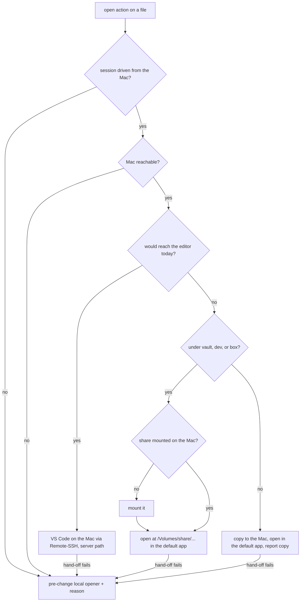
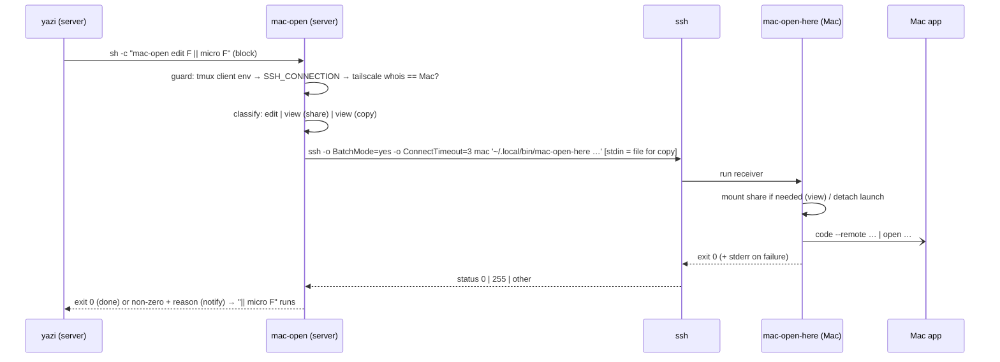

# Yazi Hand-off to the Mac - Plan

## Goal Capsule

- **Objective:** Opening a file in yazi on the Linux server lands it on the Mac the operator is sitting at. Text opens
  in an editor that is editing the server's file in place, so a save is a write to the server's disk. Anything else
  opens in the Mac's default application for its type. When the Mac cannot be reached, yazi behaves exactly as it does
  today, and says why.
- **Means:** A server-side dispatcher and a Mac-side receiver, one SSH hop apart (KTD1, KTD4); yazi's routing table
  decides edit versus view (KTD2); VS Code Remote-SSH for the edit route and the Mac's `open` for the view route, in
  place through the Taildrive share or from a streamed copy (KTD6, KTD8).
- **Authority:** Requirements govern behavior. KTDs govern mechanism. The observed behavior on the two live machines
  wins over any doc or memory claim; where a solutions doc disagrees with a live measurement, the doc is what gets
  rewritten.
- **Execution profile:** Two bash scripts, a yazi config change, and bats suites that stub every external command, so CI
  on Linux proves the routing. Proof of the product outcome is measurement on the live machines with the operator at the
  Mac (U1 first, the acceptance examples last).
- **Stop conditions:** Stop and ask if U1 shows that a GUI app cannot be launched from an SSH session even with a
  console user logged in, if `open` of a share path fails after the Remote Login full-disk-access setting is on, or if a
  Taildrive mount returns 403 (a tailnet policy problem, not this plan's).
- **Tail ownership:** The change merges to `dev` by PR. Deploying is `git pull` plus `scripts/stow-deploy local yazi` on
  both machines; the Mac must have the receiver deployed before the server's dispatcher is useful. The live learnings
  from U1 are captured in `docs/solutions/` with `sd-commit-doc` once the PR lands.
- **Open blockers:** None.

---

## Product Contract

### Summary

yazi's ordinary open action on the server becomes Mac-first. Files that reach the editor today go to VS Code on the Mac
through Remote-SSH, editing the server's file in place. Every other file (PDFs, images, audio, video, office documents)
opens on the Mac with its default app, in place at the Taildrive mount when it lives under `vault`, `dev`, or `box`,
from a copy when it does not. The hand-off only happens when the yazi session is being driven from that Mac over SSH.
Both routes return control to yazi as soon as the Mac has accepted the hand-off and fall back to the current local
opener, with the reason shown, whenever the session is not from the Mac, the Mac is unreachable, or the hand-off fails.

### Problem Frame

The server is headless and TTY-only, and the operator reaches it from the Mac through tmux. yazi there can show text and
nothing else: a PDF is a `pdftotext` dump in micro, an image or video has no opener at all, and markdown is edited in
micro rather than in the GUI editors on the Mac. Those editors already know the server: VS Code and Cursor have
connected through Remote-SSH before, and Obsidian on the Mac opens a vault that lives on the server's Taildrive `dev`
share. What is missing is the hop from a highlighted file in yazi to that file in the right Mac app, so today every such
open is a manual navigation on the Mac, or does not happen.

### Key Decisions

- **Text edits through VS Code Remote-SSH.** The editor's server process runs on the Linux host, so saves are local
  writes and git, terminal, and file watching work as if the file were local; no mount has to stay alive.
  (session-settled: user-directed — chosen over Cursor, over Obsidian through the Taildrive mount, over two-way sync,
  and over an scp round-trip: only Remote-SSH works for any path on the server with direct saves.) Governs R1, R2, R3.
- **Every file that reaches the editor goes Mac-first, with no type filter and no new key.** The operator uses `Enter`
  and `o` interchangeably as "open in the editor"; both are yazi's `open` action on a file. (session-settled:
  user-directed — chosen over a markdown-only default.) Governs R1, R8.
- **Non-text files open in the Mac's default app, in place when a share holds them, mounting the share on demand.**
  Annotations and edits on shared files must write back to the server; only files outside every share are copies.
  (session-settled: user-directed — chosen over copy-always: in-place viewing costs a mount check and a share-root
  table, and keeps edits.) Governs R4, R5, R6, R7.
- **Fire-and-forget.** yazi returns as soon as the hand-off is accepted; there is no "editor closed" signal, which is
  the natural contract for a GUI app on another machine. (session-settled: user-approved — proposed with the
  missing-signal tradeoff shown.) Governs R9.
- **Fallback is the pre-change opener, never a silent no-op.** Governs R11, R12.
- **Route only when this yazi session is driven from the Mac.** The SSH client behind the terminal yazi is running in
  must be the Mac; a yazi on the server console or attached from another device keeps today's local behavior. The
  operator asked for this guard during planning; its examined cost is one local lookup per hand-off, and it doubles as
  the reachability check, since a Mac that is holding an SSH session to the server is on the tailnet. Governs R14.



### Requirements

**Edit route (text)**

- R1. Any file that yazi would hand to the editor today opens in VS Code on the Mac through Remote-SSH targeting the
  server, addressed by its server path.
- R2. A save in that tab writes the server's file directly; no copy, sync, or mount is involved.
- R3. If VS Code is not running on the Mac, the hand-off starts it; when a window already connected to the server
  exists, the file opens there rather than in a new window.

**View route (everything else)**

- R4. Any file yazi would not hand to the editor, including PDFs (which today have their own text view), images, audio,
  video, office documents, and other binaries, opens on the Mac with the Mac's default application for that type.
- R5. When the file lives under a Taildrive share root (`vault` for `~/obsidian-vault`, `dev` for `~/dev`, `box` for
  `~/box`), it opens at that share's mount path on the Mac, so changes made there land on the server's file.
- R6. When that share is not mounted on the Mac, the hand-off mounts it first, following the repo's existing mount
  helper and its `/Volumes/<share>` convention, then opens the file.
- R7. When the file lives outside every share root, it is copied to the Mac and opened there; yazi reports that a copy
  was opened, since changes to it do not write back.

**Keys and selection**

- R8. The existing open action (`Enter`, `o`) triggers the hand-off; no new keybinding is added, and the `O` picker
  still offers the local editor.
- R9. The hand-off returns control to yazi as soon as the Mac has accepted it; yazi never blocks while the Mac app has
  the file open.
- R10. Several selected files hand off in one action, each routed by its own type.

**Fallback and reporting**

- R11. When the Mac is unreachable within a short bound (about 3 s), or the hand-off itself fails, the file opens with
  the opener it had before this change.
- R12. Every fallback shows its reason in yazi (unreachable versus hand-off failure), so a silent no-op never happens.
- R13. The hand-off does not depend on `code` being on the Mac's `PATH` or on the Mac's interactive shell configuration;
  it addresses the editor by its application bundle.
- R14. The hand-off runs only when the SSH connection driving the yazi session comes from the Mac; from the server
  console, or from any other client, the file opens with the opener it had before this change and yazi says the session
  is not from the Mac.

### Key Flows

- F1. Edit a note on the Mac
  - **Trigger:** `Enter` on `inbox/todo.md` under the vault in yazi on the server.
  - **Steps:** The hand-off probes the Mac, asks it to open the server path through Remote-SSH, and returns; VS Code
    (started if needed) shows the tab in its server-connected window; the operator edits and saves.
  - **Outcome:** The server's file has the change the moment the save completes; yazi was already back at the listing.
  - **Covered by:** R1, R2, R3, R8, R9.
- F2. Read and annotate a PDF that lives under `~/dev`
  - **Trigger:** `Enter` on `~/dev/foo/report.pdf`.
  - **Steps:** Probe; the path resolves to the `dev` share; the share is not mounted, so the hand-off mounts it, then
    opens `/Volumes/dev/foo/report.pdf`; Preview (or whatever owns PDFs) opens it.
  - **Outcome:** An annotation saved in Preview is in the server's file.
  - **Covered by:** R4, R5, R6, R9.
- F3. Look at a screenshot outside any share
  - **Trigger:** `Enter` on `/tmp/shot.png`.
  - **Steps:** Probe; no share root matches; the file is copied to the Mac and opened with the default image app; yazi
    shows that a copy was opened.
  - **Outcome:** The image is on screen; the server's file is untouched.
  - **Covered by:** R4, R7, R9.
- F4. Mac cannot be dialed back
  - **Trigger:** `Enter` on `notes.md` from the session driven by the Mac, while the Mac's Remote Login is off (or its
    SSH port is otherwise unreachable from the server).
  - **Steps:** The dial fails within its bound; the pre-change opener runs; yazi shows the reason.
  - **Outcome:** micro has the file within a few seconds, as before the change.
  - **Covered by:** R11, R12.

### Acceptance Examples

- AE1. **Covers R1, R2, R9.** Given VS Code is running on the Mac, when the operator presses `Enter` on
  `~/obsidian-vault/inbox/todo.md`, then the yazi prompt is usable before the tab appears, a tab for `todo.md` opens in
  a window connected to the server, and after an edit and save, reading the file on the server shows the change.
- AE2. **Covers R3.** Given VS Code is not running on the Mac, when the operator opens a text file, then VS Code
  launches and the tab appears in a server-connected window.
- AE3. **Covers R4, R5, R6.** Given `/Volumes/dev` is not mounted, when the operator opens `~/dev/foo/report.pdf`, then
  the share mounts and the Mac's PDF app opens `/Volumes/dev/foo/report.pdf`; a saved annotation changes the server's
  file.
- AE4. **Covers R7.** Given `/tmp/shot.png`, when the operator opens it, then the Mac's image app shows it from a copy
  and yazi reports that a copy was opened.
- AE5. **Covers R11, R12.** Given the operator's session comes from the Mac but the Mac's Remote Login is off, when the
  operator opens `notes.md`, then within about 3 s micro opens it locally and yazi shows that the Mac was unreachable.
- AE6. **Covers R11, R12.** Given the Mac is reachable but the editor command fails on it, when the operator opens
  `notes.md`, then micro opens it locally and yazi shows the failure line.
- AE7. **Covers R8.** Given `notes.md`, when the operator presses `O`, then the picker still lists the local editor and
  choosing it opens micro.
- AE8. **Covers R10.** Given three selected `.md` files, when the operator presses `Enter`, then all three open on the
  Mac from one action.
- AE9. **Covers R14.** Given yazi is running in a tmux session whose current client attached from a device other than
  the Mac (or from the server console), when the operator opens `notes.md`, then micro opens it locally, nothing is sent
  to the Mac, and yazi says the session is not from the Mac.

### Success Criteria

- Warm hand-off (VS Code running, share mounted): yazi is interactive again within 1.5 s and the file is on the Mac's
  screen within 3 s. A cold SSH round trip from the server to the Mac measured 0.83–1.01 s on 2026-09-22 (three
  samples), about 0.19 s of it the Mac's zsh loading the dotfiles profile for the remote command.
- Cold hand-off (VS Code not running, or share not mounted): the file is on screen within 15 s with no operator action
  on the Mac.
- No silent path: every outcome that is not "file is open on the Mac" produces a visible line in yazi.
- Done means measured on both live machines, per the repo's rule that a green suite is not evidence: an edit saved on
  the Mac read back on the server, a PDF opened in place, a copy reported, and a forced fallback observed.
- Routing and fallback logic is covered by bats with `ssh` stubbed, so CI on Linux exercises both branches without a
  Mac.

### Scope Boundaries

Deferred for later:

- Obsidian for vault notes through the Taildrive mount; the picker is where it would slot in.
- A zero-hop shortcut that pushes the file into an already-connected Remote-SSH window through the editor's socket on
  the server, skipping the SSH hop.
- Opening a directory as a remote folder window.
- Making `code` available on the Mac's `PATH`. Related drift, also deferred: `stow/shell/dot-profile` selects `code`
  without `--wait` and only when `code` is on `PATH`, while
  `docs/solutions/configuration-fixes/cross-platform-editor-configuration-via-editor-env-var.md` documents `code
  --wait`.

Outside this work:

- Two-way sync of any root (mutagen, syncthing, rclone bisync).
- An scp round-trip that blocks yazi until the Mac editor closes the file.
- Zed, or Cursor as the target editor; a later config switch could add Cursor since it carries its own Remote-SSH.

### Deferred to Follow-Up Work

- Restoring a direct `O` picker entry for the local PDF text view while the Mac is reachable. U4 folds the existing
  `pdftotext` view into the Mac-first entry's fallback rather than keeping it as a second picker entry, so it stays one
  line of config; a separate entry can come back later if the picker route is missed.
- Fixing the multi-file limitation of the existing PDF text view (`pdftotext` receives every selected path as one
  argument list). It predates this work and stays as is here.

### Dependencies / Assumptions

- SSH from the server to the Mac and from the Mac to the server both succeed without prompts through the aliases in the
  repo's SSH config (verified 2026-09-18, `BatchMode=yes`). Both aliases carry the tailnet FQDN as `HostName`, which
  matters because bare MagicDNS short names resolve slowly on macOS
  (`docs/solutions/developer-experience/tailscale-fqdn-vs-short-name-macos-2026-05-07.md`).
- VS Code 1.137 with `ms-vscode-remote.remote-ssh` is installed on the Mac, and the server carries `~/.vscode-server`
  from prior connections (verified).
- The VS Code CLI at the application bundle reaches the running app from an SSH session (verified with `--status`).
  Starting the app from an SSH session when it is not running is settled by U1.
- The server's Taildrive shares and roots: `vault` → `~/obsidian-vault`, `dev` → `~/dev`, `box` → `~/box` (from
  `tailscale drive list`). The repo's mount helper mounts a named share from an SSH session on the Mac (verified:
  `/Volumes/dev` in 0.8 s).
- macOS denies the SSH session read access to a mounted share (`ls /Volumes/dev` returns "Operation not permitted"), so
  mounted-state comes from the mount table and the hand-off never stats the file on the Mac side; GUI apps read the
  share under their own permission, as Obsidian on the Mac already does. Whether `open` itself can take such a path from
  an SSH session is settled by U1.
- The Mac's non-interactive shell does not have `code` on `PATH`, only Homebrew, `~/.local/bin`, and `bun`; R13 exists
  because of this.
- The Mac accepts the shared SSH key as well as this server's own key (verified 2026-09-22). Any other Linux host that
  carries the shared key therefore gets the hand-off too, provided its `hostname -s` matches a `Host` alias in the Mac's
  SSH config (or `MAC_OPEN_SERVER_ALIAS` names one).
- An SSH session on the Mac cannot list `~/Downloads` or `/Volumes/<share>` ("Operation not permitted") but could create
  a file in `~/Downloads` (verified 2026-09-22). Whether the copy route's rename, byte-count check, and `open` work
  there without Remote Login's "Allow full disk access for remote users" is settled by U1.
- yazi reads its configuration only at startup, so an instance already running in a tmux pane keeps the old openers
  until it is restarted ([yazi #1716](https://github.com/sxyazi/yazi/issues/1716)).
- The server's `~/.profile` stays POSIX: Remote-SSH reaches the server through `sh -lc`, which is dash on Ubuntu
  (`docs/solutions/logic-errors/bash-only-syntax-in-dot-profile-aborts-dash-login-shells-and-truncates-path.md`). This
  plan adds nothing to `.profile`.

### Outstanding Questions

Deferred to implementation (U1 answers each before U2 starts):

- Whether `ya emit notify:push --title=… --content=… --level=warn --timeout=…` reaches the running yazi from an opener
  process, and whether yazi already surfaces a failed blocking opener's stderr on its own.
- Whether the bundle CLI launches VS Code from an SSH session when no instance is running, or whether the receiver needs
  `open -b com.microsoft.VSCode --args …` for the cold start.
- Whether `open /Volumes/<share>/<file>` works from an SSH session as is, or only after Remote Login's "allow full disk
  access for remote users" is on.

### Sources / Research

- `stow/yazi/dot-config/yazi/yazi.toml`: the `edit` opener (`$EDITOR %s`, `block = true`), the `read-pdf` opener, and
  `[open] prepend_rules`.
- `stow/yazi/dot-config/yazi/keymap.toml`: `Enter` runs the `smart-enter` plugin, which on a file is the `open` action.
- `stow/ssh/dot-ssh/config`: the host blocks for the Mac and for the server.
- `config/shell/taildrive.sh`: `taildrive-mount <share>` and the `/Volumes/<share>` convention;
  `stow/tmuxinator/dot-config/tmuxinator/vault.yml` and the README vault section for the existing Linux-path to
  mount-path mirror.
- `stow/zsh/dot-zshenv` sources `~/.profile` for non-interactive zsh, so a command run on the Mac over SSH sees the
  dotfiles environment; `tests/shell-path-matrix.bats` pins that shape.
- `stow/shell/dot-profile`: the per-platform `$EDITOR` selection.
- `tests/taildrive.bats` and `scripts/run-tests`: the stubbing and suite conventions a new helper's tests follow;
  `stow/local/dot-local/bin/` is where user-level executables live and deploys on both platforms.
- Prior art for opening a remote file in a local app, with the tradeoffs this plan chose against: rmate over a
  `RemoteForward` tunnel ([aurora/rmate](https://github.com/aurora/rmate)), kitty's `remote_file` and `edit-in-kitty`
  ([kitty docs](https://sw.kovidgoyal.net/kitty/kittens/remote_file/)), and superbrothers/opener for URLs
  ([opener](https://github.com/superbrothers/opener)). All three ride the operator's existing SSH session; none opens a
  server path in place in VS Code with direct saves.
- Live probes on 2026-09-18: Mac editors and their CLIs live at `/Applications/Visual Studio
  Code.app/Contents/Resources/app/bin/code` and `/Applications/Cursor.app/Contents/Resources/app/bin/cursor`; Obsidian
  on the Mac has a vault registered at `/Volumes/dev/meum-control/Meum`; the tmux client attached to the server is the
  Mac.

---

## Planning Contract

Product Contract preservation: changed: R14 and AE9 added at the operator's request during planning (route only when the
session is driven from the Mac), with the matching Key Decision and Summary sentence. Otherwise restructured, no scope
change: R9's "immediately" is stated as "as soon as the Mac has accepted the hand-off" so it matches KTD3; the
Outstanding Questions that planning resolved are now KTD4, KTD5, KTD6, and KTD7, and the section keeps only what U1
settles; the two "Validate" assumptions point at U1. Existing R-IDs, F-IDs, and AE-IDs are unchanged.

### Key Technical Decisions

- KTD1. **Two scripts, one per side, both in `stow/local/dot-local/bin/`.** `mac-open` runs on the server (called by
  yazi) and `mac-open-here` runs on the Mac (called by `mac-open` over SSH). The Mac side owns everything macOS-specific
  (the bundle CLI, `taildrive-mount`, `open`, process detachment) and the server side owns classification, share
  mapping, the SSH hop, fallback status, and reporting. Rationale: each half is testable with stubs on Linux CI, and
  neither embeds shell for the other machine. `stow/local` deploys on both platforms (`scripts/stow-deploy`), so one PR
  ships both. The remote command names the receiver by explicit path (`~/.local/bin/mac-open-here`, expanded by the
  remote shell) so R13 holds even if the Mac's `.zshenv` chain is broken.
- KTD2. **yazi's `[open]` rules become an explicit table and route by MIME; `mac-open` has two subcommands, `edit` and
  `view`.** The config declares the full rule table (replacing yazi's built-in default rules rather than prepending to
  them) so a catch-all `url = "*"` can send unknown binaries to `mac-view` without shadowing the text rules that must
  keep pointing at `edit`. Every Mac-first opener entry carries `for = "linux"`, because `stow/yazi` deploys to the Mac
  too and the same file must not hand off to itself there. The `folder/*` rule points at a local-only `edit-local`
  opener (the plain `$EDITOR` entry), so `o` on a directory never reaches `mac-open` and directory handling stays
  exactly as today, with no reason line or notification; `mac-open` still refuses directories for a hand-run call.
  Governs R1, R4, R8, R10. (session-settled: user-approved — explicit table with catch-all chosen over enumerating known
  binary types; unknowns would otherwise stay on today's dead `open`.)
- KTD3. **Blocking hand-off, no `orphan`.** Opener entries use `block = true` with the shape `mac-open edit %s ||
  ${EDITOR:-micro} %s`: yazi runs the command through `sh -c` with stdio inherited, waits for it, and the exit status
  drives the `||` fallback, which is the only way a TUI fallback like micro can take the terminal. The hand-off itself
  is short (the SSH round trip, about 1 s warm, bounded by the 3 s connect timeout), and the Mac side detaches the GUI
  launch so `ssh` returns; yazi therefore never waits on the app (R9). A bare `%s` makes yazi pass every selected file
  in one invocation (R10). Governs R8, R9, R10, R11.
- KTD4. **One SSH invocation per hand-off, its exit status is the probe.** `ssh -n -o BatchMode=yes -o ConnectTimeout=3
  <mac-alias> '<receiver command>'`, wrapped in a hard `timeout` so a post-handshake stall cannot block yazi: 20 s for
  the edit and view routes, and 20 s plus 1 s per MiB of the file for the copy route, whose duration grows with size.
  `-n` keeps `ssh` off the inherited terminal, because `timeout` runs it in its own process group where a read of the
  TTY would stop it until the bound fires; the copy route drops `-n` since it feeds the file on stdin. Exit 255 →
  `unreachable: <ssh's first stderr line>` (one exit code covers a sleeping Mac, a refused key, and a changed host key,
  so the line quotes ssh); 124 → `timed-out`; 127 (the Mac's shell found no receiver) → `receiver-missing`; 2 (the
  receiver's usage error, which is what an older receiver returns for a newer call) → `receiver-outdated`; any other
  non-zero → `remote-failed: <first stderr line from the Mac>`. Exit 127 and exit 2 were observed through SSH on
  2026-09-22. Rationale: a separate probe would double the round trip for no extra information, KTD9 already establishes
  that the Mac is on the tailnet before anything is dialed, and the existing bounded-SSH shape in
  `scripts/claude-token-totals` is the repo's precedent. The Mac target is the SSH alias (env override `MAC_OPEN_HOST`);
  the server's own alias for `ssh-remote+` is `hostname -s` (env override `MAC_OPEN_SERVER_ALIAS`). Governs R11, R12.
- KTD5. **The share-root table comes from `tailscale drive list` at run time.** `mac-open view` parses the `name path
  as` table (header validated, whitespace-split), resolves the file with `realpath`, and picks the longest matching
  root; a parse failure or no match means the copy route with the reason recorded. Rationale: the daemon's own list is
  the single source of truth and a new share needs no code change; the parse is guarded because the command is alpha and
  has no JSON output. Governs R5, R7.
- KTD6. **Copies stream through the same SSH command's stdin, with the byte count as the completeness check.** For a
  file outside every share, `mac-open` runs `mac-open-here receive <basename> <size-in-bytes>` on the Mac with the file
  on stdin; the receiver writes stdin to `~/Downloads/mac-open/<epoch>-<basename>.part`, compares the bytes written with
  the size argument, and on a mismatch deletes the part file and fails with `short-copy`; on a match it renames the file
  into place and opens it. Nothing in that folder is ever deleted automatically, because a copy the operator annotated
  and saved on the Mac lives only there (session-settled: user-directed — chosen over a hidden `~/.cache/mac-open`
  pruned after a day, and over a visible folder pruned daily: a saved edit to a copy must stay findable and must not
  disappear). Before streaming, `mac-open` prints `mac-open: copying <name> (<size>) to the Mac` to the terminal yazi
  hands to the blocking opener, so a long copy reads as an expected wait (session-settled: user-directed — chosen over
  backgrounding the transfer and over a silent stream: backgrounding would lose the local PDF fallback on failure; about
  5 MiB/s was measured, so 100 MiB blocks for about 19 s). One invocation per copied file. Rationale: no `scp`, no mkdir
  round trip, and no second transport to stub; the size check exists because a `timeout` that cuts the stream reaches
  the receiver as a plain EOF, which would otherwise open a truncated file. Governs R7, R9.
- KTD7. **Reasons are a closed set, printed on stderr and pushed as a yazi notification.** `mac-open` prints `mac-open:
  <reason>` where reason is one of `not-from-mac: …`, `unreachable`, `timed-out`, `remote-failed: …`, `short-copy`,
  `not-a-file`, `receiver-missing`, `receiver-outdated`, and, on success of the copy route, an info notice `opened a
  copy at ~/Downloads/mac-open/<file> on the Mac; edits there do not write back`. Every reason line ends with one clause
  naming the next step (session-settled: user-directed — for the reasons a first run can hit, chosen to meet the
  under-2-minute setup target over documenting the fixes only in the README; for the rest, chosen over leaving them as
  bare status codes). `receiver-missing` and `receiver-outdated` say to run `git pull && scripts/stow-deploy local` on
  the Mac; the symptom U1 records for a Remote Login file-access refusal maps to a line naming System Settings → General
  → Sharing → Remote Login → "Allow full disk access for remote users"; `not-from-mac` names what decided it (the server
  console, or the tailnet node it saw) and says the hand-off runs only from a session attached from `MAC_OPEN_HOST`;
  `unreachable` says to check that the Mac is awake with Remote Login on; `timed-out` says the Mac stopped answering
  after connecting; `short-copy` gives the bytes that arrived against the bytes expected and says to retry or move the
  file under a share to open it in place; `not-a-file` says directories open locally. When `YAZI_ID` is in the
  environment, the same text goes through `ya emit notify:push --title=mac-open --content=… --level=warn --timeout=8`
  (info level for the copy notice); U1 confirms that form, and if yazi already reports a failed blocking opener's stderr
  on its own, the explicit emit is dropped. Governs R7, R12.
- KTD8. **Mac-side invariants.** VS Code is addressed at `/Applications/Visual Studio
  Code.app/Contents/Resources/app/bin/code` (env override `MAC_OPEN_CODE_CLI`) as `--reuse-window --remote
  ssh-remote+<server-alias> <paths…>`, which VS Code treats as files when they carry an extension and for which
  `--file-uri vscode-remote://ssh-remote+<alias><path>` is the unambiguous form for extension-less files. Mounting is
  `zsh -c 'taildrive-mount <share>'`, idempotent and already exercised by
  `stow/tmuxinator/dot-config/tmuxinator/vault.yml`. Every launched GUI process is started with stdin, stdout, and
  stderr detached and disowned, so the SSH session ends when the receiver exits rather than when the app does. The
  receiver never stats a path under `/Volumes`. A cold-start `open -b com.microsoft.VSCode --args …` branch exists only
  if U1 shows the CLI cannot launch the app. Governs R3, R6, R13.
- KTD9. **The client-origin guard reads the SSH connection behind the terminal and asks Tailscale who it is.** Before
  classifying anything, `mac-open` finds the `SSH_CONNECTION` of the session that is driving yazi: inside tmux, from the
  environment of the most recently active client attached to the pane's own session (`tmux list-clients` scoped to that
  session, reading `client_activity` and `client_pid`, then that process's environment under `/proc`, which is readable
  because it is the same user); `client_activity` has one-second resolution, so when several clients of the session tie
  for most recent, the hand-off proceeds if any tied client resolves to the Mac. Outside tmux, the guard reads its own
  environment. The connection's client address is resolved with `tailscale whois --json`, and the hand-off proceeds only
  when the node's computed name equals the Mac alias (`MAC_OPEN_HOST`, which is also the node's name on the tailnet,
  verified 2026-09-18). No `SSH_CONNECTION` means the server console; a different node means another client; both are
  `not-from-mac` reasons in KTD7's closed set, each carrying the detail that decided it. Rationale: the tmux client's
  environment is the live connection, whereas the pane shell's inherited `SSH_CONNECTION` is frozen at pane creation and
  goes stale across re-attaches; `tailscale whois` resolves an address to a node in one local call with no table to
  maintain. Governs R11, R14.

### High-Level Technical Design

The hand-off is one request over SSH with the fallback decided on the server side from the exit status.



Routing table declared in `yazi.toml` (openers listed in order; `open` runs the first, `O` lists them all; entries
marked Mac-first exist only `for = "linux"`):

| Rule (`mime` / `url`)                                                              | Openers                        | Mac-first entry                                                                                                                         |
| ---------------------------------------------------------------------------------- | ------------------------------ | --------------------------------------------------------------------------------------------------------------------------------------- |
| `folder/*`                                                                         | `edit-local`, `open`, `reveal` | none; `edit-local` is the plain `$EDITOR` entry, so directories open as today                                                           |
| `text/*`, `application/{json,ndjson,javascript,wine-extension-ini}`, `inode/empty` | `edit`, `reveal`               | `mac-open edit %s \|\| ${EDITOR:-micro} %s`                                                                                             |
| `application/pdf`                                                                  | `read-pdf`                     | `mac-open view %s \|\| { …; }` around the existing `pdftotext` → micro view (brace-grouped, since `\|\|` and `&&` bind equally in `sh`) |
| `image/*`                                                                          | `mac-view`, `open`, `reveal`   | `mac-open view %s`                                                                                                                      |
| `{audio,video}/*`                                                                  | `mac-view`, `play`, `reveal`   | `mac-open view %s`                                                                                                                      |
| archives (yazi's default list)                                                     | `extract`, `reveal`            | none                                                                                                                                    |
| `vfs/{absent,stale}`                                                               | `download`                     | none (yazi's undownloaded-remote-file route, kept from the preset)                                                                      |
| `trash/**`                                                                         | `open`, `trash`                | none (yazi's trash-browser route, kept from the preset)                                                                                 |
| `*` (catch-all)                                                                    | `mac-view`, `open`, `reveal`   | `mac-open view %s`                                                                                                                      |

### Assumptions

- A console user is logged in on the Mac whenever the hand-off is used; that is what gives an SSH session's child
  processes a GUI session to launch into.
- The Mac and every Linux server run the same version of dotfiles (operator-stated, 2026-09-22), so the two scripts
  change together; `receiver-missing` and `receiver-outdated` cover only the minutes of a rollout.
- `hostname -s` on the server equals the `Host` alias the Mac's SSH config uses for it. If a machine ever differs,
  `MAC_OPEN_SERVER_ALIAS` covers it.
- `jaq` (already a repo dependency) or `jq` is available on the server to read `tailscale whois --json`; when neither
  is, the guard fails closed with a `not-from-mac` reason naming the missing tool.
- Tailscale SSH sets `SSH_CONNECTION` for the sessions it serves, as OpenSSH does; the tmux server's captured
  environment on the server already shows one from the Mac's tailnet address. U1 confirms it is present in the tmux
  client's own environment.

### Risks & Dependencies

- **A Taildrive mount can be refused by tailnet policy, not by the mount helper.** The WebDAV endpoint answers 403
  `taildrive not permitted` when the policy lacks the `tailscale.com/cap/drive` grant for that share
  (`docs/solutions/configuration-fixes/taildrive-requires-cap-drive-grant-2026-05-15.md`). The receiver forwards the
  mount helper's first stderr line unchanged, so the reason yazi shows names the policy; fixing the grant is outside
  this plan and is a stop condition.
- **The copy route puts server files on the laptop's disk.** Every file opened from outside a share lands in
  `~/Downloads/mac-open` on the Mac and stays until the operator deletes it (KTD6). The route is what R7 asks for; the
  notice on each copy names the folder, and nothing copies without the operator pressing open on it.
- **A stalled receiver holds yazi for the hard bound.** `ConnectTimeout=3` covers the asleep-Mac case; a hang after the
  handshake is cut by the 20 s `timeout` (KTD4), which is also the longest yazi can be blocked. The `Host *` keep-alive
  in the SSH config (60 s) is too slow to matter here, so the hard bound is the guarantee.
- **GUI launch from an SSH session depends on a logged-in console user.** A locked screen still has one; a logged-out
  Mac does not, and the launch then fails with a reason rather than opening anything. U1 records the observed behavior
  and the fallback covers the rest.
- **An explicit routing table stops tracking yazi's presets.** Replacing the default rules (KTD2) means a future yazi
  release that adds a MIME rule does not change routing here. The `yazi-config` test pins the table and the config's
  comment names the upstream preset to diff against on a yazi upgrade.
- **The guard depends on tmux's idea of the current client.** With two clients attached, the most recently active one
  decides (KTD9); a wrong pick refuses the hand-off with a reason rather than sending anything to the wrong machine. U1
  step 6 checks that a re-attach updates the pick.
- **`tailscale drive list` is alpha and may change shape.** The parser fails closed on an unexpected header (KTD5):
  every file then takes the copy route with a reason that names the table, and the suite pins the current header so
  drift is caught by a test rather than in use.
- **Remote-SSH can prompt on the Mac, invisibly to the server.** A first connection or a changed host key makes VS Code
  ask on the Mac; the dispatcher has already returned success by then. The cold-hand-off criterion (file on screen
  within 15 s with no operator action) is measured live so such a prompt shows up as a Mac-side SSH configuration issue,
  not as a silent failure.

### Sequencing

U1 runs first and alone, with the operator present; its findings can change KTD7 and KTD8 before any script is written.
U2 (receiver) precedes U3 (dispatcher) because U3's remote command shape is the receiver's contract. U4 wires yazi once
both scripts exist. U5 documents last. Deployment to the Mac (`git pull`, `scripts/stow-deploy local yazi`) happens
before the live acceptance pass.

---

## Implementation Units

### U1. Live spike on both machines

- **Goal:** Settle the three deferred-to-implementation questions with observed output, so KTD7, KTD8, and KTD9 are
  facts before U2.
- **Requirements:** R3, R6, R12, R13; the "Validate" assumptions.
- **Dependencies:** None. The operator must be at the Mac.
- **Files:** None in the repo. Observations go into the PR body and, after landing, a `docs/solutions/` entry.
- **Approach:**
  1. From a yazi subshell on the server (so `YAZI_ID` is inherited), run `ya emit notify:push --title=mac-open
     --content=test --level=warn --timeout=5` and record whether a notification appears, whether one emitted while a
     `block = true` opener holds the terminal is still shown after yazi resumes, and whether its timeout counts from
     delivery or from display; then configure a throwaway `block = true` opener that exits 1 with a stderr line and
     record whether yazi shows anything on its own.
  2. From the server with VS Code running on the Mac: `ssh <mac> '<bundle cli> --reuse-window --remote
     ssh-remote+<server> <path to a scratch .md>'`; record whether the tab opens and whether `ssh` returns promptly or
     hangs until the app exits (this decides the detach shape in U2).
  3. Ask the operator to quit VS Code, repeat step 2, and record whether the app launches; if not, repeat with `open -b
     com.microsoft.VSCode --args --reuse-window --remote …`.
  4. With `/Volumes/dev` mounted, `ssh <mac> 'open /Volumes/dev/<an existing pdf>'`; if it reports the file as missing,
     turn on System Settings → General → Sharing → Remote Login → "Allow full disk access for remote users", and repeat.
  5. Record `man open` on the Mac for `-j`, in case a hidden launch is wanted later.
  6. From the tmux session the operator drives from the Mac: list the clients with `client_activity` and `client_pid`,
     read `SSH_CONNECTION` from the most recent client's environment under `/proc`, and confirm `tailscale whois --json`
     on its client address names the Mac; then attach the same session from the server console (or a second device, if
     one is at hand) and confirm the most recent client changes accordingly.
  7. From the server, stream a small file into `ssh <mac> 'mkdir -p ~/Downloads/mac-open && cat >
     ~/Downloads/mac-open/probe.part'`, then over SSH rename it, count its bytes, and `open` it; record which of those
     steps macOS refuses without Remote Login's "Allow full disk access for remote users", and the exact message each
     refusal prints (KTD6, KTD7).
- **Execution note:** This unit is measurement only; no repo code changes. Each observation is quoted verbatim into the
  PR body.
- **Test scenarios:** Test expectation: none -- the unit produces observations, not behavior.
- **Verification:** Each of the seven steps has a recorded outcome; KTD7, KTD8, and KTD9 are updated in this plan where
  an outcome contradicts them.

### U2. Mac-side receiver `mac-open-here`

- **Goal:** A bash script on the Mac that performs one of three actions on request (`edit`, `view`, `receive`) and
  returns as soon as the app has been asked to open the file.
- **Requirements:** R3, R6, R7, R13; KTD1, KTD6, KTD8.
- **Dependencies:** U1.
- **Files:** `stow/local/dot-local/bin/mac-open-here` (create), `tests/mac-open-here.bats` (create).
- **Approach:**
  1. `#!/usr/bin/env bash`, `set -euo pipefail`, a `die` that prints `mac-open-here: <message>` on stderr and exits 1,
     usage on a bad subcommand with exit 2, and a Darwin guard (`uname -s`) so the script cannot run elsewhere.
  2. `edit <server-alias> <path>…`: resolve the CLI per KTD8, fail with `code-cli-missing: no VS Code CLI at <path>;
     install VS Code or set MAC_OPEN_CODE_CLI` if the path is not executable, and launch it detached with every path in
     one call.
  3. `view <share> <mac-path>…`: run `zsh -c 'taildrive-mount <share>'`; on failure die with its first stderr line; then
     `open` each path, detached. No stat of the paths.
  4. `receive <basename> <size-in-bytes>`: create `~/Downloads/mac-open` if missing, write stdin to
     `<epoch>-<basename>.part`, compare the bytes written with the size argument (KTD6), delete the part file and die
     with `short-copy` on a mismatch, otherwise rename it into place and `open` it detached. Any step that macOS refuses
     in the way U1 step 7 recorded dies with the Remote Login fix line from KTD7, as does a `view` whose `open` is
     refused in the way U1 step 4 recorded.
  5. Detachment is one helper used by all three: redirect stdin from `/dev/null`, stdout and stderr to `/dev/null`,
     background, `disown`.
- **Patterns to follow:** `stow/local/dot-local/bin/tmux-new-session` (shebang, strict mode, inline error convention);
  `stow/local/dot-local/bin/sd-commit-doc` for the `die` shape; `config/shell/taildrive.sh` for the mount helper's
  contract.
- **Test scenarios** (stubs via a PATH-prepended directory holding `open`, `zsh`, `uname`, and a fake CLI whose path is
  passed through `MAC_OPEN_CODE_CLI`; each stub appends its argv to a log file, per
  `docs/solutions/conventions/never-override-core-env-vars-in-tests-stub-collaborators.md`):
  - `edit srv /a.md /b.md` invokes the CLI once with `--reuse-window --remote ssh-remote+srv /a.md /b.md`.
  - `edit` with `MAC_OPEN_CODE_CLI` pointing at a missing file exits non-zero with `code-cli-missing` on stderr and
    invokes nothing.
  - `edit` returns within 2 s when the CLI stub sleeps 5 s while holding stdout open (detachment works).
  - `view dev /Volumes/dev/x.pdf` calls `zsh -c taildrive-mount dev` before `open /Volumes/dev/x.pdf`, in that order.
  - `view` when the mount stub exits 1 with a message exits non-zero, forwards that message on stderr, and never calls
    `open`.
  - `receive shot.png <exact size>` with those bytes on stdin writes an identical file under a cache dir rooted at a
    test `HOME`, leaves no `.part` file behind, then `open`s that exact path.
  - `receive shot.png <size larger than what arrives>` exits non-zero with `short-copy` on stderr, calls no `open`, and
    leaves no file in the cache dir.
  - `receive` leaves a pre-seeded two-day-old file in `~/Downloads/mac-open` untouched (nothing is pruned).
  - `receive` whose write, rename, or `open` stub fails with the refusal message U1 recorded exits non-zero with the
    Remote Login fix line on stderr.
  - Running on a non-Darwin `uname` exits non-zero with a clear message.
  - An unknown subcommand prints usage and exits 2.
- **Verification:** The suite is observed failing against an empty script before the implementation lands;
  `scripts/lint-shell --all` is clean; on the Mac, `~/.local/bin/mac-open-here edit <server> <scratch.md>` run over SSH
  opens the tab and returns.

### U3. Server-side dispatcher `mac-open`

- **Goal:** A bash script on the server that classifies, maps, dials the Mac once, reports, and exits non-zero whenever
  the caller's fallback should run.
- **Requirements:** R1, R5, R7, R10, R11, R12, R14; KTD1, KTD4, KTD5, KTD6, KTD7, KTD9.
- **Dependencies:** U2 (the remote command contract).
- **Files:** `stow/local/dot-local/bin/mac-open` (create), `tests/mac-open.bats` (create).
- **Approach:**
  1. Subcommands `edit <path>…` and `view <path>…`; a missing or unknown subcommand prints a one-line `usage:` on stderr
     and exits 2, as the repo's other bins do; `-h`/`--help` prints the same usage to stdout and exits 0. Anything that
     is not a regular file after `realpath` (directories included) is reported as `not-a-file` and exits non-zero
     without dialing.
  2. Client-origin guard per KTD9, before any classification or dialing: locate the driving `SSH_CONNECTION` (tmux
     client environment when `TMUX` is set, own environment otherwise), resolve its client address with `tailscale whois
     --json`, and stop with `not-from-mac` unless the node's computed name is `MAC_OPEN_HOST`.
  3. Reachability per KTD4: the single `timeout 20 ssh -n -o BatchMode=yes -o ConnectTimeout=3 "$MAC_OPEN_HOST" …` call
     whose status maps to the closed reason set; `-n` (stdin from `/dev/null`) is dropped only for the `receive` call,
     which carries the file on stdin.
  4. `edit`: one remote call, `~/.local/bin/mac-open-here edit <server-alias> <paths…>`, paths single-quoted for the
     remote shell.
  5. `view`: build the share table per KTD5, group paths by share, one remote `view <share>
     /Volumes/<share>/<relative>…` call per share; each path with no share goes through `receive <basename> <size>` with
     the file on stdin and the copy route's size-scaled `timeout` (KTD4, KTD6), followed by the info notice.
  6. Reporting per KTD7: stderr line always; `ya emit notify:push …` when `YAZI_ID` is set and U1 showed it works. The
     Mac-side deploy command that `receiver-missing` and `receiver-outdated` print is one constant in the script.
  7. Exit 0 only when every requested path was accepted by the Mac; otherwise non-zero after reporting, so the opener's
     `||` runs the local fallback for the whole selection.
- **Patterns to follow:** `scripts/claude-token-totals` for the bounded, non-interactive SSH call;
  `stow/local/dot-local/bin/op-ssh-sign-wrapper` for the "tried X, Y" remediation-style error text;
  `tests/tmux-new-session.bats` for PATH-directory stubs driven by env knobs.
- **Test scenarios** (stubs for `ssh`, `tailscale`, `tmux`, `ya`, and `timeout` in a PATH-prepended directory; the `ssh`
  stub records argv and stdin to a log and exits with `MAC_OPEN_TEST_SSH_EXIT`; fixture files and a fake share root live
  under `BATS_TEST_TMPDIR`; the `tailscale drive list` stub prints a table whose paths point at those fixtures, and
  `tailscale whois --json` answers from a canned map of address to name; for the guard, the test starts a real
  background `sleep` with a chosen `SSH_CONNECTION` in its environment and the `tmux` stub reports that process's pid as
  the most recent client, so the script reads a genuine `/proc` environment):
  - Covers AE9. With the tmux client's `SSH_CONNECTION` from an address `whois` maps to another node, the script exits
    non-zero with `not-from-mac` naming that node and makes no `ssh` call.
  - With no `TMUX` and no `SSH_CONNECTION` in its own environment, the script exits non-zero with `not-from-mac` naming
    the console and makes no `ssh` call.
  - With no `TMUX` and an `SSH_CONNECTION` that `whois` maps to the Mac, the hand-off proceeds.
  - With neither `jaq` nor `jq` on `PATH`, the guard fails closed with `not-from-mac` naming the missing tool.
  - A `tailscale whois` stub that exits non-zero makes the guard fail closed with `not-from-mac` and no `ssh` call.
  - With two tmux clients in the pane's session, the one with the higher `client_activity` decides; a client attached to
    a different session is ignored even when it is more recent.
  - With two clients of the session tied on `client_activity`, the hand-off proceeds when either resolves to the Mac.
  - Covers AE8. `edit a.md b.md c.md` produces one `ssh` call whose remote command names all three absolute paths and
    the server alias.
  - `edit "it's a note.md"` (a space and a single quote) reaches the remote command as one intact argument; the `ssh`
    stub re-parses the remote command with `zsh -c` and records the path it received.
  - `edit` on a directory exits non-zero with `not-a-file` and makes no `ssh` call.
  - `view <fixture under the fake dev root>/x.pdf` produces one `ssh` call `view dev /Volumes/dev/x.pdf` and no stdin
    payload.
  - `view` on a symlink whose target is under the fake root maps by the target, not the link.
  - `view` on a file under a nested share root (`/dev` and `/dev/sub` both shared) picks the longest root.
  - Covers AE4. `view /tmp/shot.png` (outside every root) produces a `receive shot.png <byte count of the fixture>` call
    with the file's bytes on stdin, a `timeout` argument scaled to that size, and an info notification naming
    `~/Downloads/mac-open`.
  - Before that `receive` call, stderr carries `mac-open: copying shot.png (<size>) to the Mac`.
  - `view` with two files under different shares produces two remote calls, one per share.
  - Covers AE5. `ssh` exit 255 with `Host key verification failed.` on its stderr → stderr `mac-open: unreachable: Host
    key verification failed.` plus the next-step clause, a warn notification, exit non-zero.
  - Each reason in KTD7's closed set, driven through its stub, ends with its next-step clause (one assertion per
    reason).
  - Covers AE6. `ssh` exit 1 with `mac-open-here: code-cli-missing` on stderr → stderr `mac-open: remote-failed:
    mac-open-here: code-cli-missing`, exit non-zero.
  - `timeout` status 124 → `timed-out`.
  - `ssh` exit 127 → `mac-open: receiver-missing` with the Mac-side deploy command on the same line.
  - `ssh` exit 2 → `mac-open: receiver-outdated` with the Mac-side deploy command on the same line.
  - `mac-open` with no arguments, or with `frobnicate`, prints `usage:` on stderr, exits 2, and makes no `ssh` call.
  - `mac-open --help` prints the usage to stdout and exits 0.
  - The `ssh` argv carries `-n` for `edit` and `view` calls and not for `receive`.
  - `tailscale drive list` output that fails the header check → every file takes the copy route and the reason mentions
    the table.
  - `MAC_OPEN_HOST` and `MAC_OPEN_SERVER_ALIAS` overrides appear in the `ssh` argv and the remote command.
  - A `ya` stub that exits non-zero leaves `mac-open`'s exit status and stderr line unchanged.
  - A `view` selection spanning a share and a copy, where the `receive` call fails, exits non-zero after reporting both
    outcomes, so the opener's fallback runs for the whole selection (step 7).
  - With `YAZI_ID` unset, no `ya` call is made; with it set, `ya emit notify:push` is called with `--title=`,
    `--content=`, `--level=` in the single-token form.
- **Verification:** Suite observed red before the implementation; `scripts/lint-shell --all` clean; from a plain shell
  on the server driven from the Mac, `mac-open edit <scratch.md>` opens the tab on the Mac and exits 0; from the server
  console it exits non-zero at once with `not-from-mac`; and with Remote Login turned off on the Mac it exits non-zero
  within 3 s with `unreachable`.

### U4. Wire yazi's openers and routing table

- **Goal:** yazi on the server routes every file through the Mac-first entries with the local opener as the `||`
  fallback and as a picker entry, and nothing changes for yazi on the Mac.
- **Requirements:** R1, R4, R8, R9, R10, R11; KTD2, KTD3.
- **Dependencies:** U2, U3.
- **Files:** `stow/yazi/dot-config/yazi/yazi.toml` (modify), `stow/yazi/dot-config/yazi/keymap.toml` (modify the comment
  table only), `tests/yazi-config.bats` (create).
- **Approach:**
  1. `[opener] edit`: a first entry `for = "linux"` running `mac-open edit %s || ${EDITOR:-micro} %s` with `block =
     true`, ahead of the existing `for = "unix"` `$EDITOR` entry (which is what the `O` picker offers, R8).
     Double-quoted TOML string per
     `docs/solutions/configuration-fixes/cross-platform-editor-configuration-via-editor-env-var.md`.
  2. `[opener] mac-view`: one `for = "linux"` entry, `mac-open view %s`, `block = true`. Alongside it, `[opener]
     edit-local`: the plain `$EDITOR %s` entry (`block = true`, `for = "unix"`), used only by the `folder/*` rule so
     directories keep today's behavior (KTD2).
  3. `[opener] read-pdf`: the Linux entry becomes `mac-open view %s || { …; }` with the existing `pdftotext` → micro
     command inside the braces; the grouping is required because `||` and `&&` bind equally and left to right in `sh`,
     so an ungrouped chain would run `pdftotext` after every successful hand-off. The macOS entry is unchanged.
  4. `[open] rules` replaces `prepend_rules` with the table in High-Level Technical Design, including the preset's
     `vfs/{absent,stale}` → `download` and `trash/**` → `open`, `trash` rows ahead of the catch-all, with a comment
     stating the one reason the table is explicit (the catch-all must not shadow the text rules) and naming the upstream
     preset file to diff against.
  5. Every new opener entry carries a `desc`, as every existing entry in the file does, so the `O` picker reads `VS Code
     on the Mac`, `Mac default app`, and `$EDITOR` rather than raw commands.
  6. `keymap.toml`'s reference comment gains one line naming the Mac-first behavior of `o`/`Enter` on Linux.
- **Patterns to follow:** the existing per-platform `read-pdf` split in `yazi.toml`; comment density of that file.
- **Test scenarios** (the file is parsed with Python's standard `tomllib` through `python3 -B`, since the repo has no
  TOML linter and CI has no yazi; shape checks use the parsed data):
  - The file parses as TOML (a syntax slip would break yazi at startup on every host).
  - The parsed `[open] rules` equal the High-Level Technical Design routing table row for row, including the archive,
    `vfs/{absent,stale}`, and `trash/**` rows and the catch-all last.
  - Every opener entry without `for = "linux"` equals today's entries, listed in the test (yazi on the Mac is
    unchanged).
  - The `edit` opener's first entry contains `mac-open edit %s`, `block = true`, and `for = "linux"`.
  - The `edit` opener still contains the `$EDITOR %s` entry.
  - `mac-view` exists with `for = "linux"` and no entry for any other platform.
  - Every opener entry in the file carries a `desc`.
  - The `folder/*` rule's first opener is `edit-local`, whose `run` does not mention `mac-open`.
  - `read-pdf` keeps its `for = "macos"` entry unchanged and its Linux entry has the shape `mac-open view %s || {` … `;
    }`, with the `pdftotext` command inside the braces.
  - `[open]` declares `rules` and no longer declares `prepend_rules`; the last rule is the `*` catch-all, a `text/*`
    rule precedes it, and the `vfs/{absent,stale}` and `trash/**` rules both precede it.
- **Verification:** `yazi` on the server starts without a config error; `Enter` on a markdown file opens it in VS Code
  on the Mac; `O` on the same file lists the local editor; `Enter` on a PNG opens it on the Mac; on the Mac, `yazi`'s
  `o` on a markdown file still opens `$EDITOR` locally.

### U5. Documentation

- **Goal:** The two binaries and the yazi behavior are documented where the repo documents its helpers, so a future
  reader finds the env overrides and the Mac-side setting without the PR.
- **Requirements:** Success Criteria (handoff quality); KTD4, KTD8.
- **Dependencies:** U1 through U4.
- **Files:** `README.md` (modify: two rows in the Local Binaries table, and a yazi subsection holding the setup block,
  the Mac-first routes, where copies land, and the env overrides), `CONCEPTS.md` (the "Hand-off route" entry drafted
  during the brainstorm, currently uncommitted in the working tree, ships with this PR), `AGENTS.md` (modify only if the
  supported invocation shapes table needs the `ssh <mac> '<cmd>'` row).
- **Setup block** (session-settled: user-directed — the under-2-minute setup target): numbered, copy-paste steps that
  take the operator from a merged PR to the first file on the Mac:
  1. On the server: `git pull && scripts/stow-deploy local yazi`.
  2. On the Mac: the same two commands in `~/dotfiles`.
  3. On the Mac, only if U1 showed it is needed: System Settings → General → Sharing → Remote Login → "Allow full disk
     access for remote users".
  4. Quit and restart every yazi already running in a tmux pane, because yazi reads its openers only at startup.
  5. Press `Enter` on a markdown file; a VS Code tab opens on the Mac. The first connection of the day may show VS
     Code's "Setting up SSH host" for a few seconds.
- **Approach:** Present-state prose only; the U1 observations that explain a mechanism go to `docs/solutions/` after the
  PR lands, not into the README.
- **Test scenarios:** Test expectation: none -- documentation; `tests/release-docs-consistency.bats` and the markdown
  lint hook cover shape.
- **Verification:** `rg mac-open README.md` finds both rows; the markdown hook reports no issues.

---

## Verification Contract

| Check              | Command                                                                                                                          | Proves                                                                    | Applies to |
| ------------------ | -------------------------------------------------------------------------------------------------------------------------------- | ------------------------------------------------------------------------- | ---------- |
| Shell lint         | `scripts/lint-shell --all`                                                                                                       | Both scripts and both suites pass shellcheck                              | U2, U3     |
| Unit suites        | `bats tests/mac-open-here.bats`, `bats tests/mac-open.bats`, `bats tests/yazi-config.bats`                                       | Routing, mapping, reasons, detachment, config shape                       | U2, U3, U4 |
| Whole suite        | `scripts/run-tests --no-perf` (pre-push runs `--all`)                                                                            | Nothing else regressed                                                    | all        |
| Red-first evidence | Each new suite run once against the pre-implementation tree, output quoted in the PR body                                        | The tests measure the change, per the repo's "green is not evidence" rule | U2, U3, U4 |
| Deploy             | `scripts/stow-deploy local yazi` on the server; `git pull` then the same on the Mac                                              | The receiver and dispatcher are on `PATH` on the right machines           | U2, U3, U4 |
| Live acceptance    | AE1 through AE9 walked on the two machines, with `cat` on the server after the AE1 save and `ls -l` on the annotated PDF for AE3 | The product outcome, not the unit behavior                                | all        |
| Timing             | `time mac-open edit <scratch.md>` warm on the server, and once with Remote Login off on the Mac                                  | Success Criteria bounds (1.5 s warm return, about 3 s unreachable)        | U3         |
| Setup clock        | Follow the README setup block literally from a merged tree; stopwatch from step 1 to the first VS Code tab                       | The under-2-minute setup target (D4 in the DX review)                     | U5         |

## Definition of Done

- Every unit's verification holds, and each new bats suite has been observed red against the tree before its
  implementation, with that output in the PR body.
- The live acceptance pass has been done with the operator at the Mac: an edit saved in VS Code on the Mac is read back
  on the server, a PDF under `~/dev` opened in place with `/Volumes/dev` mounted on demand, a file outside every share
  opened from a copy with the notice shown, a forced fallback (Remote Login off on the Mac) landed in micro with the
  reason visible, and the same yazi driven from the server console refused the hand-off with the not-from-Mac reason.
- yazi on the Mac behaves as before (its `o` on a markdown file opens `$EDITOR` locally).
- U1's observations are recorded in the PR body, and KTD7, KTD8, and KTD9 in this plan match what was observed.
- No scratch files, throwaway opener entries, or U1 leftovers remain in the repo or in either machine's yazi config.
- The PR targets `dev` with a Conventional Commits title, its body filled from the repo's PR template, and CI green by
  rollup. Its `## Changelog` lists the new Enter behavior on Linux under Changed and `mac-open` / `mac-open-here` under
  Added, so the generated CHANGELOG carries the behavior change.
- A `docs/solutions/` entry captures the SSH-session GUI-launch and Remote Login file-access findings, committed with
  `sd-commit-doc` after the PR lands.

---

## DX Review

Mode: DX POLISH (the agreed scope, hardened; no new CLI surface). Product type: CLI tool (two bash entry points plus
yazi opener config).

### Developer Persona Card

```text
TARGET DEVELOPER PERSONA
========================
Who:       The operator at the MacBook, driving yazi on the Linux server through tmux over Tailscale SSH.
Context:   Browsing files in yazi; wants a note in VS Code or a PDF or image on the Mac's screen.
Tolerance: Seconds. One silent no-op or unexplained stall and the feature gets switched off.
Expects:   Enter puts the file on the Mac; saves land on the server; micro still works when the Mac can't be reached.
```

### Developer Empathy Narrative

"I'm in yazi on the server, in the tmux session I attached from the MacBook. Before this change, Enter on
`inbox/todo.md` drops me into micro, a PDF gives me a pdftotext dump, and a PNG gets nothing useful. With it, I press
Enter on the note and about a second later yazi is back and a VS Code tab opens on the Mac, already connected to the
server. I edit, save, and the change is on the server. The places I could stumble each print one line that says what to
do: a Mac that hasn't been deployed yet, the Remote Login file-access setting, an older receiver after a one-sided pull.
From the server console I get `not-from-mac`, micro, and a line saying the hand-off runs only from a session attached
from the Mac."

### Competitive DX Benchmark

Clock: the operator at the Mac; start is the PR merged; the useful result is the first file on the Mac's screen in the
right app with saves landing on the server. A second clock covers each open.

| Tool                               | Start to result                                                                     | Time and evidence type                                                                                                               | DX choice                                                        |
| ---------------------------------- | ----------------------------------------------------------------------------------- | ------------------------------------------------------------------------------------------------------------------------------------ | ---------------------------------------------------------------- |
| rmate + `RemoteForward`            | server script, editor plugin, one SSH config line, then `rmate file`                | setup about 5 min, each open sub-second (reported); text only                                                                        | rides the existing SSH session back to the laptop                |
| kitty `kitten ssh` + `remote_file` | swap `ssh` for `kitten ssh`, then click a file and choose Edit                      | setup about 1 min if kitty is already the terminal (reported)                                                                        | the terminal owns the channel                                    |
| superbrothers/opener               | `brew services` daemon, `RemoteForward` socket, `open` shim                         | setup about 5 min (reported); URLs only                                                                                              | one daemon, one line, one shim                                   |
| This plan                          | deploy on both machines, possibly one Remote Login toggle, restart yazi, then Enter | setup about 1.5 min estimated (0G roleplay), measured by the Setup clock row; each open 0.83–1.01 s round trip (measured 2026-09-22) | no command or key; routes by type; any path; falls back to micro |

### Magical Moment Specification

Enter on a note in yazi on the server; about a second later a VS Code tab opens on the Mac in a window already connected
to the server; a save writes the server's file. Vehicle: one new SSH connection per open (D5), bounded by the 3 s
connect timeout so a sleeping Mac fails fast into micro. Requirements it rests on: R1, R2, R3, R9; KTD3, KTD4, KTD8.

### Developer Journey Map

| Stage          | Operator does                                                                                                     | Friction                                                                                                                             | Status                                                                               |
| -------------- | ----------------------------------------------------------------------------------------------------------------- | ------------------------------------------------------------------------------------------------------------------------------------ | ------------------------------------------------------------------------------------ |
| 1. Discover    | Reads the README yazi subsection; sees `VS Code on the Mac` versus `$EDITOR` in the `O` picker; `mac-open --help` | Picker showed raw commands; no usage text                                                                                            | fixed (U4 `desc` labels; U3 usage and `--help`)                                      |
| 2. Install     | Follows the five-step setup block on both machines                                                                | Mac-side deploy, Remote Login access, and restarting a running yazi were undocumented; first failures printed raw zsh or `open` text | fixed (D4: setup block; `receiver-missing` and the Remote Login line name their fix) |
| 3. Hello World | Enter on a note                                                                                                   | The 1 s warm criterion contradicted the measured round trip                                                                          | fixed (D10: 1.5 s)                                                                   |
| 4. Real Usage  | PDFs in place, copies from `/tmp` or `~/Downloads`, multi-select                                                  | A big copy froze yazi silently; copies went to a hidden folder pruned daily                                                          | fixed (D7 announce line; D9 `~/Downloads/mac-open`, never pruned)                    |
| 5. Debug       | Reads the reason line in the notification or on stderr                                                            | `unreachable` covered three causes; later reasons had no next step                                                                   | fixed (Pass 3 accuracy; D11 next step on every reason)                               |
| 6. Upgrade     | Pulls on one machine first                                                                                        | An older receiver answered a newer call with a usage error                                                                           | fixed (D8 `receiver-outdated`)                                                       |

### First-Time Developer Confusion Report

```text
FIRST-TIME DEVELOPER REPORT
Persona: the operator at the Mac. Attempting: the first hand-off after the PR merges.
T+0:00  Setup step 1 on the server.                                       [addressed: D4 setup block]
T+0:20  Step 2 on the Mac; skipping it prints receiver-missing + fix.    [addressed: D4, exit 127]
T+0:40  Step 3, Remote Login access, only if U1 shows it is needed.      [addressed: D4, pending U1]
T+1:00  A yazi running since yesterday still opens micro, with no line.  [addressed: setup step 4; residual: undetectable]
T+1:10  Enter on a note, VS Code tab on the Mac.                          [addressed: step 5 note on first connect]
T+1:30  Save; the server shows the edit. Success inside the target.
later   From the server console: not-from-mac with its next step.        [addressed: D11]
```

### NOT in scope

- `mac-open doctor`, one command that checks every link of the setup (D12: skipped; D11's reason lines name each fix).
- `MAC_OPEN_DEBUG=1` step trace (D13: skipped; the reason line carries the deciding detail).
- Reusing one SSH connection through ControlMaster (D5: a sleeping Mac could stall an open for the hard bound).
- Copying in the background (D7: a failed copy would lose the local PDF fallback).
- A contract-version handshake between the two scripts (D8: the receiver's usage exit is enough).
- The zero-hop shortcut into an already-connected VS Code window (the Product Contract defers it; POLISH adds no
  surface).
- A JSON error mode (the persona is the operator; no agent calls `mac-open` today).
- Renaming `mac-open-here`, and sourcing the Taildrive helper directly to save about 0.19 s on the view route (FYIs;
  both cheap to revisit).

### What already exists

- Error text with the fix on it: `stow/local/dot-local/bin/op-ssh-sign-wrapper` ("Tried: …", then one line per
  platform).
- `die` plus a step-tracking trap: `stow/local/dot-local/bin/sd-commit-doc`.
- A bounded, non-interactive SSH call: `scripts/claude-token-totals`.
- The share mount and its `/Volumes/<share>` convention: `config/shell/taildrive.sh`, used the same way by
  `stow/tmuxinator/dot-config/tmuxinator/vault.yml`.
- PATH-directory stubs: `tests/tmux-new-session.bats`; function stubs: `tests/taildrive.bats`.
- Opener `desc` labels and the per-platform `for =` split: `stow/yazi/dot-config/yazi/yazi.toml`.
- The README Local Binaries table, and the "Hand-off route" entry in `CONCEPTS.md`.

### Decision Ledger

| ID  | Evidence                                                                    | Decision                                                                    | Scope applied                        |
| --- | --------------------------------------------------------------------------- | --------------------------------------------------------------------------- | ------------------------------------ |
| D1  | No design doc; the ce-brainstorm Product Contract already holds the framing | Skip `/office-hours`                                                        | none                                 |
| D2  | README and AGENTS.md audience; every flow starts in yazi at the Mac         | Persona: the operator at the Mac                                            | this section                         |
| D3  | Narrative checked against the plan and the live probes                      | Narrative accurate                                                          | this section                         |
| D4  | Setup errors printed raw zsh or `open` text                                 | Setup target under 2 min; setup failures name their fix; README setup block | KTD4, KTD7, U2, U3, U5, Verification |
| D5  | Cold round trip 0.83–1.01 s; reused 0.54–0.59 s; stale-connection risk      | One new SSH connection per open                                             | unchanged plan                       |
| D6  | Scope just settled by brainstorm and plan                                   | DX POLISH                                                                   | whole review                         |
| D7  | About 5 MiB/s measured; 100 MiB blocks about 19 s                           | Announce each copy before streaming                                         | KTD6, U3                             |
| D8  | Receiver usage error arrives as exit 2                                      | Map exit 2 to `receiver-outdated` naming the Mac-side fix                   | KTD4, KTD7, U3                       |
| D9  | Hidden folder plus daily prune could delete a saved edit                    | Copies to `~/Downloads/mac-open`, never pruned                              | KTD6, KTD7, U1, U2, Risks            |
| D10 | Measured round trip exceeds the 1 s bound                                   | Warm return within 1.5 s                                                    | Success Criteria, Verification       |
| D11 | Later reasons named no next step                                            | Every reason names its next step                                            | KTD7, U3                             |
| D12 | Setup failures surface one Enter at a time                                  | `mac-open doctor`: skipped                                                  | none                                 |
| D13 | Reason lines carry the deciding detail                                      | `MAC_OPEN_DEBUG`: skipped                                                   | none                                 |

Routine follow-through applied under the decisions above, with no separate approval: `desc` labels, `usage:` and
`--help`, `unreachable` carrying ssh's first line, `code-cli-missing` naming the path and fix, the quoting proof
scenario, the restart-yazi setup step, the U1 `~/Downloads` access check, the `CONCEPTS.md` entry shipping in U5, the PR
Changelog lines, the setup-clock row, prior-art sources, and the 0.8 s fact corrected to the measured round trip.

### DX Scorecard

```text
DX PLAN REVIEW - SCORECARD
| Dimension         | Before | After |
|-------------------|--------|-------|
| Getting Started   | 4/10   | 8/10  |
| API/CLI           | 7/10   | 8/10  |
| Error Messages    | 5/10   | 9/10  |
| Documentation     | 6/10   | 8/10  |
| Upgrade Path      | 6/10   | 8/10  |
| Dev Environment   | 7/10   | 8/10  |
| Community         | 6/10   | 6/10  |
| DX Measurement    | 5/10   | 8/10  |
| TTHW (setup)      | 2-10 min (estimated) | about 1.5 min (estimated; Setup clock row measures it) |
| Competitive rank  | Needs Work | Champion (target, pending measurement) |
| Magical moment    | designed via one SSH connection per open into VS Code Remote-SSH |
| Overall DX        | 6/10   | 8/10  |
Principles: zero friction covered (residual: two machines and one System Settings trip); learn by doing covered;
fight uncertainty covered; opinionated defaults with escape hatches covered (`O` picker, env overrides);
code in context covered (copy-paste setup block); magical moment covered.
```

Community stays at 6 because this is a single-operator tool in a personal repo; the score reflects no gap for that
audience.

### DX Implementation Checklist

- [ ] Setup from a merged PR to the first file on the Mac in under 2 minutes, measured by the Setup clock row
- [ ] Every reason line names its next step (D4, D11)
- [ ] Copies announce themselves and land in `~/Downloads/mac-open` (D7, D9)
- [ ] `receiver-missing` and `receiver-outdated` name the Mac-side deploy (D4, D8)
- [ ] Warm hand-off returns yazi within 1.5 s (D10)
- [ ] `O` picker labels read as routes, not commands
- [ ] README setup block, including the restart-yazi step, works when followed literally
- [ ] PR Changelog carries the Enter behavior change

### Implementation Tasks

Synthesized from this review's findings; each maps onto a unit above.

- [ ] **T1 (P1, human: ~2h / CC: ~15min)** — `mac-open` — map exit 127, 2, and 255 to their reasons and end every reason
  with its next step
  - Surfaced by: D4, D8, D11, Pass 3 row 1
  - Files: `stow/local/dot-local/bin/mac-open`, `tests/mac-open.bats`
  - Verify: `bats tests/mac-open.bats`
- [ ] **T2 (P1, human: ~1.5h / CC: ~10min)** — `mac-open-here` — copies into `~/Downloads/mac-open` with no pruning;
  access refusals and a missing VS Code CLI name their fix
  - Surfaced by: D9, D4, Pass 3 row 2
  - Files: `stow/local/dot-local/bin/mac-open-here`, `tests/mac-open-here.bats`
  - Verify: `bats tests/mac-open-here.bats`
- [ ] **T3 (P1, human: ~30min / CC: ~5min)** — `mac-open` — announce each copy before streaming
  - Surfaced by: D7
  - Files: `stow/local/dot-local/bin/mac-open`, `tests/mac-open.bats`
  - Verify: `bats tests/mac-open.bats`
- [ ] **T4 (P1, human: ~20min / CC: ~5min)** — U1 spike — verify create, rename, byte count, and `open` under
  `~/Downloads/mac-open` over SSH
  - Surfaced by: D9 and the 2026-09-22 access probe
  - Files: none (PR body)
  - Verify: step 7 outcome recorded
- [ ] **T5 (P1, human: ~45min / CC: ~10min)** — README and CONCEPTS — setup block with the restart-yazi step; ship the
  Hand-off route entry
  - Surfaced by: D4, 0G, Pass 4
  - Files: `README.md`, `CONCEPTS.md`
  - Verify: Setup clock row under 2 minutes
- [ ] **T6 (P2, human: ~20min / CC: ~5min)** — `mac-open` — `usage:`, `--help`, and the quoting proof scenario
  - Surfaced by: Pass 2, Pass 3
  - Files: `stow/local/dot-local/bin/mac-open`, `tests/mac-open.bats`
  - Verify: `bats tests/mac-open.bats`
- [ ] **T7 (P2, human: ~15min / CC: ~5min)** — `yazi.toml` — `desc` labels on every new opener entry
  - Surfaced by: Pass 1, Pass 2
  - Files: `stow/yazi/dot-config/yazi/yazi.toml`, `tests/yazi-config.bats`
  - Verify: `bats tests/yazi-config.bats`
- [ ] **T8 (P2, human: ~15min / CC: ~5min)** — Verification and PR — time the setup clock and write the Changelog lines
  - Surfaced by: Pass 8, Pass 5
  - Files: PR body
  - Verify: Setup clock and Timing rows recorded

### Unresolved Decisions

None.

## Eng Review

Target: this plan, reviewed in full (Scope Challenge, Architecture, Code Quality, Tests, Performance). Findings use
`[severity] (confidence) location — description`, then the disposition.

### Findings

1. `[P3] (7/10)` U2 steps 2–3 — the receiver takes `<path>` and `<mac-path>` without requiring absolute paths.
   `mac-open` always sends `realpath` output, so only a hand-run call could pass a relative or dash-leading path. No
   change.
2. Verified — VS Code's most-used remote authority on the Mac is `ssh-remote+<server alias>`, the value `hostname -s`
   returns, so R3's window reuse holds (2026-09-22). No issue.
3. `[P3] (7/10)` KTD8 — a hung VS Code or a stale mount under Preview fails on the Mac after `ssh` has returned. The
   settled fire-and-forget Key Decision accepts this. No change.
4. `[P2] (8/10)` KTD2 — with D11, `o` on a directory would print `not-a-file` and notify on every press. Fixed as
   routine follow-through restoring KTD2's approved "exactly as today": `folder/*` routes to `edit-local`.
5. `[P3] (8/10)` U3 — two reasons print the Mac-side deploy command. Fixed: one constant.
6. `[P3] (8/10)` U3 step 7 — a partial failure across two view calls falls back for the whole selection, by design.
   Fixed: a test pins it.
7. `[P3] (8/10)` U3 step 6 — a failing `ya emit` must not change the exit status. Fixed: a test.
8. `[P1] (8/10)` U4 — the replaced rule table had no parse, parity, or Mac-side regression coverage. Fixed by D17.
9. `[P3] (8/10)` Planning Assumptions — the no-`jaq`/`jq` fail-closed behavior was untested. Fixed: a test.
10. `[P3] (8/10)` KTD9 — a failing `tailscale whois` was untested. Fixed: a test.

Performance: no issues. Guard 11 ms and share table 5 ms (measured); per-open 0.83–1.01 s; the in-place view route
estimates 1.1–1.3 s, inside the 1.5 s bound.

### NOT in scope

- One script that ships its Mac half over SSH (D15, D16): with both machines on the same dotfiles version, a second
  plain file costs less than a zsh-to-bash quoting boundary.
- A mount-table pre-check in the receiver to skip the second zsh start on warm in-place opens: it saves about 0.19 s but
  duplicates `taildrive.sh`'s check, and the route already fits the 1.5 s bound.
- Absolute-path validation in the receiver: only a hand-run call could violate it.

### What already exists

- `config/shell/taildrive.sh`: `taildrive-mount` and its mount-table check, reused through `zsh -c`, not rebuilt.
- `scripts/claude-token-totals`: the bounded, non-interactive SSH call, reused.
- `tests/tmux-new-session.bats`: PATH-directory stubs, reused for `ssh`, `tmux`, `tailscale`, and `ya`.
- yazi 26.9.1's preset rule table: carried into KTD2's table and now pinned by `tests/yazi-config.bats` instead of
  inherited implicitly.
- The DX review's "What already exists" list covers the error-text and opener conventions.

### Diagrams

The Key Decisions flowchart and the High-Level Technical Design sequence diagram carry the data flow. No implementation
file needs an inline diagram; the repo's comment policy keeps code comments to non-obvious reasons.

### Failure modes

| New path         | Realistic failure                          | Test          | Handling                          | Operator sees                                  |
| ---------------- | ------------------------------------------ | ------------- | --------------------------------- | ---------------------------------------------- |
| Guard            | tmux reports a client from another session | yes           | session-scoped lookup             | correct routing                                |
| Guard            | tailscaled down on the server              | yes           | fail closed                       | `not-from-mac`, micro                          |
| Dial             | Mac asleep or Remote Login off             | yes           | exit 255                          | `unreachable: <ssh line>`, micro               |
| Dial             | stall after the handshake                  | yes           | hard `timeout`                    | `timed-out`, micro                             |
| Receiver edit    | VS Code missing                            | yes           | `code-cli-missing`                | reason with fix, micro                         |
| Receiver edit    | VS Code hangs                              | no            | launch detached, so `ssh` returns | nothing on the Mac (accepted: fire-and-forget) |
| Receiver view    | mount refused (403, share not listed)      | yes           | helper's line forwarded           | reason, local fallback                         |
| Receiver receive | stream cut short                           | yes           | `short-copy`, part file deleted   | reason, local fallback                         |
| Receiver receive | macOS file-access refusal                  | yes, after U1 | Remote Login fix line             | reason with fix, local fallback                |
| `yazi.toml`      | syntax slip or dropped rule                | yes (D17)     | CI fails                          | red CI before any host                         |

Critical gaps: 0.

### Worktree parallelization strategy

| Step           | Modules touched                       | Depends on                              |
| -------------- | ------------------------------------- | --------------------------------------- |
| U1 spike       | none (the two live machines)          | —                                       |
| U2 receiver    | `stow/local/dot-local/bin/`, `tests/` | U1                                      |
| U3 dispatcher  | `stow/local/dot-local/bin/`, `tests/` | U2                                      |
| U4 yazi wiring | `stow/yazi/`, `tests/`                | U1 (its live check waits for U2 and U3) |
| U5 docs        | `README.md`, `CONCEPTS.md`            | U2, U3, U4                              |

Lane A: U2 → U3 (sequential, shared `stow/local/dot-local/bin/`). Lane B: U4 (independent). Run U1 with the operator
present, launch A and B in parallel, merge both, then U5 and the live acceptance pass. Conflict flags: both lanes add a
file under `tests/` but touch different files. This repo is git-crypt encrypted, so an agent's `isolation: "worktree"`
checkout fails; use a manual worktree with the git-crypt key linked, or run the lanes in sequence.

### Implementation Tasks (eng review)

- [ ] **T9 (P1, human: ~2h / CC: ~15min)** — `tests/yazi-config.bats` — parse `yazi.toml`, compare its rule table with
  KTD2's, pin every non-Linux opener entry
  - Surfaced by: Section 3, finding 8 (D17)
  - Files: `tests/yazi-config.bats`
  - Verify: `bats tests/yazi-config.bats`, observed red before the config change
- [ ] **T10 (P1, human: ~20min / CC: ~5min)** — `yazi.toml` — route `folder/*` to `edit-local`
  - Surfaced by: Section 2, finding 4
  - Files: `stow/yazi/dot-config/yazi/yazi.toml`, `tests/yazi-config.bats`
  - Verify: `bats tests/yazi-config.bats`; `o` on a directory shows no reason line
- [ ] **T11 (P2, human: ~45min / CC: ~10min)** — `mac-open` — one deploy-command constant; tests for a failing `ya`,
  partial failure, missing `jaq`/`jq`, and a failing `tailscale whois`
  - Surfaced by: Sections 2–3, findings 5, 6, 7, 9, 10
  - Files: `stow/local/dot-local/bin/mac-open`, `tests/mac-open.bats`
  - Verify: `bats tests/mac-open.bats`

### Unresolved decisions

None.

### Completion summary

- Step 0: Scope Challenge — scope accepted as-is (Original arrangement, D16)
- Architecture Review: 2 issues found (findings 1, 3; both no change) plus one verified assumption
- Code Quality Review: 4 issues found (findings 4–7; all fixed in the plan)
- Test Review: diagram produced, 4 gaps identified (findings 8–10; 3 regression gaps settled by D17)
- Performance Review: 0 issues found
- NOT in scope: written
- What already exists: written
- Follow-up TODOs: none proposed
- Failure modes: 0 critical gaps flagged
- Unresolved decisions: 0 in this review
- Outside voice: codex, disabled (`codex_reviews` off)
- Parallelization: 2 lanes, 1 parallel / 1 sequential
- Lake Score: 1/1 (D17 chose the 10/10 option; D15 and D16 differ in kind)

## Decision ledger

Engineering review ledger. Question numbers continue from the DX review, so D15 onward belong to this review.

### Scope record

feature answers: no feature cuts proposed; structure: Original arrangement (D16, asked again after the operator
corrected D15's premise that the Mac could run an older version of dotfiles than the server); accepted scope: the plan
as written, two scripts deployed through `stow/local`, 9 files plus `AGENTS.md` if its invocation table needs a row;
pending remedies: none.

### R1: yazi.toml regression contract

Finding: 8, P1, confidence 8/10, `stow/yazi/dot-config/yazi/yazi.toml` (U4 step 4 replaces yazi's built-in rule table),
reviewer: eng review Section 3. Plan baseline: U4's shape assertions (Mac-first entries carry `for = "linux"`, the
`$EDITOR` entry and the macOS `read-pdf` entry remain, rule order, `desc` labels, `folder/*` → `edit-local`) plus the
Definition of Done's manual check that yazi on the Mac behaves as before; approved with the plan-time scope
confirmation. Runtime evidence: the installed yazi 26.9.1 embeds its preset rules (folder, text, image, audio/video, the
four `application/*` text types, archives, `inode/empty`, `vfs/{absent,stale}`, `trash/**`, catch-all), read from the
binary on 2026-09-22. The repo has no TOML parse check; a syntax error surfaces only when yazi starts, on every host.
Comparison grid:

| Choice                   | Current    | A                                                                                                          | B                  | C          |
| ------------------------ | ---------- | ---------------------------------------------------------------------------------------------------------- | ------------------ | ---------- |
| R1 regression assertions | shape only | shape + TOML parse + parsed rule table equals KTD2's table + parsed non-Linux opener entries equal today's | shape + TOML parse | shape only |

Question D17: D17 — How should the tests guard the behavior yazi.toml must keep? Project/branch/task: dotfiles on `dev`,
yazi Mac hand-off plan, eng review Section 3 (regression). ELI10: The plan replaces yazi's whole routing table and adds
entries beside ones the Mac uses. Behavior to keep: yazi on the Mac unchanged, archives/trash/remote-file routes
unchanged, Enter on a directory still navigates, the `O` picker still lists local openers. Intentional changes: on
Linux, open goes Mac-first for text, PDFs, images, audio/video and the catch-all; directories go to `edit-local`.
Today's tests check the shape of the new entries but not that the file still parses, that the Mac-side entries are
untouched, or that no rule was dropped. Stakes if we pick wrong: a missing quote breaks yazi on every host at startup,
or a dropped `application/json` rule silently sends JSON to the Mac as a binary. Recommendation: A, because a parse
check plus two table comparisons cover every way the file can regress for about 15 CC minutes. Completeness: A=10/10,
B=7/10, C=5/10. Net: full regression pinning, versus syntax only, versus shape only. Header: Regression Options: A) Full
regression contract (recommended) Parse the file as TOML; compare the parsed rule table with KTD2's table row for row;
compare every opener entry without `for = "linux"` with today's entries listed in the test. (human: ~2h / CC: ~15min) ✅
Catches a syntax slip, a dropped or reordered rule, and any change to what the Mac runs ❌ Every future routing change
must update the test's table. B) Parse + shape Parse the file as TOML and keep the planned shape assertions. (human:
~30min / CC: ~5min) ✅ Catches the startup-breaking syntax error on every host ❌ A dropped rule or a changed Mac-side
entry passes. C) Shape only (as planned) Keep the planned assertions. (human: 0 / CC: 0) ✅ No extra test code ❌ A syntax
error or dropped rule reaches every host before anyone notices.

State: approved Actual answer: A) Full regression contract (D17, 2026-09-22) Accepted scope: `tests/yazi-config.bats`
parses `yazi.toml` as TOML, compares the parsed rule table with KTD2's table row for row, and compares every opener
entry without `for = "linux"` with today's entries listed in the test; the planned shape assertions stay. History: none

Approval readiness: PASS — checked the scope record (D16) and R1 (D17, answer A). Routine follow-through cites its
approval: `edit-local` restores KTD2 (user-approved); the constant and the four new tests are proof of U3 step 6, U3
step 7, and the Planning Assumptions.

## GSTACK REVIEW REPORT

| Review         | Trigger                                                             | Why                             | Runs | Status      | Findings                                               |
| -------------- | ------------------------------------------------------------------- | ------------------------------- | ---- | ----------- | ------------------------------------------------------ |
| CEO Review     | `/plan-ceo-review`                                                  | Scope & strategy                | 0    | —           | —                                                      |
| Outside Review | codex (automatic after `/plan-devex-review` and `/plan-eng-review`) | Independent 2nd opinion         | 2    | disabled    | none; `codex_reviews` is disabled in config            |
| Eng Review     | `/plan-eng-review`                                                  | Architecture & tests (required) | 1    | ISSUES OPEN | 9 issues, 0 critical gaps (all resolved into the plan) |
| Design Review  | `/plan-design-review`                                               | UI/UX gaps                      | 0    | —           | —                                                      |
| DX Review      | `/plan-devex-review`                                                | Developer experience gaps       | 1    | CLEAR       | score: 6/10 → 8/10, TTHW: 2-10 min → <2 min            |

- **OUTSIDE COVERAGE:** codex, plan-review phase, disabled by `codex_reviews` for both reviews; no findings; not counted
  as a clean review.
- **VERDICT:** DX CLEARED. Eng Review is ISSUES OPEN because its 9 findings count as mapped work (each is resolved into
  the plan as a task, none unresolved, 0 critical gaps); eng review required by the dashboard rule.

NO UNRESOLVED DECISIONS
